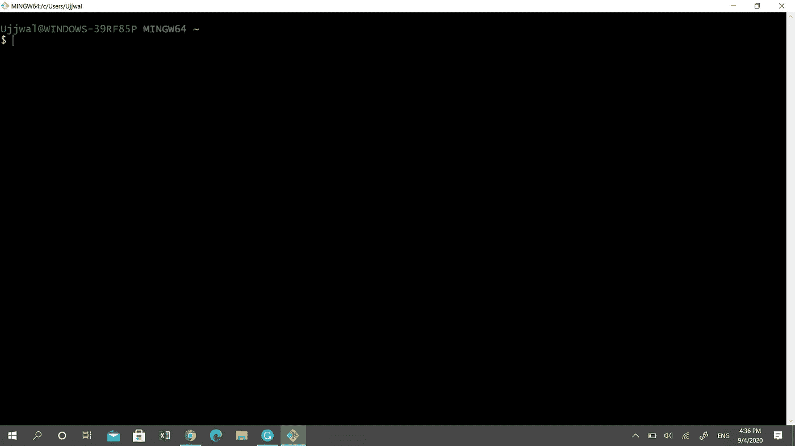
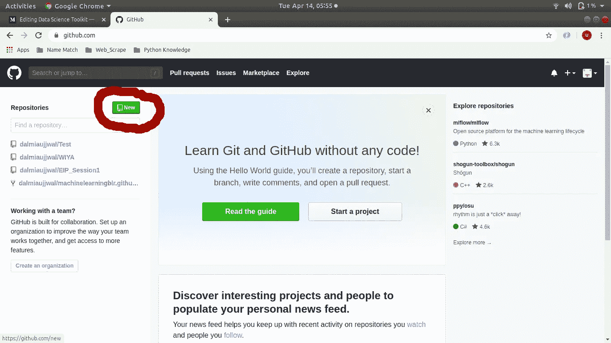
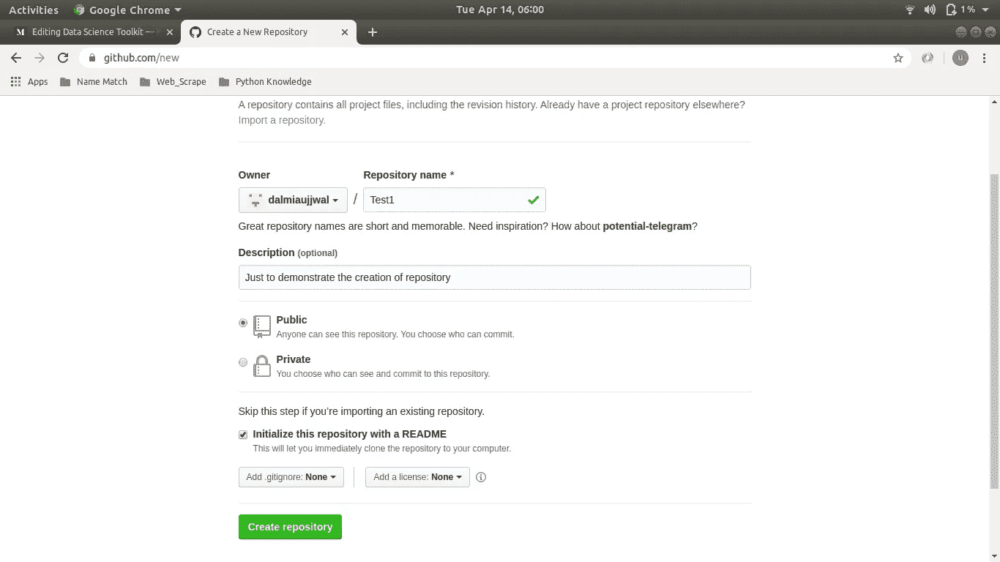
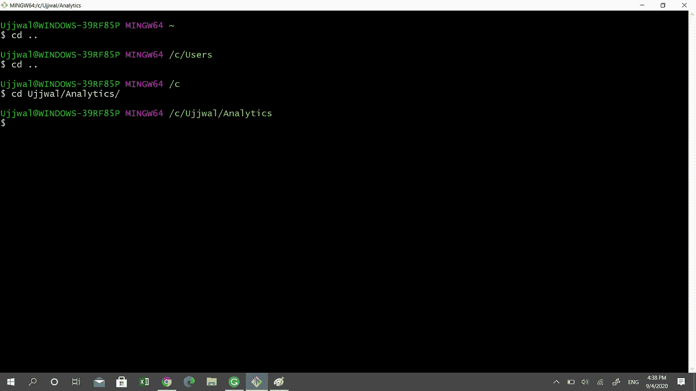
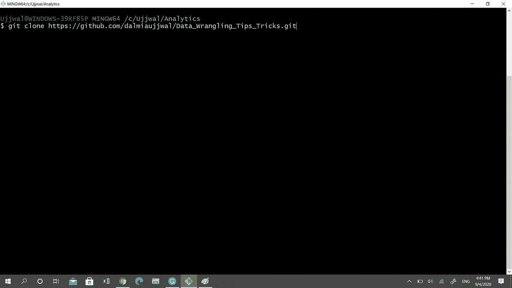
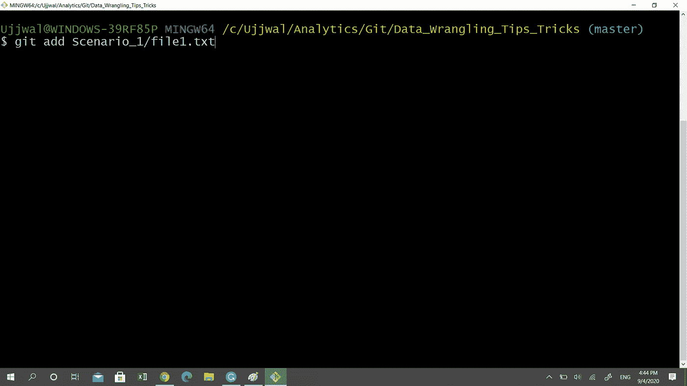
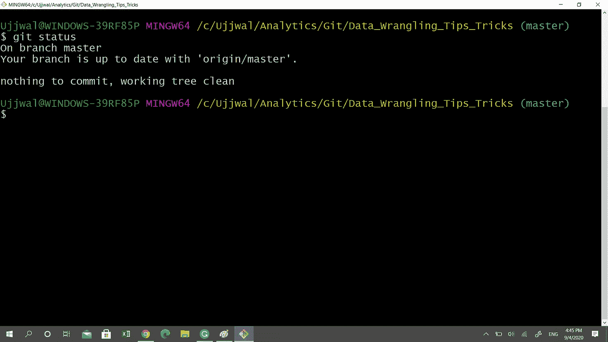
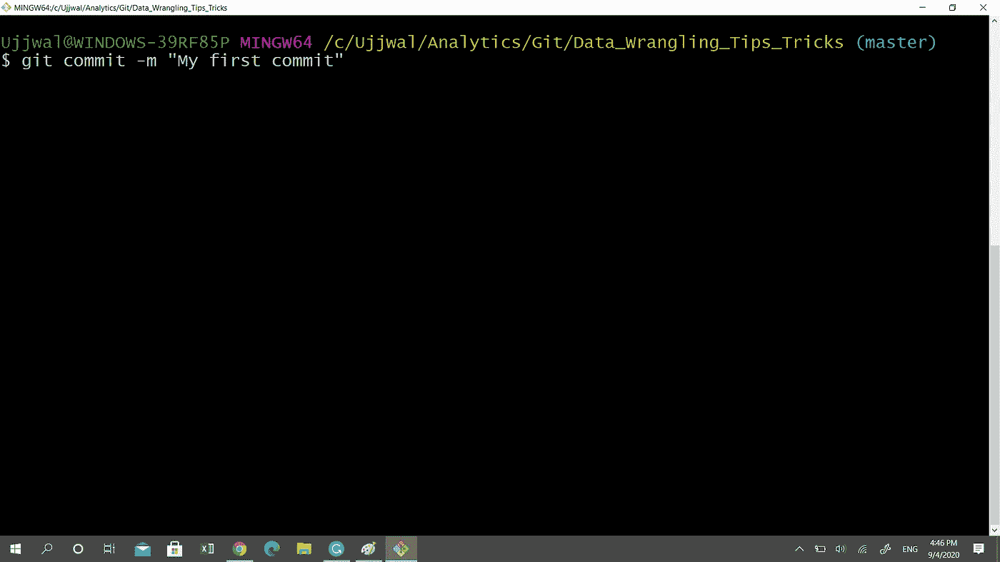
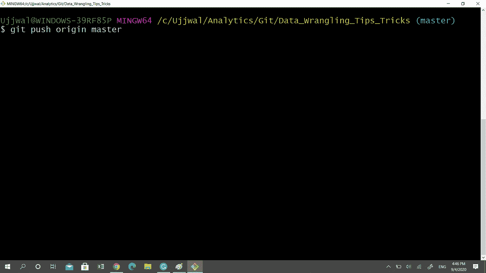
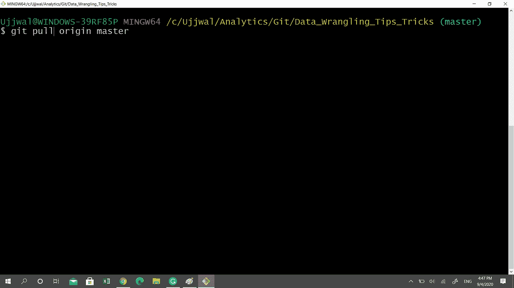

# GitHub 基础知识

> 原文：<https://towardsdatascience.com/must-know-tools-for-data-scientists-114d0b52b0a9?source=collection_archive---------36----------------------->

## 数据科学家必须了解的工具


照片由 [Richy Great](https://unsplash.com/@richygreat?utm_source=medium&utm_medium=referral) 在 [Unsplash](https://unsplash.com?utm_source=medium&utm_medium=referral) 上拍摄

有没有因为无法恢复一个**被意外删除的小**代码片段**而感到沮丧？有没有因为不能**重用你的分类模型的旧版本**而感到有障碍，旧版本提供了最好的准确度分数？你还在遵循老派的**版本控制方法**(还记得 V 0.1，V 0.2 V 1.0…)吗？**

如果以上任何一个问题的答案是肯定的，那么这个教程就是为你准备的。

# 假定

本教程假设您已经有了一个 **GitHub 帐户**并且在您的系统上安装了 **Git Bash 应用程序**(假设是 Windows 系统)。如果没有，有很多教程可以帮助你。GitBash 屏幕如下所示:



Git Bash 屏幕(图片由作者提供)

# 带着饭桶离开

Git 是一个免费和开源的版本控制系统，可以在本地跟踪源代码(或者你上传的任何文件)的变化。

为了推广协作开发的概念，像 GitHub(微软的子公司)这样的公司已经在 Git 的基础上建立了一个基于云的平台(GitHub platform)。除了支持版本控制(标准的 Git 特性)，这些平台还支持额外的特性，如 wikis、bug 跟踪、任务管理等。

# 定义关键字

在学习使用 GitHub 之前，让我们先了解一些你会在本教程中遇到的常见术语:

*   存储库 —通俗地说，这类似于一个包含所有项目文件的项目文件夹。标准实践是每个项目有一个存储库。
*   **分支**——一般来说，开发人员**使用不同的分支来维护项目**的不同模块。另一个允许使用分支的常见场景是当团队的多个成员想要处理同一段代码时。这是每个人都可以有自己的分支的时候。默认情况下，**每个新创建的存储库都有一个名为“ **master** ”的中心分支**。
*   **克隆** —克隆就像将存储库从一个驱动器(GitHub 上的开发者文件夹)复制并粘贴到另一个驱动器(我们的本地文件夹)。
*   **Stage & Commit** —在您的 git 存储库上创建一个新的项目版本，是一个两步过程。第一步是收集所有需要成为新版本一部分的文件。这就是所谓的**暂存**文件。第二步是创建项目的新版本，称为**提交**。只有那些暂存的文件才能提交到新版本。
*   **Push&Pull**——鉴于我们对 GitHub 的关注，push and pull 是关于与存储在 GitHub 云上的存储库进行交互。拉就像下载最新版本，推就等同于在 GitHub 上上传你的最新版本

# **单独工作时的 GitHub 活动**

这种场景适用于当你独自在你的存储库上工作时，比如存储你的代码、文件、项目等等。您的存储库没有授权的协作者，或者您不是其他人的存储库的授权协作者。

## a.)创建自己的存储库

使用 GitHub 时，首先要做的就是创建一个存储库。该过程非常简单，如下所示:

*   **登录** —登录您的 GitHub 账户，点击屏幕左上方的**新建**。



主页—左上角的新按钮(作者图片)

*   **详细信息—** 填写一个简单的表单，然后单击**创建存储库**(示例截图供您参考)。就这样，您的存储库创建完成了。正如前面所定义的，可以把它想象成一个可以保存多个文件的项目文件夹。



存储库表单(图片由作者提供)

## b.)在本地系统上克隆云存储库

**克隆**将您的云(GitHub)存储库的内容下载到您的系统文件夹中。使用这个过程，你不仅可以从你的 GitHub 库下载内容**，还可以从其他开发者创建的任何公共库**下载内容。这是我们开始使用 **Git Bash** 的地方:

*   **克隆链接** —搜索要克隆的存储库并复制克隆链接


克隆存储库的链接(图片由作者提供)

*   **Windows 文件夹创建** —在您的 Windows 驱动器**中创建文件夹**，您希望在其中克隆所有的存储库文件。**打开 Git Bash** ，使用以下命令导航到所需的文件夹位置。



更改文件夹位置(图片由作者提供)

关键字“ **cd** ”是**变更目录**的缩写。其次是**文件夹位置或双句点(..)**指示控制台将其工作位置从**当前目录分别更改为提供的文件夹位置**或文件夹层次中的**前一个文件夹。**

*   **克隆** —到达文件夹位置后，使用“**git clone”**命令克隆存储库

```
**#### Command**
git clone ***clone_link*** 
```



克隆 GitHub 库(图片由作者提供)

**上述命令中的克隆链接**是我们在**步骤 1** 中复制的链接。该命令将在您的文件夹位置创建一个新文件夹(与 GitHub 存储库同名)。这个新文件夹将包含我们克隆的云存储库的所有资源。**这里需要注意两个要点**:

*   上面解释的过程**仅仅克隆了存储库的“主”分支**。**我们已经在定义部分对分支做了简要介绍，但更多细节请见第 2 章**
*   用于克隆**的**克隆链接**作为**远程链接**保存在您的本地存储库**中，默认名称为**origin**

了解以上两点很重要，因为这在我们从 GitHub 库推送或获取最新版本时会很有用。

## c.)创建版本(添加和提交)

克隆完成后，我们可以修改云存储库的副本。为了**在每个检查点创建版本**，我们将采取以下步骤:

*   **暂存** —一旦您对文件进行了满意的修改(或创建了一个新文件)，请**将它们添加到暂存区**

```
**#### Command**
git add ***file_name***
```



暂存(作者图片)

*   **状态检查** —要检查文件是否成功添加到暂存区，执行以下命令

```
**#### Command**
git status
```



检查状态(作者图片)

**Git status** 将列出您在本地 repo 中修改过的所有文件。添加到暂存区的**将为绿色**，而未添加到暂存区的**将为红色。**

*   **提交** —一旦您确定您想要进行版本控制的文件在暂存中，通过执行以下命令对它们进行版本控制

```
**#### Command**
git commit -m "message"
```



提交(图片由作者提供)

请注意命令行选项“ **-m** ”，后跟“**消息**”。这里的消息是一个自由文本注释，解释提交版本中所做的更改。

就是这样，文件的新版本保存在 Git 存储库中(但是在您的本地系统上)。

## d.)将本地存储库与云存储库同步

直到最后一步，我们**通过将文件提交到我们的本地存储库**来创建文件的新版本。在这一步中，我们将把本地存储库(带有更新的文件版本)推送到云存储库。执行此操作的命令如下:

```
**#### Command**
git push origin master
```



推送至 GitHub(图片由作者提供)

解码语法:

*   **推送命令**指示命令行将本地存储库上传到云(Git Hub)
*   **正如克隆步骤中所解释的，关键字“origin”**包含到被克隆的 GitHub 存储库的链接。当 Git 遇到单词 **origin** 时，它标识本地存储库需要被推送的云位置。
*   **关键字“master”**是本地存储库将被推送到的分支的名称。**当使用其他分支**时，**用分支名称**替换主分支。

## e.)从云储存库下载后续更新

对于首次访问云存储库，我们使用了克隆过程。假设整个社区都可以访问云存储库，那么可能会有多次更新(git 术语中的 commit ),并且您的本地克隆存储库可能不会随着最近的更改而更新。要从**云仓库**下载最新版本的，请使用以下命令。

```
**#### Command**
git pull origin master
```



摘自 GitHub(图片由作者提供)

请注意，该命令与 push 命令相同，唯一的区别是 push 一词被 pull 所取代。

# 结束语

你知道吗，对于很多技术性的工作角色，雇主现在希望你是一个活跃的 GitHub 成员，拥有多个知识库和贡献者。

在 GitHub 的下一章，我们将学习如何使用 GitHub 与开发者社区合作。与此同时，掌握了这一新工具的知识，就可以开始将你的项目社会化了。

快乐学习！！！！