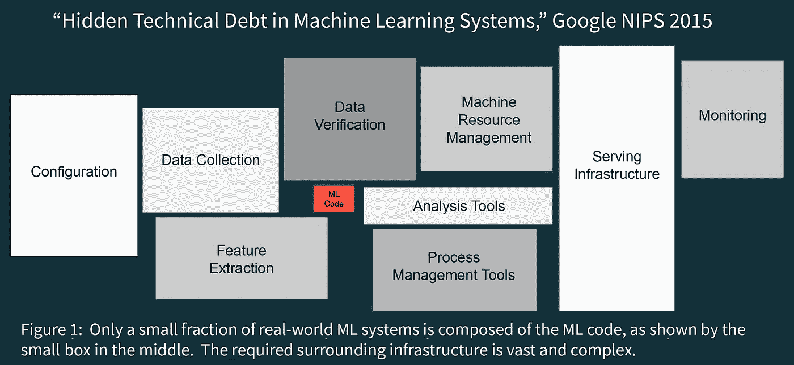
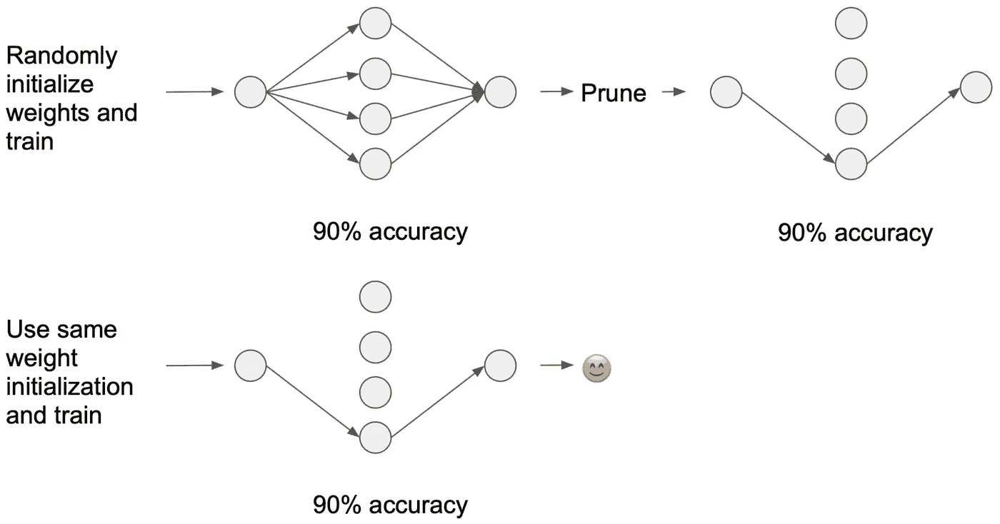
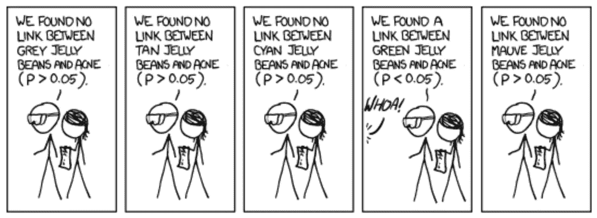

# 5 篇必读的数据科学论文(以及如何使用它们)

> 原文：<https://towardsdatascience.com/must-read-data-science-papers-487cce9a2020?source=collection_archive---------5----------------------->

## 让你在机器学习游戏中保持领先的基本理念。

Rabie Madaci 在 [Unsplash](https://unsplash.com?utm_source=medium&utm_medium=referral) 上拍摄的照片

D 数据科学可能是一个年轻的领域，但这并不意味着你不会面临关于你对某些主题的认识的期望。这篇文章涵盖了几个最重要的最新发展和有影响力的思想作品。

这些论文涵盖的主题从 DS 工作流程的**编排**到更快神经网络的**突破**再到对我们用统计数据解决问题的基本方法的**反思**。对于每篇论文，我都提供了如何将这些想法应用到自己工作中的想法

我们将通过一个 [**调查**](#b51d) 来总结一下，这样您就可以看到社区认为这组论文中最重要的主题是什么。

**#1 —** [**机器学习系统中隐藏的技术债务**](https://papers.nips.cc/paper/5656-hidden-technical-debt-in-machine-learning-systems.pdf) **🙈**

Google Research 的团队提供了关于反模式的清晰说明，以避免在设置数据科学工作流时使用反模式。本文借用软件工程中技术债的比喻，将其应用于数据科学。

通过[数据块](https://databricks.com/resources)

正如下一篇论文更详细地探讨的那样，构建机器学习产品是软件工程的一个高度专业化的子集，因此从这个学科中吸取的许多经验教训也适用于数据科学是有意义的。

**如何使用**:跟随专家的[实用提示](https://papers.nips.cc/paper/5656-hidden-technical-debt-in-machine-learning-systems.pdf)来精简开发和生产。

**#2 —** [**软件 2.0**](https://medium.com/@karpathy/software-2-0-a64152b37c35) 💻

Andrej Karpathy 的这篇经典文章阐明了机器学习模型是基于数据的代码的 T2 软件应用的范例。

如果数据科学是软件，那么我们到底在构建什么？Ben Bengfort 在一篇名为“ [**数据产品的时代**](https://districtdatalabs.silvrback.com/the-age-of-the-data-product) ”的有影响力的博客文章中探讨了这个问题

数据产品代表了 ML 项目的操作化阶段。诺埃米·马卡韦-卡特茨在 [Unsplash](https://unsplash.com?utm_source=medium&utm_medium=referral) 上拍摄的照片。

**如何使用**:阅读更多关于数据产品如何适应[型号选择流程](https://medium.com/atlas-research/model-selection-d190fb8bbdda)的信息。

**#3 —** [**BERT:用于语言理解的深度双向变形金刚预训练**](https://arxiv.org/abs/1810.04805) 🤖

在这篇论文中，谷歌研究团队提出了自然语言处理(NLP)模型，该模型代表了我们在文本分析能力方面的阶跃函数增长。

尽管关于 BERT 为什么工作得这么好还有一些争议，但这是一个很好的提醒，机器学习领域可能已经发现了成功的方法，但还没有完全理解它们是如何工作的。与自然一样，人工神经网络充满了神秘。

在这个令人愉快的剪辑中，Nordstrom 的数据科学主管解释了人工神经网络如何从自然中获取灵感。

**如何使用**:

*   [BERT 文件](https://arxiv.org/abs/1810.04805)可读性很强，包含一些建议的默认超参数设置，作为有价值的起点(参见附录 A.3)。
*   不管你是不是 NLP 新手，看看 Jay Alammar 的[“第一次使用 BERT 的可视化指南](http://jalammar.github.io/a-visual-guide-to-using-bert-for-the-first-time/)”来了解 BERT 的能力。
*   还可以看看[**ktrain**](https://arxiv.org/abs/2004.10703) ，这是一个位于 Keras 之上的包(Keras 又位于 TensorFlow 之上)，它允许您在工作中毫不费力地实现 BERT。 [Arun Maiya](https://medium.com/u/4581d07591d5?source=post_page-----487cce9a2020--------------------------------) 开发了这个强大的库，以加速对自然语言处理、图像识别和基于图形的方法的理解。

**#4—** [**彩票假设:寻找稀疏、可训练的神经网络**](https://arxiv.org/abs/1803.03635) **💰**

虽然 NLP 模型变得越来越大(参见 GPT-3 的 1750 亿个参数)，但人们一直在努力寻找更小、更快、更有效的神经网络。这些网络承诺更快的运行时间、更低的培训成本和更少的计算资源需求。

在这篇开创性的论文中，机器学习奇才 kids Jonathan Frankle 和 Michael Carbin 概述了一种修剪方法，以发现稀疏子网络，这些子网络可以获得与原始的、明显更大的神经网络相当的性能。

via [诺兰日](https://medium.com/u/6438fd23c99a?source=post_page-----487cce9a2020--------------------------------)的[打破彩票假说](/breaking-down-the-lottery-ticket-hypothesis-ca1c053b3e58)

彩票指的是具有初始权重的连接，这些连接使它们特别有效。该发现在存储、运行时和计算性能方面提供了许多优势，并在 2019 年 ICLR 获得了最佳论文奖。进一步的研究建立在这种技术上，[证明了它的适用性](https://arxiv.org/abs/2002.00585)和[将其应用于一个原本稀疏的网络](https://arxiv.org/abs/1911.11134)。

**如何使用**:

*   在投入生产之前，考虑修剪你的神经网络。修剪网络权重可以将参数数量减少 90%以上，同时仍能实现与原始网络相同的性能水平。
*   还可以看看数据交换播客的这一集[，本·洛里卡在这里与](https://thedataexchange.media/software-and-commodity-hardware-can-handle-deep-learning/)[神经魔法](https://neuralmagic.com/about/)交谈，这是一家初创公司，它正在寻求利用诸如[修剪和量化](https://www.youtube.com/watch?v=3JWRVx1OKQQ)之类的技术，通过一个灵活的用户界面使实现稀疏变得更容易。

**阅读更多**:

*   [看看这个有趣的侧边栏](https://ml-retrospectives.github.io/neurips2019/accepted_retrospectives/2019/lottery-ticket/)，它来自《彩票》的作者之一，讲述了机器学习社区评估好想法的缺陷

**#5 —** [**解开零假设统计检验的死结(*p*【t 30.05】**](https://www.researchgate.net/publication/312395254_Releasing_the_death-grip_of_null_hypothesis_statistical_testing_p_05_Applying_complexity_theory_and_somewhat_precise_outcome_testing_SPOT)**☠️**

> 经典假设检验导致过度确定，并产生错误的想法，即原因已经通过统计方法确定。([阅读更多](http://wmbriggs.com/public/Briggs.ReplacementForHypothesisTesting.pdf))

假设检验早于计算机的使用。考虑到与这种方法相关的挑战(例如[甚至统计学家都发现几乎不可能解释 p 值](https://fivethirtyeight.com/features/statisticians-found-one-thing-they-can-agree-on-its-time-to-stop-misusing-p-values/))，现在可能是考虑替代方法的时候了，例如有点精确的结果测试(SPOT)。

通过 [xkcd](https://xkcd.com/882/) 的“重要”

**如何使用**:

*   看看这篇博客文章，“假设的统计测试之死”，其中一位沮丧的统计学家概述了与经典方法相关的一些挑战，并解释了一种利用置信区间的替代方法

## 调查时间！

**你认为哪些文章对你理解数据科学至关重要？**请在评论中留言告诉我。

**如果你喜欢阅读这篇文章**，请关注我的 [Medium](https://medium.com/@nicolejaneway) 、 [LinkedIn](http://www.linkedin.com/in/nicole-janeway-bills) 、 [YouTube](https://www.youtube.com/channel/UCO6JE24WY82TKabcGI8mA0Q?view_as=subscriber) 和 [Twitter](https://twitter.com/Nicole_Janeway) ，了解更多提升你的数据科学技能的想法。当“ [**资源在 2020 年**](https://page.co/ahje9p) 最后几个月为您的数据科学增压”发布时，请注册以获得通知。

🎥**奖励—** 为您的数据科学工作流程添加可视化的绝佳指南