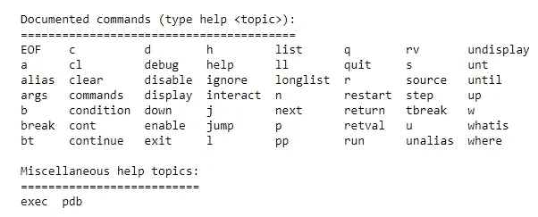

# 必须使用内置工具来调试你的 Python 代码！

> 原文：<https://towardsdatascience.com/must-use-built-in-tool-for-debugging-your-python-code-d5f69fecbdbe?source=collection_archive---------42----------------------->

## python 调试器模块指南，包含有用的代码和命令。利用这个工具，只需一行代码就可以高效地调试 python 代码。

GIF 来自 [GIPHY](https://giphy.com/gifs/bosch-power-tools-electric-ZDENP6MVo9SjbjAUUH/links)

你写完代码，满怀热情地运行程序！

只是遇到了这样的事情—


**错误！**

一旦遇到这个错误，你要么沮丧地关闭你的笔记本电脑，继续你的生活，要么回到绘图板，开始**调试**。

在计算机编程和软件开发中，调试是发现和解决计算机程序、软件或系统中的错误的过程。

在编程中，解决错误并找出错误的确切位置是一项至关重要的任务。然而，这种杂务可能很费时间，而且压力很大。

幸运的是，python 是一种出色的编程语言，为我们提供了多种处理调试问题的方法。

我们今天用来调试程序的一个简单易用的模块是 **pdb** 库模块。

**PDB** 代表 Python 调试器。

pdb 库模块为 Python 程序定义了一个交互式源代码调试器。

它支持在源代码行级别设置(条件)断点和单步执行、检查堆栈帧、源代码列表，以及在任何堆栈帧的上下文中评估任意 Python 代码。它还支持事后调试，可以在程序控制下调用。

让我们用一些代码来讨论如何利用这个模块来调试我们的 python 程序！哦，从技术上讲，它可以在一行中完成！😃


照片由 [Cookie 在](https://unsplash.com/@cookiethepom?utm_source=medium&utm_medium=referral) [Unsplash](https://unsplash.com?utm_source=medium&utm_medium=referral) 上的 Pom 拍摄

# 使用 pdb 模块进行调试:

好了，调试 python 代码只需要这一行代码。命令如下—

```
**import** **pdb**; pdb.set_trace()
```

你也可以这样写这个命令——

```
import pdb***********
Code
pdb.set_trace()
***********
```

现在，我们将进一步了解如何在我们的程序中利用这一点。让我们从查看 set_trace 命令开始。

## `**pdb.set_trace**`

此命令用于在调用堆栈帧处进入调试器。这对于在程序中的给定点硬编码断点很有用，即使代码没有被调试(例如，当断言失败时)。如果给定，就在调试开始前将*标题*打印到控制台。

为了更详细地理解这个模块，让我们借助下面的简单代码块来分析它

上面的代码块由一个简单的**组成，用于将要运行五次迭代的**循环。由于我们使用了 **pdb.set_trace** 命令，所以每次迭代结束时程序都会有一个断点，让你分析循环。

下面的输出块展示了如何使用 python 调试器模块。pdb.set_trace()函数为用户提供了许多命令选项。我们将很快讨论这些。

```
> <ipython-input-5-756613cbbf04>(5)<module>()
-> print(i)
(Pdb) c
0
> <ipython-input-5-756613cbbf04>(4)<module>()
-> pdb.set_trace()
(Pdb) h
```

我在(Pdb)块旁边输入了“c”。这个命令告诉函数继续执行。“h”命令是允许用户查看各种可用命令选项的选项。帮助命令显示以下选项—



作者截图

让我们分析一下这些可供用户选择的选项到底代表了什么。

## 调试器命令:

下面列出了调试器可以识别的命令。大多数命令可以根据需要缩写成一个或两个字母；例如:`h(elp)`表示`h`或`help`都可以用来输入帮助命令(而不是`he`或`hel`，也不是`H`或`Help`或`HELP`)。命令的参数必须用空格(空格或制表符)分隔。在命令语法中，可选参数用方括号(`[]`)括起来；不得键入方括号。命令语法中的选项由竖线(`|`)分隔。

**1。w(此处)**

打印堆栈跟踪，最新的帧在底部。箭头指示当前帧，它决定了大多数命令的上下文。

**2。d(自己的)[计数]**

将堆栈跟踪中的当前帧计数(默认为 1)向下移动一级(到一个较新的帧)。

**3。**

继续执行，仅在遇到断点时停止。

**4。h(elp)**

不带参数，打印可用命令的列表。使用命令作为参数，打印关于该命令的帮助。帮助 pdb 显示完整的文档(pdb 模块的 docstring)。因为命令参数必须是一个标识符，所以必须输入 help exec 来获得关于`!`命令的帮助。

**5。q(uit)**

退出调试器。正在执行的程序被中止。

这些是最重要的命令，可以帮助您更容易地调试代码。更多代码和命令，请访问 python 调试器模块的[官方网站](https://docs.python.org/3/library/pdb.html)。

python 调试器工具是 python 开发人员的资产。然而，它有时会被忽视。我强烈推荐大家去看看这个模块，当你在调试 python 代码时遇到困难时，好好利用它。


[NeONBRAND](https://unsplash.com/@neonbrand?utm_source=medium&utm_medium=referral) 在 [Unsplash](https://unsplash.com?utm_source=medium&utm_medium=referral) 上的照片

# 结论:

python 调试器 pdb 是一个绝对令人惊叹的库模块，用于分步调试您的代码。

如果您被困在一个问题中，并且不知道潜在的错误到底发生在哪里，那么利用这个模块是一个不错的选择。

调试代码是编程最重要的方面之一。编写代码是计算程序的重要组成部分，但评估和调试也是编码的基本特征。

> 如果说调试是去除软件 bug 的过程，那么编程一定是把 bug 放进去的过程。
> 
> **—埃德格·迪杰斯特拉**

看看这些你可能喜欢阅读的文章吧！

[](/opencv-complete-beginners-guide-to-master-the-basics-of-computer-vision-with-code-4a1cd0c687f9) [## OpenCV:用代码掌握计算机视觉基础的完全初学者指南！

### 包含代码的教程，用于掌握计算机视觉的所有重要概念，以及如何使用 OpenCV 实现它们

towardsdatascience.com](/opencv-complete-beginners-guide-to-master-the-basics-of-computer-vision-with-code-4a1cd0c687f9) [](/10-most-popular-programming-languages-for-2020-and-beyond-67c512eeea73) [## 2020 年及以后最受欢迎的 10 种编程语言

### 讨论当今 10 种最流行的编程语言的范围、优缺点

towardsdatascience.com](/10-most-popular-programming-languages-for-2020-and-beyond-67c512eeea73) [](/5-best-python-project-ideas-with-full-code-snippets-and-useful-links-d9dc2846a0c5) [## 带有完整代码片段和有用链接的 5 个最佳 Python 项目创意！

### 为 Python 和机器学习创建一份令人敬畏的简历的 5 个最佳项目想法的代码片段和示例！

towardsdatascience.com](/5-best-python-project-ideas-with-full-code-snippets-and-useful-links-d9dc2846a0c5) [](/python-coding-from-scratch-matrix-multiplication-without-any-machine-learning-libraries-463624fe8726) [## Python 从头编码:没有任何机器学习库的矩阵乘法！

### 从零开始了解如何在没有任何机器学习库的情况下实现矩阵乘法！

towardsdatascience.com](/python-coding-from-scratch-matrix-multiplication-without-any-machine-learning-libraries-463624fe8726) [](/5-awesome-computer-vision-project-ideas-with-python-machine-learning-and-deep-learning-721425fa7905) [## 5 个关于 Python、机器学习和深度学习的超棒的计算机视觉项目创意！

### 讨论 5 个很酷的计算机视觉项目，学习新的技能，增强你的简历

towardsdatascience.com](/5-awesome-computer-vision-project-ideas-with-python-machine-learning-and-deep-learning-721425fa7905) 

谢谢你们坚持到最后。我希望你们喜欢阅读这篇文章。我希望你们都有美好的一天！