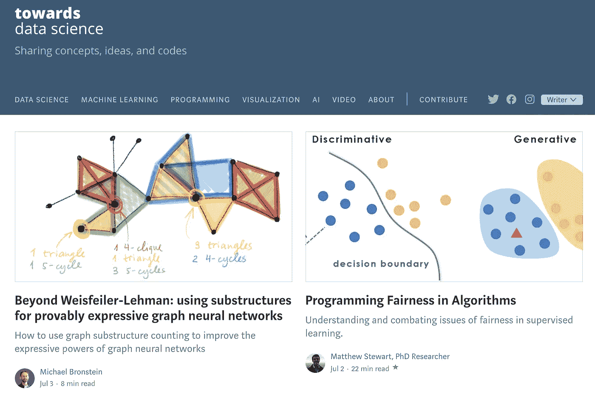
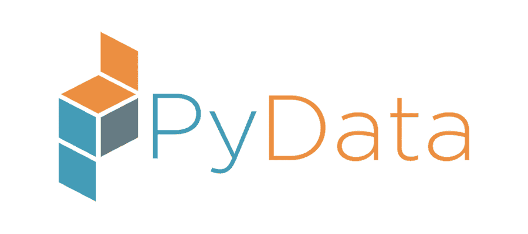
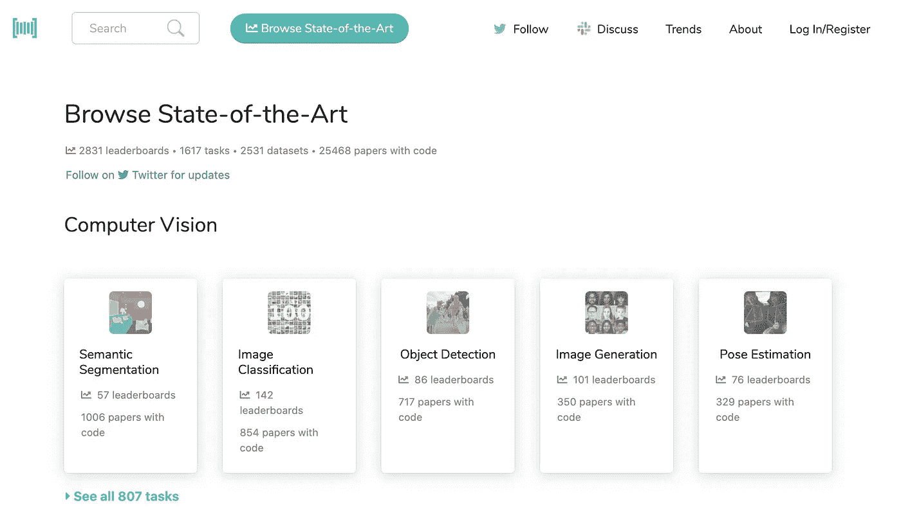

# 我最喜欢的 10 个在线学习数据科学的资源

> 原文：<https://towardsdatascience.com/my-10-favorite-resources-for-learning-data-science-online-c645aa3d0afb?source=collection_archive---------6----------------------->

[Ivo Rainha](https://unsplash.com/@ivoafr?utm_source=unsplash&utm_medium=referral&utm_content=creditCopyText) 在 [Unsplash](https://unsplash.com/s/photos/library?utm_source=unsplash&utm_medium=referral&utm_content=creditCopyText) 上拍摄的照片

## 这些网站将帮助您跟上数据科学的最新趋势

当我说数据科学正在成为最受欢迎的工作领域之一时，我想你不会反对我，特别是考虑到《哈佛商业评论》将“数据科学家”评为 21 世纪最性感的工作。在这个领域，我们已经走过了漫长的道路，从数据科学和机器学习这样的术语还不为人知，一切都聚集在统计的保护伞下的时代开始。然而，我们离旅程的终点还很远。

这也可能是数据科学的一个分化方面，该领域发展如此迅速，以至于很难跟上所有新的算法、技术和方法。所以在数据科学领域工作，类似于软件工程，通常需要不断的学习和发展。不要误解我，有些人(包括我自己)非常喜欢那样。其他人更喜欢学习几年，然后从那些知识中剪下优惠券。两种方法都很好——这是个人偏好。

正如我提到的，在数据科学领域工作可能是一段旅程。这就是为什么在本文中，我想分享我最喜欢的 10 个数据科学资源(在线资源)，我经常使用它们来学习并试图跟上当前的发展。这个列表将关注在线资源(博客、视频、播客),不包括 MOOCs 或书籍，因为那里的内容已经足够写一篇单独的文章了。开始吧！

# 1.走向数据科学

来源:[https://towardsdatascience.com/](https://towardsdatascience.com/)

鉴于你正在阅读发表在[走向数据科学](https://towardsdatascience.com/)上的这篇文章，这并不奇怪。TDS 是 Medium 最大的出版物，涵盖所有数据科学相关主题。你可以在这里找到什么:

*   带代码的初学者友好教程(使用最流行的语言，如 Python、R、Julia、SQL 等)，
*   特定 ML 算法或技术的深入描述，
*   有影响的论文摘要，
*   个人宠物项目描述，
*   来自现场的最新消息，
*   还有更多！

TDS 创建了一个非常好的社区，鼓励每个人分享和参与。此外，我强烈推荐加入时事通讯，在 Twitter 上关注 [TDS，了解最新最受欢迎的文章。](https://twitter.com/TDataScience)

最后，我还可以推荐“走向数据科学”播客，它对想知道如何进入数据科学并找到自己理想角色的人特别有帮助。

# 2.PyData(会议+视频)

[来源](https://www.inawisdom.com/wp-content/uploads/2018/03/pydata-logo-900x400.png)

[PyData](https://pydata.org/) 是 NumFOCUS 的教育项目，NumFOCUS 是一家促进研究、数据和科学计算开放实践的非营利慈善机构。他们在世界各地组织会议，鼓励研究人员和从业人员分享他们在工作中的见解。在讲座中，您可以找到一般 Python 最佳实践的组合、数据科学家处理的真实案例的示例(例如，他们如何对客户流失建模，或者他们使用什么工具来提升他们的营销活动)，以及一些新库的介绍。

从我的经验来看，亲自参加会议是非常有趣的，因为你可以积极地参与演示，提出问题，并与和你有共同兴趣的人建立联系。然而，由于这并不总是可能的，而且有太多的会议要参加，你可以在他们的 [YouTube 频道](https://www.youtube.com/channel/UCOjD18EJYcsBog4IozkF_7w)上找到所有的记录。通常，这些录音会在每次会议后几个月发表。

PyData 讲座是一个很好的灵感来源，因为你可以看到其他公司如何处理一个特定的主题，也许你可以在你的公司应用类似的方法。

# 3.机器学习掌握

杰森·布朗利的[网站/博客](https://machinelearningmastery.com/blog/)对于数据科学家来说是一座内容的金矿，尤其是那些资历较浅的科学家。你可以找到大量的教程，从经典的统计建模方法(线性回归，ARIMA)，到最新最棒的机器/深度学习解决方案。这些文章总是非常实用，并包含将特定概念应用于玩具数据集的 Python 代码。该网站的真正伟大之处在于，Jason 清楚地解释了这些概念，并为那些想要深入了解理论背景的人提供了进一步的阅读。如果你只对不平衡学习或如何编写你的第一个 LSTM 网络感兴趣，你也可以按主题过滤所有的文章。

# 4.蒸馏

[distilt](https://distill.pub/)旨在为机器学习概念提供清晰直观的解释。他们认为，论文往往局限于 PDF 文件，不能总是显示全貌。当 ML 获得越来越多的影响时，很好地理解我们使用的工具实际上是如何工作的是至关重要的。

Distill 使用令人印象深刻的交互式可视化来清楚地解释机器学习算法背后实际发生的事情。我在[最喜欢的一篇文章](https://distill.pub/2016/misread-tsne/)描述了 t-SNE(t-分布式随机邻居嵌入),并展示了生成的图形虽然看起来令人愉快，但可能会产生误导。它还指出了超参数的重要性，提供了一个互动工具来直接观察影响。

如果你需要任何关于内容质量的额外保证，Distill 背后的指导委员会包括 Yoshua Bengio，Ian Goodfellow，Michael Nielsen，Andrej Karpathy 等名字。

# 5.带代码的文件

[来源](https://paperswithcode.com/sota)

代码为的论文是一个伟大的创举，它创建了一个包含 ML 论文的免费开放资源库，以及代码和评估表。您可以轻松浏览可用的论文(包括最先进的)并按主题进行搜索，例如，计算机视觉领域中的图像彩色化。

当你想尝试一些方法或者把它应用到你的数据集上，而不需要实际自己写所有的代码时，这个网站非常方便。虽然这样的练习肯定是有帮助的，并且你会学到很多东西，但是有时你只需要拼凑一个 MVP 来表明某些东西实际上为你的用例工作并且产生增值。在获得所需的批准后，您可以平静地钻研代码，理解特定模型或架构的所有细微差别。

# 6.卡格尔

[Kaggle](https://www.kaggle.com/) 成为想要参加机器/深度学习竞赛的人的首选平台。成千上万的人参加比赛来训练最好的模型(通常是大型和复杂的模型集合)，以达到最好的分数并获得认可(和金钱奖励)。

但是，平台本身远不止这些。首先，Kaggle 包含数千个[内核/笔记本](https://www.kaggle.com/notebooks)，展示了 ML 算法的实际实现。通常，创建者还会对模型及其超参数提供深入的理论解释。[这个笔记本](https://www.kaggle.com/shivamb/data-science-glossary-on-kaggle)包含了许多最流行的 ML/DL 算法的链接，这些算法是在 Kaggle 内核(Python 和 R)中为定制数据集实现的。

更重要的是，Kaggle 还包含许多定制的、用户上传的数据集(在撰写本文时，超过 40k)，您可以用于自己的分析。从新冠肺炎的最新数据到所有神奇宝贝的统计数据，你几乎可以找到任何能引起你兴趣的东西。许多 TDS 文章都是使用 Kaggle 的数据集编写的。因此，如果你想在泰坦尼克号或波士顿房子以外的地方练习你的技能，Kaggle 是一个很好的起点。

# 7.r 博客

[信号源](https://www.r-bloggers.com/)

我从 R 开始了我的数据科学之旅，即使在将我的主要编程语言切换到 Python 之后，我仍然关注 R-bloggers。它是一个博客聚合器(你也可以通过提交你的博客来加入),涵盖了广泛的主题。虽然大多数都与 R 相关，但是通过阅读数据科学任务的一般方法，您仍然可以学到很多东西。

我确实相信，人们不应该把自己局限于一种编程语言，而忽略其他任何东西。也许你会读到一个有趣的 R 项目/包，并决定将其移植到 Python？或者，您可以使用`rpy2`从 Python 访问 R 包，让您的生活更轻松。

虽然 Python 目前是数据科学领域的头号语言，但仍有许多包和工具没有从 R 移植到 Python。这就是为什么我认为 R-bloggers 是一个非常有价值的资源，并且可能是将一些 R 功能移植到 Python 的灵感来源。

# 8.arXiv

arXiv 是康奈尔大学在计算机科学、机器学习等领域的科学论文电子预印本的开放存取资源库。基本上，这是寻找最新研究和最先进算法的地方。但是，现在每天新增的文章非常多，基本上不可能做到面面俱到。这就是为什么 Andrej Karpathy 创建了 ArXiv Sanity Preserver 来试图过滤掉最重要/相关的文件。此外，你可以在 Twitter 上关注 [arXiv Daily](https://twitter.com/arXiv_Daily) ，获得每日最重要研究文章的精选列表。友情提示:推文的数量可能会多得令人无法承受。

# 9.GitHub 超棒的机器学习

这个 [GitHub repo](https://github.com/josephmisiti/awesome-machine-learning) 包含了机器学习框架、库和一般软件的精选列表。为了方便起见，它们按语言分组。此外，repo 还包含博客、免费书籍、在线课程、会议、聚会等列表。这个存储库绝对非常有价值，您可以花相当长的时间来探索所有可用的信息。尽情享受吧！

# 10.推特

这是非常主观的，因为在很多情况下，Twitter 被用作社交网络，就像脸书一样。然而，我试图将它专门用于关注数据科学领域的人，并避免点击诱饵内容。许多研究人员、作者和其他著名的数据科学家都有活跃的 Twitter 账户，他们经常分享有趣/相关的内容。这是了解数据科学最新发展和“热门话题”的好方法。

要关注的人的列表将高度依赖于你的兴趣范围，例如，如果你专注于用于计算机视觉或 NLP 的深度学习。我建议从你最喜欢的作者开始，无论是书籍还是 MOOCs，然后名单会自然增长，因为你会通过转发等方式接触到其他有趣的人。

万一你有兴趣，可以在这里找到我关注[的人。](https://twitter.com/erykml1/following)

# **其他有用的资源**

上面的列表绝非详尽无遗，因为互联网上充满了非常有用的数据科学资源。下面我列出了一些其他的资源，它们没有进入我的前十名，但也很棒，我经常使用它们:

*   [KDnuggets](https://www.kdnuggets.com/)
*   [AWS 机器学习博客](https://aws.amazon.com/blogs/machine-learning/)
*   [图片搜索](https://www.pyimagesearch.com/)
*   [艾](https://explained.ai/)
*   [视觉资本家](https://www.visualcapitalist.com/)
*   [数据漂亮](https://www.reddit.com/r/dataisbeautiful/)
*   [分析 Vidhya](https://www.analyticsvidhya.com/blog/)

我会继续更新这个列表，以防我忘记了什么或者我发现了新的东西:)

# 结论

在本文中，我向您展示了 10 个最受欢迎的资源，用于进一步发展我的数据科学技能。你有没有这里没有提到的最喜欢的来源？请在评论中告诉我，我会很乐意找到更多！

觉得这篇文章有趣？成为一个媒介成员，通过无限制的阅读继续学习。如果你使用[这个链接](https://eryk-lewinson.medium.com/membership)成为会员，你将支持我，不需要你额外付费。提前感谢，再见！

如果您喜欢这篇文章，您可能还会对以下内容感兴趣:

 [## 论度量的专制和度量的固定

### 在一个充满指标的世界里，我们需要清楚地认识到那些弊大于利的指标

towardsdatascience.com](/on-the-tyranny-of-metrics-and-metric-fixation-b4c1d44b5f6c)  [## 介绍我的书:Python 金融烹饪书

### 我的短篇小说从中型文章到图书合同

towardsdatascience.com](/introducing-my-book-python-for-finance-cookbook-de219ca0d612)  [## Python 统计块中的新成员:pingouin

### 图书馆的快速参观，以及它是如何从老守卫中脱颖而出的

towardsdatascience.com](/the-new-kid-on-the-statistics-in-python-block-pingouin-6b353a1db57c)