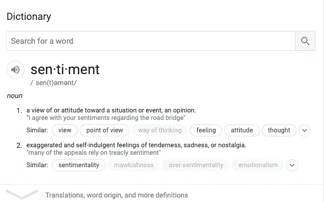

# 使用 TextBlob 的情感分析

> 原文：<https://towardsdatascience.com/my-absolute-go-to-for-sentiment-analysis-textblob-3ac3a11d524?source=collection_archive---------4----------------------->

## 使用 TextBlob 的情感分析及其工作原理！


[来源](https://wallpaperaccess.com/sunny-landscape-desktop)

# 你说的情绪是什么意思？



情感分析可以帮助我们解读大众的情绪和情感，并收集关于环境的深刻信息。情感分析是根据研究的需要分析数据并对其进行分类的过程。

这些情绪可以用来更好地理解各种事件及其造成的影响。L. Bing [1]强调，在研究文献中可以看到许多不同的名称，例如“情感分析、意见挖掘、意见提取、情感挖掘、主观性分析、情感分析、情感分析、评论挖掘”，然而它们都具有相似的目的，并且属于情感分析或意见挖掘的主题。通过分析这些情绪，我们可以发现人们喜欢什么，他们想要什么，他们主要关心什么。

## 使用 TextBlob 的情感分析

TextBlob 是一个用于自然语言处理(NLP)的 python 库。TextBlob 积极使用自然语言工具包(NLTK)来完成其任务。NLTK 是一个库，它提供了对大量词汇资源的简单访问，并允许用户进行分类、归类和许多其他任务。TextBlob 是一个简单的库，支持对文本数据的复杂分析和操作。

对于**基于词汇的方法**，一种情感是由其语义取向和句子中每个词的强度来定义的。这需要一个预定义的字典来对消极和积极的词进行分类。一般来说，一条短信会用一包单词来表示。在给所有的单词分配了单独的分数之后，最终的情感是通过一些汇集操作来计算的，比如取所有情感的平均值。

TextBlob 返回句子的**极性**和**主观性**。极性介于[-1，1]之间，-1 表示消极情绪，1 表示积极情绪。否定词颠倒极性。TextBlob 具有语义标签，有助于进行细粒度分析。比如——表情符号、感叹号、表情符号等。主观性介于[0，1]之间。**主观性量化了文本中包含的个人观点和事实信息的数量。更高的主观性意味着文本包含个人观点而非事实信息**。TextBlob 还有一个参数—强度。TextBlob 通过查看“**强度**”来计算主观性。强度决定了一个单词*是否修饰下一个单词*。对于英语来说，副词用作修饰语(“很好”)。

例如:我们计算了“我一点也不喜欢这个例子，它太无聊了”的极性和主观性。对于这个特殊的例子，极性= -1，主观性是 1，这是公平的。

然而，对于句子“这是一个有用的例子，但我更喜欢另一个”。它为主观性和极性都返回了 0.0，这不是我们期望的最好的答案。

如果您的句子不包含任何在 NLTK 训练集中具有极性的单词，或者因为 TextBlob 对每个样本中的所有单词使用加权平均情感得分，则如果库恰好返回 0.0，则可以预期。在我们的例子中，这很容易分散单词之间极性差异很大的句子的影响:“有用的”和“但是”。

大多数情况下，对于简单的情况，TextBlob 工作得很好。

使用 TextBlob 应用情感分析的步骤–

1.导入 textblob

```
from textblob import TextBlob
```

2.定义一个计算主观性、极性的函数，并根据您想要设置的阈值给它一个分数。

使用 TextBlob 和分析数据的代码片段

> 我碰到的另一篇有用的文章是:[https://Neptune . ai/blog/情操分析-python-text blob-vs-Vader-vs-flair](https://neptune.ai/blog/sentiment-analysis-python-textblob-vs-vader-vs-flair)

参考文献—

1.  [https://www . cs . UIC . edu/~ liub/FBS/sentiment analysis-and-opinion mining . pdf](https://www.cs.uic.edu/~liub/FBS/SentimentAnalysis-and-OpinionMining.pdf)
2.  [https://github.com/sloria/TextBlob/blob/dev/textblob/](https://github.com/sloria/TextBlob/blob/dev/textblob/en/en-sentiment.xml)