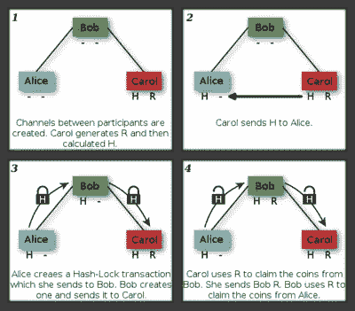
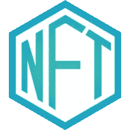
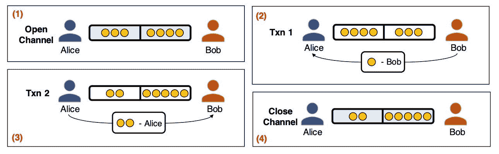
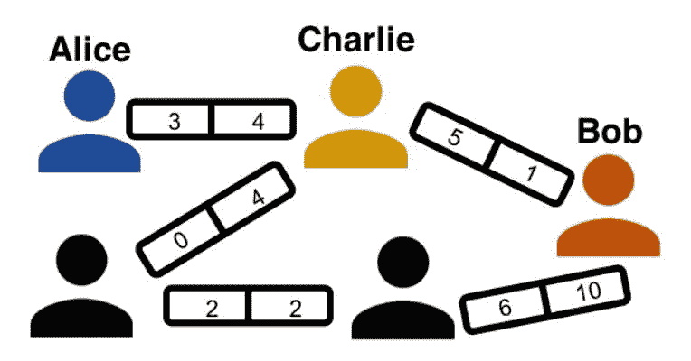
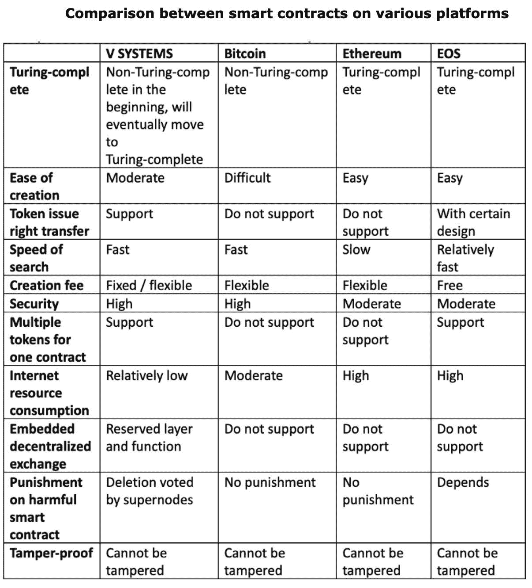

# 智能合同简介

> 原文：<https://towardsdatascience.com/my-amazon-data-engineer-internship-interview-experience-817419e9caf4?source=collection_archive---------41----------------------->

美国宇航局在 [Unsplash](https://unsplash.com/s/photos/earth?utm_source=unsplash&utm_medium=referral&utm_content=creditCopyText) 拍摄的照片

> 信任是好的，但是让我们使用区块链

## 让我们深入了解区块链是如何保持“信任”的:

*   什么是智能合同？
*   智能合同是如何工作的？
*   V 星系统的特殊智能合约。
*   哈希时间锁契约
*   不可替代合同
*   支付渠道合同
*   各种智能合同之间的比较

# 什么是智能合同？

智能合同是一种自动执行的合同，买卖双方之间的协议条款直接写入代码行。该准则和其中包含的协议存在于一个分布式、分散的[区块链](https://www.investopedia.com/terms/b/blockchain.asp)网络中。代码控制执行，事务是可跟踪和不可逆的。

智能合同允许在不同的匿名方之间执行可信的交易和协议，而不需要中央权威机构、法律系统或外部执行机制。

# 智能合同如何工作

智能合约最早是由美国计算机科学家尼克·萨伯在 1994 年提出的，他在 1998 年发明了一种叫做“比特黄金”的虚拟货币，比比特币的发明整整早了 10 年。事实上，经常有传言说萨博是真正的中本聪，比特币的匿名发明者，对此他予以否认。

绍博

Szabo 将智能合同定义为执行合同条款的计算机化交易协议。他希望将电子交易方法的功能，如 POS(销售点)扩展到数字领域。

在他的论文中，Szabo 还建议执行一项合成资产合同，如衍生品和债券。Szabo 写道:“这些新的证券是通过多种方式将证券(如债券)和衍生品(期权和期货)结合起来形成的。由于对这些复杂的期限结构进行了计算机化分析，非常复杂的支付期限结构现在可以纳入标准化合约，并以低交易成本进行交易。”

# 智能合约示例 ft: V 系统

对于这篇特别的文章，我们将研究 V Systems 推出的智能合约，以了解智能合约中的各种新进展。

[**V 系统**](https://v.systems/?ref=hackernoon.com)

它是一个开源的区块链平台项目，最近在其版本 [2.0 升级](https://medium.com/vsystems/vsys-2-0-is-coming-introducing-fermat-smart-contracts-1744de80362e?ref=hackernoon.com)中实现了支付通道智能合约。该项目由首席建筑师 Sunny King 领导，他也是 POS(股份证明)的开发者。)

# 1.哈希时间锁定合同

哈希时间锁定合同(HTLCs)是 P2P 金融未来的基础构件。它们使我们能够建立[原子互换](https://liquality.io/blog/atomic-swaps-explained/)和闪电网络——替代现有货币和金融体系的局限性。

资产锁定是区块链系统中的一项有用功能。锁定合同是一种工具，用于在用户定义的时间段内锁定资金，然后才能取回资金。

## 例子

Alice 将她的 VSYS 硬币或代币存放到链条上的锁契约中。使用“锁定”功能，她提交一个解锁时间戳。一旦设置了时间戳，她只能在解锁时间戳之后提取她的 VSYS 硬币或代币。在解锁时间戳之前，只能从令牌协定中调用存款触发器。在解锁时间戳之前，锁合同只接受押金。

## V 系统锁定合同的特殊之处在于:

这个想法就像一个池过程，你可以随时增加池的大小和延长锁的时间。如果你愿意，它也可以被再次使用。

# 2.不可替代合同

## 什么是不可替换的令牌？

非同质化通证

不可替换的令牌包含记录在其智能合约中的识别信息。正是这些信息使得每个令牌都不同，因此它们不能被另一个令牌直接替换。它们不能互换，因为没有两个是一样的。相比之下，钞票可以简单地交换，如果它们是相同的价值，对持有者来说没有区别。

不可替换的代币是不可分割的，就像你不能把音乐会门票的一部分送给别人一样。演唱会门票的一部分本身没有任何价值，也不可兑换。

不可替代契约最显著的特征是不可替代令牌的最大值和单位总是 1。它只代表一个独特的不可分的东西。

当不可替换的令牌契约被初始化时，它的常数被设置为零，因为它还没有被发布，因此还不存在。当一个不可替换的令牌被发行后，它就开始存在，并且它的供应量永久固定为 1。这确保了您在契约中所做的每个操作的稳定性和安全性，也确保了令牌是可证明唯一的。

## 是什么让 NFTs 如此特别？

不可替换的令牌具有独特的属性，它们通常与特定资产相关联。它们可用于证明游戏皮肤等数字物品的所有权，直至实物资产的所有权。

其他代币是可替换的，就像硬币或纸币一样。可替换令牌是相同的，它们在交换时具有相同的属性和值。

## 在哪里使用它

不可替换的令牌用于创建可验证的唯一数字项目，并证明其所有权。不可替换的令牌允许在多个游戏或应用程序之间无缝地使用独特的资产。

例如，一把独特的剑可以用在十五个不同的游戏中。

> 比赛

如果游戏玩家在游戏中拥有独特的物品，游戏外所有权和可转让性的明确证明将增加他们物品的价值。游戏的创建者可以在公共区块链上使用不可替换的令牌来代表用户在游戏中拥有的物品，以增加物品在其生态系统中的价值。在公共区块链上证明不可替换代币的所有权是很容易的，这给了玩家额外的所有权保障。这样，不同游戏之间的物品交换也是可能的。

> 艺术和收藏品

独特物品的所有权和出处可以使用不可替换的令牌来证明。在一双独特的设计师鞋的情况下，制造商可以将仅绑定到那双鞋的不可替换令牌的所有权转让给买方。如果这些鞋子被买家出售，他们可以将代币的所有权转让给新的所有者。这增加了独特的鞋的价值，证明他们不是假冒的。

> 优惠券

一家公司可能希望分发优惠券，允许用户在唯一的条件下相互转让。不可替换的代币允许该公司发行任意数量的独特优惠券。

## 是什么让 V 系统的不可替换令牌如此特殊

**零开发工作:** V System 的不可替代令牌是唯一的、不可分割的令牌，可以通过零软件开发工作来创建。

# 不可替代代币的未来

*   主要地，不可替换的代币在[游戏](https://decryptmedia.com/resources/gaming)和加密收藏品中实现。对于游戏来说，不可替代的代币可以用来代表游戏中的物品，如皮肤，这可能允许它们被移植到新游戏或与其他玩家交易。
*   然而，它们的潜力要大得多，可能应用于版权和知识产权、票务以及视频游戏的销售和交易。
*   不可替代的令牌增加了创造[安全令牌](https://decryptmedia.com/resources/security-token-vs-utility-tokens)的潜力，这是数字和现实世界资产的令牌化。像房产这样的实物资产可以被标记为部分或共享所有权。如果这些安全令牌是不可替换的，那么资产所有权是完全可追踪和清晰的，即使只有代表部分所有权的令牌被出售。
*   不可替换令牌的进一步应用可以是资格认证、软件许可、担保，甚至是出生和死亡证明。不可替代令牌的智能合约不可改变地证明了接收者或所有者的身份，并且可以存储在数字钱包中，以便于访问和表示。有一天，我们的数字钱包可以包含我们拥有的每一个证书、许可证和资产的证明。

# 3.支付渠道合同

区块链创新发誓要鼓励安全、最小努力的通用支付处理服务(和不同的交易)，使用编码的分布式记录，对交易进行可信的实时确认，而不需要中间人，例如银行和清算所。

> 区块链支付面临的挑战

*   **举例:**比特币网络每秒处理 7 笔交易，以太坊每秒 15 笔交易，与 VISA 网络达到的每秒 1700 笔交易相比相形见绌。因此，可扩展性仍然是将加密货币用于零售和其他大规模应用的主要障碍。可伸缩性挑战的根源是底层共识协议的低效率:每个事务都必须经过完全共识才能得到确认，这可能需要几分钟到几小时。

> ***解***

在众多提高加密货币可扩展性的解决方案中，一个领先的方案依赖于**支付渠道**。支付通道是一种加密货币交易，它在区块链上保存货币，以便在预定的持续时间内与预先指定的用户进行交换。

*   **示例:** Alice 可以与 Bob 建立一个支付通道，在该通道中，她每月持有 10 个代币。现在，Alice 可以从托管帐户发送 Bob(只有 Bob)签名的交易，Bob 可以以安全的方式私下验证它们，而无需区块链的中介。如果 Bob 或 Alice 想要在任何时候关闭支付通道，他们可以向区块链广播最近签署的交易消息，以完成资金转移。
*   支付渠道的多功能性源于支付渠道网络(PCN ),其中不共享直接支付渠道的用户可以通过中介进行交易，只收取象征性的费用。

# [***V 系统***](https://v.systems/?ref=hackernoon.com) ***:支付渠道***

下面提到的几个重要变量存储在 V System 的合同中，这些变量定义了支付渠道功能的行为。

1.  **累计付款**是发送方已经向接收方支付的累计金额。
2.  **到期时间戳**是接收方不能再收款的时间戳，发送方可以将剩余资金卸载回自己。
3.  **累计负载**是发送方加载到信道的累计量。

为了确保安全，这三个变量只能增加⬆️

*   *由于累积的负载不能减少，接收者可以确信在信道中至少有一定量的资金，而不必经常检查合同的状态值。在渠道关闭之前，汇款人不可能从渠道中提取资金。*
*   *由于累计付款不可能减少，收款人可以提取他们已经收集的任何资金，而不必等待通道结束。*
*   *V System 的实施允许发送者通过更新到期时间戳和将额外资金加载到通道中，即使在现有支付通道到期后也可以重新使用它们。*

要了解 V 系统的更多信息，请访问此处的。

来源:[4]

# **支付渠道网络**

来源:[4]

支付渠道网络是双向支付渠道的集合。如果 Alice 想要向 Bob 发送三个代币，她首先找到一个到 Bob 的路径，该路径可以支持三个支付代币。路径上的中间节点(Charlie)将把支付中继到它们的目的地。因此，发生了两个事务:Alice 到 Charlie，以及 Charlie 到 Bob。为了激励 Charlie 参与，他收到了一笔路费。为了防止他窃取资金，加密哈希锁确保所有中间交易只有在交易接收者知道 Alice 生成的私钥后才有效。一旦 Alice 准备好付款，她就在带外将密钥交给 Bob 他可以广播它(如果他决定关闭频道)或者把它传给查理。查理受到激励，将密钥向上游传递给爱丽丝，这样他也可以得到报酬。请注意，Charlie 与 Alice 和 Bob 的支付渠道是独立的:Charlie 不通过区块链就不能在他们之间转移资金。

**参考文献:**

1.  [美国运通](https://www.americanexpress.com/us/foreign-exchange/articles/blockchain-to-accelerate-payment-processing-services/#:~:text=Blockchain%20technology%20promises%20to%20facilitate,as%20correspondent%20banks%20and%20clearing)
2.  [轴行区块链论文](https://www.axisbank.com/docs/default-source/press-releases/axis-bank-launches-ripple-powered-instant-payment-service-for-retail-and-corporate-customers.pdf?sfvrsn=6)
3.  [支付方式下的高吞吐量](https://arxiv.org/pdf/1809.05088.pdf#:~:text=A%20payment%20channel%20is%20a,10%20tokens%20for%20a%20month.)
4.  [频道](https://arxiv.org/pdf/1809.05088.pdf#:~:text=A%20payment%20channel%20is%20a,10%20tokens%20for%20a%20month.) [走向 _ 比特币 _ 支付 _ 网络](https://www.researchgate.net/publication/304621007_Towards_Bitcoin_Payment_Networks)
5.  五.系统文件

> 我们是可被黑客攻击的动物，区块链可以增加我们被黑客攻击的安全性。如果人工智能可以黑你，区块链可能会充当你的防火墙。

谢谢，希望你今天学到了新东西！

在 LinkedIn[和 YouTube](https://www.linkedin.com/in/maniksoni) 上关注我。

 [## 马尼克索尼-马尼克索尼- YouTube | LinkedIn

### 查看 Manik Soni 在全球最大的职业社区 LinkedIn 上的个人资料。Manik 有 8 个工作列在他们的…

www.linkedin.com](https://www.linkedin.com/in/maniksoni) 

我的其他几篇文章:

 [## 消失&爆炸梯度问题:事实背后的数学

### 你好星尘！今天我们将看到消失&爆炸梯度问题背后的数学原因，但首先让我们…

binarykeys.in](https://binarykeys.in/2020/07/vanishing-exploding-gradient-problem-math/)  [## LSTM 细胞:用代码从零开始理解架构

### LSTMs 是一种特殊的 rnn，具有处理长期依赖关系的能力。他们还提供解决方案…

binarykeys.in](https://binarykeys.in/2020/07/lstm-cell-architecture-scratch-code/)