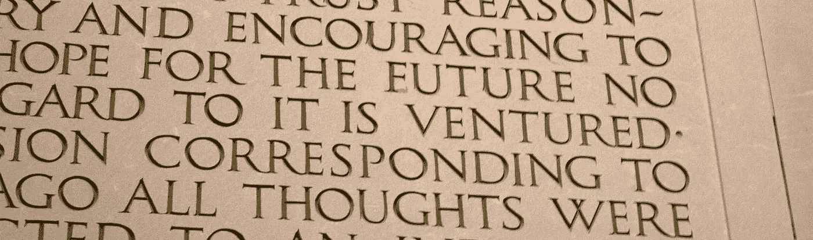
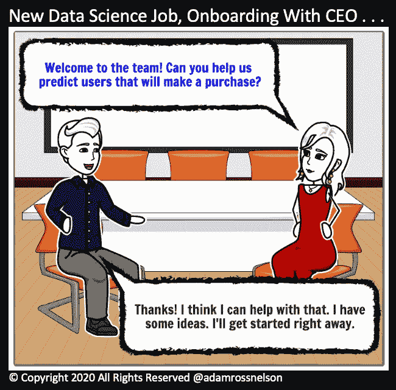
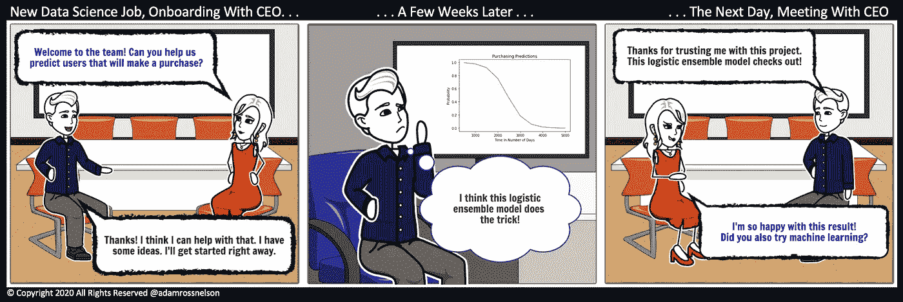

# 我职业生涯中最大的错误，在数据科学领域

> 原文：<https://towardsdatascience.com/my-biggest-career-mistake-in-data-science-b95ad9fd0ff7?source=collection_archive---------1----------------------->

图片来源:维基共享。错误时有发生。在林肯纪念堂，一位艺术家不小心在应该是 f 的地方刻了一个 E。

## 一篇关于我在数据科学生涯中犯的最大错误的文章

# 介绍

在我的职业生涯中，不久前有人在工作中问了我一个问题。这个问题让我意识到我犯了一个巨大的错误。这个错误损害了我已经做了五年多的工作的声誉。

从广义上讲，这是我在攻读博士学位时就开始的工作，并在随后的两家雇主那里延续了下来。以下是对这种互动的基本真实的描述和对经验教训的解释。

## 问题是什么？

> 你认为我们什么时候能够开始使用机器学习、人工智能和预测建模？

版权所有 2020 [亚当·罗斯·尼尔森](https://medium.com/u/4c558804d1cf?source=post_page-----b95ad9fd0ff7--------------------------------) —保留所有权利。一位数据科学家在上班的第一天会见了公司首席执行官。首席执行官请求帮助预测哪些用户将进行购买。数据科学家马上开始工作。

当我的同事问我“你认为我们什么时候能够开始使用机器学习、人工智能和预测建模”时，我已经做了几个月了

我惊呆了。多年来，我们一直在使用机器学习、人工智能和预测建模。我不明白这个问题。

抛开我的困惑，我优雅地指出了我们在近两年前实施的一个著名项目。

我说，“你记得我们去年秋天做的那个项目吗？我们公司一半的人都在会议室呆到深夜？”

同事说:“当然！”这位同事补充道:“那真是太有趣了，我的团队现在还把它当作美好的回忆来谈论。我知道我们做出了巨大的改变。”

我说，“我也喜欢那个项目……事实证明，我们使用了预测模型来确定我们将邀请哪些客户参与那个项目。我们一直在使用预测模型。我们每天都在用！”

## 问题是

问题是，我的同事，也许是大多数，不知道我们正在(并且已经有很长一段时间)成功地实现机器学习、人工智能和预测建模，这些都是数据科学工作的核心方面。真实的故事，这个问题是我的错。

版权所有 2020 [亚当·罗斯·纳尔逊](https://medium.com/u/4c558804d1cf?source=post_page-----b95ad9fd0ff7--------------------------------) —保留所有权利。半自传体的故事。在这个故事中，一位首席执行官要求新的数据科学家预测哪些用户将进行购买。在用逻辑回归集成执行了那个任务之后，CEO 问道:“你试过机器学习吗？”

## 吸取的教训

这幅漫画中的数据科学家和我在数据科学职业生涯的早期，低估和错误描述了这项工作。逻辑回归是一种有监督的机器学习技术。使用集成(多个实施相关模型)也是预测分析中常用的技术。

我认为我避免使用“机器学习”、“人工智能”和“预测建模”等当代、术语、包罗万象、几乎毫无意义的术语是在帮自己和他人的忙。

我用我知道的更具体、更精确的术语和短语来代替包罗万象的流行语。这幅漫画中的数据科学家也犯了类似的错误。

无意中，由于没有明确地将逻辑回归的集合描述为受监督的机器学习算法，很少有人意识到这项工作是数据科学的应用。

## 如何避免这种错误

从这次经历中，我学到了，并且仍在学习，许多重要的经验。以下是其中的几个。

*   **清晰地向他人表达你的努力。**向他人清楚表达你的努力意味着花时间以尽可能多的交流方式交流你到底在做什么以及为什么。如果你幸运的话，老板或导师会帮助你，但是不要等待许可。动手吧！*为了避免这种错误，找到并使用尽可能多的沟通方式(如面对面、一对一、小组、Slack、电子邮件、状态报告等)。).*补充提示:找到你知道会被听到的交流方式。如果不确定，寻求帮助来确定贵公司最有效的模式。
*   言语很重要。在你发现他们的地方遇见他们。就我而言，我没能在同事们所在的地方见到他们，因为当他们期望听到“预测分析”时，我用“监督机器学习逻辑回归集成技术”击中了他们。我错误地认为这将是对我自己和其他人的一种恩惠，将作品去神秘化。我错了，我把工作搞复杂了。为了避免这种错误，在你开始谈论作品之前，先听听你的听众会认识的术语和短语的线索。使用你的听众会认识的术语和短语。带着关心和同情介绍新的术语和短语。
*   历史会重演。回顾我在成为数据科学家之前的工作(通常是作为一名教育工作者或大学管理人员),我发现我之前低估或错误描述了我的工作。这是任何行业的专业人士都会犯的错误——无论是技术性的还是其他的。*为了避免这种错误，要从过去吸取教训，否则你将被迫重新经历。*

 [## 加入我的介绍链接媒体-亚当罗斯纳尔逊

### 作为一个媒体会员，你的会员费的一部分会给你阅读的作家，你可以完全接触到每一个故事…

adamrossnelson.medium.com](https://adamrossnelson.medium.com/membership) 

# 结论

本文描述了我在数据科学职业生涯中犯的最大错误之一。有一次，一位同事问我“你认为我们什么时候能够开始使用机器学习、人工智能和预测建模”，我意识到自己犯了这个错误

那时，我们已经在那家公司使用机器学习、人工智能和预测建模很长时间了。

让我的同事认为数据科学仍然是一种渴望是错误的。我尽量避免使用术语、无所不包、几乎毫无意义的流行词汇，从而变得更加透明。但这一策略似乎适得其反。

在解释了这是如何发生的故事之后，本文还提供了一个可以从经验中吸取的教训列表。