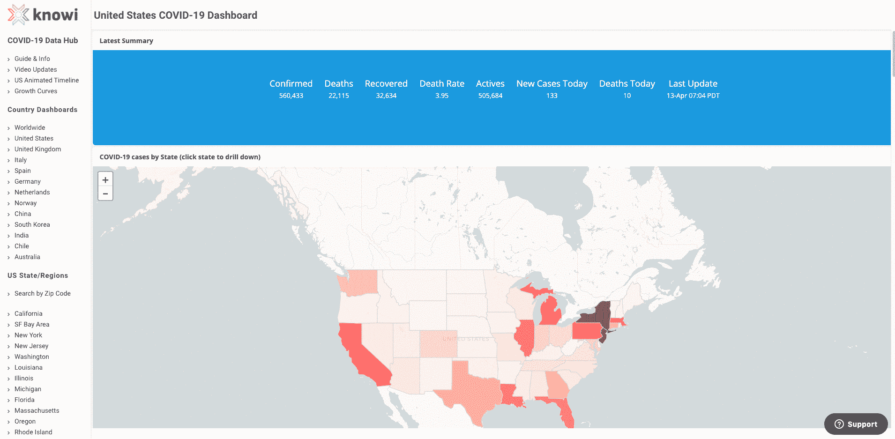
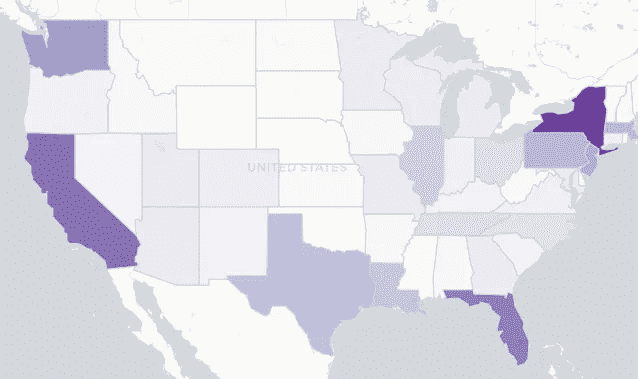
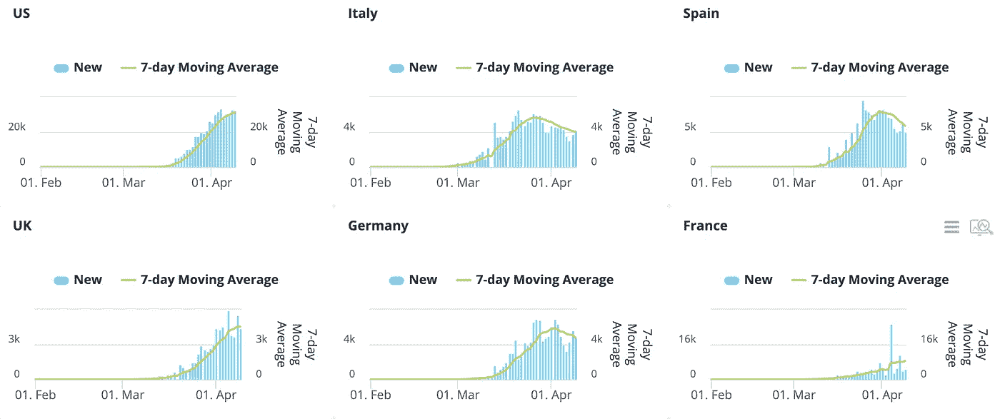

# 我的老板和我花了两周时间痴迷地建立一个新冠肺炎数据中心

> 原文：<https://towardsdatascience.com/my-boss-and-i-spent-two-weeks-obsessively-building-a-covid-19-data-hub-f5898daadb18?source=collection_archive---------48----------------------->

图片来源:gratisography.com

***编者按:*** [*走向数据科学*](http://towardsdatascience.com/) *是一份以数据科学和机器学习研究为主的中型刊物。我们不是健康专家或流行病学家，本文的观点不应被解释为专业建议。想了解更多关于疫情冠状病毒的信息，可以点击* [*这里*](https://www.who.int/emergencies/diseases/novel-coronavirus-2019/situation-reports) *。*

# 数据在哪里？

这一切都始于我试图回答一个本该简单的问题。

我住在旧金山湾区，这里是新冠肺炎疫情最严重的地区之一，也是这种病毒的早期震中之一。但我不住在圣克拉拉县，那是海湾地区早期曾有过一次巨浪的地方。我住在北边一点，在海湾对面的奥克兰。

因此，尽管圣克拉拉的新病例层出不穷，但我想知道奥克兰和阿拉米达县(奥克兰所在的县)是如何受到影响的。

像其他人一样，我的经历让我想知道在我的城市这种情况有多糟糕。我站在乔氏店里的一条队伍中，这条队伍从收银台绕过商店。我困惑地发现卫生纸成了新的抢手货。就像我的公司一样，我听说越来越多的朋友在家工作。但这仅仅是人们采取预防措施，还是表明情况变得有多糟糕？我需要数据。

我的第一站是每个人都去的地方，约翰霍普金斯仪表板。

这个仪表板在早期确实有地区/县级别的数据，但是在某个时候删除了它。这个仪表板设计得很好，但没有我想要的数据粒度来了解我的本地社区正在发生什么。无法进一步挖掘数据。我还想探索更多的数据可视化，而不仅仅是案例的数量。

我还尝试了纽约时报、世界卫生组织和 ESRI(ArcGIS 的开发者)制作的仪表盘。它们都没有真正给我我想要的数据的特异性。

幸运的是，就在这个时候，我的同事杰伊(Jay)突然给我发了一条短信(好吧，从技术上讲，他是我的老板，但我不擅长处理层级关系，所以我倾向于把每个人都当成合作者)。

"嘿，伙计，你有没有发现什么好的冠状病毒数据来源？"

原来他一直在做同样的搜索。他还对缺乏容易获得的新型冠状病毒数据感到沮丧。

# 为我们自己建造它

对杰伊和我来说，这篇文章开启了我们两周的构建和重建自己的仪表盘的工作，我们可以在仪表盘上找到任何可信的新冠肺炎信息。我们最初为自己构建它是为了帮助我们理解正在发生的事情，但随着事情的发展，我们不断添加越来越多的仪表板，最终决定我们应该公开分享它。

但是决定公开发布它带来了另一个挑战。我们一直在为自己建造这些。我们没有集中导航或干净的组织。见鬼，我们的大部分图表都缺少标题和轴标签——这会让我的研究生院顾问们畏缩不前。

我的研究生院顾问如果他们看到了早期的数据可视化仪表板(来源:knowyourmeme.com)

但是我们加倍努力，几个不眠之夜后，我们做出了一些值得骄傲的东西。

# **一些我们不会不好意思给人看的东西**

你可以在这里查看最终结果:[新冠肺炎数据中心](https://www.knowi.com/coronavirus-dashboards/)

图片由作者提供。看仪表盘[这里](https://www.knowi.com/coronavirus-dashboards/united-states/)。

最终，我们发布了 10 个国家的仪表板，一个按邮政编码搜索的页面，这样人们就可以看到他们所在的地区，一个旧金山湾区的仪表板(我最喜欢的)，以及 10 个美国州的仪表板。

我们最近还增加了一个显示美国测试数据的仪表板，开放了 API，任何人都可以提取我们的数据，以及几个基于搜索的分析页面。

美国的测试地图。见[测试仪表板这里](https://www.knowi.com/coronavirus-dashboards/testing-data/)(图片由作者提供)

我完全承认它仍然有一些部分需要一点设计和润色。但我很高兴能建立一些东西，希望能帮助人们在这场危机中获得可操作的信息。

我们也很乐意接受关于下一步要做什么的建议或请求。下图是一个新的仪表板，可以方便地比较不同国家的新冠肺炎增长曲线。我们建立它是为了回应人们希望能够监测哪些国家成功地使曲线变平的评论。如果有足够的需求，我们可能会为美国各州建立一个类似的。

这个仪表板的目标是让人们相对容易地看到哪些国家正在拉平曲线(图片由作者提供)

我们也在继续扩建。从我开始写这篇文章到今天，我们发布了一个新的动画形象，展示了新冠肺炎病例在各州的进展情况(见下文)。

作者视频。点击这里查看完整的/当前的[新冠肺炎动画时间轴。](https://www.knowi.com/coronavirus-dashboards/us-timeline/)

# **持续挑战**

当前最大的挑战是数据访问不断变化。约翰·霍普金斯大学的数据集令人惊叹，我们非常感谢他们。也就是说，在过去的几周里，访问它的能力和方法已经发生了几次变化，这要求我们重新设计我们的数据中心。我们的理想是有一个清晰一致的 API 来提取数据。但希望我们的 API 也能为其他人所用。

当数据源改变它们的 API、数据格式或访问方式时，感觉如何。(来源:gratisography.com)

另一个巨大的挑战是获得与冠状病毒爆发相关的更丰富的数据集，以便我们可以创建更具可操作性的可视化和仪表板。在我们的列表中，一些最重要的是医院床位利用率、城市级数据以及与失业救济相关的预测。

我至少见过一个县获得市级数据的案例，但由于这些数据的来源，它可能在一段时间内对其他所有人都不可用。

# **天上掉馅饼:市一级数据**

Contra Costa County 通过从 [CalREDIE](https://www.cdph.ca.gov/Programs/CID/DCDC/Pages/CalREDIE.aspx) 手动抓取数据并将其手动放入他们的系统，完成了城市级数据的采集和发布。

对于那些不知道的人，CalREDIE 代表加州可报告疾病信息交换。这是一个由加州公共卫生部门主办的电子疾病报告和监测网站。

你看，有些疾病和情况是州法律强制要求医疗服务提供者和实验室报告的。当医疗服务提供者和实验室报告这些情况时，他们会进入 CalREDIE。新冠肺炎病例就是这样一种情况，所以理论上，加州所有的新冠肺炎病例都将进入加州医院。

问题是:目前，出于完全正当的隐私原因，CalREDIE 中的数据只能由当地卫生部门和加州公共卫生部门访问。没有用于数据匿名版本的 API。这就是为什么康特拉科斯塔县不得不手动收集数据，将其匿名，并将其放入他们的新冠肺炎门户网站。

# **面向新闻媒体、记者、记者和博客作者**

一些新闻媒体已经建立了非常惊人的数据可视化。《旧金山纪事报》是一个页面，即使我们的数据中心已经启动，我仍然会定期访问。但是并不是所有的新闻媒体都有这种能力，即使他们的读者会从疫情数据中受益。如果你为一个需要可视化的组织工作，请联系我。您可以免费将我们的任何可视化添加到您的网站上。

我们的数据中心中的任何可视化都可以用 iframe 或一些 javascript 嵌入到另一个网站中，我很乐意帮助你设置。