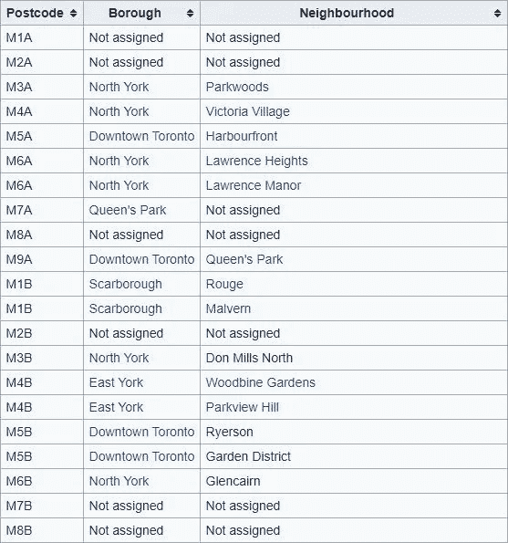
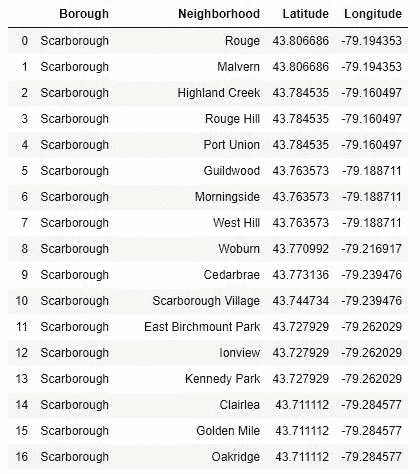
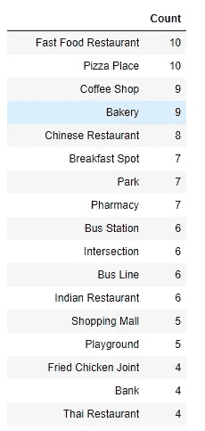
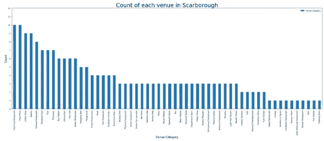
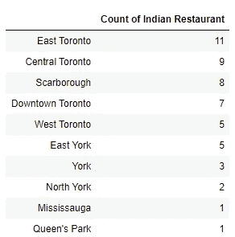
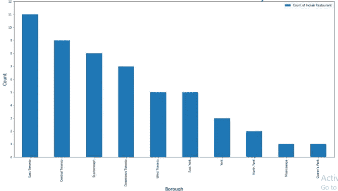
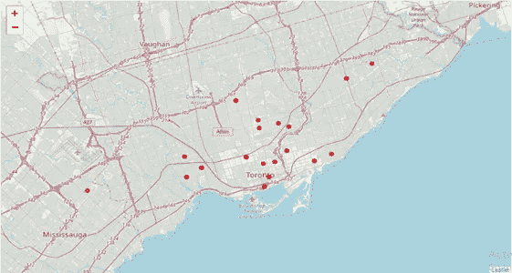
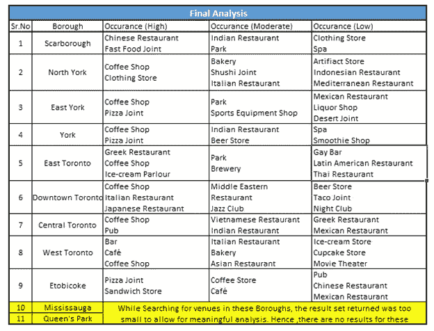

# 我的顶点项目:探索多伦多，寻找开设印度餐馆的最佳地点

> 原文：<https://towardsdatascience.com/my-capstone-project-exploring-toronto-and-searching-for-the-best-place-to-establish-an-indian-af140e77250b?source=collection_archive---------24----------------------->

## 我第一次尝试数据科学项目

在 [Unsplash](https://unsplash.com?utm_source=medium&utm_medium=referral) 上由 [mwangi gatheca](https://unsplash.com/@thirdworldhippy?utm_source=medium&utm_medium=referral) 拍摄的照片

# **简介**

尊敬的读者们，你们好，这是我第一次写博客，并把它发布出来让大众仔细阅读。我写这篇博客是作为我的 IBM 数据科学顶点课程的一部分。我的任务是提出一个假设的问题，并提出一个面向数据科学的解决方案，以发掘有意义的见解和结论性的结果。顾名思义，这里的任务是探索美丽的多伦多市，遍历其邻近地区，并最终提出几个有商业潜力的建议，以开设一家新的印度餐厅。

# **目标受众**

在制定问题陈述时，我考虑到了个人在现实世界中可能面临的困境。因此，我想出了一个问题陈述，旨在为多伦多市的一家印度餐馆找到最佳地点。

这将为两种不同的受众群体服务。首先，这将有助于那些打算在酒店行业(如餐馆)开展新业务的人找到一个印度餐馆最少的地方。其次，这可以帮助游客根据他们的个人喜好选择地点(行政区)。例如，一个有很多餐馆的行政区或一个有很多游客可能感兴趣的公园的行政区。

# 数据集

以下项目所需的数据集来自三个不同的数据源。下面列出了三个数据源，

*   一个[维基百科页面](https://en.wikipedia.org/wiki/List_of_postal_codes_of_Canada:_M)获取多伦多市的行政区和社区。
*   答。csv 文件来获取对应于每个邮政编码的纬度和经度。
*   foursquare api 获取附近不同的公共场所。

维基百科页面包含了多伦多的邮政编码表，以及多伦多市的行政区和社区。的。csv 文件为我们提供了多伦多地区每个邮政编码的经度和纬度坐标。该数据是有益的，因为这些坐标随后与 four square api 一起使用，以给出每个街区中受欢迎的场所的列表。

这些数据是全面的，并产生了与多伦多市相关的有价值的见解，最终帮助我们挖掘出结论性的结果和观察。在项目开始时，数据源被认为是不干净的，需要密集的预处理，以便将其转换为能够处理机器学习算法和在其上实现的可视化操作的工作集。

表格形式的数据在进入项目的预处理阶段之前看起来是这样的。

不干净的数据集(*图片作者*

一旦使用数据预处理工具处理了从数据源获取的数据，它看起来就像下面给出的表格。

干净的数据集(*图片作者*

# **数据预处理**

我执行的第一步是从维基百科页面抓取数据，包括所有的行政区和社区以及它们的邮政编码。我将它转换为数据框，因为在使用可视化技术进行分析时，它们是最好的数据结构。数据框仍由许多可视为缺失值的值组成，因为邮政编码未分配给任何区或邻域。当我们进入项目的后期阶段时，缺失的值会导致结果的差异。因此，我删除了所有缺少值的行。

第二步包括从. csv 文件导入数据。的。csv 文件由每个邮政编码的经度和纬度坐标组成。这个。csv 文件被导入到数据框中，以便于后期分析。随后，我合并了由区和邻域信息组成的数据框和由坐标值组成的数据框。合并是在邮政编码列上实现的，该列后来从最终的表中删除，因为它对进一步的分析没有任何用处。

# 数据分析

数据分析阶段包括两个重要的任务，为了得到问题陈述的答案，必须完成这两个任务。我们问题陈述的两个方面包括。

*   行政区分析。
*   根据所选地点附近印度餐馆的数量，寻找在多伦多市建立印度餐馆的最佳可能邻近地区，即(选择竞争最小的邻近地区)。

首先，我从区分析开始。为了获得特定行政区不同场馆所需的数据，我使用了 foursquare api。当客户端 id、客户端机密和 Foursquare api 的版本被传递时，foursquare api 被链接到我的代码。这意味着我与 foursquare api 建立了连接，我可以调用 foursquare api 来获取任何所需的场地信息，包括多伦多市的任何一个区。因为该项目是基于逐区分析的。我将最终的、干净的数据框分割成单独的数据集，其中每个表只包含一个区的数据。这是通过保留与我们感兴趣的行政区相关联的行来实现的。完成上述步骤后，我编写了一个函数，该函数将调用 four square api 并访问数据，如场馆名称、场馆类别、场馆纬度、场馆经度等，然后将这些数据与我们在上一步中提取的区表相结合。我还删除了区列，因为它对我们的分析没有必要，最后我根据它在数据集中出现的次数对场馆类别进行了分组。分组场馆类别的样本数据集如下所示。

包含场馆数量的数据集(*图片由作者*提供)

经过彻底的数据分析阶段后，我提出的数据框架被绘制到一个条形图上，以便于可视化和可读性。下图描绘了斯卡伯勒的条形图。

斯卡伯勒场馆数量条形图(*图片由作者*提供)

作为我顶点工程的下一步。我开始对整个多伦多市进行分析，目的是找到最适合开设印度餐馆的街区和行政区。解决此问题陈述所遵循的流程与行政区分析所遵循的流程相似。我们再次使用用于区分析的相同函数来调用 foursquare api。但是，我们没有传递根据各个区分开的数据帧，而是传递包含多伦多市所有区和社区信息的数据帧。这给了我们一个大的数据框架，其中包含了多伦多市几乎所有场馆的信息以及这些场馆的类别。然后，我们提取包含印度餐馆信息的行，并丢弃数据框中的其余条目，因为它们对我们没有用。我们现在手头的数据集是一个简洁的数据集，包含了对我们的项目很重要的信息。然后，我们创建一个新的数据框，其中包含每个行政区的印度餐馆数量。下图描述了数据框。

每个区的印度餐馆数量(*图片作者*

这些数据被绘制在一个条形图上，以便于理解，同时也能吸引阅读本文的读者的注意力。

一张柱状图展示了每个区的印度餐馆数量

此外，我还计划在多伦多地图上标出印度餐馆的位置。地图上将在餐馆的位置有一个标记，这表示附近有一家印度餐馆。此外，当一个人点击标记时，会弹出一个标签，描述附近印度餐馆的数量。这将通过查看地图为观众提供关于印度餐馆的位置的很好的想法，同时它将描述特定社区中印度餐馆的数量。打算开一家印度餐馆的人会避开有大量印度餐馆的地方，而会寻找竞争最小的地方。这可以通过查看地图和仔细研究印度餐馆的位置来实现。下面是描绘多伦多市印度餐馆位置的地图。

描绘多伦多市印度餐馆位置的多伦多地图(*图片由作者*提供)

# **结果**

下面的表格为读者提供了在某个特定行政区可以找到的不同场馆类别的简要信息。该信息是从 four square api 返回的数据中检索的。

多伦多市行政区的整体分析(*作者图片*)

> 如果任何读者对详细的区分析感兴趣，或者对检查为每个区创建的各种条形图感兴趣，或者如果他们对检查为了描绘多伦多市的印度餐馆的位置而创建的地图感兴趣，他们可以通过我的 [Github](https://github.com/shaunak09vb/IBMData-Science-Capstone) repo。

# **假设和考虑**

在本项目过程中，考虑了一些假设和考虑因素，以帮助成功完成本项目。在浏览我的所有实现步骤时，下面给出的实例被考虑在内，并且在浏览过程步骤时应该牢记在心。

*   在区域分析阶段，foursquare api 调用期间传递的半径被认为是 500 米。
*   在项目的第二阶段，包括寻找建立印度餐馆的最佳地点，foursquare api 调用期间传递的半径被认为是 700 米。这种改变是必要的，因为采取较小的半径会导致错过一些街区。
*   foursquare api 返回的结果可能每天都有变化，因此 foursquare api 返回的场地数量可能会略有变化。
*   在确定开设印度餐馆的最佳地点时，只考虑了一个因素，即防止在已经有相当多印度餐馆的社区开设印度餐馆(即寻找竞争最小的地点)。
*   两个区，密西沙加和皇后公园从我们的分析中被排除，因为在上述区搜索场地没有返回大量的结果。

# **结论**

在这个顶点项目的过程中，我能够应用我在 IBM 数据科学课程中学到的不同的数据科学技术和工具。这帮助我从多伦多数据集的数据分析中挖掘出有意义的见解。下面列出了我在数据分析阶段发现的一些方面。

## 区域分析

*   咖啡店是一个几乎在所有行政区都有很高出现率的场所。
*   如果你是一名游客，密西沙加和皇后公园有很少的场地可以去或选择。
*   公园是下一个在不同行政区中出现最多的场所。
*   多伦多市中心有最多、最多样的场所供游客选择。

## 多伦多城市分析(建立一家新的印度餐馆)

*   东多伦多和中多伦多是印度餐馆数量最多的两个区。
*   印度集市、索恩克利夫公园和海滩西区是印度餐馆最多的街区。
*   北约克、皇后公园和密西沙加是开设一家新印度餐厅的理想地点，我们的理念是新业务在那里面临的竞争最小。