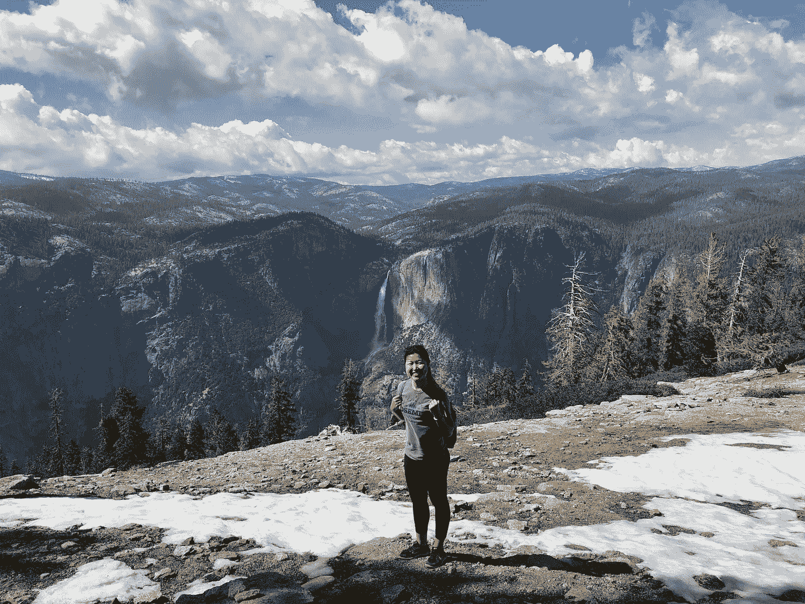

# 我从数据分析师到数据科学家的职业转变

> 原文：<https://towardsdatascience.com/my-career-transition-from-a-data-analyst-to-data-scientist-12f79931d2fc?source=collection_archive---------37----------------------->

## 我如何坚定不移地追求数据科学

6 个月前，我辞去了数据分析师的工作，去 Metis 数据科学训练营加速学习。3 个月的课程让我以结构化的方式学习，提高我的技术能力，并获得更多关于当今最新技术的专业经验。我实施了五个端到端 DS 项目，这些项目解决了业务挑战并提高了业务价值。其中一个包括一个[端到端推荐系统](https://medium.com/analytics-vidhya/personalised-recommendations-based-on-customer-segmentation-and-e-commerce-product-ratings-6465b8877815)，基于个人的 CLV 和产品评级，提供更有针对性的建议，改善用户体验，确保用户保留。

带着对数据科学高涨的热情，我踏上了作为 DS 的下一个职业旅程。然而，在新冠肺炎疫情寻找下一个机会充满了挑战和挫折。疫情的一个必然结果是不确定的商业环境，招聘冻结，裁员。然而，在这个不确定和困难的时期找工作给了我各种各样的教训。

## 1.事业是马拉松，不是短跑。

当我进入最后一轮招聘程序时，有一阵阵的兴奋和渴望，也有令人沮丧的拒绝。我没有对结果过于沮丧，而是不断提醒自己专注于过程，每天学习新的东西并应用它。毫无疑问，这并不容易实现，因为我注重结果的个性与缓慢而稳定的方法背道而驰。

## 2.这让我想到了我的第二课——视角转换。

当我因学习过程中的失败或疲惫而沮丧时，我会提醒自己采取另一种观点。例如，当被更有经验或更强领域知识的申请人取代时，我将这种挫折视为磨练自己技能、获得更多行业知识、为自己的正确工作做准备的机会，只是现在还看不到。

经过 70 多份申请、30 次面试、无数次带回家的作业和现场编码会议，我很荣幸也很感激成为戴尔客户体验团队的数据科学家，很高兴能与才华横溢的 DS 社区一起改善用户体验并确保留住人才。

## 3.没有家人、朋友和导师的大力支持，这个过程是不可能的。

我也非常感谢我的朋友们坚定不移的支持，以及导师们在此期间宝贵的指导和鼓励。在这个充满挑战和不确定的商业环境中，你的支持和建议帮助我坚持了下来。非常感谢我的朋友们，他们在我找工作的过程中友好地同意推荐我，我真的很感激你们的帮助。

## 4.当我开始作为一名数据科学家的旅程时，我也被提醒不要满足于现有的成就，要永远对知识充满渴望。

这个数据科学/人工智能行业每天都在快速发展，需要获取大量的新知识。为此，我试图通过参加[深度学习课程](http://coursera.org/verify/specialization/NH8FTXZ5URG5)，成为 [AWS 认证](https://aw.certmetrics.com/amazon/public/verification.aspx?code=QXNCNF3KEMQEQDCK)，在我的兼职项目中应用最先进的自然语言处理(NLP)技术，如 BERT，来磨练我的技术能力，例如[从用户的信息中识别用户的意图](https://github.com/valerielimyh/Intent_Recognition_using_BERT)，以及[从句子中提取最能描述其情感的关键短语](https://medium.com/analytics-vidhya/to-be-rt-or-not-to-be-rt-7b7b1f008d37)。目前，我正在参加 Shopee 在亚洲最大的在线比赛( [Shopee 代码联盟](https://careers.shopee.sg/codeleague/))，在比赛中，我应用了最新的计算机视觉技术[将 Shopee 的产品图像分类到相应的类别](https://www.kaggle.com/datahan/tf-record-pipeline)，并应用[无监督机器翻译](https://engineering.fb.com/ai-research/unsupervised-machine-translation-a-novel-approach-to-provide-fast-accurate-translations-for-more-languages/)将繁体中文产品标题翻译成英文，而没有使用并行数据。

我渴望发展我的技能组合，以释放数据的力量，让其他人能够做出基于数据的决策并将这些见解传达给他们，并努力成为一名全栈数据科学家，在其中为人们构建自动化和可扩展的应用程序！

有兴趣跟随我的旅程吗？请随时在 LinkedIn 上联系我，交流想法或进行非正式聊天。你也可以在这里查看我为其他数据科学项目[撰写的文章:)保重，注意安全！](https://medium.com/@valerielimyh)