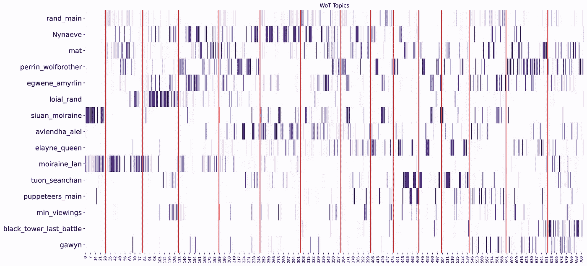

# 我的电脑显示“时间之轮”。

> 原文：<https://towardsdatascience.com/my-computer-reads-the-wheel-of-time-faab61d18e9f?source=collection_archive---------18----------------------->

## 史诗奇幻系列丛书的自然语言处理。

塞德里克·范登堡在 [Unsplash](https://unsplash.com?utm_source=medium&utm_medium=referral) 上拍摄的照片

很久很久以前，在一个现在被称为 90 年代的时代，一场关于后《指环王》时代最佳史诗奇幻片头衔的大战正在进行。在一个角落里站着乔治·r·r·马丁(George R. R. Martin)，他的黑暗阴森系列电影《冰与火之歌》(A Song of Ice and Fire)，也就是现在更为人熟知的《权力的游戏》(Game of Thrones)。另一个挑战者是罗伯特·乔丹，他有自己的系列片《时间之轮》。今天，这个宏大的故事不为许多人所知，但当根据这些书改编的电视剧明年上映时，这种情况可能会改变。在写这篇文章的时候，电影正在拍摄中。

随着越来越多的关于拍摄这部新的奇幻剧的公告出来，我对这些书的热爱也被重新点燃了。因此，当我选择我的下一个项目作为 Metis 数据科学训练营的一部分时，我决定让我的计算机作为自然语言处理(NLP)项目来“阅读”这个系列。

## 那些书

《时间之轮》是一个庞大的故事，跨越 15 本书，共 704 章，多达 440 万字。它以大量的角色和地点为特色，并从 147 个独特的角色的角度讲述，一些角色比另一些角色对故事更重要。故事从一个小村庄开始，以一群人物为中心，从那里开始变得越来越庞大和复杂。它包含了一个丰富详细的世界，充满了文化、魔法和政治。正如在史诗般的幻想中常见的那样，中心主题是光明与黑暗、善与恶之间的古老战争，随着时间的车轮旋转，这场战争一次又一次地进行。

> 《时间之轮》是一个庞大的故事，跨越 15 本书，共 704 章，多达 440 万字。

不幸的是，罗伯特·乔丹在完成他一生的工作之前就去世了，但他留下了大量的笔记，甚至完成了未来章节的部分内容。他的妻子兼编辑哈丽雅特选择布兰登·桑德森利用现有的材料完成这本书，最终的书于 2013 年 1 月出版。

## 方法学

在开始实际分析之前，我必须确保能够访问 Python 中的全文。我购买了捆绑系列的电子书版本(ISBN 9780765376862 ),并使用 EBooklib 库来访问 XML 格式的书籍，我使用 BeautifulSoup 解析了这些书籍。令人惊讶的是，这是我的项目中最具挑战性的一步，因为这本电子书是多本书的集合。有几本书的格式与其他书不同，所以我不得不设置例外和规则，以自己的方式解析和提取它们。

这是一个无人监督的学习项目，所以我主要关注主题建模，看看计算机是否能够理解这一大堆文本。我尝试了多种技术来查看不同建模方法可以得出的结果。您可以在我的 Github [这里](https://github.com/S-Hermanides/Wheel_of_Time)找到我的完整代码和结果，包括每个被丢弃选项的注释，但是对于本文，可以说我最终的模型使用了 TF-IDF 矢量器和非负矩阵分解。我有一种感觉，我需要使用二元语法来捕捉书中许多虚构的名字和地点，但这被证明是不必要的，并且根本没有提高我的主题建模的质量。

当我尝试上面提到的不同模型时，突破时刻是从标准计数矢量器切换到 TF-IDF。当我尝试的时候，话题开始与我的书本知识相吻合。

## 结果

我的主题建模的结果比我开始项目时所希望的要清晰。最终的模型非常清晰地区分了 14 本书中的角色弧线。我把最终的主题数量限制在 15 个，除了一个以外，所有的主题都有一个中心人物的名字(或阿朵的人物)作为最重要的特征。增加主题的数量仍然会产生合理的新主题，但情节和人物的重要性会降低。一个不围绕角色的主题围绕着最后一场战斗，这是如此的不同和关键，以至于它有自己的主题是有意义的。

> 最终的模型非常清晰地区分了 14 本书中的角色弧线

这些角色弧线定义得如此清晰，使得在整本书和整个系列中追踪它们成为可能。我创建了一个热图可视化，显示了 15 个主题以及它们在书中出现的位置。x 轴是章节号，y 轴是主题，红线是不同的书，颜色的强度标志着一章与主题的紧密程度。

贯穿整个《时间之轮》系列的主题热图

对于那些不熟悉这些书的人，我将用一个例子来说明这个结果有多准确。这个系列的一个非常重要的角色是莫伊瑞恩，她在两个主题中出现，与她最强的两个盟友，斯万和兰一起出现。事实上，她是如此重要，以至于在《时间之轮》的中途，她有了自己的前传来探索她的背景故事。这本书是上面热图中的第一本书，你可以看出视觉完全集中在这本书的两个主题上。

类似上面例子的结果很多。我一直在为这个最终模型寻找有趣的应用。我从书迷网站上收集了书籍摘要，并将它们与单本书的热图进行了比较，比如下图中《冬天的心》一书的热图。结果匹配得非常好，就像 Mat 和 Tuon 的角色弧线有重叠的章节。剧透:这两个人在这本书中相遇后最终结婚了。

然后我拿了 Goodreads 上系列评分最低的那本书(第十本书:暮光之城的十字路口)分别对它的主题建模。结果显示了这本书过于政治化的情节，以及粉丝们所熟知的厄运情节。一个特别的情节被拖得太长，而且有一些奇怪的角色行为。我可以举更多的例子，但是你应该明白。

我进行的最后一项测试是为了真正检验这个模型，看看它与人类对书籍的解读相比如何。出版商的网站上有一个名为[时间之轮重读](https://www.tor.com/features/series/wot-reread/)的长期系列。它以作者和超级粉丝 Leigh Butler 对每一章的深入总结以及附加的解释和分析为特色。我从网站上搜集了每一章的摘要，在我的模型中运行，发现 86%的章节都有主题匹配。许多无与伦比的也是千钧一发，然而…

## 限制

除了模型表现之外，与重读的比较显示了一些局限性。随着模型在整个系列上被训练，主题是非常高的水平。一些被重读的摘要所强调的真正关键的时刻没有被计算机提取出来，因为它们可能没有占用该章的许多单词。计算机也没有办法在一个角色弧线内模拟节奏、剧情分辨率或支线剧情，就像前面提到的《毁灭战士》的情节主线。

作为一个热情的读者，我很高兴知道自己仍然有很好的理由去读这些书。作为一名数据科学家，我很高兴我的模型产生了如此有趣的结果。我喜欢用我所获得的数据科学技能，以一种不同的方式钻研我最喜欢的系列丛书之一。我强烈建议任何想在自己最喜欢的书上尝试同样的实验的人，看看[我的代码](https://github.com/S-Hermanides/Wheel_of_Time)，从中获得一些乐趣。