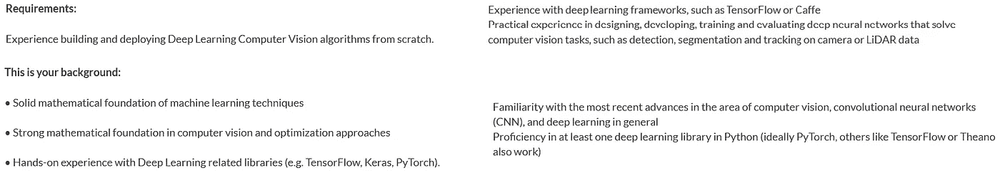

# 我在 Coursera 上的数据科学在线学习之旅

> 原文：<https://towardsdatascience.com/my-data-science-online-learning-journey-on-coursera-d5f733c68368?source=collection_archive---------3----------------------->

## Coursera 上的课程和专业列表，让我开始了数据科学和机器学习之旅

凯勒·琼斯在 [Unsplash](https://unsplash.com/s/photos/path?utm_source=unsplash&utm_medium=referral&utm_content=creditCopyText) 上拍摄的照片

# 介绍:我的背景

正是在 2016 年，我在完成机械工程学士学位后，立即开始了追求计算力学硕士学位的旅程。当时我的编程知识有限，更不知道什么是数据科学，什么是机器学习。

这件事发生在我硕士学习期间，当时我得到了一个经典的计算机视觉项目，我需要使用 Python、C++和 OpenCV 构建对象检测和对象跟踪算法。那个项目真的迫使我艰难地学习 Python 和 C++以及如何正确地编写干净的代码。

长话短说，后来我发现自己被计算机视觉领域迷住了，这使我着迷:我想成为一名计算机视觉工程师。

但在我阅读了所有空缺职位中计算机视觉工程师的职位要求后，厚望变成了灰尘:他们希望候选人了解机器学习和深度学习，特别是卷积神经网络(CNN)。

计算机视觉工程师常见职位描述

那时候我连机器学习是什么都不知道，更别说 CNN 了。虽然我的学习计划确实触及了编程、数学和统计领域，但我们从未谈论过机器学习。

经过一些研究，我发现如果你想了解 CNN，你需要先了解深度神经网络(DNN)的一般情况。如果你想了解 DNN，你需要先了解经典神经网络。想要了解神经网络，首先需要了解机器学习。如果你想从总体上了解机器学习，你需要首先了解数据科学的基础。

这就像一个电子游戏，我需要一步一步地向上，直到我到达我想要的主题。另外，我非常喜欢自下而上的方法，因此我决定先学习数据科学的基础知识。

当时的问题是:当我的学习计划不提供与它们相关的课程时，我如何才能了解所有这些知识？

我需要自学所有的课程。

那是我第一次知道 Coursera 的存在。

# 为什么是 Coursera 呢？

首先，我在这篇文章里并没有为 Coursera 背书的意思。我只是发现它们是我最好的在线学习平台，因为有很多来自知名机构的数据科学和机器学习课程。此外，您可以选择免费旁听课程，并且仍然可以访问学习资料。

最重要的是，如果你真的想追求专业化证书，与 Udacity Nanodegree 相比，它的总成本要便宜得多，尤其是如果你还是学生的话。

好了，说够了，让我们进入我的学习之路。

# 我的数据科学学习途径

我想我们都同意，万事开头难。和我想涉足数据科学的时候一样。我一直在问一个问题:我从哪里开始？

经过一番研究，我终于想出了我的在线学习课程，以下是我在 Coursera 上按时间顺序学习的课程或专业列表。

## [IBM 数据科学](https://www.coursera.org/professional-certificates/ibm-data-science)

我决定从非常基础的水平开始学习数据科学，因为我不想错过一些重要的概念。这就是为什么我决定将 IBM 数据科学作为我的第一个专业。

在学习这门课程之前，你不需要有任何关于数据科学、统计学、机器学习或编程的知识。这个专业的第一门课程字面上叫做*‘什么是数据科学？’*。我的意思是，你不会得到比这更基本的，对不对？

这个专业有 9 门课程。它从数据科学的概念和方法开始，然后深入研究 Python 和 SQL 的编程内容。接下来，它将向您介绍数据科学的核心内容——统计学、数据分析、数据可视化和机器学习。

完成本专业后，你不会成为数据科学专家，因为本专业不会非常详细地教授你每个主题。然而，它给了我一个非常好的数据科学概述，以及我接下来应该学习什么。

由于这个专业，我能够为我的数据科学和机器学习在线学习之旅创建一个路线图，如下所示:

*   结构化查询语言
*   统计数字
*   数据可视化
*   机器学习
*   深度学习

这将引导我进入下一个专业领域。

## [使用 SQL 进行现代大数据分析](https://www.coursera.org/specializations/cloudera-big-data-analysis-sql?)

这是 Cloudera 提供的一个专业，专注于利用 SQL 进行大数据分析。这个专业总共有 3 门课程。

众所周知，如今的数据量太大，无法存储在传统的数据库管理系统中，因此在分布式集群中处理数据的知识和实践经验非常重要。这门课会教你这一点。

我真正喜欢这个专业的是它的实践性。借助 Cloudera 的虚拟机，我们有机会应用 SQL 查询来检索或存储 Apache Hive、Apache Impala、MySQL 或 PostgreSQL 中的数据。即使在完成专业化之后，您也可以随时重新访问虚拟机，因此您将始终能够修改您的 SQL 技能并处理数据。

如果您对 SQL 一无所知，请不要担心，因为这个专业将从基础开始教您。

## [借助谷歌云平台从数据到洞察](https://www.coursera.org/specializations/from-data-to-insights-google-cloud-platform?)

我参加这个课程是为了补充我在 Cloudera 之前的专业课程中学到的内容。虽然 Cloudera 的专业化更侧重于在分布式集群中应用 SQL，但这种专业化让我能够在云上应用 SQL。

这个专业将教你如何在 BigQuery 中检索或存储谷歌云平台(GCP)上的数据。您将可以使用 Google analytics 等 Google 公共数据集，并自己实现 SQL 查询。

除此之外，我喜欢这种专业化的原因是，您将学到的不仅仅是 SQL 和 BigQuery。您还将了解如何使用 Google Data Studio 创建交互式数据可视化仪表板，以及如何直接在 BigQuery 中创建简单的回归或分类机器学习模型。

在完成这个专业之后，我进一步学习了数据科学和机器学习背后最重要的概念之一，也就是统计学。

## [用 R 统计](https://www.coursera.org/specializations/statistics)

我们同意统计学是数据科学的核心。因为我以前已经了解统计学，所以我选择了这个专业，期望更新统计学的基础理论。但最后，我得到的比我预期的要多。

专业化真正教会你所有你需要知道的关于统计学的知识，从关于概率的基础理论、推断统计学和从频率主义者和贝叶斯观点的回归理论开始。

这种专业化有两点是我喜欢的:

1.  所有的期末项目都是有价值的，这意味着你需要做真正的统计数据分析工作，不要指望在一两个小时内完成。在你完成专业化后，你将有 3 或 4 个有价值的项目放在你的简历中。
2.  每门课都需要用 R 来完成项目。这对我很好，因为我以前从未用过 R。我认为学习一门新的编程语言从长远来看是有益的，R 无疑是一个很好的数据科学和统计工具箱，可以添加到你的技能组合中。

完成专业学习后，我觉得我想更深入地研究贝叶斯统计，尤其是马尔可夫链蒙特卡罗。这就是为什么我在这个专业毕业后又上了一门关于统计学的课程，那就是…

## [贝叶斯统计:技术和模型](https://www.coursera.org/learn/mcmc-bayesian-statistics)

如果你想全面了解贝叶斯统计的概念，我认为这将是适合你的课程。在本课程中，您将学习关于马尔可夫链蒙特卡罗的概念，以及如何用贝叶斯概念解决回归问题。

我真正喜欢这门课的是理论和实践之间的平衡。

对于每一个材料，首先会涉及到理论，然后会有一个演示，在这个演示中，讲师会向你展示如何用代码实现你刚刚学到的理论。在本课程中，您将学习如何在 R 和 JAGS 中实现贝叶斯统计。

本课程的期末专题也是有价值的，与上面 R 专业的统计学非常相似。你将被要求在 r 中用贝叶斯概念做统计分析工作。

结束课程后，我决定继续下一个主题，即数据可视化。

## [带 Tableau 的数据可视化](https://www.coursera.org/specializations/data-visualization?)

在可视化数据方面，我通常会使用 Python，或者借助 Matplotlib、Seaborn 或 Plotly。然而，我想学习一些新的东西——我想学习如何使用商业智能工具可视化数据，无论是使用 PowerBI 还是 Tableau。然后我就发现了这个专精。

如果您不熟悉 Tableau，并且想学习用它来可视化数据，我会推荐这个专门化。

这个专业有 5 门课程，包括一个顶点项目。前三门课程将为您提供数据可视化最佳实践的理论理解，以及如何用您的数据讲述故事。第四个课程基本上是您接触 Tableau 的地方，因为您将学习如何使用 Tableau 创建交互式数据可视化仪表板和故事。

我真正喜欢这个专业的是，当你注册了这个专业，你将获得 6 个月的 Tableau 桌面免费使用权。

这意味着您可以在本地机器上探索 Tableau 的许多功能，并用它创建许多有趣的可视化效果。如果许可证在 6 个月后过期，你将有机会再延长 6 个月。

## [机器学习](https://www.coursera.org/learn/machine-learning?)

至此，我已经了解了数据科学概述、使用 SQL 的大数据分析、统计学和数据可视化最佳实践。接下来，终于到了我学习机器学习的时候了。

作为一个完全的机器学习初学者，我决定参加吴恩达的机器学习课程，因为我知道这个课程是 Coursera 上关于机器学习的最知名的课程。

这是完全正当的。我相信我找不到比这更好的初学者机器学习课程了。

本课程将向您介绍经典的监督和非监督机器学习算法的概念，如线性回归、逻辑回归、SVM、K 均值聚类以及人工神经网络。不仅如此，安德鲁还为我们提供了在实践中应用机器学习系统的技巧和诀窍。

基本上，我喜欢这门课的一切。

我喜欢吴恩达在教我们不同类型的机器学习算法时的热情。我喜欢他向我们解释和简化困难的机器学习概念是多么容易。我也喜欢这个编程作业，以及我们如何有机会从头开始实现神经网络算法。

如果你是机器学习的新手，对我来说，这是你应该开始学习的最好课程。

## [深度学习](https://www.coursera.org/specializations/deep-learning?)

最后，我越来越接近我的最初目标——学习卷积神经网络的概念。

我仍然记得当我发现吴恩达是这个深度学习专业的老师时，我是多么兴奋。在我完成机器学习课程后，选择这个专业对我来说并不是一个困难的决定。

专业化是非常好的结构。第一门课将在你学习了之前机器学习课程中的经典神经网络之后，教你深度神经网络的概念。接下来，它给出了卷积神经网络和序列模型的重要概念。

吴恩达一如既往地在教授深度学习算法的困难概念方面表现完美。编程作业很有趣，这让你可以用 TensorFlow 实现各种深度学习算法，tensor flow 是目前业界最常用的深度学习框架之一。

然而，这个专业中的大多数编程任务仍然在 TensorFlow 1 中实现，而 tensor flow 1 现在已经过时了。

## [深度学习。AI TensorFlow 开发者职业证书](https://www.coursera.org/professional-certificates/tensorflow-in-practice?)

我相信这个专精在 DeepLearning 之前在实践中叫做*tensor flow*。AI 更名为 *TensorFlow 开发者职业证书*。

无论如何，我在完成深度学习专业化后直接选择这个专业化的主要原因是，我想学习如何为各种深度学习算法实现 TensorFlow 2。这种专业化完全实现了这一点。

这个专业化是一个纯粹的动手练习。你在里面找不到任何关于深度学习的理论，因为它的重点是借助 TensorFlow 实现深度学习算法。因此，建议您在参加本专业之前已经了解深度学习的概念。

它为您提供了关于如何为图像分类、情感分析、诗歌生成和时间序列预测构建深度学习模型的实践经验。

作为奖励，如果你将来想参加 TensorFlow 开发者证书，这个专业也将是你准备它的最好来源。我最近参加了认证，我可以说这个专业是最好的准备来源。如果你对我参加认证的经历感兴趣，你可以在下面的链接中阅读。

 [## 我参加 TensorFlow 开发者认证考试的故事

### 我参加考试的总体经历，我是如何准备的，如果我必须参加考试，我会做些什么…

towardsdatascience.com](/my-story-of-taking-the-tensorflow-developer-certification-exam-85d4fb777cbb) 

# 结束语

我假设你已经知道，单独参加数据科学和机器学习课程不足以实现你的目标，无论是获得一份数据科学工作还是掌握某些数据科学概念。和我一样，上过 CNN 相关的课程并不代表我已经掌握了。

这些课程为你提供了你感兴趣的任何主题的基础知识。参加课程只是一个起点，接下来会发生什么完全取决于你。

将你从课程中学到的知识运用到实践中，真正巩固你的新技能。在参加这些课程的同时或之后，做一些自己喜欢的项目，将代码上传到 GitHub 上，并通过博客将项目或学习材料分享给其他人。

祝您的数据科学学习之旅一切顺利！