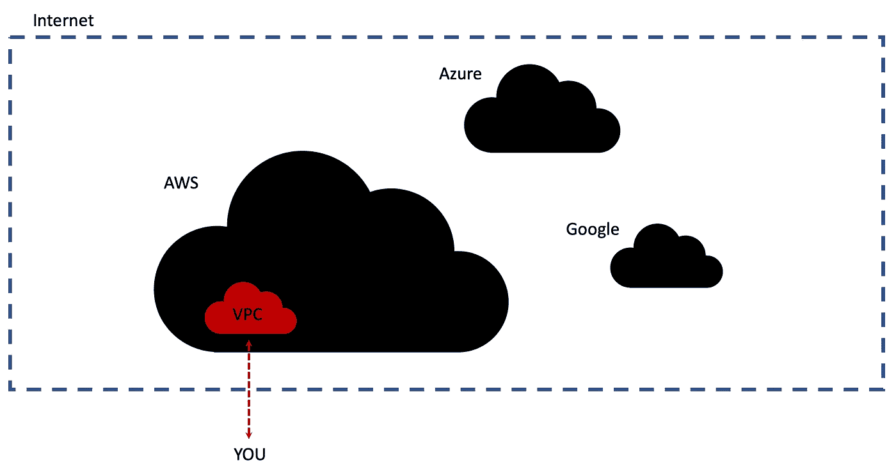
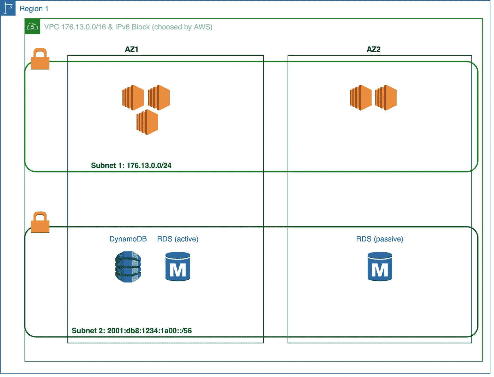
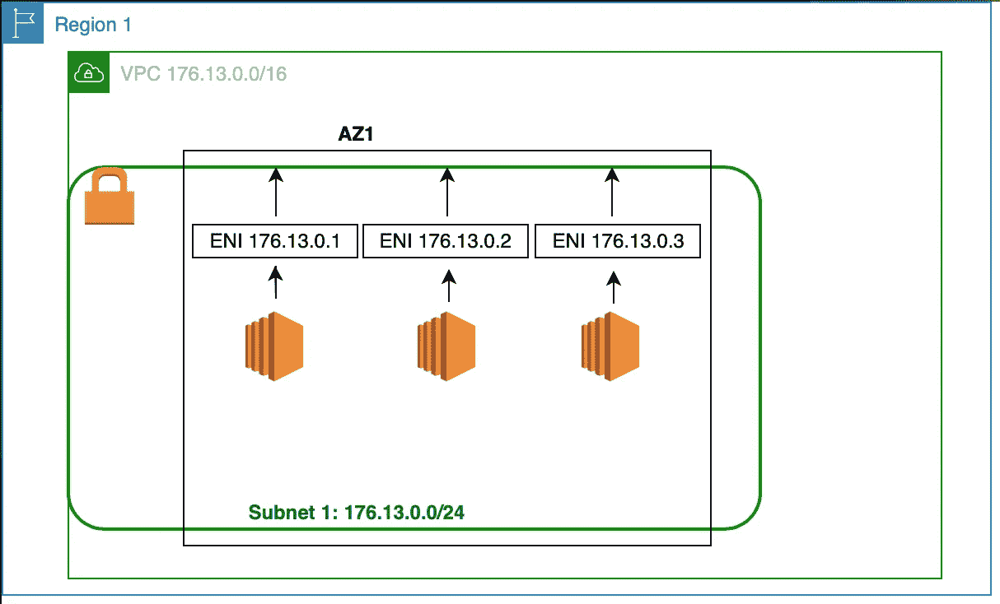
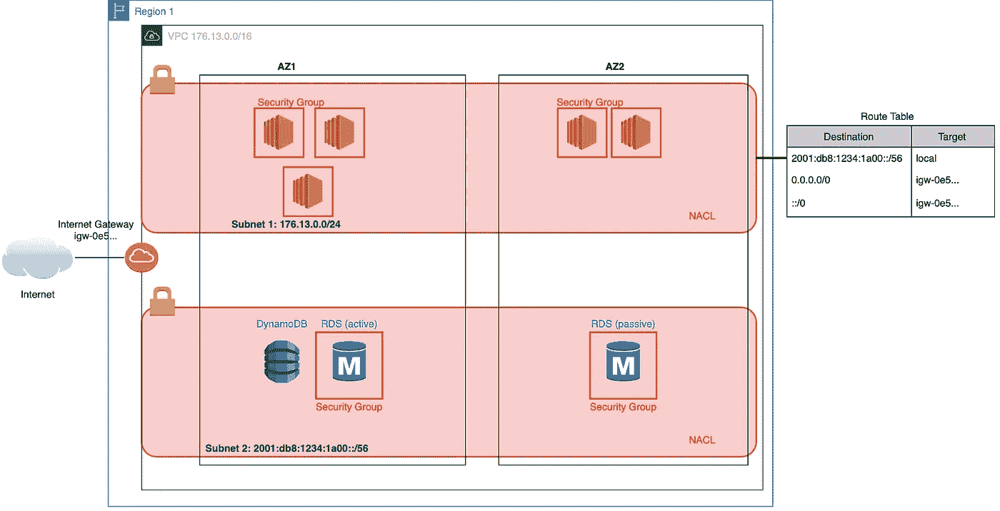

# “我的数据科学家不知道如何正确启动 EC2 实例”。

> 原文：<https://towardsdatascience.com/my-data-scientist-doesnt-know-how-to-properly-start-an-ec2-instance-b1b9f4920359?source=collection_archive---------7----------------------->

## VPC、子网或互联网网关是指任何 AWS 设置的核心组件。然而，数据科学家通常认为它是为他们配置的。让我们介绍一下最重要的概念，并清楚地了解它们的作用。


新加坡的 CBD 采用神经式传送，用的是这种[码](https://github.com/ProGamerGov/neural-style-pt)和[纸](https://arxiv.org/abs/1508.06576)。

[在我之前的文章](https://medium.com/@louisdge/catching-up-with-the-cloud-trend-and-the-aws-ecosystem-dd512e8e2456)中，我们为弹性和数据密集型应用建立了一个云基础设施，如下图所示。如果您对 AWS 区域、AZs 或高可用性区域没有很好的了解，我推荐您阅读这篇文章。


我们上一篇文章中的云架构示例

让我们用这个例子来解释底层的网络和安全概念。请随意访问 AWS 控制台，启动我们提供的资源(大多数都是免费的)。阅读完本文后，您将能够理解在设置 EC2 实例时您实际上在做什么。不仅如此，它还将使您能够配置其他 AWS 服务并将它们链接在一起。此外，各部分都是相当独立的，因此在需要时可以直接跳到概念。

**I .隔离您的基础设施**

1.  *VPC*
2.  *子网*

**二。实例和网络之间的通信**

1.  *弹性网络接口*
2.  *互联网网关*
3.  *路由表*

**三。安全事项**

1.  *安全组*
2.  *氯化钠*

我们开始吧！

# 隔离您的基础设施

首先，请记住，互联网从根本上说是一个巨大的网络，其中的节点由像您这样的服务器或计算机组成，由公共的[互联网协议地址](https://en.wikipedia.org/wiki/IP_address)或 *IP* (如 104.16.122.127)标识。这些节点使用[互联网协议套件](https://en.wikipedia.org/wiki/Internet_protocol_suite) ( *TCP/IP* )相互通信。

在继续之前，请务必熟悉这些概念。

当在云中创建一个应用程序时，比如上面提到的，我们可以独占访问由云提供商创建的位于更大的公共网络中的网络。这被称为*虚拟私有云* (VPC)，是首先要设置的。这是我们所有的 AWS 资源将在其中运行的网络。



在互联网这个庞大的网络中，你可以通过云提供商获得自己的私有网络。

## VPC

默认情况下，VPC 最初会与任何其它网络隔离。它必须位于一个 AWS 区域中。然后，您需要选择一些 IP 地址，这些地址将用于标识在 VPC 中运行的实例。这必须在您开始构建基础设施时完成。例如，使用[无类域间路由](https://en.wikipedia.org/wiki/Classless_Inter-Domain_Routing) ( *CIDR* )符号，您可以留出这些 IP 地址(或 CIDR *块*)供将来使用:176.13.0.0/16。此语法指定了从 176.13.0.0 到 176.13.255.255 的所有 IP 地址。

为了确保这些地址不会与互联网上当前使用的公共 IP 地址重叠(例如像*medium.com*的地址)，你应该从 [RFC1918 范围](https://en.wikipedia.org/wiki/Private_network)中选择它们。如果你想连接两者，也不应该与现有的 VPC 重叠！选择您的 IP 地址范围非常重要，因为一旦创建了 VPC，您将无法修改它。所以仔细想想吧！

请注意，我们在示例中使用了 IPv4 地址，类似的概念也适用于较新的(1998…) IPv6 地址。

## 子网络

现在还不是在我们刚刚创建的 VPC 中开始 EC2 实例的时候:我们需要另一个层。每个实例必须与一个*子网*相关联，这个子网只是 VPC 内部的一个逻辑子网。它是用 CIDR 块定义的，它必须是 VPC CIDR 块的子集。例如，我们可以使用 CIDR 地址块 176.13.0.0/24 在之前创建的 VPC 中定义一个子网。它确实是 176.13.0.0/16 的子集。

为什么我们需要这样的子网？云架构师在构建应用程序时要牢记三个主要原因:

*   **将实例彼此隔离**:一个*公共*子网可用于直接与互联网通信的 web 服务器，而一个*私有*子网可用于仅与 web 服务器通信。
*   **控制实例间的流量:**当你有一个分段的架构时，监控你的网络和防止攻击就变得更容易了。它还可以通过允许流量只到达某些子网来提高性能。
*   **保持井然有序**通过为每个子网分配特定的功能:一个子网可以专用于存储，例如 RDS 之类的服务。

最后但同样重要的是，您应该记住每个子网只能跨越一个*可用区域* (AZ)。正如我们在上一篇文章中看到的，这意味着单个子网内的资源容易受到本地故障的影响(因为 AZ 对应于一个物理数据中心)。为了使您的应用程序*具有高可用性(HA)* ，您需要跨可用性区域复制子网，但仍然在同一个 VPC 内。

因此，让我们看看它在我们之前设计的应用程序中会是什么样子。



基本设置，单个 VPC 覆盖一个 IPv4 数据块和一个 IPv6 数据块，两个子网跨越两个 az。

我们现在有了一个合适的网络设置。现在，我们如何让我们的实例相互通信呢？

# 实例和网络之间的通信

## 弹性网络接口

弹性网络接口(ENI)使网络实例之间能够进行通信。因此，任何实例都必须至少有一个:它是您的实例和一个子网之间的链接。IP 地址实际上绑定到 ENI，而不是实例！

大多数时候，我们忽略这些 ENI，因为它们将单个实例链接到单个子网。因此，我们之前的架构实际上应该是这样的(为简单起见，仅查看一个 AZ):



IP 绑定到 ENIs，ENIs 反过来支持与实例的通信。

尽管如此，当一个实例出现故障时，Eni 对于重定向流量还是很有用的。考虑下面有两个实例的情况:


在实例失败的情况下，可以使用相同的 IP 地址，而使用不同的实例来完成处理工作。

如果实例 1 出现故障，其 ENI 可以作为*辅助* ENI 连接到实例 2。从外部看，流量仍然到达同一个 IP 地址，但实际上是由幕后的另一个实例处理的。

现在我们可以在子网内进行通信，那么与互联网通信呢？

## 互联网网关

为此，我们使用互联网网关(IG)作为中间人，连接到子网。它将给出一个实例:

*   一个**公共 IP 地址，**不同于标识子网内实例的私有 IP 地址(因此实例可以有两个 IP——公共和私有！),
*   到互联网的**连接**以查询网络客户端，例如，
*   从互联网接收请求的能力

IG 与单个 VPC 相关联。你认出它是因为它在 AWS 上的 ID 以`igw-xxx`开头。

现在，请注意，我们从未提及实例之间、子网之间、实例和互联网之间的流量应该如何流动，等等。那就是*路由表*介入的地方。它将指定从您的实例到其他实例和外部世界的路线。

## 路由表

关于路由表，您应该记住的第一件事是它们链接到一个或多个子网。路由表描述了应该如何重定向来自子网实例的流量。就路线而言，我们指以下两件事:

*   以 CIDR 记法表示为 IP 地址的**目的地**
*   一个**目标**，这是一个 AWS 网络资源，如 IG、ENI、本地或 NAT 设备(继续阅读了解这是什么；)

起初，让我感到困惑的是，一条路线只有一个目的地。实际上是因为原点是与路由表相关联的整个子网。

同样令人困惑的是:目的地和目标有什么区别？目的地是您希望数据包(数据)最终到达的最终 IP 地址，而目标是数据包下一步应该到达的地方，以便更接近这个最终目的地。

有两条特别重要的路线，您几乎会一直看到:

*   *本地路由*允许来自一个子网的实例与 VPC 内不同子网的其他实例通信。
*   *默认路由*指向互联网网关，允许互联网访问与路由表相关联的子网。

在我们的应用中，我们通常可以为第一个子网配置下表:

```
----- Example of a Route table for a webserver ----
+-------------------------+------------------------+
|     Destination         |         Target         |
+-------------------------+------------------------+
| 2001:db8:1234:1a00::/56 |  local                 |
| 0.0.0.0/0               |  igw-0e533011g0frrd318 |
| ::/0                    |  igw-0e533011g0frrd318 |
+-------------------------+------------------------+
```

您可以看到，第一条路由将流量从我们创建的第一个子网重定向到第二个子网，第二个子网由 2001:db8:1234:1a00::/56 定义。最后两行简单地创建了与我们的第一个子网的互联网连接，允许所有地址("***0 . 0 . 0 . 0/0****"*IP v4 和"***::/0****"*IPv6 中的【】指的是所有地址—公共地址和您的 VPC 内的地址)通过 IG 到达。由于这两条线，子网变成了*公共子网*。如果没有这些到互联网网关的连接，它将是一个*私有子网*。

让我们用这些新元素更新我们应用的云架构:


您可以看到上面的子网是公共的，而包含数据库的子网是私有的。请注意，私有子网仍然可以通过公共子网间接访问互联网。

如果现在您想以一种详细的方式控制流向您的实例的流量，该怎么办呢？比如哪个协议被允许到达你的实例，在哪个端口，等等。？

# 安全事项

主要通过在实例级使用*安全组*和在子网级使用*网络访问控制列表* (NACL)来实现对到达基础设施的内容的细粒度控制。

## 安全组

安全组基本上是一个防火墙，它控制着与该安全组链接的实例之间的流量。这是通过指定*入站*和*出站*规则来实现的，由以下内容组成:

*   数据包的入站规则的**源**(分别为出站规则的**目的地**)表示为 CIDR 块或另一个安全组的 ID
*   [**协议**](https://en.wikipedia.org/wiki/Internet_protocol_suite) 用于与实例之间传输数据包(如 TCP)
*   [**端口**](https://en.wikipedia.org/wiki/Port_(computer_networking)) **范围**，指定数据包通过哪些端口中转

让我们以您想用作 web 服务器的 EC2 实例为例。在这种情况下，你会允许每个 IP 地址作为一个来源，因为你希望你的用户访问你的应用程序，对不对？在这种情况下，用于在互联网用户和实例之间建立连接的协议将是 TCP，而端口范围是 443，通常用于 [HTTPS](https://en.wikipedia.org/wiki/HTTPS) 数据传输。现在，您可能还想从远程终端控制您的实例来做一些维护工作。您将通过 SSH 从一个特定的源(例如在 197.52.101.10)完成这项工作。考虑到这一点，安全组的入站规则如下所示:

```
- Example of Security group Inbound rules -
+------------------+----------+------------+
|      Source      | Protocol | Port range |
+------------------+----------+------------+
| 0.0.0.0/0        |    TCP   |        443 |
| ::/0             |    TCP   |        443 |
| 197.52.101.10/32 |    TCP   |        443 |
+------------------+----------+------------+
```

请注意，默认情况下，所有外部通信都被拒绝。您需要明确地将将要与您的实例通信的*源列入白名单*。

另一方面，对于出站通信，默认情况下允许所有地址。这意味着您的默认出站规则如下所示:

```
Default Security Group's Outbound rules 
+-------------+----------+------------+
| Destination | Protocol | Port range |
+-------------+----------+------------+
| 0.0.0.0/0   |    TCP   |        443 |
| ::/0        |    TCP   |        443 |
+-------------+----------+------------+
```

最后，关于安全组有一个重要的概念需要记住:据说它是*有状态的*。这意味着，如果在一个方向上允许一些流量，那么在相反的方向上也允许一些回复流量。这在与互联网客户端通信时很重要:我们的实例可能试图向 web 服务器发送一个包(像 GET 请求)并期待一个应答。我们的安全小组将允许答案通过。

当安全组在实例级控制流量时，另一个服务用于更方便地控制子网间的流量: *NACL* 。

## 氯化钠

*网络访问控制列表*在使用规则控制入站和出站流量的意义上类似于安全组。但是，一个 NACL 连接到一个子网，控制进出整个子网的流量。对于子网实例之间的流量，安全组是首选。

与担保集团类似，NACL 实施以下列要素为特征的规则:

*   **规则号**:一个整数，用于确定规则应用的顺序。首先应用较低的规则编号。
*   **协议**:与安全组相同的字段
*   **端口范围**:与安全组相同的字段
*   **入站规则的源**(或出站规则的**目的地**):与安全组的字段相同
*   **动作**:要么*允许*要么*拒绝*与的通信源或目的地

创建子网时，会附加一个默认 NACL，并且可以进一步修改。它的默认入站规则如下所示:

```
--------------- Default NACL Outbound rules -----------------
+-------------+-----------+------------+-----------+---------+
| Rule Number |  Protocol | Port Range |  Source   |  Action |
+-------------+-----------+------------+-----------+---------+
| 100         | All       | All        | 0.0.0.0/0 | Allow   |
| *           | All       | All        | 0.0.0.0/0 | Deny    |
+-------------+-----------+------------+-----------+---------+
```

请注意，默认情况下允许所有入站流量，这与安全组不同！另请注意，最后一行带有星号作为规则编号:这是一个默认规则，不能修改或删除。它会拒绝先前规则未明确允许的任何流量。

NaCl 有一个特性会导致一些错误，因此值得记住:NaCl 是无状态的。这意味着它不会自动返回流量:您需要指定与允许通信发生的入站规则相对应的出站规则。或者你可以使用短暂的港口，但那是另外一个故事了！



NACLs 覆盖整个子网，而安全组在实例级运行(注意，DynamoDB 没有安全组，而是使用 IAM 角色……)

## 结论

我们讨论了正确启动 AWS 服务所需的基本概念。我们看到了如何根据实例的利用率将实例安排到子网中。我们还支持实例之间的通信以及与互联网的通信(IG，路由表)。最后，我们通过指定应该允许哪些流量到达我们的实例(安全组，NACL)来保护我们的基础设施。

## *接下来的步骤*

请记住，这篇文章仅仅触及了理解云架构的皮毛。下一步，您可能会对 AWS UI 感兴趣，创建自己的免费资源(使用免费层服务)。然后，通过阅读文档或关注 AWS 定期推出的新服务，您可以了解许多微妙之处:

*   例如，在创建 VPC 之后，您仍然可以使用*辅助 CIDR 块*为 VPC 分配 IP 地址(正如这里[所宣布的](https://aws.amazon.com/about-aws/whats-new/2017/08/amazon-virtual-private-cloud-vpc-now-allows-customers-to-expand-their-existing-vpcs/))。这是为了在您需要更多资源时随时进行扩展。
*   最好使用安全组来限制出站流量，因为随着更新，端口可能会改变，并且 NACLs 不允许对其进行动态改变。
*   您可以使用[弹性 IP 地址](https://docs.aws.amazon.com/AWSEC2/latest/UserGuide/elastic-ip-addresses-eip.html)独占访问和使用一系列公共 IP 地址。
*   只需将流量从私有子网重新路由到 [NAT 设备](https://docs.aws.amazon.com/vpc/latest/userguide/VPC_NAT_Instance.html\)，以进一步保护您的敏感实例(数据库等)。)
*   还有更多…

一如既往地感谢您的阅读，请不要犹豫给我提供反馈或意见，以提高我对这个主题的理解。