# 深度学习的不确定性。如何衡量？

> 原文：<https://towardsdatascience.com/my-deep-learning-model-says-sorry-i-dont-know-the-answer-that-s-absolutely-ok-50ffa562cb0b?source=collection_archive---------1----------------------->

## 使用 Keras 对认知和任意不确定性进行贝叶斯估计的实践教程。走向人工智能的社会接受。

> 我的深度学习模型说:“对不起，我不知道答案”。这完全没问题。

苏菲·玛德琳的绘画

# 动机

虽然深度学习技术有效，但大多数时候不清楚 [**为什么深度学习有效**](/why-deep-learning-works-289f17cab01a) 。这使得在航空、司法和医学等高风险领域部署人工智能变得棘手。

> 神经网络识别细胞活检是癌性的——它不告诉为什么。

通常，分类器模型被迫在两个可能的结果之间做出决定，即使它没有任何线索。它刚刚抛了一枚硬币。在现实生活中，医疗诊断模型不仅要关心准确性，还要关心预测的可信度。如果不确定性太高，医生会在决策过程中考虑这一点。

> 深度学习模型应该能够说:“对不起，我不知道”。

从不够多样化的训练集中学习的自动驾驶汽车模型是另一个有趣的例子。如果汽车不确定路上哪里有行人，我们会希望它让司机来控制。

> 泛化能力更强的网络更难解释。可解释的网络不能很好地概括。([来源](https://medium.com/intuitionmachine/deep-learnings-uncertainty-principle-13f3ffdd15ce))

有些模型可能不需要解释，因为它们用于低风险应用中，如产品推荐系统。然而，将关键模型整合到我们的日常生活中需要可解释性，以增加人工智能的社会接受度。这是因为人们喜欢把信念、欲望、意图归于事物([来源](https://christophm.github.io/interpretable-ml-book/interpretability-importance.html))。

理解和解释神经网络不知道的东西对最终用户来说至关重要。从业者也寻求更好的可解释性来构建更健壮的模型，这些模型可以抵抗[对抗性攻击](/breaking-neural-networks-with-adversarial-attacks-f4290a9a45aa)。

图片*由 Goodfellow 等人于 2015 年在 ICLR 拍摄。* [*解释和治理反面事例*](https://arxiv.org/abs/1412.6572) *。*给熊猫的照片加一点噪点会导致不正确的分类为长臂猿。

在接下来的几节中，我们将更深入地了解不确定性的概念。我们还介绍了如何评估深度学习模型中的不确定性的简单技术。

# 不确定性的类型

深度学习中有两种主要的不确定性:认知不确定性和任意不确定性。这两个术语都不容易脱口而出。

**认知不确定性**描述了模型不知道什么，因为训练数据不合适。认知的不确定性是由于有限的数据和知识。给定足够的训练样本，认知不确定性将会降低。认知的不确定性可能出现在训练样本较少的领域。

**随机不确定度**是观测值的自然随机性产生的不确定度。即使提供了更多的数据，也不能减少任意的不确定性。当谈到测量误差时，我们称之为同方差不确定度，因为它对所有样本都是恒定的。依赖于输入数据的不确定性被称为异方差不确定性。

下图代表了一个真实的线性过程( *y=x* )，它是在 *x=-2.5* 和 *x=2.5* 附近采样的。

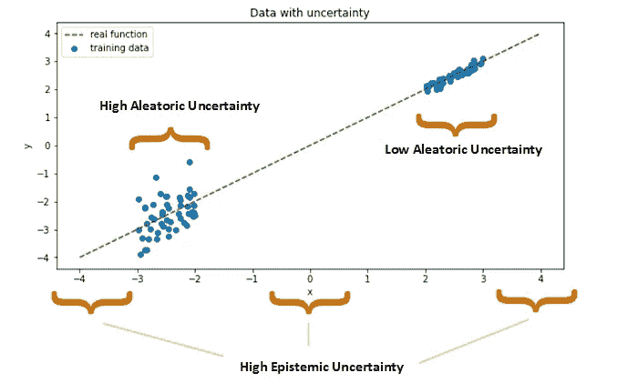

在线性回归环境中展示不同种类的不确定性(图片由 Michel Kana 提供)。

一个传感器故障在左侧云层中引入了噪音。底层过程的噪声测量导致左边云中的*高随机不确定性*。这种不确定性不能通过额外的测量来减少，因为传感器在设计*时一直产生大约 *x=-2.5* 的误差。*

*高认知不确定性*出现在很少或没有训练观察的区域。这是因为可以提出太多似是而非的模型参数来解释潜在的地面真实现象。这就是我们云的左、中、右三部分的情况。这里我们不确定哪个模型参数最能描述数据。给定空间中更多的数据，不确定性将会降低。在高风险应用中，识别这样的空间是很重要的。

# 如何使用 Dropout 获取不确定性

[贝叶斯统计](/bayesian-nightmare-how-to-start-loving-bayes-1622741fa960)允许我们根据数据和我们对潜在现象的先验知识得出结论。一个关键区别是参数是分布而不是固定权重。

> 如果我们不学习模型的参数，而是学习它们的分布，我们将能够估计权重的不确定性。

我们怎样才能知道重量的分布呢？**深度集成**是一项强大的技术，在该技术中，大量模型或模型的多个副本在各自的数据集上进行训练，它们的结果预测共同构建预测分布。

因为集成可能需要大量的计算资源，所以提出了一种替代方法:**丢弃作为模型集成的贝叶斯近似**。这项技术是由亚林·加尔和邹斌·格拉马尼在他们的 [2017 年论文](https://arxiv.org/abs/1506.02142)中介绍的。

[Dropout](http://jmlr.org/papers/v15/srivastava14a.html) 是深度学习中一种常用的正则化方法，以避免过度拟合。它由随机抽样的网络节点组成，并在训练过程中将其删除。丢弃根据伯努利分布随机地将神经元清零。

一般来说，在贝叶斯模型中，正则化和先验分布之间似乎有很强的联系。辍学并不是唯一的例子。经常使用的 L2 正则化本质上是高斯先验。

在他们的论文中，亚林和邹斌表明，在每个权重层之前应用丢失的神经网络在数学上等价于高斯过程的贝叶斯近似。

图片由谭在 [yuritan.nl](https://www.yuritan.nl/posts/prediction_uncertainty/) 上提供——在不同的正向传递中，漏失改变了模型架构，从而允许贝叶斯近似。(授权引用的图片来自谭)

使用 droupout，每个未被删除的节点子集定义一个新网络。训练过程可以认为是同时训练 *2^m* 不同的模型，其中 *m* 是网络中的节点数。对于每一批，这些模型的随机抽样集被训练。

关键的想法是在培训和测试时都要退出。在测试时，论文建议重复预测几百次，随机剔除。所有预测的平均值就是估计值。对于不确定区间，我们简单计算预测的方差。这给了系综的不确定性。

# 预测认知不确定性

我们将使用通过向函数 *y=x* 添加正态分布噪声生成的数据来评估回归问题的认知不确定性，如下所示:

*   在 x=-2 和 x=-3 之间的左侧云中产生 100 个数据点
*   在 x=2 和 x=3 之间的右侧云中产生 100 个数据点。
*   噪声以比右云高 10 倍的方差被添加到左云。

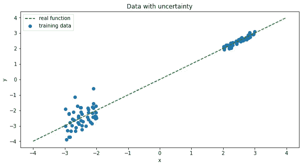

下面我们设计两个简单的神经网络，一个没有漏失层，另一个在隐藏层之间有漏失层。在每个训练和推理批次期间，丢弃层随机禁用 5%的神经元。我们还包括 L2 正则化应用优化期间层参数的惩罚。

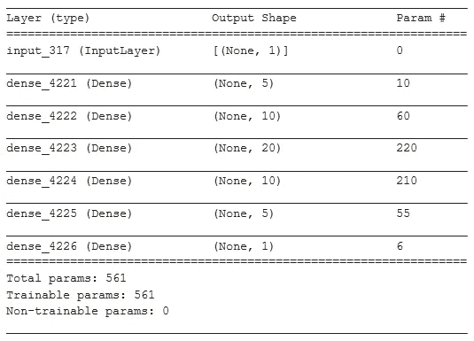

没有脱落层的网络

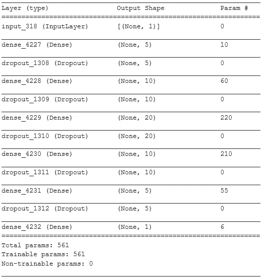

带有脱落层的布局

rmsprop 优化器用于通过最小化均方误差来训练 10 个点的批次。训练成绩如下所示。两种模型的收敛速度都非常快。有退出的模型表现出稍高的损失和更多的随机行为。这是因为网络的随机区域在训练期间被禁用，导致优化器跳过损失函数的局部最小值。

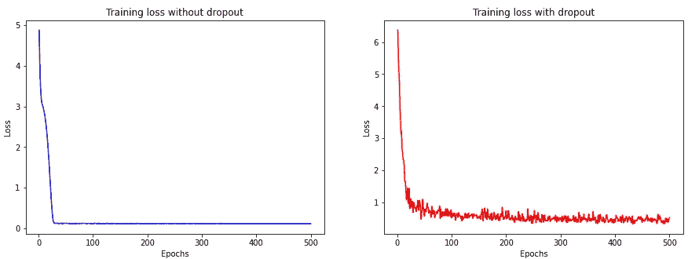

下面，我们展示了模型在测试数据上的表现。没有辍学的模型预测了一条完美的 R2 分数的直线。包括辍学导致了一条非线性预测线，R2 得分为 0.79。虽然漏失过度拟合较少，具有较高的偏差和降低的准确性，但它突出了没有训练样本的区域中预测的不确定性。预测线在这些区域具有较高的方差，这可用于计算认知不确定性。

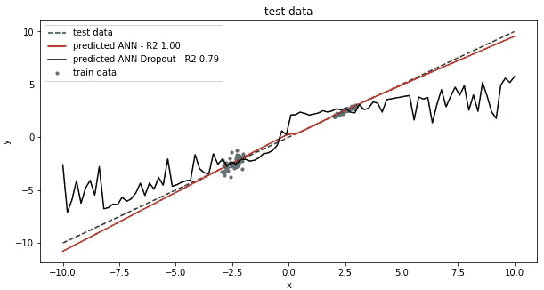

在没有训练样本的区域中，具有漏失的模型表现出具有高方差的预测。这个性质被用来近似认知的不确定性。

下面，我们在测试数据集上评估两个模型(有和没有脱落)，同时在评估中使用脱落层数百次。这相当于模拟一个高斯过程。我们每次都从测试数据中获得每个输入标量的一系列输出值。这允许我们计算后验分布的标准偏差，并将其显示为认知不确定性的**度量**。

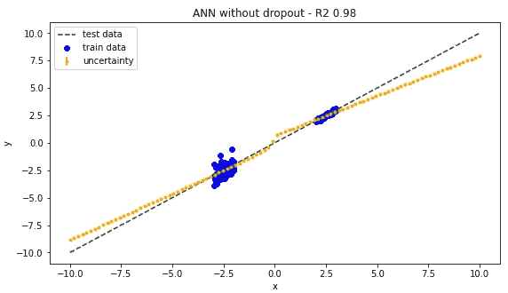

即使在没有训练样本的区域中，没有丢失的模型也没有 100%确定性地预测固定值。

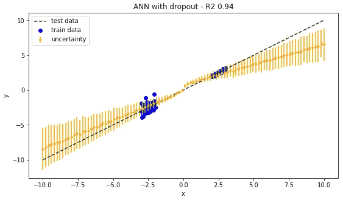

在没有训练样本的地区，带有退出的模型估计了高认知不确定性。

正如预期的那样， *x < -3* 和 *x > 3* 的数据具有很高的认知不确定性，因为在这些点上没有可用的训练数据。

> Dropout 允许模型说:“我对 *x < -3* 和 *x > 3* 的所有预测只是我的最佳猜测。”

图像由 OpenClipart-Vectors 在 [Pixabay](https://pixabay.com/vectors/lion-animal-confused-bewildered-159448/) 上生成

## 多项式回归

在这一节中，我们研究如何通过更复杂的任务(如多项式回归)的退出来评估认知不确定性。

为此，我们生成一个从正弦函数中随机采样的合成训练数据集，并添加不同幅度的噪声。

下面的结果表明，包括辍学带来了一种方法，在没有数据的地区，甚至对于非线性数据，访问认知的不确定性。虽然遗漏会影响模型性能，但它清楚地表明，在没有足够训练样本的数据区域中，预测不太确定。

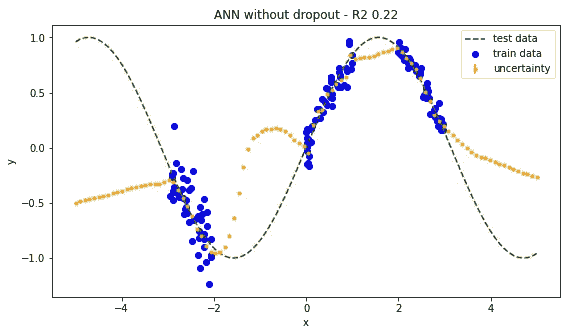

在没有训练数据的区域中进行预测时，没有辍学的模型会过度拟合训练样本并显示出过度自信。

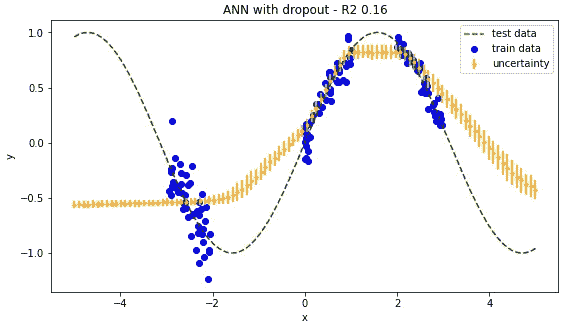

辍学模型有较高的偏差，但在没有训练数据的地区不太可信。在训练样本缺失的情况下，认知的不确定性更高。

# 预测任意不确定性

认知的不确定性是模型的一个属性，而随机的不确定性是数据的一个属性。任意的不确定性抓住了我们对数据无法解释的信息的不确定性。

当随机不确定性为常数，不依赖于输入数据时，称为**同方差不确定性**，否则，使用术语**异方差不确定性**。

异方差不确定性取决于输入数据，因此可以作为模型输出进行预测。同方差不确定性可以作为任务相关的模型参数来估计。

学习异方差不确定性是通过用以下等式代替均方误差损失函数来完成的([来源](https://alexgkendall.com/computer_vision/bayesian_deep_learning_for_safe_ai/)):

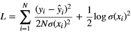

该模型预测了均值 *y* ^和方差 *σ* 如果残差非常大，模型将倾向于预测较大的方差。对数项防止方差无限增大。下面提供了这个任意损失函数在 Python 中的实现。

任意损失可用于训练神经网络。下面，我们举例说明一个类似于上一节中用于认知不确定性的架构，有两个不同之处:

*   隐藏层之间没有脱落层，
*   输出是 2D 张量而不是 1D 张量。这允许网络不仅学习响应 *y^* ，还学习方差 *σ* 。

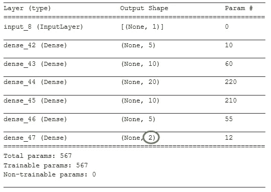

学习到的损耗衰减迫使网络在训练过程中寻找最小化损耗的权重和方差，如下所示。

**对任意不确定性的推断是在没有遗漏的情况下完成的。**下面的结果证实了我们的预期:左侧数据的随机不确定性高于右侧数据。由于 *x=-2.5* 附近的传感器误差，左侧区域有噪声数据。添加更多的样本并不能解决问题。噪声仍将存在于该区域中。通过在损失函数中包括任意的不确定性，该模型将对落在训练样本有噪声的区域中的测试数据进行不太可信的预测。

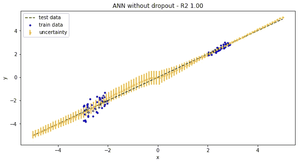

具有丢失的模型检测具有噪声训练数据的区域。这有助于在这些区域预测更高的随机不确定性。

测量任意不确定性在计算机视觉中变得至关重要。图像中的这种不确定性可以归因于当相机不能透过物体看到时的遮挡。图像的过度曝光区域或某些视觉特征的缺乏也可能导致任意的不确定性。

认知的不确定性和任意的不确定性可以相加得到总的不确定性。在自动驾驶汽车的预测中包括总的不确定性水平可能非常有用。

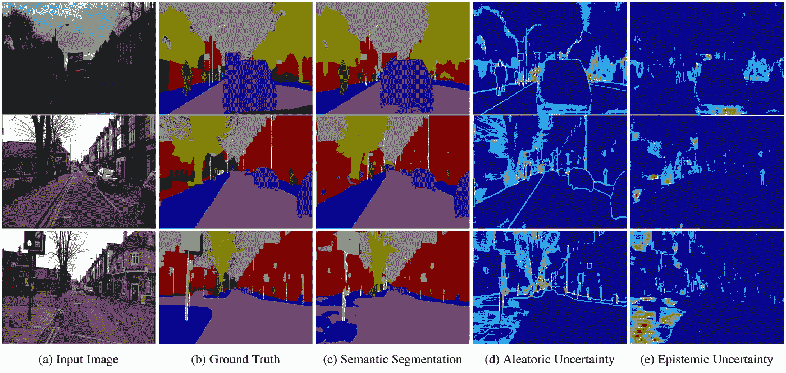

剑桥大学 Alex Kendall 的图像，关于计算机视觉中语义分割的任意和认知不确定性。任意不确定性(d)捕捉由于遮挡或距离而导致标签有噪声的对象边界。认知不确定性(e)突出显示模型不熟悉图像特征的区域，例如中断的人行道。

# 结论

在这篇文章中，我们展示了**如何在推理时间**使用 Dropout 等同于使用贝叶斯近似来评估深度学习预测中的不确定性。

在商业环境中，了解一个模型对其预测有多有信心是很重要的。优步一直使用这种技术来评估时间序列预测中的[不确定性](https://eng.uber.com/neural-networks-uncertainty-estimation/)。

在机器学习中适当地包含不确定性也可以帮助[调试模型](https://becominghuman.ai/using-uncertainty-to-interpret-your-model-67a97c28fea5)，使它们在对抗敌对攻击时更加健壮。新的 [TensorFlow Probability](https://www.tensorflow.org/probability) 提供了概率建模，作为深度学习模型的[插件。](/how-to-deal-with-uncertainty-in-the-era-of-deep-learning-977decdf84b5)

你可以进一步阅读我关于[负责任的数据科学](/wild-wide-ai-responsible-data-science-16b860e1efe9)的文章，看看当我们过于信任我们的机器学习模型时会出现什么问题。这份[深度学习综合介绍](/why-deep-learning-works-289f17cab01a)和[贝叶斯推理实用指南](/introduction-to-bayesian-logistic-regression-7e39a0bae691)可以帮助深化和挑战深度学习的经典方法。

感谢《走向数据科学》的 Anne Bonner 的编辑笔记。

在不确定时期保持安全。