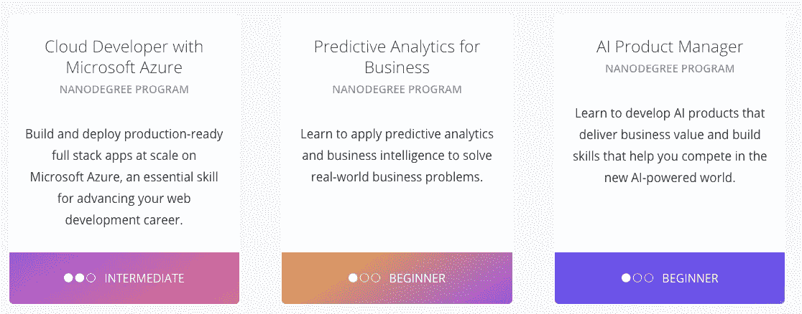
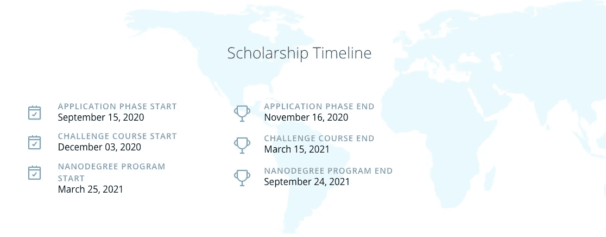
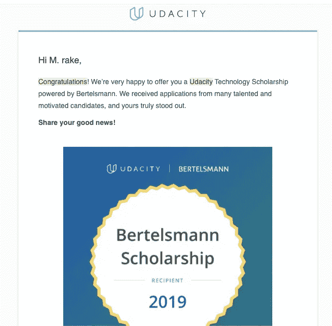
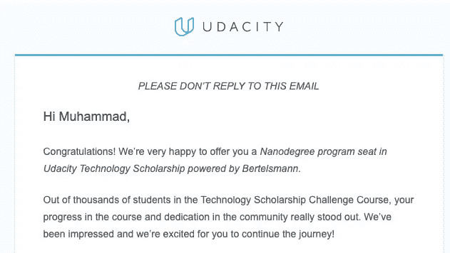

# 我作为贝塔斯曼技术和深度学习纳米学位毕业生的经历

> 原文：<https://towardsdatascience.com/my-experience-as-a-bertelsmann-tech-and-deep-learning-nanodegree-graduate-459ab27db477?source=collection_archive---------8----------------------->

## 很难相信，2020 年即将结束。这是我在其中的一次奇妙经历。

迪米塔尔·贝尔切夫在 [Unsplash](https://unsplash.com?utm_source=medium&utm_medium=referral) 上拍摄的照片

当一年即将结束时，要做的一件负责任的事情就是反思。你取得了哪些成就，你面临了哪些挑战，你学到了什么，以及你如何让这一年的剩余时间变得有价值。

我可以肯定地分享的一个经历，希望对读者有益，是获得 2019 年贝塔斯曼技术奖学金，并获得 Udacity 的深度学习纳米学位，完全免费。今年，贝塔斯曼科技公司在[开设了另一个](https://www.udacity.com/bertelsmann-tech-scholarships)奖学金申请项目，如果你对数据和云技术有热情，你绝对应该试试。

许多人在网上询问申请贝塔斯曼技术奖学金、赢得奖学金并完成 Udacity 的纳米学位是什么感觉。此外，一个人能从实现这一切中得到什么好处呢？所以希望这篇文章能帮助回答你可能有的一些问题。

我们开始吧！

# 1.贝塔斯曼理工奖学金到底是什么

贝塔斯曼是一家媒体、服务和教育公司，在全球约 50 个国家开展业务。他们的首席执行官 Thomas Rabbe 表示，他们的使命是让世界各地越来越多的人获得对数字技能的需求。他们与 Udacity 合作，提供免费的纳米学位课程，否则如果由个人全额支付将会非常昂贵。

2019 年，他们提供了数据分析、人工智能/深度学习和数据科学方面的纳米学位。今年，他们提供了三个新项目。如果你想了解更多，我在下面附上了链接。

2020 年贝塔斯曼理工奖学金项目。[来源](https://www.udacity.com/bertelsmann-tech-scholarships)

# 2.申请奖学金

去年的申请要求申请者写一篇短文，内容是关于(1)你为什么应该获得奖学金，以及(2)你打算如何利用你将从奖学金中获得的技能，或者你将如何从奖学金中受益。我们还被问及对我们的 Python 技能的信心。

今年，这个应用程序变得更加简单和容易。您只需要回答几个关于您自己以及您当前 Python 和 SQL 技能的问题。

# 3.选择是如何完成的

为了获得全额奖学金，你必须通过两个主要阶段。

第一个是申请阶段。全世界有成千上万的人申请，只有大约 10000-15000 人被三个项目接受，这意味着每个项目大约有 35000 人被选中通过申请程序。

第二阶段称为第一阶段。第一阶段是给你提供你申请的 ND 项目的基础或基础课程。看看哪些候选人能真正完成整个课程。时长 3 个月左右，与去年持平。在 3-5k 申请者中，只有大约 300-500 人(10%)获得全额奖学金，即第二阶段，获奖者开始全部 ND 计划并完成剩余课程。

就是这样。之后，就看学者们在 6 个月内完成 ND 了。

以下是今年奖学金的时间表

2020 年贝塔斯曼理工奖学金时间表。[来源](https://www.udacity.com/bertelsmann-tech-scholarships)

不要被愚弄，这些时间窗口可能看起来很长，但是参与阶段 1 和阶段 2 并不像看起来那么容易。尤其是和新冠肺炎·疫情。由于新冠肺炎和每个人都必须适应的“新常态”，我花了比预期更长的时间完成了课程。

# 4.我的经历

现在，我们到了有趣的部分。我跟大家分享一下我从申请一路到毕业的故事。

## 4.1 申请流程

2019 年，我选择了深度学习计划，因为我相信这些资源(学习资料、论坛、提示和技巧、最佳实践等。)对于深度学习来说，如果我选择在其他在线课程或网站上自学，仍然比其他两个更难达到。

我写了论文，提交了申请。一两个月后，我收到了这个。

我非常高兴，欣喜若狂，我的申请脱颖而出，被第一阶段录取了。

关键是我必须真正知道我想从这个项目中得到什么，以及为什么我(还有贝塔斯曼)会从接受(和给予)奖学金中受益。

> *所以，如果有另一个申请过程类似的奖学金，这里的关键是*你真的真的要把它卖出去。

但是今年有点简单，因此在我看来，更难。为什么？好吧，申请中没有文章，只有几个复选框，这可能会让你在竞争中脱颖而出。

但是，这不应该阻止任何人去尝试，我说的对吗？:)

## 4.2 第一阶段

这就是贝塔斯曼理工奖学金的乐趣所在。

因此，在每一个 ND 项目中，学生们被分成三个全球松弛小组，每个小组根据他们申请的项目而定。每个学生都可以接触到他们研发项目的基础课程。

这一阶段以及进入第二阶段的说明简单明了。

> 我们必须及时通过基础课程，并积极参加休闲小组。

听起来很简单，对吗？完成课程并参加为期 3-4 个月的小组放松活动，对吗？

没那么快，

因为这是“容易”和“简单”的，每个人都可以很容易地做到这一点，即竞争也很激烈，很容易出错。人们最常犯的错误是:

1.  他们很快就完成了课程，感到厌倦，不再参加小组活动
2.  他们及时完成了课程并参加了小组活动，但还不够

第一个错误可能是因为无聊、办公室里有急事等等。关键是他们没有始终如一地参与到懈怠小组中。错误 2 是最危险的。因为许多人确实及时完成了他们的课程，他们确实参加了懈怠小组，但是他们被那些更积极的人淹没了。他们中的一些人甚至向 Udacity 投诉，说他们不同意/抗议他们朋友的选择结果。这些高度活跃的人通常参加学习小组会议(我们称之为学习堵塞)，每天或一周中的几天发布在 Slack 小组中，要么是有用的想法，要么是对其他学生问题的回答，要么是激励性的报价，甚至可能是一个有趣的 meme 来放松。

> 关键是，那些进入第二阶段的人，是那些“疯狂地”想要这些奖学金的人，他们表现出来了。在第一阶段的所有 3-4 个月中。

第一阶段我做了什么？我在下班后与我的印度尼西亚学者们聚在一起，在课程中一起工作，组织并参加定期会议，并一直致力于它。我甚至发表了一个我用第一阶段获得的技能做的项目。

 [## Pytorch 挑战中国十二生肖分类

### 贝塔斯曼 AI Udacity 奖学金的挑战之一，这是如何分类中国十二生肖的一种方法…

towardsdatascience.com](/chinese-zodiac-sign-classification-challenge-with-pytorch-d89a8897d00b) 

经过大量的艰苦工作，那 3-4 个月感觉漫长得多。但这是值得的，尤其是这封邮件。

## 4.3 第二阶段

现在真正的艰苦工作开始了。

有 5 门主课，5 个项目，我们必须在 9 月 17 日之前提交。如果你觉得非常有动力，再加上一门课外课程。从事这 5 个项目并不是最大的挑战。是新冠肺炎。

世界被扔进了一个巨大的扳手，全球每个人都必须适应“新常态”，包括印度尼西亚。从早上 9 点到下午 6 点在办公室工作变成了在家工作，工作时间更长，也更随意。有时还是一样，有时你不得不从睁开眼睛的那一刻一直工作到晚上 10 点。真的很难预料。我不能合理地计划我的时间。当然，我必须首先确定工作的优先顺序。因为疫情，很多人被解雇了。

我别无选择，只能在深夜和周末全职攻读我的纳米学位。太累人了。

将近六个月过去了。最终，在祈祷、咖啡、谷歌以及 Udacity 的导师和学生中心的帮助下，我设法在大截止日期前完成了它，并毕业了。另外，我在不牺牲健康的情况下做到了这一点。

 [## Udacity 纳米学位项目毕业证书

### 证明你完成了一个职业相关的项目，侧重于技术技能

confirm.udacity.com](https://confirm.udacity.com/P2VR7KDA) 

## 4.4 我得到了什么

这就是 2019 年贝塔斯曼技术奖学金和 Udacity 深度学习 nd 的过程和旅程。也有人问我，我做这一切得到了什么好处。以下是其中的一些

1.  在奖学金和纳米学位期间，我遇到了许多有着同样动力和激情的了不起的人，并和他们成为了朋友。我们交流想法和令人敬畏的话题，并激励彼此进步。我仍然和他们中的一些人有联系。谁知道将来我们会如何从这个网络中受益。谁知道你会在 2020 年的贝塔斯曼技术奖学金中遇到谁呢
2.  毫无疑问，技能和知识和我想象的一样好。讲师，导师和学生中心是如此惊人。这些讲座相对容易听懂和理解。实践项目也非常直观，它们还提供了解决方案，以防我们被一两行代码或它们背后的概念所困扰。
3.  这些项目非常独特。我从纳米学位项目中获得的经验好得令人难以置信。这些问题是独特的。这些案子是真实的。Udacity 还为学生提供了 99 小时的支持 GPU 的工作空间，以比使用我们自己的私人笔记本电脑更快的速度运行我们的代码和模型。他们也给了我们一套清晰的目标，让我们在项目中实现(最小准确性、最大损失、清晰简明地解释我们的逻辑/思维过程)。没有其他在线课程能给我提供同样的体验。

总的来说，这是一次奇妙的经历。Udacity 没有为他们的深度学习 ND 夸大纳米学位这个术语。这几乎就像一个迷你硕士项目。我建议其他人去实现。

# 临终遗言

希望这篇文章对那些想申请和学习贝塔斯曼技术奖学金和 Udacity ND 的人有所帮助，或者至少激励你继续学习。

> “保持饥饿，保持愚蠢”——史蒂夫·乔布斯
> 
> “保持安全和健康”——任何有常识的人