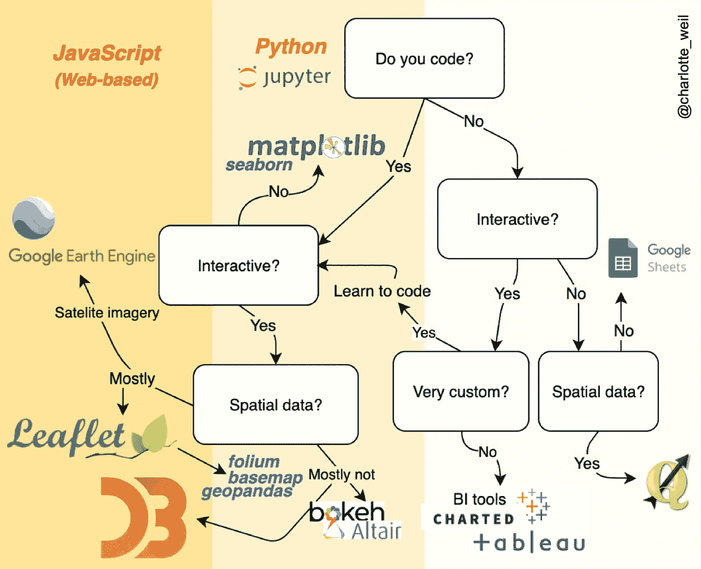
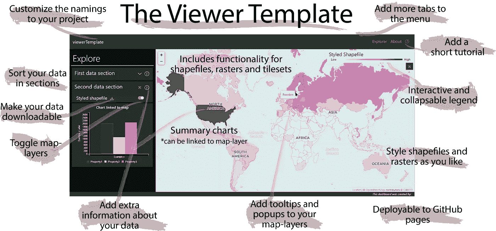

# 我最喜欢的(免费)交互式数据可视化工具

> 原文：<https://towardsdatascience.com/my-favorite-free-interactive-data-visualisation-tools-550a3f7a44b?source=collection_archive---------52----------------------->

## 构建交互式网络地图的灵感和工具&更多

**交互式网络浏览器**是我作为斯坦福大学[数据科学家工作的重要组成部分，支持决策者为人类和自然做出有针对性的空间规划选择](https://naturalcapitalproject.stanford.edu/)。当[教](https://naturalcapitalproject.stanford.edu/impact/invest-virtual-workshops)的时候，我被问了很多关于底层工具的问题，所以这里有一个快速的回答。

# **交互式数据可视化非常有用**

在数据时代，我们饱受信息过剩之苦，有效地理解大量数据已经成为一项重要的技能；因此，数据可视化蓬勃发展。的确， ***数据即*** 已经成为探索大型多维数据集必不可少的。**交互式**数据 viz 特别有助于链接不同的数据视图，过滤大数据集，或[可视化跨比例的精细分辨率地图](http://viz.naturalcapitalproject.stanford.edu/ipbes/wq.html) …

在我从事生态系统管理的工作中，我看到了以一种用户友好的方式向决策者传达复杂的量化结果是项目成功的关键。交互式查看器有助于讨论，并易于吸引用户，让他们直观地研究数据集。除了它们潜在的吸引力，它们还真的有助于从复杂的数据集中获得洞察力，[研究显示](https://medium.com/r?url=https%3A%2F%2Fwww.techrxiv.org%2Farticles%2FOn_the_usefulness_of_map-based_dashboards_for_decision_making%2F12738683)。

著名的**全球观众** [监测森林砍伐](https://www.globalforestwatch.org/map/global/)[珊瑚礁健康](https://coralreefwatch.noaa.gov/product/vs/map.php)[气候适应能力](https://www.prepdata.org/explore?basemap=default&boundaries=false&filterQuery=&labels=none&lat=24.44714958973082&lng=-66.97265625000001&location=GLOBAL&minZoom=3&tab=core_datasets&water=none&zoom=3)[食物系统](https://foodsystemsdashboard.org/compareandanalyze)[资源](https://resourcewatch.org/data/explore)[海平面上升](https://vesl.jpl.nasa.gov/sea-level/slr-gfm/) (…)以及最近的[冠状病毒](https://coronavirus.jhu.edu/map.html) [病例](https://hgis.uw.edu/virus/)。这些甚至经常作为他们的主题的数据库，收集最新的数据集。在较小的范围内，**特定于项目的查看器**服务于特定的目标和目标受众，允许协作者共享和可视化数据，在团队迭代时促进跨组讨论。例如，在空间发展计划的背景下，观众帮助合作伙伴调查发展的[场景，如](http://viz.naturalcapitalproject.stanford.edu/pro-agua/)[新道路](http://viz.naturalcapitalproject.stanford.edu/caracol/)或新[保护区](http://cons.scienceontheweb.net/belize/)建设的影响…

# **我最喜欢的数据可视化工具&库**

一个数据可视化工具的流程图，可以让你制作更漂亮的流程图…等等！

*那么，最好的数据可视化工具是什么？没有放之四海而皆准的神奇解决方案；像任何好的视觉效果一样，合适的工具取决于你的受众、数据格式和要传达的关键信息。下面，我将列出我喜欢使用的工具，并链接一些例子。*

## 对于网络观众，利用强大的 JavaScript 库

先说最强大的交互标图库:**[**D3 . js**](https://d3js.org/)**是交互数据可视化的*猛兽*。从用 [**C3.js**](https://c3js.org/) 轻松制作的非常简单的互动图表，到最酷的[迷幻](https://observablehq.com/@mbostock/circle-wave)、[艺术](https://observablehq.com/@d3/mona-lisa-histogram)、以及[富有洞察力的](https://www.gapminder.org/tools/?from=world#$state$time$value=1805;;&chart-type=bubbles)视觉效果。它几乎涵盖了所有[类型的地块](https://github.com/d3/d3/wiki/Gallery)，从[和弦图](https://blog.csaladen.es/refugees/)到[单词树](https://www.jasondavies.com/wordtree/?source=obama.inauguration.2013.txt&prefix=We)。D3.js 不容易，但是有[充足的](https://observablehq.com/@d3/learn-d3) [教程](https://www.d3-graph-gallery.com/intro_d3js.html)和[实例](https://github.com/d3/d3/wiki/Gallery)来支撑。****

****说到空间数据， [**小叶**](https://leafletjs.com/) 是交互制图的女王库。它的能力依赖于它的[插件](https://leafletjs.com/plugins.html)，由社区贡献，可以适应最流行的数据类型。我将这些用于，特别是用于[shape file](https://github.com/calvinmetcalf/leaflet.shapefile)、 [geoJSONs](https://github.com/calvinmetcalf/leaflet-ajax) 的那个，最近，我发现这个用于(相对较小的)[栅格](https://www.npmjs.com/package/georaster-layer-for-leaflet) **。**对于更大的栅格(和最快的显示)，我推荐使用**图块**。商业解决方案(如 [Mapbox](https://www.mapbox.com/) 、 [ArcGIS Online](https://www.arcgis.com/index.html) 或 [Carto](https://carto.com/) )让您可以轻松制作和托管切片，但有数据托管限制，并且永远无法 100%定制。我更喜欢创建自己的 tileset，它并不像看起来那么复杂(3 个 GDAL 命令，然后用 GitHub pages 平稳地服务它们)>参见[我构建和服务自制 tileset 的神奇技巧](https://github.com/charlottegiseleweil/viewerTemplate/blob/master/Readme_detailed.md#build-and-display-tilesets)！****

****现在，对于卫星图像， [**谷歌地球引擎**](https://code.earthengine.google.com/) (啧啧)大概是你最好的选择。*优点*:如果你展示的是 GEE 托管的数据集(他们托管了很多！)，你会节省相当多的时间。你也不需要担心托管或服务你的浏览器，因为它是通过 GEE 应用程序托管和服务的。缺点:虽然编码被简化了(感谢谷歌)，但它是沙箱化的，所以你不能完全控制创建你梦想中的漂亮界面。此外，应用程序部署仍处于测试版本。当然，它不是开源的。****

## ****部署您的浏览器****

******GitHub Pages** 让部署你自己的浏览器变得异常简单(设置>选项> GitHub Pages >源>选择你的分支和浏览器文件夹)。您的查看者的 URL 看起来像*{您的用户名} . github . io/{ repository-name }*，但是如果您拥有一个更酷的域，则可以自定义。****

******只需要一个快速原型？**如果你不需要部署一个完整的 web 浏览器，你可以节省大量的时间(基本上跳过所有的 web 开发:没有 HTML 也没有 CSS，直接跳到你的 viz 需要的 JavaScript)，通过使用 [Observable](https://observablehq.com/) 的交互式 JavaScript 笔记本，可以在线加载你的数据。****

## ****如果你宁愿用 Python 呢？****

****对 JavaScript 过敏？别再担心了。一些很棒的 Python librairies ( [**散景**](https://bokeh.org/) ， [**牛郎星**](https://altair-viz.github.io/) )让你互动地到处玩(在 Jupyter 笔记本里)。尽管 Javascript 仍然是将在 web 上共享的任何内容的参考，但上面提到的大多数 js librairies 也有 python 版本(例如[**flower**](https://python-visualization.github.io/folium/)集成了 flower . js 用于 Python 数据)。****

## ****如果我不编码呢？****

> ****它总是在可定制性和易于实现之间进行权衡。****

****存在商业解决方案( [ArcGIS Storymaps](https://storymaps.arcgis.com/) 允许轻松创建结合媒体、文本、地图和图表的交互式[故事](https://medium.com/r?url=https%3A%2F%2Fundesa.maps.arcgis.com%2Fapps%2FMapSeries%2Findex.html%3Fappid%3D48248a6f94604ab98f6ad29fa182efbd)；Tableau 让你轻松创建仪表板…)，尽管它们在功能和可定制性方面存在固有的局限性。大多数功能都是基于免费增值模式。老实说，我对他们不够了解，无法提供好的建议。****

****如果你不怕看代码，并且你对 github 有足够的了解，可以试试这个:****

# ****在 2 小时内构建您的定制网络浏览器！****

****掌握这些可视化库，并让一切顺利地协同工作——从数据格式化到在线部署查看器——可能非常耗时。为了简化这个过程，我和出色的 Anna hhgg 为我们的同事制作了一个模板**来免费、快速地构建网络浏览器**。都是开源的，所以也是你的！****

****[*https://charlottegiseleweil.github.io/viewerTemplate*](https://charlottegiseleweil.github.io/viewerTemplate/)*/*****

********

****viz.naturalcapitalproject.stanford.edu/viewerTemplate(由安娜·哈格设计)****

****它仍然很新，所以非常欢迎您的反馈——看一看[演示](https://charlottegiseleweil.github.io/viewerTemplate),并复制[回购](https://github.com/charlottegiseleweil/viewerTemplate)以开始使用。****

****底线:如本文所述，有许多新的库和工具可以用来制作更精致、更漂亮、更丰富多彩的网络地图…我建议在选择工具和设计解决方案时，始终关注要传达的关键信息和受众——有时最简单的就是最有效的！****

> ****牢记[图形完整性](http://jcsites.juniata.edu/faculty/rhodes/ida/graphicalIntRedes.html)原则，玩得开心！****