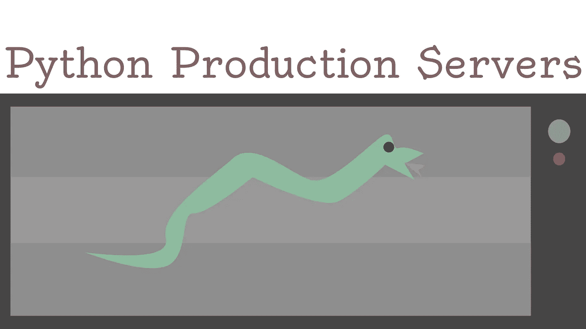

# 我最喜欢部署到生产中的 Python 服务器

> 原文：<https://towardsdatascience.com/my-favorite-python-servers-to-deploy-into-production-d92289764fbe?source=collection_archive---------0----------------------->

## 探索常规生产服务器的替代解决方案，增强您的部署能力！

(图片由作者提供)

# 介绍

> 我们都经历过:

您已经构建了完美的 web 应用、终端或应用——所有的按钮都已准备就绪，您终于可以将您的软件部署到生产环境中了！虽然这是一个令人兴奋的努力，但它也提出了许多关于技术栈的问题，你可能想用它来让你的软件被大众使用。在解决 NGINX 配置和设置 Unix 后端的过程中，很容易忘记这个难题中最重要的部分:

> 服务器本身。

有这么多优秀的 Python 服务器供我们使用！问题是有这么多好的选择，很难计算出哪一个最适合你的具体情况。幸运的是，在某些类别中有一些明显的赢家，在其他类别中有一些明显的输家。

> 重要提示:

> 选择下面的服务器部分是因为它们满足作为具有 UDP 或 TDP 协议的 WSGI 服务器的要求。这些服务器的主要目标是部署基于框架的应用程序，而不是服务静态文件。

# Gunicorn3

Gunicorn3 是“经典的”和行业标准的 Python 生产服务器。与其竞争对手相比，Gunicorn 作为一个独立实体的最大特点是其管理员工的能力。它还非常节省资源，与工作人员管理相结合，意味着您可以设置某些终端的优先级，并在最需要的地方保持服务器的性能！

使用 Gunicorn 的另一个显著优势是，它是唯一一个兼容几乎所有东西的用于 Python 的 WSGI web 服务器。鉴于它通常被视为生产中 Python 部署的标准，包在开发过程中经常依赖于它，因此在发布时完全兼容。这是您在使用 Flask 和 Django 时可能会用到的典型服务器，这是 Python 中最流行的两个 web 框架。

使用 Gunicorn 的最后一个优点是它天生就相当快。Gunicorn 坚持的很多东西是简单——这不是一件坏事。这意味着它通常可以非常容易地实现，并且运行速度非常快。它也主要是用 C 编程语言编写的，这意味着就速度而言，它可能在任何其他用纯 Python 编写的服务器之上。

Gunicorn 的另一个优势是，我已经有了一个关于如何使用它和 NGINX 部署 Flask 的教程:

 [## 用 Gunicorn 3 展开烧瓶

### 应用程序部署通常会带来意想不到的后果和错误。部署可以是制定或…

towardsdatascience.com](/deploying-flask-with-gunicorn-3-9eaacd0f6eea) 

# 女服务员

对于那些寻求真正轻松体验 Python 服务器的人来说，with 是另一个很好的选择。一个显著的区别，也可能是它对 Gunicorn 的优势，是能够在 Windows 和 UNIX 上运行，而 Gunicorn 只能在类似 UNIX 的操作系统上使用。虽然这对于那些希望在 Windows 上部署的人来说可能是一个优势，但我也不记得我上次看到 Windows 服务器是什么时候了，所以如果它适合您，这可能很好，但对于大多数最终用户来说可能不是一个优势。

女服务员在 CPython 上运行并引用

> “非常可接受的性能”

我没有测试过这一点，尽管这可能会在未来产生一些有趣的观察结果——所以我不得不相信他们的话。虽然我怀疑性能相当不错，但我也认为 Gunicorn 的表现超过了它，这仅仅是因为他们使用 C 语言作为 Python 代码服务背后的主要驱动力。

关于 last，我想指出的最后一件重要的事情是，它没有标准库中没有的依赖项。这又回到了让东西变得非常轻便的想法。如果您正在寻找一个纯 Pythonic 的、轻量级的、不需要任何依赖就能运行的服务器，那么这可能就是您想要的！

# GEvent

GEvent 是另一个伟大的网络服务器，但它离 Gunicorn 或 large 之类的东西有一个相当大的飞跃。虽然这些库主要关注轻量级、简单和快速，但 GEvent 更关注子进程的分段，也称为协程，可以随时停止和恢复。这大大提高了速度，同时保留了一些人可能需要的许多功能。

GEvent 的一个突出特点是 SSL 支持和协作套接字。这使得多个入站连接协同工作以实现相同的目标变得容易得多，从而在多个连接而不是一个连接之间平衡负载。SSL 支持也总是一件好事！

为了解决与某些库的潜在不兼容问题，GEvent 使用了一个他们称之为“猴子补丁”的系统。它实际上工作得出奇地好，而且事实上相当令人印象深刻，可以很容易地自动化。最重要的是，它提供了对线程池的简单支持。虽然它比一些同类产品笨重，但对于许多全栈应用来说，它可能是目前可用的最佳选择。

# uWSGI

这个列表中的最后一个选项是一个名为 uWSGI 的 C 库。像 Gunicorn 一样，uWSGI 高度重视 CPU 的使用。这反过来又使得它非常适合与许多不同的端点或可能协同工作的应用程序一起使用。然而，这并不是说 uWSGI 的主要用途将永远是端点，因为其中包含的许多特性也可能使它适用于 fullstack。

首先，uWSGI 包含请求插件。这考虑到了服务器本身的实际可扩展性，使它更适用于大多数解决方案，而不仅仅是少数几个。

此外，uWSGI 非常关注过程控制。流程很容易管理，也非常容易控制。此外，您可以访问竞争对手的库中通常看不到的更低级的选项。

然而，尽管 uWSGI 具有所有的可扩展性和多功能性，但它也有一些缺点。我发现它比 Gunicorn 甚至 GEvent 之类的东西要难用得多。虽然我必须承认，我只是最近才开始使用它，它似乎有一个陡峭的学习曲线和一个比这个列表中的任何其他人更大的进入壁垒。

# 最后的想法

将与您的模型或全栈应用一起部署的 web 服务器是一个需要考虑的非常重要的事情。无论您的应用程序是轻量级的、需要身份验证的还是仅仅是一个简单的端点，都是决定哪一个服务器最适合您的特定情况的因素。对于我个人来说，我通常会选择 Gunicorn3。这部分是因为它与 Flask 和 NGINX 合作得非常好，但也是因为它的轻量级性质，这是我在使用 Python 进行 web 开发时所寻求的。这当然是因为我的大部分 web 部署是在端点的特定用例中。然而，我也用 GEvent 部署了一些很棒的 web 应用程序，它在那些环境下工作得相当好。通常我会使用 Gunicorn 作为端点，使用 GEvent 作为全栈应用。不管哪个选项适合您的用例，幸运的是大多数部署场景都有不同的选项，这使得讨论起来更有趣！