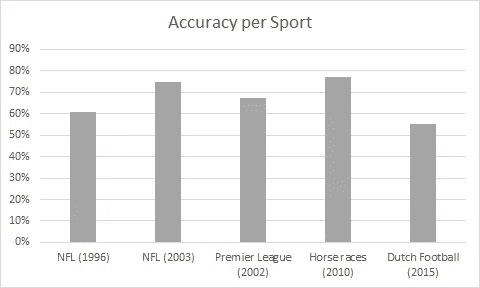

# 我关于使用机器学习进行体育博彩的发现:博彩公司总是赢吗？

> 原文：<https://towardsdatascience.com/my-findings-on-using-machine-learning-for-sports-betting-do-bookmakers-always-win-6bc8684baa8c?source=collection_archive---------5----------------------->

## 一个幼稚的金钱至上的想法？

凯文·Ku 在 [Unsplash](https://unsplash.com?utm_source=medium&utm_medium=referral) 上的照片

一天下午，在我度假期间，我想到了使用机器学习来预测英超联赛的足球结果。我自己从来没有赌过体育，因为我不喜欢把钱挥霍掉，我就是这样做的。然而，我有这个想法。我想，如果我能设计一种算法，使我的准确率超过 60%，我就可以分散风险，在多个匹配上下注，从而获得持续的收入。

我想了下，如果我以 100 英镑(我住在英国)开始，在 10 场不同的比赛中下注 10 英镑，我可能会在 10 场比赛中赢大约 5 场。如果我确保有一个可靠的算法，我想我可以赚一大笔钱。这里是重要的部分，我从来没有下过赌注，我不知道博彩行业的细节和复杂性。我知道我必须做我的研究，以更好地了解我错过了什么。

我知道我错过了一些东西；我不可能是第一个想到这一点的人，这从来都不容易。我继续做了一个小调查，以更好地理解我能找到的关于这个话题的东西。结果非常有趣，因为我发现了事情的真实运作方式。

首先，我找到了几篇期刊论文，这让我能够收集一篇关于这一领域的小型文献综述。是的，很明显，这是一个完整的研究领域，人工智能领域的专业人员将他们的时间和精力投入到改进他们的机器学习(ML)模型中。根据 [Bunker 等人(2019)](https://www.sciencedirect.com/science/article/pii/S2210832717301485) 的说法，虽然有几项研究考虑了统计体育预测，但使用神经网络范式是一种更近的方法。

# 在我的研究中，我发现了不同运动的各种算法的准确率:

[Purucker (1996)](https://ieeexplore.ieee.org/abstract/document/535226) 使用神经网络模型对国家橄榄球联盟(NFL)的结果实现了 61%的预测准确度。

[Kahn (2003)](http://homepages.cae.wisc.edu/~ece539/project/f03/kahn.pdf) 扩展了 Purucker (1996)的工作，在 NFL 第 14 周和第 15 周的比赛中实现了 75%的准确率。为此，收集了 2003 赛季 208 场比赛的数据。

McCabe 和 Trevathan (2008) 使用 2002 年的数据研究了四种不同运动的运动预测，即 NFL(橄榄球联盟)、AFL(澳大利亚规则足球)、Super Rugby(橄榄球联盟)和英格兰超级联赛足球(EPL)。神经网络算法的平均性能为 67.5%。

[Davoodi 和 Khanteymoori (2010)](https://www.researchgate.net/profile/Alireza_Khanteymoori/publication/228847950_Horse_racing_prediction_using_artificial_neural_networks/links/53fc54590cf2dca8ffff0df8/Horse-racing-prediction-using-artificial-neural-networks.pdf) 试图利用 2010 年 1 月在纽约州举行的渡槽赛道上的 100 场比赛的数据来预测赛马的结果。虽然 Davoodi 和 Khanteymoori (2010 年)开发的算法需要详尽的训练时间，但它达到了 77%的准确率。

[Tax and Joustra (2015)](https://www.researchgate.net/profile/Niek_Tax/publication/282026611_Predicting_The_Dutch_Football_Competition_Using_Public_Data_A_Machine_Learning_Approach/links/5601a25108aeb30ba7355371/Predicting-The-Dutch-Football-Competition-Using-Public-Data-A-Machine-Learning-Approach.pdf) 利用荷兰足球比赛的数据预测未来比赛的结果。在这种情况下，作者还考虑了赌博赔率作为他们机器学习模型的变量。他们的模型达到了 54.7%的准确率，而只使用赔率的模型达到了 55.3%的准确率。这个事实让我意识到一些事情。博彩公司有自己的数据科学团队。如果一个队赢的几率是 10/1，那么这个队可能会输。

作者图片:每项运动 ML 预测模型的准确性——改编自文献综述

在发现之前的研究中算法的准确性在 50%到 70%左右(取决于运动项目)后，我仍然认为如果比赛的赔率至少为 2/1，这将是可行的。

# 找出为什么没有人用这个成为百万富翁

在写第一行代码之前，我下定决心要弄清楚这是否真的可行。在某种程度上，我认为使用你自己的算法可能是不合法的，一个简单的谷歌搜索回答说这是允许的。然后我想到了博彩公司，以及他们如何监管或限制你可以下注的金额。我找到一篇名为 ***"*** [***用自己的号码击败庄家——以及网络体育博彩市场如何被操纵***](https://arxiv.org/abs/1710.02824)***2017 "***。

这篇论文是我的研究停止的地方。本文解释了作者如何试图使用他们的算法来赚钱，并发现了两个主要障碍。首先:

*   ***博彩公司使用自己的机器学习算法来生成比赛的赔率。***

因此，当你的 ML 模型把你指向更确定的结果时，你可能总是以低收益结束。第二，更重要的是:

*   ***庄家歧视成功的客户。***

因此，当你开始经常赢的时候，庄家会开始歧视你，限制你可以下注的金额。

除了这两个障碍，我发现的论文解释说，在 5 个月的时间里，他们在 672 次下注中赚了 2086 美元，回报率为 6.2%。这很好(相对于你必须投入的努力量来说不是那么好)，但这是一项艰苦的工作。你必须投入大量的时间和精力来下很多注，并承受被庄家标记的风险。

我的结论是，开发体育博彩的 ML 模型只对实践和提高你的数据科学技能有好处。你可以把自己做的代码上传到 GitHub，完善自己的作品集。然而，我不认为这是你可以长期生活方式的一部分。因为最后庄家永远不会输。最终，我在这个项目中没有做一行代码。我希望我的文献综述有助于说明其他人。

跟着我上 [LinkenIn](https://www.linkedin.com/in/manuelsilverio/)

关注我的 LinkenIn 页面: [AI Makers](https://www.linkedin.com/company/ai-makers)