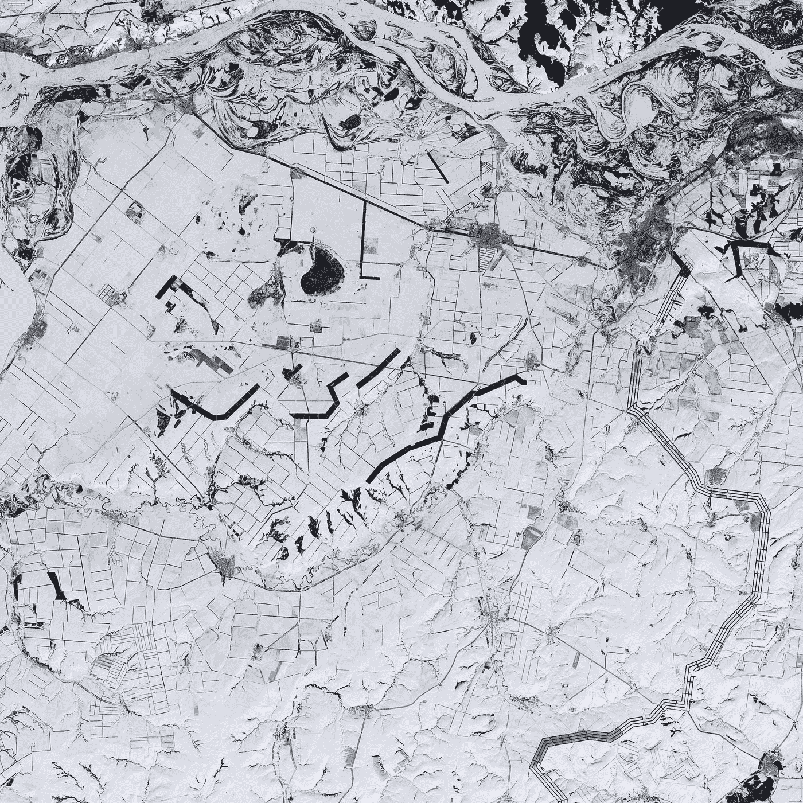
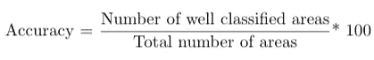
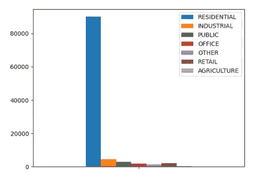
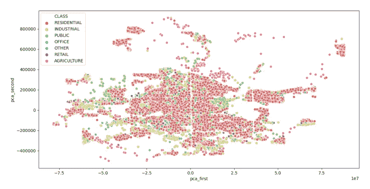
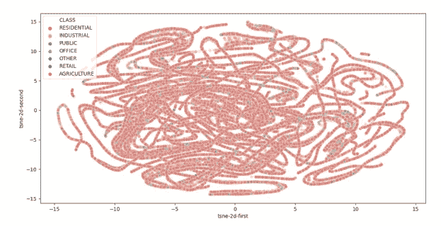

# 我的第一次数据科学竞赛

> 原文：<https://towardsdatascience.com/my-first-data-science-contest-3f540557decc?source=collection_archive---------53----------------------->

## 从一无所知到**成为全国决赛选手**

[美国地质勘探局](https://unsplash.com/@usgs?utm_source=medium&utm_medium=referral)在 [Unsplash](https://unsplash.com?utm_source=medium&utm_medium=referral) 上拍摄的照片

2020 年 2 月中旬，我的朋友 [Mario](https://www.linkedin.com/in/macammoc/) 和我谈到了学士和硕士学位学生最重要的全国数据大赛。那时我大二，他大三，两人都来自巴伦西亚理工大学的计算机科学专业。

更重要的是，**我们对数据科学和人工智能一无所知。**

于是，我们报名参加了大赛，开始学习 Python，机器学习的基础理论，用在线教程大量练习。

我们选择的挑战是[敏赛土地分类](https://www.cajamardatalab.com/datathon-cajamar-universityhack-2020/retos/predictivo/)。目标是建立一个多类分类器来确定给定楼层面积的类型。检验模型的指标描述如下:

训练数据由 55 个变量组成:

*   标识符:每个区域的唯一 ID。
*   坐标:两个变量，X 和 Y，描述平面上每个区域的位置。
*   颜色变量:红、绿、蓝和红外通道各 11 个变量，描述十分位数。
*   面积:以平方米为单位的延伸。
*   几何变量:给出几何信息的 4 个变量，没有任何说明。
*   小农场建造年份。
*   给定地块中当前建造的最大高度。
*   土地登记标识符:表示区域的质量。它接受范围[A，B，C，1，2，3，4，5，6，7，8，9]内的值；做一个最坏的人，做一个最好的人。
*   类:要预测的目标。有 7 个不同的类别:住宅、工业、公共、办公、其他、零售和农业。

测试数据只包含特性。

为了提交我们的结果，我们必须对测试数据运行我们的模型，并以 AREA_ID | PREDICTED_CLASS 的形式发送预测。

如果两个队在准确性上的差异小于 5%,这将被视为平局。在这种情况下，法官会考虑诸如代码文档和破解代码的演示等因素。

只有前 3 名的队伍才能到达马德里(由于新冠肺炎危机，他们后来不得不取消)，并赢得:

*   第一名，每队 6000€。
*   第二名，每队 2400€。
*   第三名，每队 1200€。

第一个问题很快就出现了。

最大高度和土地登记质量的特征具有一些空值。我们将它们设置为-1。然后，我们检查了训练集上的类分布，发现了以下情况:

图片来自 2020 年 Astralaria.pdf[。由](https://github.com/asicoderOfficial/National-Datathon-UH-2020/blob/master/Astralaria.pdf)[阿西尔·塞拉诺·阿兰布鲁](https://www.linkedin.com/in/asier-serrano-aramburu-262b921a1/)和[马里奥·坎波斯·莫乔利](https://www.linkedin.com/in/macammoc/)执笔

非常不平衡！居住类特征占 87.28%，而农业类特征仅占 0.33%。

此外，通过比较训练数据集和测试数据集之间每个特征的平均值，我们发现:

*   训练组的住宅平均面积为 281 平方米，其余组均大于 1000 平方米。总平均值为 4.41 亿英镑。
*   测试集的总平均值为 967 米。

因此，我们可以知道两个数据集之间的类分布是不同的。

这就是我们如何发现两个主要缺点的。

我们花了第一个月的时间阅读机器学习的基本概念、不同类型的学习，特别是监督方式、线性回归、二元分类、多类分类……此外，我们还必须学习 Python，幸运的是这很容易。

一旦我们认为我们已经理解了我们的使命和我们的选择，我们就开始着手解决这个问题。

在尝试了几种分类模型后，我们发现结合 XGBoostClassifier+RandomForestRegressor 会给出最好的结果，并且为了处理随机性，我们进行了各种时间的训练，并最终通过共识分配每个类，同时考虑到模式。我们还必须处理不平衡的问题，所以我们决定只随机挑选 8000 个住宅类样本进行训练。使用 gridsearch 调整一些超参数，我们都准备在 Jupyter 笔记本上发送我们的最终提交。

几天后，最终结果出来了，我们达到了 69.999%的准确率，是当时全国最好的成绩。我们很亲密。

我们成为了大学冠军和西班牙决赛选手！[astraria](https://www.cajamardatalab.com/datathon-cajamar-universityhack-2020/centros/upv/)队在比赛中还活着！

是时候抓紧时间了。然后我们意识到我们的对手比我们年长得多，也更有经验。事实上，其余的团队是由数据科学的硕士研究生组成的，甚至他们中的一些人已经在从事这项工作了。

因此，如果我们想获得一个好职位，我们必须开始寻找有趣的数据见解，并尝试新的模型。

我们认为，可视化工具可以帮助我们更容易地找到区分阶级的模式。因此，我们研究了主成分分析和 T-SNE 降维，以及每个特征的小提琴图。这些是我们获得的*揭示的*结果:

图片来自 2020 年 Astralaria.pdf[。由](https://github.com/asicoderOfficial/National-Datathon-UH-2020/blob/master/Astralaria.pdf)[阿西尔·塞拉诺·阿兰布鲁](https://www.linkedin.com/in/asier-serrano-aramburu-262b921a1/)和[马里奥·坎波斯·莫乔利](https://www.linkedin.com/in/macammoc/)执笔

图片来自[Astralaria.pdf，](https://github.com/asicoderOfficial/National-Datathon-UH-2020/blob/master/Astralaria.pdf) 2020。作者:Asier Serrano Aramburu 和 Mario Campos Mochol

所有的类都有很多重叠，我们找不到任何模式或组。

在此之后，我们尝试对数据进行一些小的更改，这似乎对我们的结果有所改善:

*   将土地登记质量特性转换为 12 个热点变量。
*   将建造年份改为古代的年数。
*   将空值更改为 0，而不是-1。

我们仍然有许多事情要尝试，我们只有不到一个月的时间用我们普通的笔记本电脑进行一些实验。

我们就是这样分工的。

Mario 会尝试使用自动编码器来降低维度，用神经网络建立一些奇特的模型，并测试额外的树和支持向量机如何能够有所帮助。

我将致力于过采样和欠采样技术，[一个对一个——数据平衡算法，](https://www.researchgate.net/publication/261086899_Enhancing_classification_performance_of_multi-class_imbalanced_data_using_the_OAA-DB_algorithm)和特征工程。

经过大约两周的研究和实验，我们认为我们找到了一些东西。

我的同事测试并确认了我们可以使用的最好的 ML 模型是我们一直在使用的两个模型。在我身边，我有两个直觉。

*   **邻居**。如果一个地区是住宅区，它的邻居不会占多数，也是来自同一个阶层吗？根据这个想法，我们构建了一个 K-D 树，它将确定每个区域的 4 个最近邻居(在训练数据集中)，或者某个类的邻居的概率(在测试数据集中)。这个过程增加了 7 个特征的维数，每个类别一个。
*   **OAA-DB 算法。**如上所述，起初它给我们留下了深刻的印象，因为它将结果提高了约 10%，但我们最终放弃了它，因为它导致了巨大的过度拟合。

我们还试验了[深度特征合成、](http://groups.csail.mit.edu/EVO-DesignOpt/groupWebSite/uploads/Site/DSAA_DSM_2015.pdf)和其他一些工具，但是只有邻居技术似乎工作得很好，它似乎提高了大约 1.5%的精确度。

我们只剩下一件事需要确定:用于减少训练集中住宅类样本数量的欠采样技术。我们试验了所有的 [imblearn 包](https://imbalanced-learn.readthedocs.io/en/stable/api.html)方法，然而，我们最终决定进行随机欠采样，减少到 6000 个样本。几乎和我们开始时一样。

任务日。我不会忘记的。截止时间是 13 点。几乎一切都准备好了。我很早就醒了，来结束文档的细节。马里奥稍后会加入我。

**我们仍然没有生成结果。**

10:30.我已经写完了代码，并把笔记本递给了 Mario。

10:40.后面的 Json 文件出了个 bug，我们没看懂。我的同事试图在 Visual Studio 代码、Google Colab 和 Jupyter 中打开它。但是什么都没用。

11:00.新笔记本。还是同样的问题。

11:35.Python 脚本生成，包含两个部分，并有文档记录。马里奥不能执行它。

12:15.Mario 最终能够运行脚本来训练模型并获得结果。然而，我们不知道它是否会及时结束。但我们无法阻止它。

是时候相信运气了。

12:53.节目结束了！

12:58.结果文件已发送。我们成功了。

两个星期后，最佳的三支队伍揭晓了。我们没能进入前 3 名。我们最终没有赢得任何奖项。

一开始，我们真的很难过。然而，我们认为我们已经走了很远，特别是考虑到我们是从一无所知开始的。

此外，该组织告诉我们，他们稍后会通知我们我们的最终位置，以及上次交付的准确性和一些改进的技巧。

几周后，它来了。

我们获得了第四名！此外，由于其余队伍都是由硕士生组成，我们可以被认为是**学士级第一名**！

我们感到非常高兴，即使我们没有获得任何现金奖励，我们也能够学到很多东西，玩得开心，并发现了数据科学和人工智能的惊人领域！

就我个人而言，我必须感谢我的队友和比赛的组织者，是他们让一切成为可能。

给这篇文章的读者:如果你仍然对某个领域一无所知，不要担心，付出它应得的努力，学习，即使你是通过参加一个竞赛来做到的。

点击查看我们的最终作品[。](https://github.com/asicoderOfficial/National-Datathon-UH-2020)

感谢阅读！:D