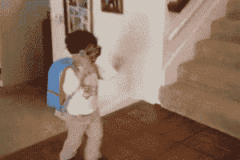
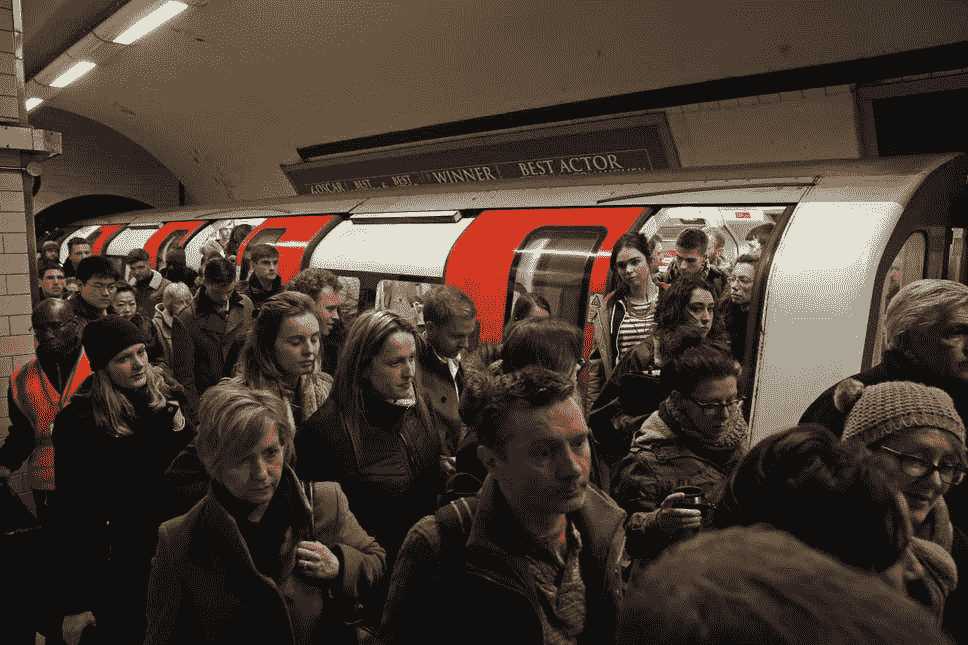
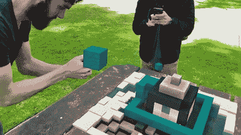
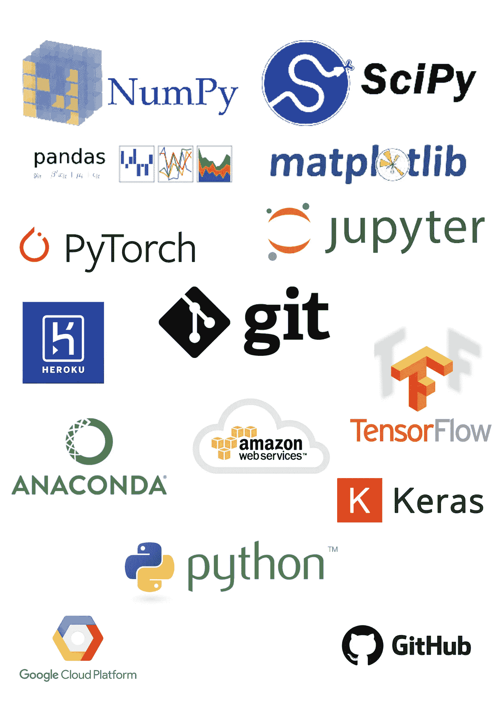
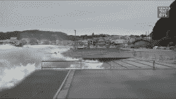

# 我作为计算机视觉工程师的第一天

> 原文：<https://towardsdatascience.com/my-first-day-as-a-computer-vision-engineer-8b59750c79a0?source=collection_archive---------15----------------------->

## 剧透:我引起轰动

斯科特·韦伯在 [Unsplash](https://unsplash.com/s/photos/kid-school?utm_source=unsplash&utm_medium=referral&utm_content=creditCopyText) 上拍摄的照片

我最近在伦敦的一家初创公司找到了一份计算机视觉工程师的工作。

得到这个角色的过程是令人兴奋的，但那是以后的事了。在这篇文章的最后，我为好奇的读者留下了一篇关于我一次失败面试的文章。

但是今天，我将谈谈我第一天工作的情况。

我会包括一些关于团队介绍的细节，我将从事的计算机视觉领域，以及我是如何让自己难堪的——*别担心，我第一天并没有丢掉工作。*

我还将包括一些有抱负的机器学习实践者可能会发现有用的技巧和建议。

# 兴奋/早上好

在 2019 年 9 月完成计算机视觉、机器学习和机器人学硕士学位后，我休了几个月的假，并在 2019 年 12 月开始找工作(*12 月不是找工作的好时机，许多公司都在休假*)。

现在，我终于得到了一个计算机视觉工程师的职位。

我对我正在工作的初创公司的潜力以及我能给团队带来的贡献感到兴奋。

来自 Tenor.com[的 gif](https://tenor.com/)

## 在我开始约会的时候，我醒得特别早，比我应该醒的时间早了两个小时。

是纯粹的兴奋唤醒了我。感觉就像开学第一天。

我的兴奋被伦敦地铁的早晨通勤暂时打断了。

伦敦早晨的通勤很糟糕，我认为我永远也不会习惯。

来自伦敦的读者知道我在说什么(*我确信拥堵的早晨通勤是一个全球现象*)。

[标准包装的伦敦管](https://www.standard.co.uk/news/transport/tfl-tube-delays-commuter-misery-as-disruption-hits-four-london-underground-lines-and-the-dlr-a4279456.html)

让我们快进到我进办公室的时候。

今天的第一项议程是介绍和问候。

这是一个认识我的新团队成员的机会。认识新的人很可怕；我总是努力给人留下极好的第一印象，尽量不说或不做任何愚蠢或怪异的事情。

我成功地度过了第一天的这一部分。

介绍进行得很顺利，而且我已经在 LinkedIn 上跟踪了公司里的大多数人，知道他们的职业和教育背景，这也很有帮助。

> 建议:了解你未来同事的网上职业资料。调查他们做过什么项目，或者他们以前在什么公司工作过。这能让你建立起初步的融洽关系。

# 中午

我工作的新公司在游戏和增强现实行业运营。我的角色是在 AR 环境中实现和集成计算机视觉技术。这与我习惯的用图像文件夹进行任意分类大不相同。

> 但是潜入未知领域是一种被证明的扩展知识和战胜职业停滞的方法。AR 再次变得很酷也是有帮助的。

【giphy.com AR gif

经过介绍和聊天，我启动了我的机器。

我过去工作过的大多数公司在新员工入职的第一天都没有准备好机器，但谢天谢地这家公司有。

我的机器都准备好了，我开始下载一堆软件和工具。你可以在任何一个 ML 工程师的武器库中找到典型的工具。

常见 ML 工具的校对图像

你懂的钻，安装 [Git](https://git-scm.com/) ， [PyCharm](https://www.jetbrains.com/pycharm/) ， [JupyterLab](https://jupyterlab.readthedocs.io/en/stable/) ， [Anaconda](https://www.anaconda.com/) ， [TensorFlow](https://www.tensorflow.org/) ， [PyTorch](https://pytorch.org/) ， [SciPy](https://www.scipy.org/) ， [TensorBoard](https://www.tensorflow.org/tensorboard) ， [OpenCV](https://opencv.org/) 等等。作为一个机器学习从业者，你可能熟悉我刚才提到的百分之九十的工具。

> 建议:不要害怕走出你的舒适区。机器学习技术适用于各种行业。在选择寻找机器学习工作的行业时要非常开放。

# 我现在可以回家了吗？

我一天中的这一部分并不有趣。

记住它也不好玩，事实上，写它也不好玩。

但我说过我会提供所有的细节，我会的。

开始了…

午餐时间到了，我出去买了些豆腐、米饭和花生酱(*你可能不需要知道我午餐吃了什么 lol* ) *。*我一般都是一个人吃饭，琢磨宇宙的奥秘，但是第一天，宇宙可以等。

所以我选择和我的新团队在一张共享的桌子上吃饭，桌子上放着每个人的笔记本电脑和电子设备— *你能看出我要说什么吗*。

经过 20 分钟的聊天、欢笑和大声咀嚼之后，我终于伸手去拿我那满满一杯水。

当我伸手去拿杯子时，突然，我的手眼协调和大脑计算拿杯子应该用多大的力似乎失灵了，我打翻了那杯水。

我不骗你，但我亲眼目睹了这一事件的缓慢发展。

[来自 giphy.com 的 Gif](https://giphy.com/gifs/tsunami-weQwdlDZOsHLi)

当水迅速蔓延到整个桌子，到达每个人的笔记本电脑和设备，并找到通往延长线的路时，我的脸上充满了恐惧。

我大叫(*说实话我其实是尖叫了*)。

每个人都从椅子上跳起来，放下午餐，走到他们能找到的最近的纸巾和毛巾旁。这一切都像一些现实游戏节目活动。

最后，一切都变得很好，笔记本电脑和手机被擦干了，地板被打扫干净了，我们都只是一笑置之。谢天谢地，我的新队友有点宽容。

> **建议**:如果你像我一样笨手笨脚，那就在第一天上班前，先练练吃喝。这里明显是开玩笑。

# 下午

在午餐的兴奋过后，我的身体从正在发生的事件中获得了肾上腺素的刺激，我准备好回去工作了。

在我的第一天之前，我一直在与该公司的首席执行官/首席技术官沟通，以了解他们对我作为一名计算机视觉工程师的要求。

我知道他们的长期愿景是什么，我也知道我要实现什么。

考虑到公司的目标，我的下午继续探索研究论文和 GitHub 知识库，内容涉及姿势估计、手跟踪和对象检测等技术。我还研究了如何在移动设备和增强现实环境中利用这些 CV 技术。

这是我写的一篇短文，解释了一些你可能在工作环境中遇到的常规简历技巧。

 [## AI 如何检测物体？(技术)

### 了解如何使用机器和深度学习技术应用和实现对象检测

towardsdatascience.com](/how-does-ai-detect-objects-technical-d8d63fc12881) 

人工智能是一个迷人的领域，每天都在推进被认为是可能的事情的边界。作为人工智能爱好者和实践者，我们喜欢阅读和研究人工智能相关的话题。但是在实际环境中，真正重要的是将这些技术设计成商业应用程序的能力，这些应用程序将被数百人甚至数千人使用。

因此，我的第一天让我明白，作为一名计算机视觉工程师，我的工作分为 70%的工程 CV 技术和 30%的研究。我对这种平衡感到满意。

> 建议:在确定一份长期工作之前，要明白 10 年后你的职业目标是什么。
> 
> **建议**:在实际场景中练习运用 ML 模型。将 ML 模型部署为移动和 web 应用程序，并考虑人们如何使用您的 ML 模型。
> 
> **建议**:了解你即将加入的公司或组织的愿景，知道你和你的技能适合哪里。
> 
> 建议:在开始工作之前，对你将要从事的工作进行研究是很有帮助的，因为这将向你的同事传达你的奉献精神和动力。

# 傍晚/一天结束时

由于清楚地了解我的角色需要什么，以及我将使用什么技术，我有了一个坚实的基础。

那天快结束的时候，我做了一些文档和管理工作。没有写代码，也没有阅读研究论文，但这一部分和我一天中的任何部分一样重要。

我观察了一下我想在什么样的环境中工作，我的结论是我想在一个角色的一切(或至少 90%)都有记录的环境中工作。我指的是一切，包括关于硬件和软件规范的文档，关于在应用程序中使用什么机器学习技术的文档，以及关于机器学习工作流程的文档。

所有这些都很重要，因为它让我的队友和未来的我更容易理解和解释我的工作。如果我回顾以前的工作或决策，文档会派上用场。

随着文件夹和文档的创建，我对自己作为计算机视觉工程师的第一天所取得的成就感到满意。

开始第二天！

## 但是明天我会独自吃午饭，远离所有的电子产品。

## 获得目前的角色并非一帆风顺。我遇到的一个陷阱的一个很好的例子可以在下面链接的文章中看到。

## 此外，如果你喜欢这篇文章，并希望更多，给我一个[关注](https://medium.com/@richmond.alake)。

 [## (拒绝)来自我的第一次数据科学面试

### 拒绝是获得数据科学工作的整个过程的一部分。但它并不经常被提起。这是我的账户…

towardsdatascience.com](/rejected-from-my-first-data-science-interview-c9784dd65296)