# 我和朱莉娅的第一次相遇

> 原文：<https://towardsdatascience.com/my-first-encounter-with-julia-15777c6189f9?source=collection_archive---------25----------------------->


[美国地质勘探局](https://unsplash.com/@usgs?utm_source=medium&utm_medium=referral)在 [Unsplash](https://unsplash.com?utm_source=medium&utm_medium=referral) 上拍摄的照片

## 带朱莉娅去试驾

## 抓挠着朱莉娅和冥王星的表面

我开始在网上学习一门课程，是通过朱莉娅教授的。尽管我以前没有使用 Julia 的经验，但对我来说很容易快速学会一些东西——因为我以前有编程经验，而且最重要的是—*Julia 被设计成易于编写*。

# 布鲁托:写作《朱丽亚》的审美环境

朱莉娅通过 REPL 在命令行工作。我听说 [Visual Studio Code 对 Julia](https://github.com/julia-vscode/julia-vscode) 的扩展也很棒。但是最好使用冥王星来完成像图像分析这样的任务，并且能够获得即时反馈对它非常有帮助。


冥王星接口。来源:作者

Pluto 界面真的很好看，选的字体我也很喜欢。

Pluto 有一个方便的 Live docs 功能。您只需将光标放在一个函数或对象内，如果您单击 Live docs 图标，就会显示该特定函数或对象的文档。

在这里，我将光标放在了`rand`方法上，我看到了这样的文档

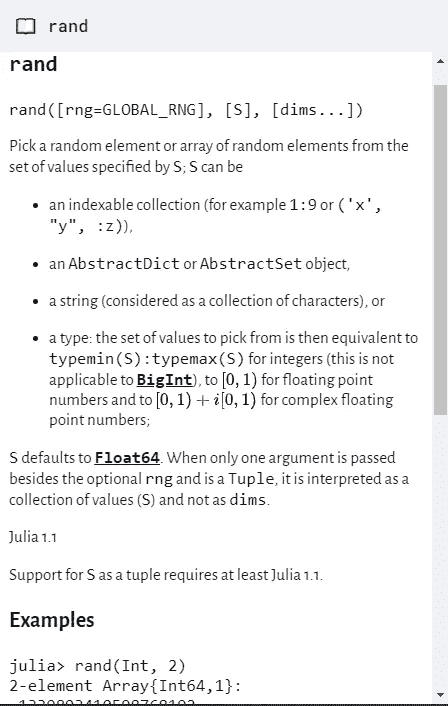

rand()文档，来源:作者

你必须在 Jupyter 笔记本上输入`??function()`才能获得文档。

# Julia 中的表情符号支持

Julia 不仅支持字符串形式的表情符号，还支持命名变量！

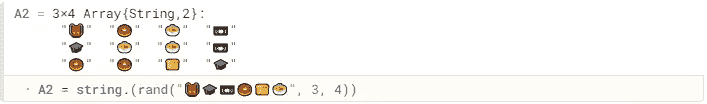

从给定列表中生成表情符号的随机组合，来源:作者

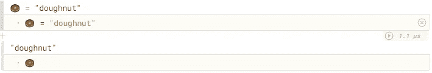

用表情符号命名变量，来源:作者

看到了吗？在 Julia 里可以用表情符号给变量命名！

使用图像

在 Julia 中处理图像非常直观。您可以从 web 或本地存储中加载图像，并在 Julia 中使用该图像。

朱莉娅的不同之处在于，在这里，你与图像本身一起工作。在其他语言中，会创建一个图像对象或类似的东西，或者我们必须处理文件的路径。但是这里增加了一个更深层次的抽象，你可以直接处理图像本身。让我展示给你看:

首先，你从本地存储器加载或者下载到本地存储器，然后加载一个图像

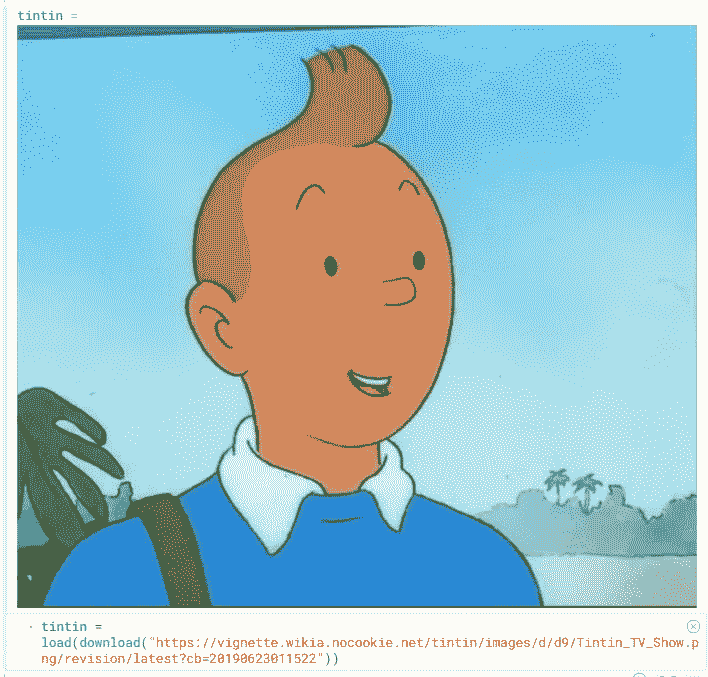

从网上下载图片并在 Julia 中使用，来源:作者，[原始图片来源](https://tintin.fandom.com/wiki/Tintin)

我还下载了一张黑线鳕的图片。让我给你看看我做了什么。

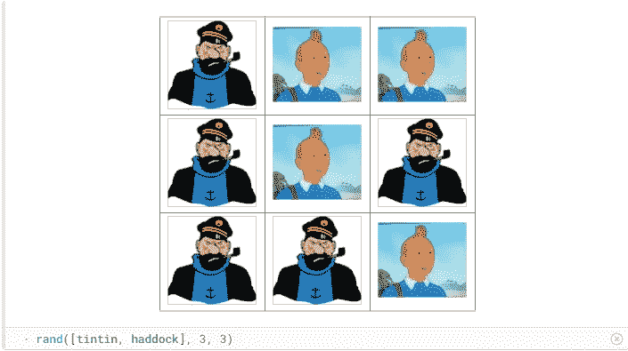

丁丁和黑线鳕的随机排列，来源:作者，[黑线鳕原始图片来源](https://www.deviantart.com/ironsid0r/art/Captain-Haddock-in-a-bad-mood-422568166)

我只用一行代码就用一些图像生成了一个 2D 数组！我对此很着迷。

# 进一步图像处理

在 Julia 中处理图像非常直观和容易。

您可以像对待其他编程语言中的任何其他元素一样对待图像和图像的一部分。

让我展示给你看。但在此之前，我想让你知道 Julia 附带了一个`RGB`“颜色空间”,它允许你将一种颜色存储到一个变量中，并在其他地方使用它。

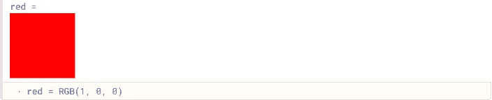

使用 RGB“色彩空间”，来源:作者

我下载了这个人的照片并存储在一个变量中:

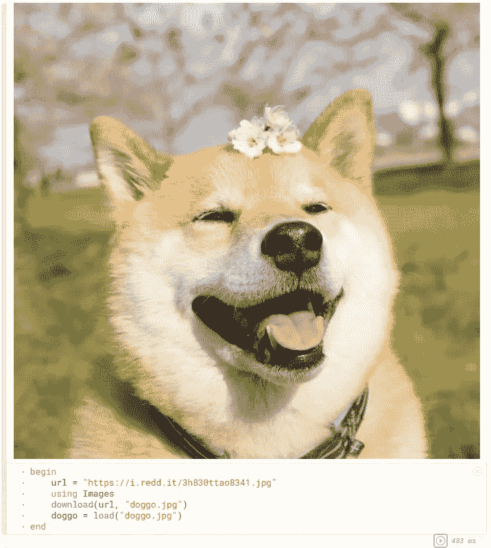

将 Good-Boi 存储在变量中，来源:作者，[原图来源](https://i.redd.it/3h830ttao8341.jpg)

你可以通过 Julia 很容易地得到尺寸和裁剪。

这里有趣的是，你可以访问每个像素或一组像素，并随心所欲地操纵它们。

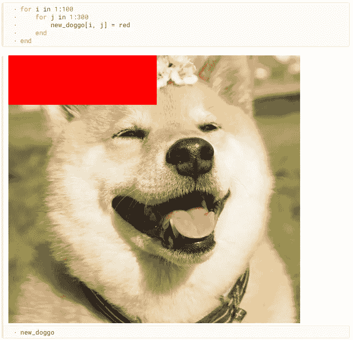

对一组像素的操作，来源:作者

这里，我只是取了一些像素，给它们赋值红色，这是一种颜色。它是如此简单和无缝。

你可以做更多有趣的东西，比如制作蓝光过滤器。

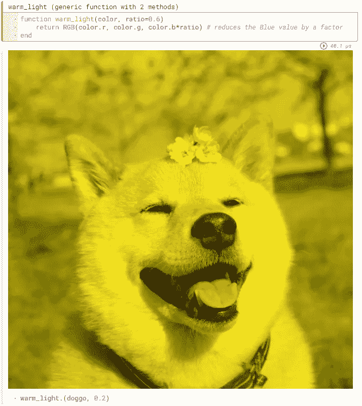

一个减少图片中蓝色量的函数，来源:作者

我写了一个函数，应用到图片上。很简单。像这样的函数也可以应用于一组图像，这使得它在计算机视觉训练集中的数据扩充中非常有用。计算机视觉问题可能还有其他有趣的应用。

# 像对待变量一样对待图像

你不仅可以毫不费力地在 Julia 中进行像素级操作，还可以用多种方式操纵它们。


堆叠图像，来源:作者

仅仅通过跑步-

```
[
head reverse(head, dims=2)
reverse(head, dims=1) reverse(reverse(head, dims=1), dims=2)
]
```

你可以创造这个—


堆叠镜像和反转图像，来源:作者

我再次看到了这在深度学习中神经网络训练的增强变换中的应用。

# 同步更新

作为 Jupyter 的用户，我不禁注意到

在 Jupyter Notebook 中，直到你运行一个单元格，单元格中的内容(变量、方法、类等)发生变化。)不要被反射。

但是布鲁托和朱莉娅会自动这么做。

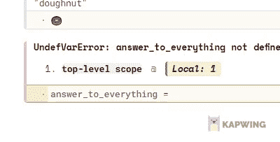

GIF 展示同步更新，来源:作者

现在，这是一个更加微妙的问题。对我来说，陪审团仍然不知道这是否会有所帮助。

# 强大的 PDF 转换支持

您可以将 Pluto 笔记本转换为 PDF，而不会有任何重大损失。Pluto 对 PDF 的支持值得称赞。

如需完整代码(并查看 Julia 创建的完美 PDF 文件)，您可以下载这里涉及的两个笔记本(Dropbox 链接)—

*   [图像分析笔记本](https://www.dropbox.com/s/ilsx94ual2kdmxk/beginning_image_analysis_julia.pdf?dl=1)
*   [阵列笔记本](https://www.dropbox.com/s/5sco9wnfkb395oe/arrays_in_julia.pdf?dl=1)

# 缺少捷径

我可以在木星周围移动而不用碰鼠标，但这在冥王星是不可能的。快捷键很少，鼠标是不可或缺的。我不能说我喜欢冥王星的这一点。但是看起来[他们正在努力](https://github.com/fonsp/Pluto.jl/issues/65)。

# 软件包管理器

Julia 有一个简单有效的包管理器，可以从 Pluto 内部和命令行访问。

我更喜欢命令行，任何时候。

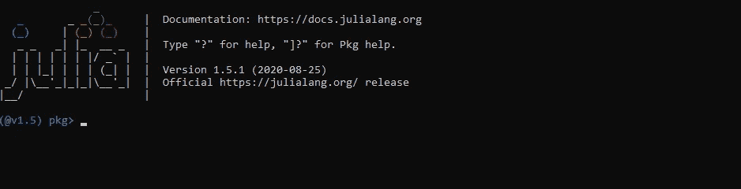

从命令行管理包，来源:作者

# 结论

如您所见，我在这里仅仅触及了皮毛。我只用了茱莉亚和布鲁托一天。并且分享了自己经历过的，喜欢的，不喜欢的。

还有很多(如果不是全部的话)留给我去探索。我很期待！

你可以看看麻省理工学院的 TEDx 演讲，其中一位联合创始人分享了他对这门语言的愿景。

# 与我联系

*   [推特](https://twitter.com/AllesistKode)
*   [领英](https://www.linkedin.com/in/ritobrata-ghosh/)
*   [网站](https://ghosh-r.github.io/)

和平！