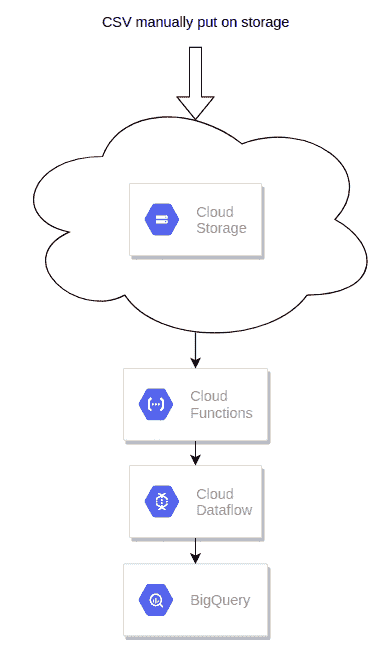

# 我的第一份谷歌云数据流 ETL 工作

> 原文：<https://towardsdatascience.com/my-first-etl-job-google-cloud-dataflow-1fd773afa955?source=collection_archive---------12----------------------->

我是如何在没有任何经验的情况下在 Python 和 Google Cloud 函数上使用 Google Cloud Dataflow 编写一个简单的 ETL 作业的。

最近，我被聘为门户网站 Telemedicina 的数据工程师，这是一家帮助每个人提高健康质量的神奇公司。在我学习新职位的过程中，我发现大数据工具实在太多了。因为我从来没有做过数据工程师，所以我在选择大数据工具来运行 ETL(提取转换加载)作业时有些纠结，就像这只可怜的狗一样。

幸运的是，我参加了一个讲座，Resultados Digitais 的数据工程师 [Thiago Chiarato](https://www.linkedin.com/in/thiagochiarato/) 正在谈论无服务器解决方案，以及我们如何通过不必担心服务器维护来提供更多服务。他告诉我们他是如何通过 Google Cloud Dataflow 做到这一点的，这是一个无服务器的 Apache Beam 解决方案。

回到门户网站 Telemedicina， [Gabriel](https://www.linkedin.com/in/gabriel-aristeu-cabral-8b6634179/) ，一位和我一起在研讨会上的同事，说服团队数据流可以解决一些问题。因此，我们决定花一周时间进行概念验证(PoC ),以检查 Google Cloud Dataflow 是否真的符合我们的需求。这并不难，因为我们已经在谷歌平台上了。作为 PoC，我们选择使用数据流将巴西城市及其人口的列表上传到 Big Query。

我们开发的两个代码( **pocdataflow.py** 和 **cloudfn.js** )都在一个 [Github Gist](https://gist.github.com/andrevrochasilva/45d49575d7bfa468e24fb1b8d56fb744) 里。

# 谷歌云数据流

为了学习如何使用 Apache Beam，我们找到了一些很好的教程，比如这个[使用 cloud pub/sub](https://www.youtube.com/watch?v=I1JUtoDHFcg) 作为“Hello Beam”。经过一些艰苦的工作，我们想出了 **pocdataflow.py** 代码。

当你只是运行代码时，你是在本地运行，但如果你想在谷歌云数据流上运行，你必须添加一些参数，如' staging_location '，' runner '和' temp_location '。一个有用的技巧是在云上运行之前尝试在本地运行它。如果您发送的任务是可并行化的，Dataflow 将分配更多的 CPU 来完成这项工作。

当你的工作在谷歌服务器上运行时，你可以在控制台上监控它。您可以在那里检查错误、当前使用的 CPU 数量以及其他一些信息。

谷歌云数据流的扩展速度有多快！

一旦您的工作正常运行，[您就可以为它创建一个模板](https://cloud.google.com/dataflow/docs/guides/templates/creating-templates)。该模板允许您从请求或浏览器中触发数据流的作业。我们发现创建模板的最简单方法是在使用终端命令运行 python 脚本时添加选项'—template _ location GS://your-bucket/pathtotemplate/template '。它不会运行作业，但会在您的 bucket 上创建一个包含作业模板的文件。之后你还要在同一个文件夹里添加一个' [template_metadata](https://cloud.google.com/dataflow/docs/guides/templates/creating-templates#metadata) '文件，就完成了。

到目前为止一切顺利，但我们想看看它能自动化到什么程度。Thiago Chiaratto 又一次挽救了局面，他推荐了[谷歌云功能](https://cloud.google.com/functions/)。

# 谷歌云功能

Google Cloud Functions 是一小段代码，可能由 HTTP 请求、云发布/订阅消息或云存储上的一些操作触发。就像以前的工具一样，它完全没有服务器，能够运行 Node.js、Go 或 Python 脚本。

在我们的解决方案中，我们决定使用 Node.js，遵循我们找到的例子[。结果就是代码 **cloudfn.js** 。现在，每当您在存储桶上插入包含城市列表的文件时，它将自动启动您的工作模板。](https://medium.com/google-cloud/how-to-kick-off-a-dataflow-pipeline-via-cloud-functions-696927975d4e)

最终的架构如下所示:

PoC 架构

在概念验证结束时，我们能够分布式处理数据，而无需设置 Hadoop 集群或承担维护成本。很难说我们会花多少时间从头开始学习如何设置整个 Hadoop 和 Apache Beam 结构。

事实上，我有一个在编程方面比我更有经验的犯罪伙伴，这增强了整个 PoC 体验。我认为，与单独行动相比，两人一组能更快地完成任务。值得一提的是，支持这种实验的公司对项目的成功至关重要(我们正在招聘)！

自从那次经历之后，我一直使用 Google Cloud Dataflow 来编写我的数据管道。由于 Dataflow 的可扩展性和简单性，一些需要大约 2 天才能完成的数据管道现在在 Portal Telemedicina 只需 3 小时即可完成。

如果你需要一些关于 Apache Beam/Google Cloud 数据流的帮助，请告诉我，我很乐意帮忙！