# 我第一次接触到机器学习问题。

> 原文：<https://towardsdatascience.com/my-first-exposure-to-a-machine-learning-problem-4804ea1480f9?source=collection_archive---------34----------------------->

## 解决世界闻名的泰坦尼克号机器学习问题，并向 ML 的世界介绍自己。

美国国家海洋和大气管理局在 [Unsplash](https://unsplash.com?utm_source=medium&utm_medium=referral) 拍摄的照片

# **简介**

这个时代的每个人都知道泰坦尼克号。泰坦尼克号是当时最大的船，被称为“永不沉没之船”。以至于该船的工程师和建筑师得出结论，没有必要在船上增加足够数量的救生艇。这意味着这艘船可以容纳更多的乘客，使他们能够在甲板上自由移动。

1912 年 4 月 14 日，泰坦尼克号与一座冰山相撞，灾难降临，造成船只大面积损坏。2 小时 40 分钟后，船沉入海底。由于船舶设计者计划不周，救生艇无法容纳船上所有的乘客。这造成了大量的生命损失。估计死亡人数约为 1517 名乘客。

对于那些正在阅读这篇博客的人来说，你可能很难把我的博客的标题和我到目前为止所做的介绍联系起来。这是可以理解的，我简要介绍整个泰坦尼克号灾难的原因是因为我的第一个机器学习项目是基于完全相同的主题。

# **问题陈述**

Kaggle 上的泰坦尼克号挑战赛是一个开放的比赛，供初学者参加并熟悉 Kaggle 平台。此外，它还为人们开始机器学习之旅提供了一个起点。

问题陈述很简单。给定一个训练集和一个测试集，我必须开发一个机器学习算法来预测泰坦尼克号灾难中幸存的乘客和遇难的乘客。

# **工作流程**

由于这是我第一次接触机器学习问题，我想在数据集上测试所有可能的算法。我最终引入了许多机器学习算法，从简单的如逻辑回归和 K 最近邻算法到复杂的如随机森林分类器和 AdaBoost 分类器。

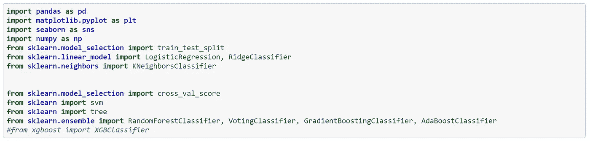

(图片由作者提供)

在导入库并将数据加载到 pandas 数据框中之后，我开始研究数据，寻找可能的异常值或缺失值，这可能是我们项目后期算法的关注点。

## 数据探索

作为数据探索的第一步，我使用了 describe 函数来获得训练数据集中的数字数据的概述。描述功能是一个有用的工具，因为它为用户提供了数据的统计概览。它给出了计数、平均值、标准偏差和所有的四分位值。训练数据集具有 891 名乘客的信息。

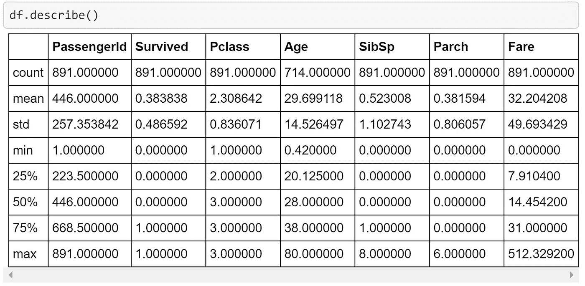

(图片由作者提供)

在下一步中，我将利用条形图来探索分类变量。条形图是研究要素中存在的各种分类标签的计数的好方法。下图给出了目标标签的条形图，即存活或未存活，其中 1 表示存活，0 表示未存活。

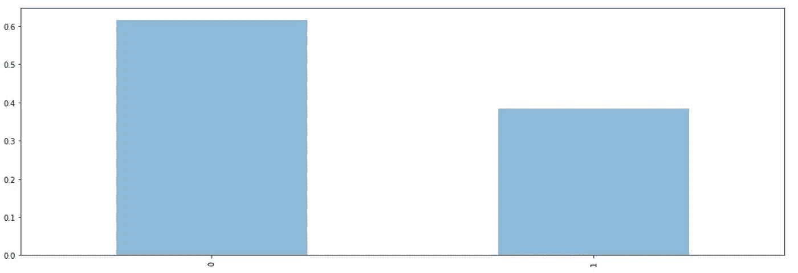

(图片由作者提供)

柱状图也被用来比较事故中幸存的女性和男性的数量。正如柱状图非常清楚地描述的那样(通过下面提供的图片)，事故中幸存的女性人数多于男性。这种模式的例子可以在历史书上找到，其中指出，船长明确地发出命令，让妇女和儿童优先获救。因此，女性的存活率几乎是男性的三倍。

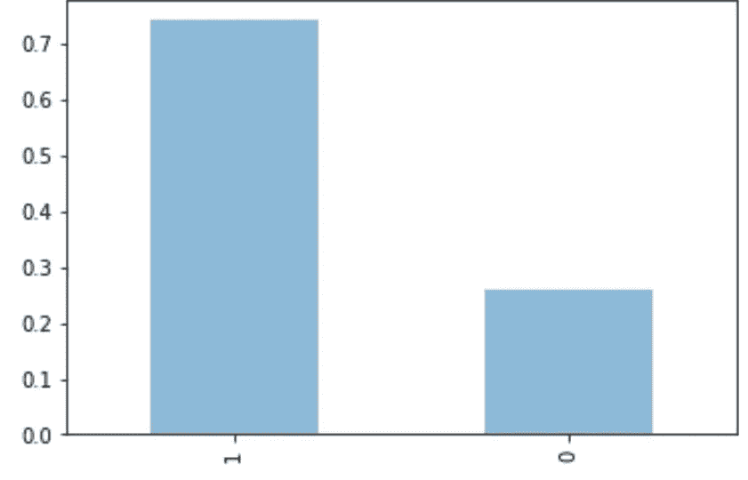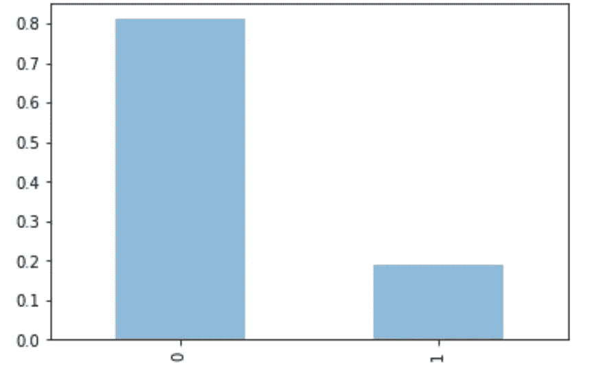

描述幸存女性人数的柱状图(左)描述幸存男性人数的柱状图(右)。(图片由作者提供)

在对训练集中的分类变量有了一个相当不错的想法后，我现在将注意力转移到我们的数据集中存在的缺失值(即训练数据和测试数据)。缺少值会导致算法行为不当和性能不佳，这就是为什么应该适当地处理它们。我使用 pandas isnull 和 sum 函数来获得缺失值的计数。在训练数据中,“年龄”、“客舱”和“登机”列中有缺失值，而在测试数据中,“票价”、“年龄”和“客舱”列中有缺失数据。

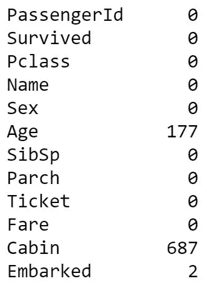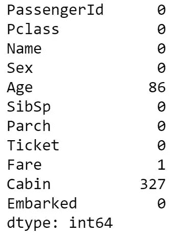

训练数据(左)和测试数据(右)中缺失值的摘要。(图片由作者提供)

## 数据工程(训练集)

在数据探索步骤之后，我对手头的数据集有了一个相当好的想法，因此我决定对数据集进行必要的修改和更改，以适应我们的机器学习算法的需要。

步骤 1:删除丢失数据的行/列。

“已装船”列有两个缺失值。由于缺失值的数量很少，我决定删除包含缺失值的行。删除它们不会导致算法信息的重大损失。另一方面，客舱列有相当数量的缺失值，这些缺失项占“客舱”列中所有数据的 77%。客舱列中缺少的值会阻碍模型达到最佳精度，因此，我决定删除“客舱”列。

步骤 2:填充数据集中缺失的值。

训练集中唯一缺少值的列是“年龄”列。为了填补缺失的值，我使用了箱线图。因为列“Pclass”没有缺失值，所以我将它映射到数据集中存在的年龄值。形成的箱线图给了我船上每个等级的乘客的平均“年龄”值。然后用这些平均值代替缺失值，这样我们就有了一个完整的“年龄”栏。下图中可以看到箱线图。

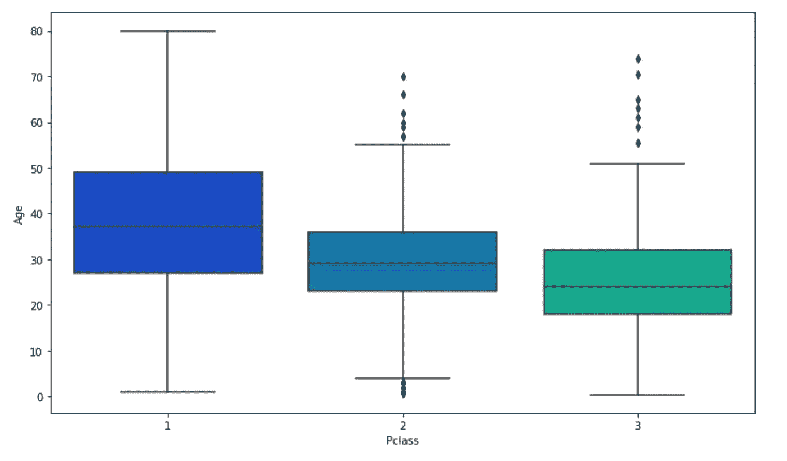

(图片由作者提供)

步骤 3:分类变量的一次性编码。

一种热编码是将分类变量转换成可解释形式的过程，该可解释形式可以提供给 ML 算法以在预测中做得更好。pandas get_dummies 函数有助于将分类变量转换成独热编码格式。对于这个项目，我将“Sex”列和“apollowed”列转换为 one-hot 编码的特性。下图显示了添加到数据框中的新列。“男性”和“女性”列是在对“性别”列应用一键编码后派生出来的。

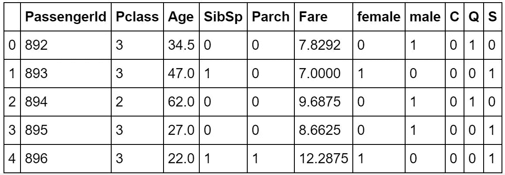

(图片由作者提供)

步骤 4:删除不需要的列

在执行了步骤 1、2 和 3 之后，我剩下了一些在项目的后续阶段中不需要的列。首先，我删除了“性别”和“上船”列，因为我有它们的热编码等价物；其次，我删除了“机票”和“姓名”列，因为它们无助于增加机器学习模型的预测能力。

## 数据工程(测试集)

由于训练集和测试是两个不同的 CSV 文件，在完成训练集的数据工程任务后，我将注意力转向了测试集。我使用了前一节中描述的相同的四个步骤来清理测试集。

总之，删除了“Cabin”列，删除了缺少“Fare”值的一行，并使用用于替换训练集中缺少的“Age”值的方法替换了缺少的“Age”值。最后，使用一次性编码转换分类变量，并从测试集中删除不需要的列。

## 在训练数据上实现机器学习算法

现在我有了一个干净的数据集，剩下的唯一部分就是将训练集和测试集分配给变量。下图也可以看出同样的情况。

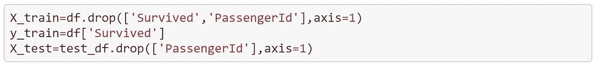

(图片由作者提供)

一旦执行了上述步骤，我就开始在训练数据集上实现机器学习算法。我在训练数据上实现的算法是:

*   逻辑回归
*   支持向量机(核:线性、RBF 和 Sigmoid)
*   决策树
*   脊线分类器
*   随机森林分类器
*   XG 增强分类器
*   AdaBoost 分类器
*   k 近邻分类器

在对训练数据实施了上述算法之后，我计算了模型精度以及拟合模型的交叉验证分数。下表列出了每个模型的准确度分数和交叉验证分数。

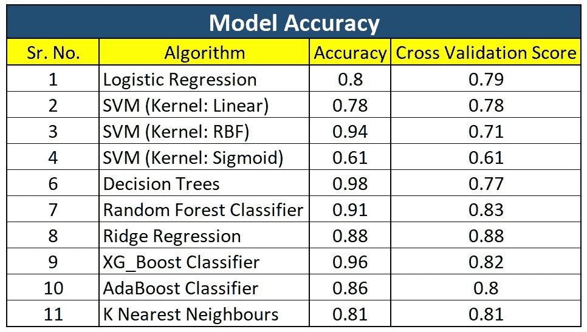

(图片由作者提供)

## 推理

查看上表，SVM(内核:RBF)、决策树和 XG Boost 分类器具有显著的模型准确性，但交叉验证得分较低，这表明对训练数据过度拟合。相反，岭回归分类器具有较高的模型精度和交叉验证分数。因此，我得出结论，岭回归分类器是我的机器学习项目的最佳算法。

## 关于 Kaggle 的呈件

我在测试集上使用了岭回归分类器，并生成了一个 CSV 文件提交到 Kaggle 上。提交文件由测试集中乘客的预测值组成。该模型达到了 76%的准确率。

# **结论**

我在机器学习项目上的第一次尝试是富有成效的。我遇到了各种用于清理数据和处理缺失值的方法，我能够在数据集上实现各种机器学习算法，并评估它们的准确性。

在未来，我将更多地了解各种机器学习算法的复杂性及其工作原理。这将允许我了解情况，并相应地使用最能满足需要的算法。最后，我将致力于更多有趣的机器学习项目，并与世界上的机器学习爱好者分享。

*我做泰坦尼克号项目遵循的流程可以在* [*Github*](https://github.com/shaunak09vb/Titanic-Kaggle/blob/master/titanic.ipynb) *上找到。我希望你喜欢看我的博客。*