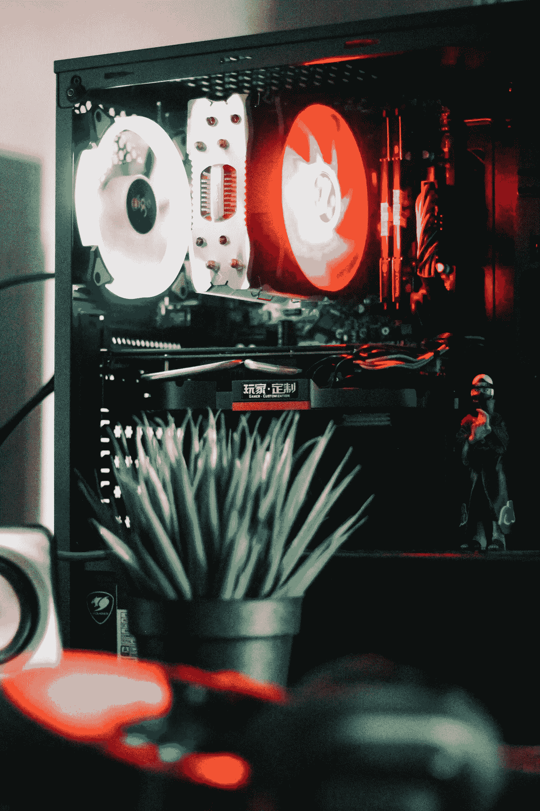

# 我作为计算机视觉工程师的第一个月

> 原文：<https://towardsdatascience.com/my-first-month-as-a-computer-vision-engineer-5813574d394a?source=collection_archive---------11----------------------->

## 洞察一个实践机器学习工程师的第一个月。Jupyter 笔记本之外的世界

Avi Richards 在 [Unsplash](https://unsplash.com/s/photos/work?utm_source=unsplash&utm_medium=referral&utm_content=creditCopyText) 上拍摄的照片

# 介绍

大约一个月前，我写了我作为计算机视觉工程师的第一天是怎样的。如果你错过了这个故事，在阅读本文之前，请随意阅读。

 [## 我作为计算机视觉工程师的第一天

### 剧透:我引起轰动

towardsdatascience.com](/my-first-day-as-a-computer-vision-engineer-8b59750c79a0) 

一个月后，我回来提供一些第一个月的细节。

## 我写这些文章的原因是向个人提供一些知识，而不接触机器学习行业内的人。一些内部消息有利于人们做出重要的职业选择。但是请记住，我的经历并不能反映整个行业。

在这篇文章中，我谈了以下几点:

*   我在第一个月遇到的脆弱情绪
*   角色所需的研究期望
*   为什么研究很重要
*   期望在以 ML 为中心的角色中取得成功的技术能力水平

# 恐惧和责任

不如我先说说我第一个月有多害怕。这不是我的第一份正式工作，在成为机器学习/计算机视觉工程师之前，我已经做了 3 年半的网页开发员。

但是这次感觉很不一样。我很害怕，原因如下:

*   我负责所有与公司产品相关的计算机视觉
*   团队非常信任我的决定

恐惧不一定是一件坏事，我把它作为一种工具来确保我拿出最好的作品，并在需要的时候付出 100%的努力。

# 研究

照片由[丹·迪莫克](https://unsplash.com/@dandimmock?utm_source=unsplash&utm_medium=referral&utm_content=creditCopyText)在 [Unsplash](https://unsplash.com/s/photos/research?utm_source=unsplash&utm_medium=referral&utm_content=creditCopyText) 上拍摄

作为该公司第一个专注于机器学习的员工，我被要求列出我认为最适合工作的流程。

它包含了大量的研究。

作为一名机器学习工程师，你必须能够理解发表的研究论文中提出的最先进技术的关键细节。

作为一名工程师，实施技能至关重要，但解释你的机器学习模型是如何工作的，或者解释你为什么选择一种方法而不是另一种方法，可以将你描绘成你所在领域的专家。

第一个月阅读了大量关于标准计算机视觉问题解决方案的研究论文，如姿势估计、语义分割、对象检测等。

[**研究门**](https://www.researchgate.net/) **和** [**代码为**](https://paperswithcode.com/) **的论文是发现解决特定计算机视觉问题的相关论文的绝佳资源。**

# 技术的

该公司的主要交付成果以 iOS 移动应用的形式出现。

照片由 [Roozbeh Eslami](https://unsplash.com/@roozbeheslami?utm_source=unsplash&utm_medium=referral&utm_content=creditCopyText) 在 [Unsplash](https://unsplash.com/s/photos/code?utm_source=unsplash&utm_medium=referral&utm_content=creditCopyText) 上拍摄

我没有接触过开发 iOS 移动应用程序，所以我的第一个月涉及到熟悉 [Xcode](https://developer.apple.com/xcode/) ，这是一个用于开发移动应用程序的 IDE，还有 Swift，这是一种由 [Apple](https://swift.org/) 开发的编程语言。

由 [Roozbeh Eslami](https://unsplash.com/@roozbeheslami?utm_source=unsplash&utm_medium=referral&utm_content=creditCopyText) 在 [Unsplash](https://unsplash.com/s/photos/code?utm_source=unsplash&utm_medium=referral&utm_content=creditCopyText) 上拍摄的照片

对于那些可能没有意识到的人来说，一个好的机器学习工程师也应该是一个体面的软件工程师。

这是一个非常高的要求，机器学习工程师不要仅仅将他们的工作局限于 Jupyter 笔记本和 Python 脚本。但相反，你需要能够掌握新的语言来建立网站或移动应用程序。

每天，我交替使用 Swift、Python 和 JavaScript 来完成各种不同的任务。

关键的事情不是要知道数百种编程语言，而是你需要掌握大多数编程语言的基础知识。

一个不错的起点是学习面向对象编程(OOP)。

一般来说，你从一种编程语言中学到的知识可以转移到下一种语言。

# 五金器具

我利用一台 Nividia Geforce GTX 1650 来训练我的业余爱好项目的大部分 ML 模型。这种 GPU 规格甚至没有接近训练最先进模型所需的硬件规格。

由 [Aviv Rachmadian](https://unsplash.com/@avivrchmdn?utm_source=unsplash&utm_medium=referral&utm_content=creditCopyText) 在 [Unsplash](https://unsplash.com/s/photos/gpu?utm_source=unsplash&utm_medium=referral&utm_content=creditCopyText) 上拍摄的照片

在我的第一个月，我的任务是提出一个合适的 GPU 工作站技术规格，然后公司可以订购。

选择合适的硬件组件需要预见到我将在未来几个月甚至几年训练什么类型的模型。

为了做出准确的决定，我不得不进行大量的研究，研究论文利用什么样的硬件规格来训练他们提出的模型。

此外，还需要对支持稳定工作站所需的其他硬件组件进行研究。

对以下问题进行了考虑:

*   冷却系统
*   主板和处理器
*   电源容量
*   GPU 插槽可用性
*   还有更多…

**这里有一个** [**视频**](https://www.youtube.com/watch?v=xsnVlMWQj8o&t=41s) **解释了如何构建一个深度学习的机器学习工作站。**

**即使你不会很快建立一个工作站，了解训练深度学习模型所涉及的硬件组件也是很好的。**

# 证明文件

软件文档冗长、乏味、无聊。但是任何达成一致的技术方法的文档都是至关重要的。

照片由[莎伦·麦卡琴](https://unsplash.com/@sharonmccutcheon?utm_source=unsplash&utm_medium=referral&utm_content=creditCopyText)在 [Unsplash](https://unsplash.com/s/photos/documents?utm_source=unsplash&utm_medium=referral&utm_content=creditCopyText) 上拍摄

所采取的每一个决定和方法都应该记录下来，以告知团队成员和未来的新成员。

在我的第一个月，我记录了大约 12 个小时的文档。这并不有趣，但却是必要的。

我记录的项目包括以下内容:

*   处理基于机器学习的项目时要采取的已定义流程
*   基本材料快速文摘研究论文的基本摘要
*   关键项目和软件解决方案的实施方法说明
*   GPU 工作站硬件比较规格
*   解释围绕实现代码的推理和逻辑的代码内文档。

在您的角色中，您可以记录很多领域。从一周中抽出一些时间，至少 2 个小时用于文档。

**这篇** [**文章**](/why-you-should-document-your-work-as-a-data-scientist-a265af8a373) **作者**[**Admond Lee**](https://medium.com/u/7cfb1b8791bb?source=post_page-----f40949096cd4----------------------)**进一步探讨了为什么文档对于数据科学家来说是必要的。**

# 偏爱

作为一名正式的计算机视觉工程师，我的第一个月让我对实用的机器学习如何融入公司有了一些了解。

我意识到许多人可能没有意识到的是，ML 模型不是最终产品。机器学习本身是软件工程的一个使能部分；我们产生的结果被嵌入到软件系统中，它们以创造性的方式执行任务。

向前看，我的第一个月让我意识到我喜欢机器学习带来的创造性产出。

**朝着一个创造性的目标努力可以让平凡的模型实现、调试和训练任务变得不那么无聊。**

# 结论

在第一个月，我做到了以下几点:

*   设定接近计算机视觉过程的标准
*   学会了一门新的编程语言
*   为构建公司的 GPU 工作站提供硬件规格
*   实现了计算机视觉技术，如姿态估计、手势识别和语义分割
*   选择 TensorFlow 和 TensorFlow Lite ( *我更喜欢 PyTorch 类型的家伙*

# 希望这篇文章对你有用。

要联系我或找到更多类似本文的内容，请执行以下操作:

1.  订阅我的 [**YouTube 频道**](https://www.youtube.com/channel/UCNNYpuGCrihz_YsEpZjo8TA) 视频内容即将发布 [**这里**](https://www.youtube.com/channel/UCNNYpuGCrihz_YsEpZjo8TA)
2.  跟我上 [**中**](https://medium.com/@richmond.alake)
3.  通过 [**LinkedIn**](https://www.linkedin.com/in/richmondalake/) 联系我