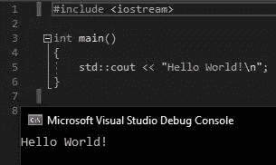

# 我作为人工智能医疗保健研究员的第一个月

> 原文：<https://towardsdatascience.com/my-first-month-as-an-ai-healthcare-researcher-f4736a38bd02?source=collection_archive---------41----------------------->

马库斯·弗里乌夫在 [Unsplash](https://unsplash.com?utm_source=medium&utm_medium=referral) 上的照片

**概述**

这篇文章是写给任何像我一样，对在医疗保健领域从事人工智能研究感兴趣的人的。就在不到一个月前，我开始了与当地一家医院合作的硕士项目研究。我想让你们了解一下我的背景，我目前的日常工作，以及我对这个领域的初步想法。

与任何事情一样，我要说的几乎肯定不适用于所有的人工智能医疗研究，但我希望你能带着一些一般概念离开。

**我的背景**

我是一名 23 岁的俄亥俄州立大学的硕士生，学习…机械工程？而我的本科学历呢？机械工程…那么我是怎么到这里的呢？让我们往回走一点。

大概从 10 岁开始，我就喜欢上了电脑。我仍然记得我告诉我爸爸我想学习如何制作电子游戏，然后从学校回来，我的床上放着一本崭新的《傻瓜 C++》。我不知道整数是什么，变量这个词是什么意思，也不知道这些如何让我更接近于成为《星球大战前线 2》的精神继承者，但这都不重要。因为在花了一个小时在热键盘上挥汗如雨，安装一些古老版本的 Dev-C++之后，我按下了“运行”按钮，神奇的事情发生了…

嘿，你好！

我让我的电脑和我说话。不知何故，这些我不懂的胡言乱语让我的电脑说话了。从那时起，我几乎总是在做一些与计算机相关的事情，无论是尝试修改我最喜欢的游戏还是制作我自己的基本文本冒险。计算机背后的许多神秘对我来说已经消失了，但我一直对它们的能力感到敬畏。

> *这是我梦寐以求的工作，我实现它完全是巧合。*

所以现在我已经彻底摆脱了超级书呆子的身份，你可能会想，如果我如此热爱计算机，为什么我决定学习机械工程。主要原因是我担心如果我成为一名程序员，我将无法解决物理问题。我的视力会因为整天盯着电脑屏幕而变得模糊，我会养成可怕的姿势，我的牙齿会掉光，等等。没有人警告过我，所有这一切也将成为机械工程的现实！

但是在本田的长期实习后意识到这些现实并没有改变我的道路。我的顶点项目是医学性质的，而我满怀希望的硕士项目顾问正在研究校园附近医院的人工智能研究，这两个项目的奇怪交叉将我带到了这里。说白了，这是我梦寐以求的工作，我实现它完全是巧合。再次专注于编程感觉就像回到了家。

**我的日常生活**

那么现在我已经谈论了我自己，我实际上在做什么？就像大多数工作一样，我没有一个固定的待办事项清单，但是有几件事我每天都在做。下面是我最常见的三种，排名不分先后。

1.  *摆弄数据*

由[卢克·切瑟](https://unsplash.com/@lukechesser?utm_source=medium&utm_medium=referral)在 [Unsplash](https://unsplash.com?utm_source=medium&utm_medium=referral) 拍摄的照片

基本上任何机器学习工作都是如此，怎么说都不为过。我大部分时间都在关注清理和处理我自己的数据，或者阅读其他拥有类似数据的研究人员是如何清理和处理他们的数据的。他们是如何处理缺失值的？它们有什么独特的设计特征吗？他们是如何标准化他们的数据的？他们的模型能用他们的方法达到好的结果吗？这些都是你在研究同事的论文时会问的问题。

2.*与利益相关方合作*

显然，研究的目的是为了取得某种成果并与科学界分享。但是什么结果呢？如果利益相关者 A 和利益相关者 B 对你应该做什么有不同的想法呢？你需要确保每个人都在同一页上，朝着同一个目标前进，最重要的是，你需要确保*你*明白你要去哪里。虽然名义上您的利益相关者是负责人，但当涉及到您的数据时，您可能是主题专家。将数据集中的任何限制或漏洞告知他们是至关重要的。

所有数据背后都有一个故事，但你必须能够向它提出正确的问题，让这个故事浮出水面。例如，如果您的利益相关者希望能够检测患者的内出血，但尽管您尽了最大努力，您的模型也只能随机应变，那么您有责任与您的利益相关者分享您的担忧。方向的快速改变、对新数据的投资，或者对你认为无法设计的功能的建议，都比用头撞墙有用得多。

3.*阅读研究论文*

丹·迪莫克在 [Unsplash](https://unsplash.com?utm_source=medium&utm_medium=referral) 上拍摄的照片

这真的不应该是一个惊喜！成为一名医疗保健研究员不仅仅意味着研究你自己的问题。阅读您的同行在医疗保健中使用机器学习的研究几乎总是一项不错的投资。虽然不像其他领域的机器学习研究那样普及(还没有！)，其他研究人员的见解，即使他们在处理与我自己完全不同的问题时，也常常可以很容易地应用到我自己的工作中。

如果你真的想成为一名研究人员，那就认真阅读研究报告吧。就时间和精力而言，这可能非常费力，但净收益是值得的。我每天至少看一份报纸。这样想:如果最优解微不足道，为什么会有人去研究它？如果其他人已经研究过并找到了好的解决方案，为什么我需要重新发明轮子呢？

> 如果你真的想成为一名研究人员，那就认真阅读研究报告吧。

**我对球场的最初想法**

因为这篇文章已经很长了，我会尽量保持简短！以下是我过去一个月的一些热门镜头。

1.  人工智能在医疗保健领域有着光明的前景！它的一些功能才刚刚被认识到，还有许多令人兴奋的领域是健康数据独有的
2.  某些问题缺乏公开可用的解决方案可能会令人困惑，但我相信随着时间的推移，这将不再是一个问题
3.  领域知识是绝对重要的。拥有一些健康数据不足以成为一名称职的医疗保健研究人员。与卫生专业人员合作是必须的

**结论**

谢谢你看我的文章！希望将来会有更多。如果你喜欢你所看到的，考虑在 LinkedIn 或者 Medium 上关注我。

请在评论区告诉我你的想法！你有兴趣从事人工智能医疗保健方面的研究吗？你现在是研究员吗？如果是，你对这个领域有什么想法？