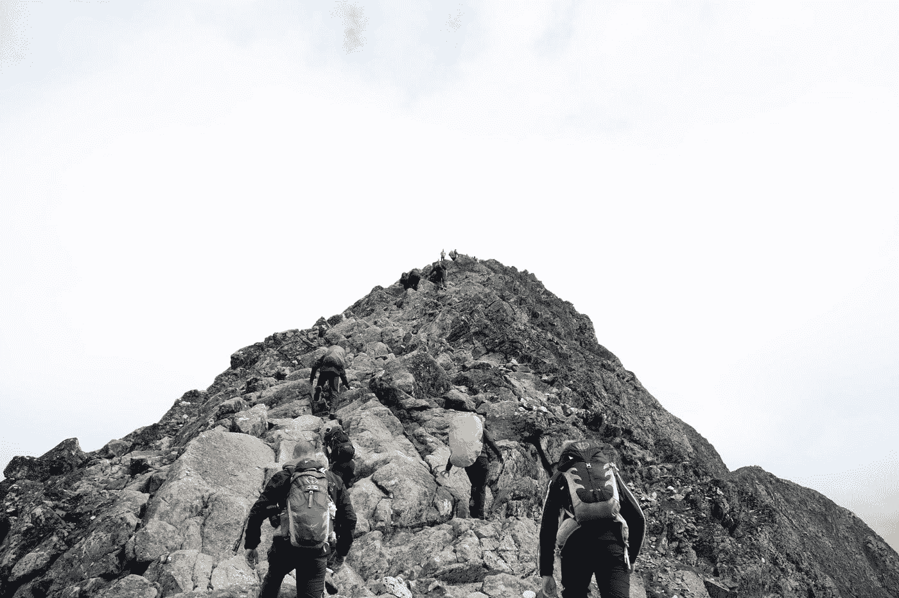

# 我作为博士生的第一周:数据科学之旅的开始

> 原文：<https://towardsdatascience.com/my-first-week-as-a-phd-student-bfce13281f5c?source=collection_archive---------47----------------------->

## 感觉像一条巨大池塘里的小鱼

[绿色变色龙](https://unsplash.com/@craftedbygc?utm_source=medium&utm_medium=referral)在 [Unsplash](https://unsplash.com?utm_source=medium&utm_medium=referral) 上的照片

首先，让我自我介绍一下。我叫 Philip Wilkinson，正如标题所示，我刚刚结束了在伦敦大学学院(UCL)攻读博士学位的第一周。我的研究专注于一个非常特殊的主题，即开发空间交互模型，或寻找替代模型，这些模型基本上可以用于根据现有的人口分布和其他因素来了解和预测商店收入。这一特定主题是空间相互作用模型更广泛历史的一部分，空间相互作用模型在以这种方式使用的同时，还被用于理解迁移模式、预测新交通基础设施的影响，以及理解新就业机会的创造如何影响当地的住房需求。由于新的大型数据集的出现，以及计算能力的提高，允许更大和更精确的模型，这也是一个最近获得新生命的主题。这是我主要在 UCL 大学攻读智能城市和城市分析硕士课程时感兴趣的一个领域，我们的一个模块围绕这些模型的历史和发展。这主要侧重于预测伦敦的工作分布将如何随着收入的变化或旅行成本的大幅增加而变化，但我很高兴看到这些模型还能做什么，以及更好的数据和软件如何让我们更好地了解我们周围的建筑环境。

那么我的第一周是什么体验呢？嗯，主要我会说，感觉就像我刚刚被扔进一个非常大的游泳池的深水区(因为我只有 5 英尺 6 英寸，所以深的游泳池不一定要那么深)或者我刚刚从一座非常大的山的底部开始，这将需要我至少三年的时间来攀登(我的资金在三年后用完，所以这是至少的目标)。我会说这主要是因为，当涉水进入这些水域，或者从山脚开始，完成我的博士学位的问题和挑战就在我面前。在这段时间里，我意识到我必须继续发展我的编码技能，使我能够处理非常大的数据集，并有可能创建新的软件来展示和运行开发的模型，阅读数百篇关于零售历史、零售位置、电子商务、空间交互模型和基于代理的模型的论文，有效地吸收和理解所有这些知识，为我的赞助商制作最终产品，并为我的博士论文撰写大约 10 万字的论文。如果这种前景没有吓到任何开始攻读博士学位的人，那么这项任务的艰巨性肯定还没有成为现实。

Mathias Jensen 在 [Unsplash](https://unsplash.com?utm_source=medium&utm_medium=referral) 上拍摄的照片

当然，虽然我对如何在未来三年内管理所有这些知识和创造所有这些产出感到害怕、焦虑和担心，但我完全期待着这一挑战，这有几个原因。首先，博士学位一直是我感兴趣的事情，虽然这不是我接受工作邀请后的最初计划(只是为了让 Corona 在这些工作中发挥作用)，但当一个我感兴趣的项目出现时，我很乐意抓住机会。我希望一旦我完成了这件事，我的父母和祖父母会为我感到骄傲，因为他们总是鼓励我尽可能地追求我的教育。其次，它提供了一个在未来三年继续我的学术和个人发展的机会，完成前面提到的所有任务，并在这个过程中学到很多东西，无论是通过我将要做的工作，还是通过我参加的社团或我遇到的人，我相信当我完成时，我会学到更多的知识，这是我可以带着我进入下一步的东西。鉴于我将在我感兴趣的学科内工作，将数据和技术驱动的解决方案应用于我们对建筑环境的理解，这一点尤其如此。第三，虽然工作目前还很遥远，但我真的很喜欢成为我在 UCL 的部门的一部分，因为我已经遇到了一些人(包括许多帮助我完成去年硕士学位并申请博士学位的令人难以置信的讲师和导师)，并期待着未来的见面，以及他们正在从事的世界领先的工作，这为我提供了很多向一些非常聪明和有趣的人学习的机会。这包括成为赞助公司的一员，虽然我还没有完全融入其中，但我期待着在未来这样做。

说了这么多，我在第一周实际上做了什么？这是从空间互动模型领域的一些初步探索性阅读开始的，这无疑会产生焦虑和恐惧的感觉，因为认识到要涵盖的内容太多了。到目前为止，就阅读和笔记而言，我只涉及了大约 14 篇学术论文，这基本上是我尝试了所有我能阅读的内容，比我想在第一周完成的数量少得多，但这是一个开始。这一小部分主要是因为我不得不非常专注于每篇论文，看看他们在模拟什么，他们是如何做的，他们的主要发现是什么，因此我可以从他们那里学到什么，帮助我知道我应该在哪里阅读。随着我阅读越来越多的论文，我希望这变得更容易，我意识到我不需要阅读什么，或者我需要更深入地阅读什么，因为我发现我到底想专注于什么。这也与系内的助教机会相平衡，助教机会将贯穿我的第一个完整学期，涵盖 Python 编程语言，与另外两名助教和两名讲师一起领导该课程。这无疑比我想象的要耗费更多的时间，但它向我表明，我应该同时从中学到很多东西，所以这对发展我的编码技能也非常有益。所以这两个主要的任务占据了我这周大部分的时间来生成我的工作产品。

然而，除了工作之外，到目前为止把它当作一份上午 9 点到下午 5 点的工作(尽管通常是上午 8 点到下午 4 点 30 分，除非工作进一步结束)，还有一个虚拟的部门展示和讲述，展示了部门内发生的一些令人兴奋的工作，以及与其他学者、博士和硕士生见面的机会，以更好地了解他们。我们还为系里的新博士们举行了一个小型的虚拟会议，喝着咖啡/茶，这很好地了解了每个人的相处情况，确保我们保持联系，如果有什么需要，我们会互相帮助，这也将成为一个固定的特征。由于在家工作，见不到很多人，这两个当然是需要的，所以在开始攻读博士学位的同时与人保持联系是很好的。最后，昨晚我设法重新开始玩 Fives，这是一项我这次非常想念的运动，所有的预防措施都到位了，在户外进行一些急需的锻炼，回到更热情的社区，与几个我很久没见到的人聊聊天，这很好。这表明博士不仅仅是工作，还有娱乐的时间(至少到目前为止)！

[布鲁诺·纳西门托](https://unsplash.com/@bruno_nascimento?utm_source=medium&utm_medium=referral)在 [Unsplash](https://unsplash.com?utm_source=medium&utm_medium=referral) 上拍照

所以总体来说，在我的第一周，对即将到来的事情既恐惧又兴奋，但这是意料之中的。我同时感觉到很多事情已经完成，但也有很多事情没有完成，所以我会看看下周会怎么样。能够开始这段漫长的旅程很好，我对未来充满期待。下周，我的目标是安定下来，继续做助教，为我的导师创作我的第一件作品，并继续深入了解空间交互模型的世界！

## 短期目标(1 周)

*   下周完成至少 12 次阅读，并开始绘制该地区关键人物的地图
*   为我的导师写我的第一篇文章
*   完成当助教的第二周

## 中期目标(6 个月)

*   在 6 个月内完成文献综述的草稿
*   制作一个基本的空间交互模型
*   了解我的数据的格式及其包含的内容

## 长期目标(3 年)

*   精通管理大型数据集和创建数据管道来处理这种情况
*   参加几个黑客马拉松
*   读完博士！！！

我希望通过每周发表的一系列博客，继续发展我在博士生涯中的这些想法、感受和行动。虽然认识到每个人的博士学位是不同的，但在开始之前，我并不完全确定博士学位将包含什么，所以我希望这些博客系列将为任何未来寻求攻读博士学位的人阐明过程！

感谢您的阅读！