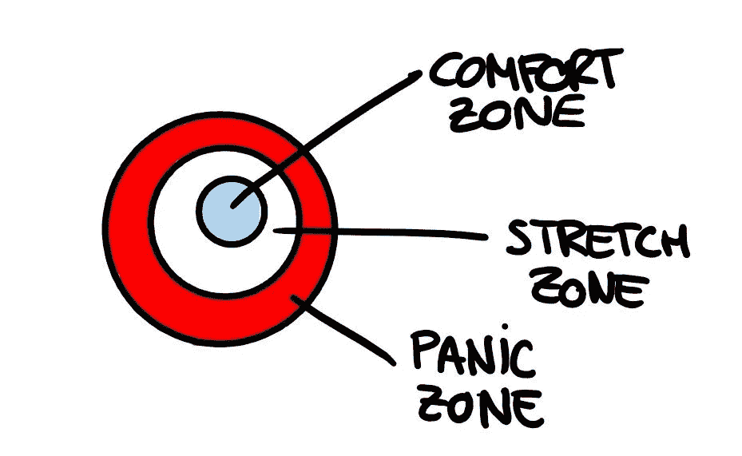

# 我在亚马逊工作的第一周

> 原文：<https://towardsdatascience.com/my-first-week-working-at-amazon-daaeaa6fcf43?source=collection_archive---------9----------------------->

Patrick Schneider 在 [Unsplash](https://unsplash.com/s/photos/amazon-office?utm_source=unsplash&utm_medium=referral&utm_content=creditCopyText) 上拍摄的照片。

在这篇文章中，我将让你一瞥我作为亚马逊 SDE 的第一周。我会让你知道我的第一印象，以及我从世界上最伟大的公司之一学到的一些有趣的经验。*注意:这篇文章表达的所有观点都是我的，绝不代表亚马逊。*

# 但是首先…一些背景

当我第一次收到邀请时，我无法接受。我甚至还没从大学毕业，就被这家大公司邀请去工作，而这已经是我日常生活的一部分。澄清一下，我是一名 Prime 会员，Alexa 的头号粉丝，我一直在试图说服我周围的人买一台 Kindle(如果你想知道原因，请查看[这篇文章](https://medium.com/@elsascola/heres-why-you-should-buy-a-kindle-179a2dc7e0a1))。

我花了一点时间才意识到这是一个多么好的机会，不仅是在专业层面上(这是显而易见的)，而且就我可能产生的影响而言。我会为改善数百万人的生活做出贡献吗？像我这样的人，我的家人或朋友？我甚至无法想象前方会发生什么。

我最终加入了亚马逊时尚团队，成为马德里的一名前端工程师。

# 入职流程

当我写这篇文章时，这实际上是我在亚马逊工作的第四周。我将描述我自己的入职经历，每个人的经历可能不同，但步骤基本相同。

第一天。一大早，我和我的经理开了“首次会议”,他向我介绍了我将在未来几周使用的平台。这是一个入职流程的指导平台，包含专为您和您的工作岗位量身定制的内容。例如，在我的情况下，有一个每天都要遵循的学习路径，在其中我可以找到内部教育视频、博客帖子、讲座、分步指南和测验，以确保我已经吸收了重要的知识。我定期学习更多关于亚马逊的内部理念，以及如何在我的团队中使用一些工具。这并不是说你在最初几周做的唯一事情就是完成课程，完全不是，你实际上被期望逐渐开始做一些小任务，并将它们与培训相结合。就我而言，我在第二周的周一接到了第一个任务。

**第二天。**我开始参加[的每日脱口秀](https://en.wikipedia.org/wiki/Stand-up_meeting)，这帮助我了解项目管理动态。

**第三天。我有机会见到了我的登机伙伴。入职伙伴帮助解决培训过程中可能出现的任何技术疑问，以及关于工作、工具的问题，以及你脑海中出现的任何问题。就我而言，是一位高级工程师友好地向我介绍了亚马逊的内部工作原理，目前解决了我的许多新手疑问。**

在整个**第一周**期间，我将大部分时间用于在入职平台学习。我花了大部分学习时间试图理解代码变更和部署过程是如何工作的，以及不同的内部技术。

我确实发现一个接一个地学习那么多技术可能会有点混乱。这不一定是一个糟糕的方法，但我是一个非常视觉化的人，所以我真的更喜欢在深入研究之前先有一个更广阔的画面，并看到概念之间的联系。因此，我制作了自己的方案，我的经理鼓励我将其转化为数字形式，以便在内部分享。我喜欢他们支持我们分享知识和寻求改进。

在第二周，在高级工程师的支持下，我已经被分配了一些小任务。

在**第三周**我正在发送代码进行评审和部署。

到这个星期(**第四周**)我已经有一些代码投入生产了。(耶🎉)

**继续上车。**即使在亚马逊工作了一个月，真的感觉不像。我还在上车平台和自己学习。总是第一天。

# 第一印象和教训

## 信任

我不知道能从亚马逊这样的公司期待什么。作为一名应届毕业生，我觉得我的意见不会被这么大的公司考虑，因为人们会认为我没有经验。我最终看到了完全相反的情况，每当我或我的同伴提出想法时，他们总是被认真听取，我从不觉得自己被当作新手对待，我经常被鼓励去完成我的提议。

## 个人成长

每个团队成员每周都要与经理进行 30 分钟的非正式会谈。这一周的时间专门用来谈论任何事情，除了你当前的任务。你有机会向你的经理解释更多个人问题，职业前景，你感兴趣的话题，或者寻求建议。

给我留下非常积极印象的是经理给予的巨大支持，以实现你想要的一切，即使这意味着离开球队。经理的目标是让你尽可能感到快乐，并帮助你达到目标。包括路径、国家或团队的完全改变。

一旦你和经理讨论了你的兴趣，他会试着给你分配那些与你最喜欢的话题相关的任务，或者那些对实现你的目标更有帮助的任务。他还允许你自由地提出与你的偏好相关的项目，这些项目可以让团队受益，即使这些项目不在团队最关心的范围内。

这可能看起来违背直觉，因为它很少发生在更传统的公司，然而，完全有道理。你在一家公司越开心，继续在那里工作并继续向其他团队提供知识和经验的机会就越大。这也提高了员工的绩效和工作积极性。

## 沟通

当然，这可能会让人不知所措。亚马逊是一家如此大的公司，人们很容易迷失在细节中，感觉自己一无所知。但事实是，没有人知道这一切。关键是专注于沟通，你不需要马上知道事情是如何运作的。就我而言，这几周我问了很多问题，似乎没有人对此感到困扰，相反，我的队友似乎很乐意回答我的疑问，并为我的学习过程做出贡献。

经理还经常检查我们对工作量的感受，并强调如果我们进入**恐慌区**，就要让我们沟通。这有助于避免精疲力竭，保持团队健康。

承蒙作者好意。

## 我们都觉得自己是骗子

在与团队的一些高级成员交谈后，我开始意识到我们都觉得自己有点像骗子，大部分时间都不知道发生了什么。这完全正常，亚马逊庞大，不可能全知道。有人告诉我，亚马逊并不真正关心聘请某个主题的专家，它试图聘请冒险家，那些愿意尝试、深入探索并坚持面对未知的人。最后，我们中的许多人，尽管觉得自己不完全胜任这份工作，但最终还是申请了。

# 包装它

总的来说，我的入职进展顺利。我很高兴能在这样一个友好和充满关怀的环境中工作。还有很长的路要走，我会确保继续写下去。

如果你正在读这篇文章，感谢你的时间，我真的希望你能从这篇文章中得到一些价值。下一集再见！

# 一些资源

我链接了一些资源，以防你想更深入地了解亚马逊文化。

*   [在亚马逊工作](https://youtu.be/SpXMWRiR3iE)
*   [亚马逊如何招聘](https://blog.aboutamazon.com/working-at-amazon/how-amazon-hires)
*   [领导原则](https://www.amazon.jobs/en-gb/principles)