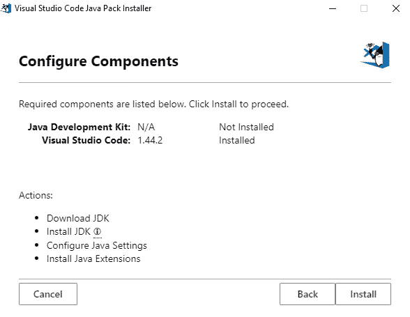
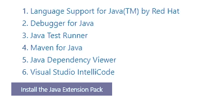
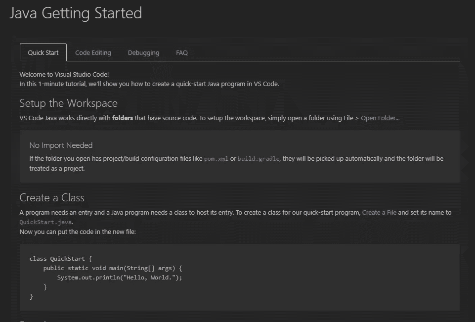
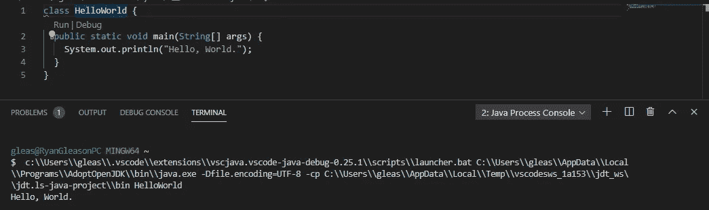

# 我在 Visual Studio 代码中的 Java 设置

> 原文：<https://towardsdatascience.com/my-java-setup-in-visual-studio-code-62844abdb9cb?source=collection_archive---------25----------------------->

## 一本入门书，确保您拥有成功开发 Java 应用程序所需的工具


照片由[希特什·乔杜里](https://unsplash.com/@hiteshchoudhary?utm_source=unsplash&utm_medium=referral&utm_content=creditCopyText)在 [Unsplash](https://unsplash.com/s/photos/code?utm_source=unsplash&utm_medium=referral&utm_content=creditCopyText) 拍摄

# 目标

在设置好本地开发环境之后，启动一个简单的 Java 应用程序。

我们将尽可能保持简短。您将能够在不到五分钟的时间内在 VSCode 环境中启动并运行 Java 代码。

这些是我们将要安装的工具:

*   Visual Studio 代码
*   Java 开发工具包(JDK)
*   增强我们环境的 Java 扩展

我们开始吧！

# 下载 VS 代码

从 [Visual Studio 代码](https://code.visualstudio.com/)下载稳定版本。

这是一个非常简单的下载。微软在简化这个应用程序的安装过程方面做得很好。

# 下载 Visual Studio 代码 Java 包安装程序

这个过程已经自动化，你不会相信。

我们将导航到这个站点:[https://code.visualstudio.com/docs/languages/java](https://code.visualstudio.com/docs/languages/java)，然后向下滚动到你看到“下载 Visual Studio 代码 Java 包安装程序”的地方

这个安装程序将处理所有 Java 相关的包，这些包是您开始 Java 开发所必需的。



点击“安装”按钮，这将需要几秒钟来完成。

# 安装 Java 扩展包

一旦安装了 JDK，我们就可以安装扩展包了。这些工具将增强我们的项目。它增加了自动完成、依赖查看器、Maven 支持、调试器、测试运行器等功能。

在我们刚刚访问的 [VSCode 站点](https://code.visualstudio.com/docs/languages/java)上，向下滚动直到您看到以下内容:



点击**安装 Java 扩展包**按钮。

# 你好世界

成功安装此扩展包后，您将看到如下所示的屏幕:



我们将按照说明创建一个新文件。在这个文件中，我们将放入以下代码:

```
class HelloWorld {
  public static void main(String[] args) {
    System.out.println("Hello, World.");
  }
}
```

当您单击“运行”按钮(或按 F5)时，您应该会在控制台中看到以下输出:



注意:如果你在路上的任何地方有一个空格。例如，如果这是我的道路:`C:\Users\Ryan Gleason\Documents\…`

一个快速的解决方案是将您的默认终端切换到 Powershell。

键入`Ctrl + Shift + P`打开命令面板，输入**终端:选择默认 Shell** 并选择 Powershell 选项。

仅此而已。现在，您已经准备好在 VSCode 中使用 Java 构建一些令人惊叹的东西了！