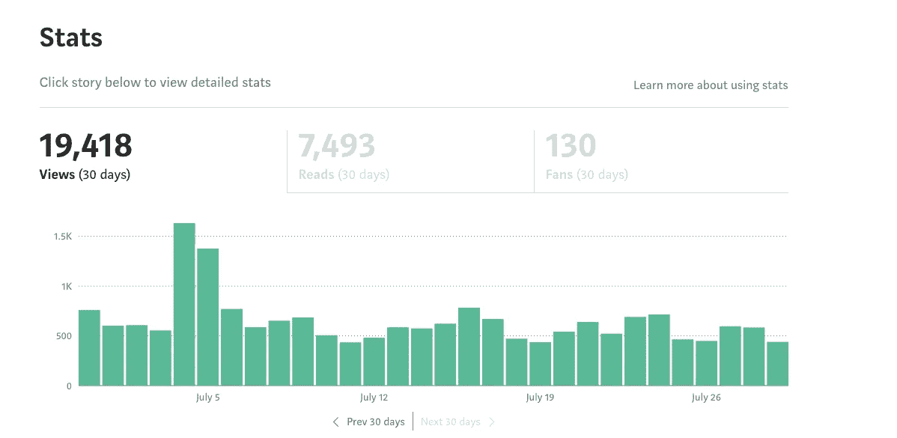

# 我的数据科学博客之旅

> 原文：<https://towardsdatascience.com/my-journey-as-a-data-science-blogger-d6fdf6d2a304?source=collection_archive---------34----------------------->

## 以及在媒体上写博客如何改变了我的长期职业前景。

图片来自 [Pixabay](https://pixabay.com/?utm_source=link-attribution&utm_medium=referral&utm_campaign=image&utm_content=1807515) 的 [Sasin Tipchai](https://pixabay.com/users/sasint-3639875/?utm_source=link-attribution&utm_medium=referral&utm_campaign=image&utm_content=1807515)

**简介**

我在 2019 年 10 月开始写关于数据科学和机器学习的博客。现在，10 个月过去了，我想与我的读者和其他考虑开始自己博客的数据科学家分享我的旅程。

在这 10 个月里，我没有靠我的博客谋生，也没有成为一个拥有大量追随者的数据科学影响者，但是，我写了几十篇文章，被媒体读者阅读了超过 18 万次。

更重要的是，通过分享我的知识，我学到了很多。

这一切是如何开始的？

**写博客前的时间**

2019 年 5 月，我开始在 Thinkful 数据科学训练营担任导师，这就是我如何发现 Medium 的。当我开始指导时，我从我的学生那里收到了很多关于许多数据科学和机器学习概念的额外资源的问题。原来很多时候我都有给他们推荐中等文章。

我注意到 Medium 涵盖了数据科学的不同主题，我发现这些文章对初学数据的科学家特别有用。这时候我才意识到，我自己大概也能写出这样的文章。此外，我每天都和学生打交道，所以我知道他们在纠结什么概念。

**第一篇博文**

我没有想太多，决定写我的第一篇文章。在此之前，我做了一个关于媒体写作的快速研究，并了解到我应该在我的文章中包含一些照片，并为出版物写作。

我在阅读媒体文章时最常用的出版物是关于数据科学的，所以我决定申请成为它们的作者。令人惊讶的是，他们接受了，我发表了我的第一篇文章:“[每个人都可以并且应该学习数据科学的 5 个理由](https://medium.com/p/c22e3bc96299?source=post_stats_page---------------------------)”。

同一天，我获得了 130 次浏览，第二天几乎达到了 500 次。也有一些喜欢的。对一些人来说，这些数字可能看起来不算高，但对我来说，这就足够了。人们在读我写的东西，我被吸引住了。

图片由 [8212733](https://pixabay.com/users/8212733-8212733/?utm_source=link-attribution&utm_medium=referral&utm_campaign=image&utm_content=3190829) 来自 [Pixabay](https://pixabay.com/?utm_source=link-attribution&utm_medium=referral&utm_campaign=image&utm_content=3190829)

**后续帖子**

在我的第一篇博文*‘成功’*之后，我继续写博客，写了更多关于数据科学的文章。在最初的几个月里，我想写就写，所以我最初的写作时间表有点不一致。有几个月我发表了六篇文章，也有几个月我一篇也没发表。

在过去的几个月里，我决定写博客应该成为我的数据科学家日常生活的一部分。最初的几个月告诉我，我喜欢与他人分享我的知识，我的职业生涯应该朝着包括这一点的方向改变。

这是我开始更经常写博客的时候。我目前试图每周写一篇关于机器学习或数据科学的文章。

**中等和统计**

每周写几个小时，我已经取得了以下中等统计数据(2020 年 7 月 29 日实际数据)。

**发表文章** : 28 篇

**关注人数** : 768 人

**总浏览量**:18 万以上

所有这些数字都令人鼓舞，而且还在继续增长。我希望交付高质量的内容将有助于我在接下来的几个月里增加我的受众。

**开自己的博客**

这个小小的成功启发了我，我创建了自己的博客:[aboutdatablog.com](https://www.aboutdatablog.com/)。我希望我的文章能让更多的人知道，包括那些不使用媒体的人。它还将允许我提供不同类型的内容，并对我发布的内容有更多的控制权。

**未来计划**

我目前的目标是每周在 Medium 和我的博客上发表一次高质量的文章。我没有很多我想联系的观点或追随者。我宁愿专注于写好质量的内容。

这是我到目前为止一直在做的事情，它对我来说似乎很有效。最后，我的文章在世界各地都有读者，我希望它们能帮助一些人应对数据科学挑战。

最终，我希望能够将这个小爱好变成一个更严肃的数据科学学习项目。甚至可能在未来创建一门数据科学相关的课程。

我对如今有这么多人想学习数据科学感到惊讶，我认为作为一个在该领域已经有一些经验的人，我应该能够帮助他们。

**给考虑创建自己博客的数据科学家的建议**

> 不要想它，只管去做！

可能你们中有很多人想开自己的博客，但却推迟了，因为他们认为现在还不是时候。

永远不会有*‘正确的时间*’，所以如果你想写博客，现在就开始写你的第一篇文章并发表。

Medium 让你开始写博客变得如此简单。你不需要自己的域名，也不用担心托管自己的网站。

**感谢纸条**

我只想留下一封简短的感谢信，感谢数据科学团队发表了我的第一篇媒体文章，从而让我开始了我的博客之旅。

如果没有媒体平台和数据科学出版物的支持，我不认为我有勇气创建自己的博客。

另外，感谢我所有的活跃读者到目前为止的评论和支持。

*原载于 aboutdatablog.com:* [我作为数据科学博主的旅程](https://www.aboutdatablog.com/post/my-journey-as-a-data-science-blogger)，*2020 年 7 月 30 日。*

*PS:我正在 Medium 和*[***aboutdatablog.com***](https://www.aboutdatablog.com/)*上撰写深入浅出地解释基本数据科学概念的文章。你可以订阅我的* [***邮件列表***](https://medium.com/subscribe/@konkiewicz.m) *在我每次写新文章的时候得到通知。如果你还不是中等会员，你可以在这里加入***。**

*下面还有一些你可能喜欢的帖子*

* [## 作为一名有抱负的数据科学家，你应该关注的中型作家

### 我最喜欢的 10 个数据科学博主，让你的学习之旅更轻松。

towardsdatascience.com](/medium-writers-you-should-follow-as-an-aspiring-data-scientist-13d5a7e6c5dc)  [## 熊猫概况和探索性数据分析的第一行代码！

### 了解如何为自动 EDA 安装和使用 pandas profiling

towardsdatascience.com](/pandas-profiling-and-exploratory-data-analysis-with-line-one-of-code-423111991e58)  [## Jupyter 笔记本自动完成

### 数据科学家的最佳生产力工具，如果您还没有使用它，您应该使用它…

towardsdatascience.com](/jupyter-notebook-autocompletion-f291008c66c)  [## 9 大 Jupyter 笔记本扩展

### 改进笔记本电脑功能，提高您的工作效率

towardsdatascience.com](/top-9-jupyter-notebook-extensions-7a5d30269bc8)*