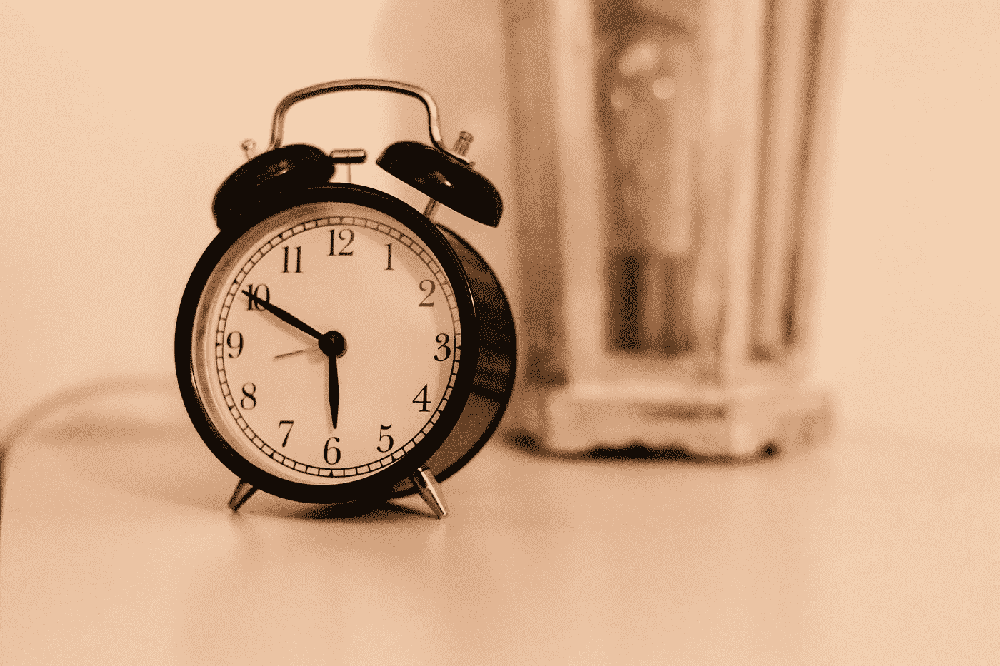
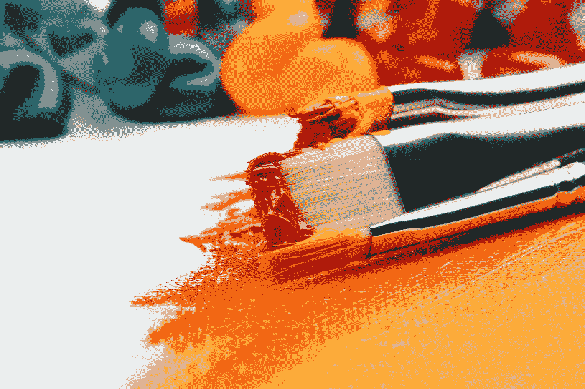
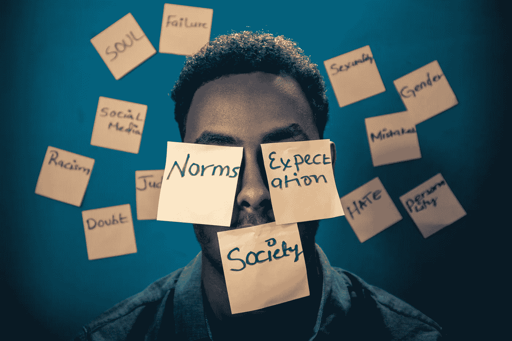

# 我作为数据科学家的旅程

> 原文：<https://towardsdatascience.com/my-journey-as-a-data-scientist-f59eafc6fe2d?source=collection_archive---------10----------------------->

## 我的数据科学之旅，以及这一切是如何开始的

由 [Unsplash](https://unsplash.com/s/photos/journey?utm_source=unsplash&utm_medium=referral&utm_content=creditCopyText) 上 [Mukuko 工作室](https://unsplash.com/@mukukostudio?utm_source=unsplash&utm_medium=referral&utm_content=creditCopyText)拍摄的照片

我第一次进入数据科学领域的时候是 16 岁。我依稀记得坐在我父亲的对面，他给了我一份职业选择清单。

大约一个小时后(*和他告诉我，攻读新闻专业学位是个糟糕的主意*)，我们选定了职业道路。

## **数据科学。**

那时候，我完全不知道自己会陷入什么样的境地。我是我所知道的技术最差的人，完全不知道任何与计算机相关的事情。

几天后，我报名参加了大学的计算机科学项目，并选择了数据科学专业。

时间过得很快，我轻松地度过了大学时光，心中完全没有最终目标。“我所要做的就是学习课本材料，每个学期都取得好成绩，”我想。“那我就能找到一份好工作了。”

## 叫醒电话？

[Julian Hochgesang](https://unsplash.com/@julianhochgesang?utm_source=unsplash&utm_medium=referral&utm_content=creditCopyText) 在 [Unsplash](https://unsplash.com/s/photos/wake-up?utm_source=unsplash&utm_medium=referral&utm_content=creditCopyText) 上拍摄的照片

当我意识到自己完全没有进入就业市场所需的技能时，我的警钟就敲响了。

这是和我的讲师的一次对话，他是我一生中第一次上编程课的老师。她的期望很高，对我来说更是如此——我从来没有安装过 IDE。

对于一个向完全新手教授这门课程的人来说，她的耐心相当少。当我正在努力运行一堆代码时，她说了一句让我至今难忘的话:

“ ***有些人就是做不到。”***

作为一名在班上总是名列前茅的学生，也是我所做的每一件事情中的佼佼者，我的讲师的话就像一块巨大的砖头一样击中了我。

她的话暗示我不适合编程，这不适合我。这是我一生中第一次有人对我说这样的话。她的话对我的自尊心是一个巨大的打击。

这真的让我想证明她是错的，因为我内心深处知道，如果我真的想学，我是有可能学会的。

我还意识到，不知道如何编码(只有理论上的 CS 知识)在未来试图找工作时不会有太大用处。

这意味着我必须学习，而且必须学得很快。

## 创建我自己的学习计划

照片由 [Siora 摄影](https://unsplash.com/@siora18?utm_source=unsplash&utm_medium=referral&utm_content=creditCopyText)在 [Unsplash](https://unsplash.com/s/photos/study?utm_source=unsplash&utm_medium=referral&utm_content=creditCopyText) 上拍摄

我决定，如果我要自学，我必须制定自己的教学大纲，从零开始学习。

我**从学习 Python** 开始，每天花大约 7-8 个小时在 LeetCode 和 HackerRank 等网站上编写代码。

我同时上了大学网络课程，自习的时候完全逃课。我会在手机上上课，然后学习我自己的材料。

我花在编码上的时间确实帮助我提高了技能，同时也提高了我的自信心。

我还参加了多门**在线课程**以获得**数据科学和分析**的基础知识，并且每天至少花 4 个小时学习数学和理论材料。

## 超越在线课程

Anna Kolosyuk 在 [Unsplash](https://unsplash.com/s/photos/art?utm_source=unsplash&utm_medium=referral&utm_content=creditCopyText) 上的照片

这条建议“*做你自己的数据科学项目，”*在互联网上到处都是。这正是我在获得该领域的基础知识后所做的。

我内心一直是一个创造者。

**事实上，我相信在他们的内心深处，每个人都是创造者。**

你一生中有多少新想法？轻松过千？

现在，这些想法中有多少是你真正付诸实施的？

我猜这个数字要小得多。

完成在线课程后，我已经参与了多个小项目。我也有开始自己的项目所需的编程背景。

所以我就这么做了。

我想出了新的项目想法和数据来分析。我通过我的 Jupyter 笔记本把这些想法变成了现实。

这件事花了我好几天的时间。基于一个想法创建项目不是一件容易的事情。有时候，我会半途而废，意识到这个项目不可能完成。

不管结果如何，我总是在创造。

作为一个热衷于讲故事和新闻的人，我把我的想法放在一起。我用笔围绕我的项目写了一些故事，并在互联网上发表。

一切都始于一个想法。我写的每个故事，我参与的每个项目。

我会像没有人阅读一样写作，像没有人观看一样创作。

## 克服自我怀疑

亚辛·优素福在 [Unsplash](https://unsplash.com/s/photos/doubt?utm_source=unsplash&utm_medium=referral&utm_content=creditCopyText) 上的照片

每次这个行业的新人来找我，通常都是关于项目的开始。

我最常被问到的问题是:“*我该如何开始？”*

我的回答:“*别问了。就开始吧。”*

将你的想法付诸实践。

也许这是个糟糕的主意。也许结局会很可怕，你得从头再来。

**但那又如何？**

每次你创造的东西没有按照你想要的方式运作，你就学到了东西。并重复。重新学习。

学习不是一个线性的过程，所以不要期望它是线性的。每一次犯错，你都会从中成长。

事实上，你会从错误和失败中学到比成功项目更多的东西。

**没人看我的作品怎么办？**

当我开始创建项目、讲故事和写作时，我完全是从零视角开始的。

没人看我的网站，没人看我的博客，没人看我的 Github 库。

但这并不重要。

我继续做我喜欢的事情，仅仅是因为我热爱它。

你努力工作的回报会到来，但你需要等待。做事情只是因为你喜欢，而不是因为你想获得利益。

## 结论

截至目前，我在数据科学领域同时学习和工作。

我每天醒来都兴奋地学习新事物，想出点子，创造新项目。

到目前为止，这是一个不可思议的旅程——它的开始是因为我决定克服恐惧，像没有人看一样创造。

> 创造的欲望是人类灵魂中最深切的渴望之一——老乌奇多夫