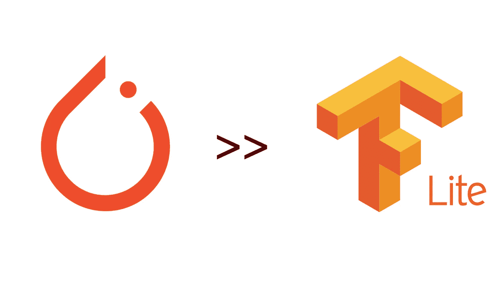

# 我将 PyTorch 转换为 TensorFlow Lite 的历程

> 原文：<https://towardsdatascience.com/my-journey-in-converting-pytorch-to-tensorflow-lite-d244376beed?source=collection_archive---------10----------------------->

## 有时候一个傻瓜要做一个傻瓜该做的事

摘自[维基媒体](https://commons.wikimedia.org/wiki/Main_Page)

# 介绍

我最近不得不将一个深度学习模型(一个 [MobileNetV2](https://paperswithcode.com/method/mobilenetv2) 变种)从 [PyTorch](https://pytorch.org/) 转换为 [TensorFlow Lite](https://www.tensorflow.org/lite) 。这是一个漫长而复杂的旅程，要经历很多磨难才能成功。我发现自己从 Stackoverflow 帖子和 GitHub 问题中收集了一些信息。我的目标是分享我的经历，试图帮助其他像我一样迷失的人。

> **免责声明:这不是关于如何正确进行转换的指南**。我只想分享我的经历。我可能做错了(特别是因为我没有 Tensorflow 的经验)。如果你注意到一些我可以做得更好/不同的地方，请评论，我会相应地更新帖子。

# 任务

将深度学习模型(一个 [MobileNetV2](https://paperswithcode.com/method/mobilenetv2) 变体)从 Pytorch 转换为 TensorFlow Lite。转换过程应该是:
py torch→ONNX→tensor flow→TF lite

# 试验

为了测试转换后的模型，生成了一组大约 1000 个输入张量，并为每个张量计算 PyTorch 模型的输出。该集合随后被用于测试每个转换的模型，通过在整个集合上的平均误差度量，将它们产生的输出与原始输出进行比较。平均误差反映了在相同的输入下，转换后的模型输出与原始 PyTorch 模型输出的差异。
我决定将平均误差小于 1e-6 的模型视为转换成功的模型。

可能还需要注意的是，我在张量中添加了批次维度，尽管它是 1。我这么做没有任何理由，除了我之前将 PyTorch 转换为 [DLC 模型](https://developer.qualcomm.com/docs/snpe/index.html)的经验所带来的直觉。

# 将 Pytorch 转换为 ONNX

这绝对是最简单的部分。主要感谢 PyTorch 上优秀的文档，比如这里的[这里的](https://pytorch.org/docs/stable/onnx.html)和[这里的](https://pytorch.org/tutorials/advanced/super_resolution_with_onnxruntime.html)。

要求:

*   ONNX ==1.7.0
*   PyTorch ==1.5.1。

Pytorch 至 ONNX 转换

新创建的 ONNX 模型在我的示例输入上进行了测试，平均误差为 1.39e-06。

注意，为了在 ONNX 模型中运行它，您必须将`torch.tensor`示例转换成它们的对等示例`np.array`。

# 将 ONNX 转换为张量流

现在我有了我的 ONNX 模型，我使用[ONNX-tensorflow](https://github.com/onnx/onnx-tensorflow)([v 1 . 6 . 0](https://github.com/onnx/onnx-tensorflow/releases/tag/v1.6.0))库来转换到 tensor flow。我没有使用 Tensorflow 的经验，所以我知道这是事情变得具有挑战性的地方。

要求:

*   tensor flow = = 2 . 2 . 0(onnx-tensor flow 的先决条件。然而，它对我的 tf-nightly build `2.4.0-dev20200923`也有效
*   张量流-附加项==0.11.2
*   [onnx-tensor flow](https://github.com/onnx/onnx-tensorflow)= =[1 . 6 . 0](https://github.com/onnx/onnx-tensorflow/releases/tag/v1.6.0)

我不知道确切的原因，但这种转换只在 GPU 机器上对我有效。

ONNX 到张量流转换

我在创建的 TensorflowRep 对象上运行了我的测试(用它进行推理的例子[在这里](https://github.com/onnx/onnx-tensorflow/tree/master/example))。运行**非常慢**(大约 1 小时而不是几秒钟！)所以让我很担心。然而，最终，测试产生了 6.29e-07 的平均误差，所以我决定继续前进。

此时最大的问题是——出口了什么？这个`.pb`文件是什么？在网上做了一番调查后，我意识到这是一个`[tf.Graph](https://www.tensorflow.org/api_docs/python/tf/Graph)`的例子。现在 ***剩下的*** 要做的就是把它转换成 TensorFlow Lite。

# 将 TensorFlow 转换为 TensorFlow Lite

对我来说，这就是事情变得非常棘手的地方。据我所知， [Tensorflow 提供了 3 种将 TF 转换为 TFLite 的方法](https://www.tensorflow.org/lite/convert) : SavedModel、Keras 和 concrete functions。我对这些选项不太熟悉，但是我已经知道 onnx-tensorflow 工具导出的是一个冻结的图形，所以这三个选项对我都没有帮助:(

在网上探索了一段时间后，[这个家伙](https://stackoverflow.com/questions/53182177/how-do-you-convert-a-onnx-to-tflite/58576060#58576060)基本上拯救了我的一天。原来在 Tensorflow `v1`中支持从冻结图转换！我决定对剩下的代码使用`v1` API。

当运行转换函数时，出现了一个奇怪的问题，它与`protobuf`库有关。按照这个用户的建议，我能够继续前进。

TF 冻结图形到 TFLite

您可能会认为，在经历了所有这些麻烦之后，在新创建的`tflite`模型上运行[推理](https://www.tensorflow.org/lite/guide/inference#load_and_run_a_model_in_python)可以平静地完成。但是我的麻烦并没有就此结束，更多的问题出现了。

其中一个与名为“ [ops](https://www.tensorflow.org/lite/guide/ops_compatibility) ”(带有“`ops that can be supported by the flex.`”的错误消息)的东西有关。经过一番挖掘，我意识到我的模型架构需要在转换之前[显式启用一些操作符](https://www.tensorflow.org/lite/guide/ops_select)(见上文)。

然后，原来我的网络使用的很多操作还在开发中，所以当时运行的 TensorFlow 版本(2.2.0)无法识别它们。这是通过安装 [Tensorflow 的夜间构建](https://pypi.org/project/tf-nightly/)，特别是`tf-nightly==2.4.0.dev20299923`解决的。

我的另一个错误是“`The Conv2D op currently only supports the NHWC tensor format on the CPU. The op was given the format: NCHW`”。这在[这位用户评论](https://github.com/onnx/onnx-tensorflow/issues/535#issuecomment-683366977)的帮助下解决了。

最终，这是用于测试的推理代码—

TFLite 推理

测试的平均误差为 2.66-0.7

我希望我的经验对你有用，祝你好运！

# 相关链接

**官方文件:**

*   [https://pytorch.org/docs/stable/onnx.html](https://pytorch.org/docs/stable/onnx.html)
*   [https://py torch . org/tutorials/advanced/super _ resolution _ with _ onnx runtime . html](https://pytorch.org/tutorials/advanced/super_resolution_with_onnxruntime.html)
*   https://github.com/microsoft/onnxruntime
*   【https://github.com/onnx/tutorials 
*   [https://www.tensorflow.org/lite/guide/ops_compatibility](https://www.tensorflow.org/lite/guide/ops_compatibility)
*   [https://www.tensorflow.org/lite/guide/ops_select](https://www.tensorflow.org/lite/guide/ops_select)
*   [https://www . tensor flow . org/lite/guide/inference # load _ and _ run _ a _ model _ in _ python](https://www.tensorflow.org/lite/guide/inference#load_and_run_a_model_in_python)

**问题和堆栈溢出**

*   [https://stack overflow . com/questions/53182177/how-do-you-convert-a-onnx-to-TF lite/58576060](https://stackoverflow.com/questions/53182177/how-do-you-convert-a-onnx-to-tflite/58576060)
*   [*https://stack overflow . com/questions/55475551/toco-from-protos-command-not-found*](https://stackoverflow.com/questions/55475551/toco-from-protos-command-not-found)
*   [https://github . com/onnx/onnx-tensor flow/issues/535 # issue comment-683366977](https://github.com/onnx/onnx-tensorflow/issues/535#issuecomment-683366977)
*   [https://github.com/tensorflow/tensorflow/issues/41012](https://github.com/tensorflow/tensorflow/issues/41012)