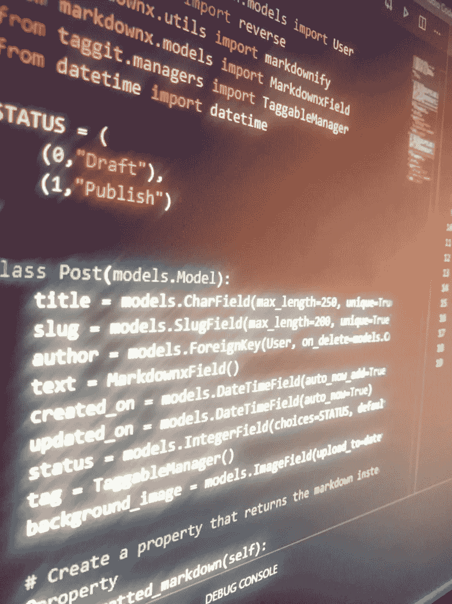

# 我的数据之旅

> 原文：<https://towardsdatascience.com/my-journey-into-data-41c3edfdc952?source=collection_archive---------67----------------------->

## 我进入数据世界的道路以及在此过程中我学到的一些经验。

我在雅典耀大学学习计算机科学，并获得了数据科学和分析的专业学位。在那里，我学会了如何编码和如何管理软件项目。我在 RideWave 得到了一份数据分析师的实习工作，这是一家提供上下班班车的初创公司。我写了一篇关于推特用户行为模式的论文并毕业了。我加入了第一圈数据团队，这就是我的旅程。嗯，我撒谎了；事实上并没有那么简单。旅程远非直线。

三年前，如果你问我数据工作是什么样的，我可能会从谷歌或其他人的媒体文章中给你一些一般性的答案，甚至可能是茫然的凝视。两年多以前，我甚至不确定自己是否想从事数据方面的职业。我从来没有想过我会在这个位置上和那些可能比我年长几岁的人谈论我的数据工作之旅，最好的方式就是告诉你我学到的东西以及我是如何学到的。

那么让我们回到我所说的我进入数据之旅的开始，我在计算机科学的第二年快结束的时候，这通常是大多数人最终决定他们是要留下来还是离开这个项目并追求另一个学位的时候。那时，我已经决定留在这个项目中，但我必须找到答案的一个问题是，我是否要专攻，以及我要专攻什么。唯一让我感兴趣的项目是数据科学和分析。

这是我在课堂上。老实说，我绝对不是最好的学生之一。

回想起来，这引发了一连串的事件，因为它为我打开了可能性的领域；作为一个并不特别喜欢软件工程或网络开发的人，这是计算机系的人可能会走的路。我开始学习数据库、计算机模拟、社会计算和基于代理的建模课程。

与此同时，我也开始加入围绕数据使用的黑客马拉松，并在 Kaggle 数据集上进行实验，试图弄清楚数据科学是否适合我，并尽可能多地学习相关知识。Kaggle 和黑客马拉松教会了我机器学习算法，或者至少让我了解了他们做了什么，以及如何实现它们。

**关键要点**:学校和在线课程对于学习基础知识非常有用。学习是结构化的，我接触了一堆不同的东西，尽管只是表面的。学校让我接触到了网络、容器化、一般编程实践和软件开发实践的基础知识。

快进到第四年年初，我在 RideWave 实习，这是一家早期创业公司，旨在为人们提供每天上下班的方式。

最初，我们在 Google Sheets 上工作和存放数据库，但这严重缺乏我们需要的能力。每张表格都要花几分钟来加载，要么这样，要么 Google Sheets 本身就会崩溃。因此，我和我的合作实习生开始为一个专用数据库的实施做一个案例，这花了我们很长时间，因为我们的经理有太多的问题。

我还开始学习如何使用 Twitter API 和谷歌地理位置 API 来使用 API，我们收集数据来了解对 Grab 和优步等拼车应用的看法，并试图将它们映射到位置，以了解我们可以扩展到哪里。

**关键要点**:我在这里学到的一件重要事情是，技能比工具更重要。理解数据存储和数据处理的核心概念可以教会你在不同工具之间转换的技能。学习 R 还是 Python 之间的争论总是很有趣，但是在现实中，如果你可以用这两种工具实现同样的事情，那么结果是一样的。了解工具是很好的，但只是在付诸行动之前。

之后，我回到学校，写论文，临近毕业时，我开始寻找可能的工作地点。我申请了很多不同的公司，他们的数据团队成熟度各不相同。有些显然已经建立，而另一些则处于起步阶段。甚至有些人正在寻找他们进入团队的第一份工作。

我收到了一些邀请，但是更多的拒绝或者其他的甚至没有给我回复。拒绝的次数可能至少是提议的两倍。回想起来，许多这样的拒绝可能是为了更好。甚至当时我梦想中的公司拒绝了我。我发现自己在面试一些公司，而我对这些公司的工作一点也不感兴趣。其他时候，我甚至去参加面试，但我对他们提供的角色并不感兴趣。

**关键要点**:我想指出的真正重要的一点是，你必须弄清楚你想做什么。如果可以的话，你想成为一名数据工程师、数据分析师或数据科学家，并与你未来的经理谈论这些吗？数据工作是一个完整的领域，很难同时兼顾这三个方面，所以你必须明白自己想要什么，看看公司提供的东西是否与此相符。

在我找工作的某个时候，我偶然在脸书集团的一个帖子上看到一个帖子，谈到这个数据团队正在招聘，该公司是一家旨在通过提供金融服务来为中小企业提供支持的初创公司。我看了看这份工作，然后申请了。只是想看看它会走向何方。与团队经理交谈，符合他们对角色的预期，参加测试，并参加面试。

老实说，通过与经理的第一次通话，我对这个团队很感兴趣。他很好地管理了期望，并且对这个角色需要什么很坦率。我仍然记得他在采访中表示的一件事是，最初的工作可能更多地是在工程方面，这一点我完全同意。

我去年 7 月开始在 First Circle 工作，参与了不同的项目，让我接触到业务的不同方面，以及不同背景的不同人。

我在团队中做的第一个项目是建立一个图形数据库。如果你在我写论文之前问我什么是 graph DB，我根本不知道你在说什么，我也不知道我们在讨论这个业务。我们本可以更好地向企业介绍它是什么以及随之而来的可能性。直接利益相关者应该从一开始就参与进来，这可能会使我们在新数据库上的工作协调一致。

我们试图更好地理解现实世界的关系，并描绘出网络效应。听起来很酷，对吧？曾经是，但有一件事是商业必须指导我们做什么和制造什么。不要误解我的意思，我仍然相信该项目会在未来带来更多令人惊叹的工作，但是如果我们将它与企业更具体的目标联系起来，影响会更直接。

另一方面，我从事这个小得多的工作，它在测试后立即被业务使用。这项工作只是试图实现一些信贷限额增长的解决方案，只是几行代码。这是因为从工作的第一天起，直接利益相关者就已经大量参与。事实上，他们提出了这个问题。我们一起试图弄清楚到底发生了什么以及为什么。然后，我们一起集思广益，寻找可能的解决方案。当实现的时候，涉众已经就需要什么样的解决方案达成了一致。

**关键要点**:业务影响是项目的重中之重。除非你和他们一起建立，否则业务中的人不会理解可能性，所以你必须沟通并理解他们来自哪里。一个数据人员应该深入业务，了解业务是什么以及它是如何工作的。

总的来说，数据工作或技术，甚至生活本身，如果我们是哲学的，肯定是关于不断学习。总会有新的工具和新的新颖算法需要学习和研究，但每个人都需要尽早弄清楚的最大问题是如何学习。