# 蒙特卡罗方法

> 原文：<https://towardsdatascience.com/my-journey-into-reinforcement-learning-part-4-monte-carlo-methods-2b14657b7032?source=collection_archive---------27----------------------->

## [强化学习之旅](https://towardsdatascience.com/tagged/a-journey-into-r-l)

## 使用机器学习来表示、探索和解决真实世界的场景。

欢迎来到我的强化学习研究的另一个章节。到目前为止，我们已经奠定了强化学习的基础，使用有限马尔可夫决策过程(MDP)来描述已知的环境。这一切都很好，直到我们遇到一种情况，环境的一切都不为人所知。这更有趣，因为它更真实，更接近真实生活环境(如果事情像 gridworld 一样简单就好了)。像往常一样，我会在这个博客的底部发布资源。让我们开始吧。

[第一部](https://medium.com/analytics-vidhya/my-journey-into-reinforcement-learning-part-1-dijkstras-algorithm-in-python-53408bc1c7c8) | [第二部](https://medium.com/@reubena.kavalov/my-journey-into-reinforcement-learning-part-2-markov-decision-processes-55ede33478f2) | [第三部](https://medium.com/@reubena.kavalov/my-journey-into-reinforcement-learning-part-3-dynamic-programming-3cb8a8d0815c)

**蒙特卡罗** (MC)方法不需要知道整个环境才能找到最佳行为。术语“蒙特卡罗”广泛用于任何包含显著随机成分的估计方法。在我们的例子中，他们所依赖的是*经验，即*状态、行动和奖励的重复序列，来自与环境的互动。我们将这些互动分成*集*，以便能够定义这些序列的开始和结束。我们可以使用上一篇博客中的相同概念来评估一项政策，但区别是关键:上一次我们是基于对 MDP 的了解来计算价值函数，而这次我们是从 MDP 的样本回报中学习价值函数。正如我们之前所做的，我们将从计算固定的任意策略π的值函数和动作-值函数开始，然后转向策略改进，然后转向控制问题及其通过一般策略迭代的解决方案。

回想一下，一个状态的价值是从该状态开始的预期累积未来贴现回报。根据经验来估计，我们可以简单地平均访问该州后观察到的回报。根据大数定律，当观察到许多回报时，平均值将最终收敛到期望值。现在，这个平均值既可以从第一次*访问*到特定状态获得，也可以从每次访问的*获得。这两种 MC 方法非常相似，但有细微的差别。先来看看初诊 MC 预测。*

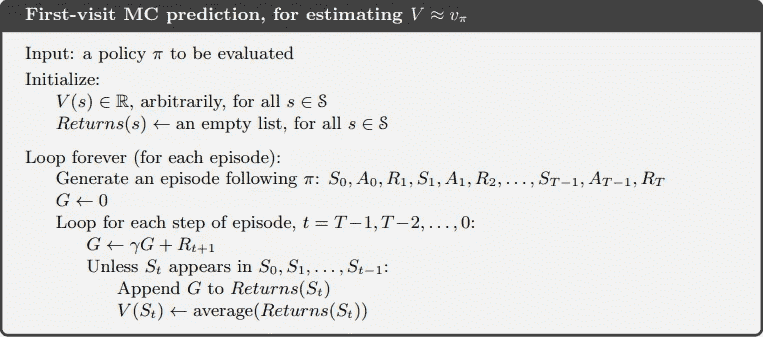

[http://incompleteideas.net/book/RLbook2018.pdf](http://incompleteideas.net/book/RLbook2018.pdf)

让我们用一个真实世界的情况来帮助实现这一点。21 点是一种大多数人都熟悉的纸牌游戏，并且简单易学。在每一轮开始时，玩家和庄家都发两张牌。直到回合结束，玩家只能看到一张庄家的牌。游戏的目标是让牌的价值尽可能高，但不超过 21。所有的面牌都算 10，一张 a 可以算 1 或者 11。玩家可以“打”，收到另一张牌，或“坚持”，停止接受牌，开始发牌。庄家按固定的策略出牌:他坚持任何 17 或以上的数目，否则就打。如果庄家“破产”，或超过 21，玩家获胜。否则，结果(赢、输或平)取决于谁更接近 21 岁。

一个重要的注意事项是，如果玩家持有一张可以算作 11 而不会破产的王牌，那么这张王牌被认为是*可用的*。在这种情况下，它总是被计为 11，因为计为 1 将使和等于或小于 11，这是玩家每次都应该碰到的。因此，玩家根据以下观察做出决定:他当前的总和(12–21)，庄家的出牌(a-10)，以及他是否有可用的 a。这总共有 200 种可能的状态。

我们可以认为这是一个插曲式的有限 MDP，每一轮都是一个插曲。赢、输、抽分别给予+1、-1、0 的奖励。一轮中的所有奖励都是零，这意味着这些最终奖励被视为回报:

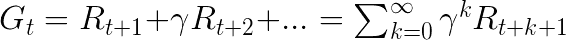

在我们的例子中，我们不贴现，所以 *γ = 1。*

假设我们有一个策略，如果玩家的和是 20 或 21，那么这个策略就有效，否则就无效。为了找到状态值函数，我们可以模拟许多遵循策略的游戏，并对每个状态的回报进行平均。

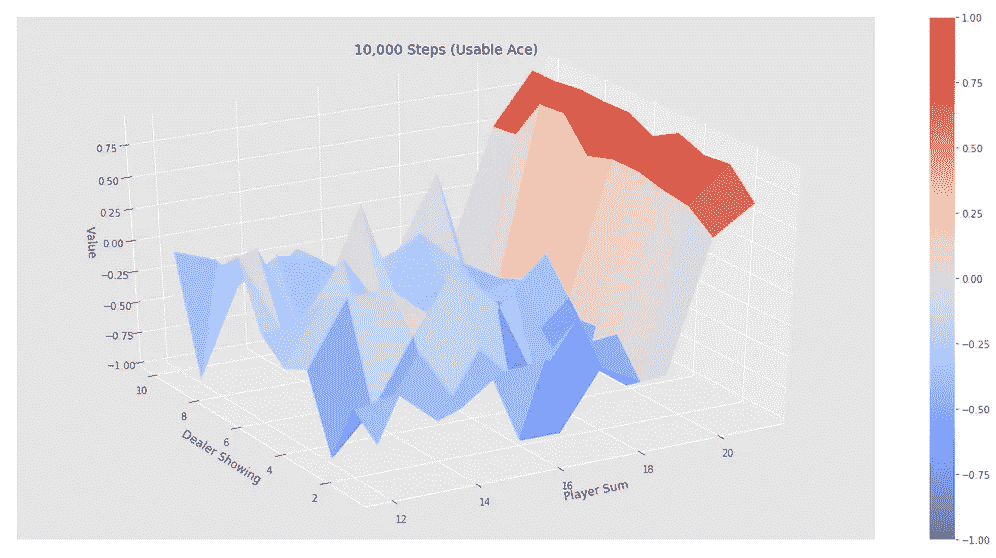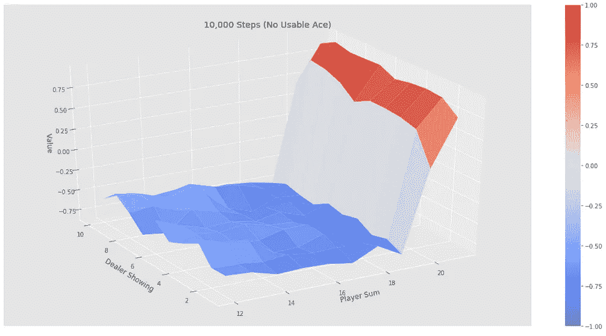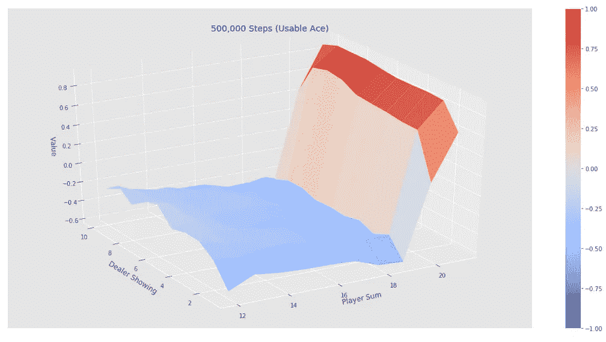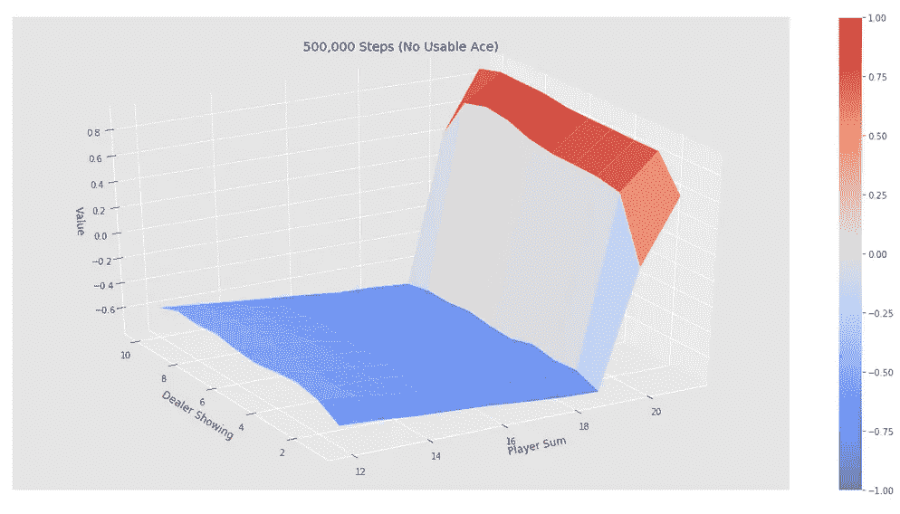

通过蒙特卡罗策略评估我们给定策略计算机的近似状态值函数

从上面的图表中可以看出，当玩家总数达到或超过 20 时，该值会大幅上升，随着玩的游戏越来越多，其他州的值会变平。有一个可用的 ace 是非常罕见的，所以需要更多的剧集来获得更准确的价值函数，如左边的图表所示。

现在让我们继续使用蒙特卡罗估计进行控制，或者近似最优策略。主要思想与动态编程相同:通用策略迭代(GPI)。策略评估完全如上所述进行，并且通过使策略相对于当前值函数(现在是动作值函数)变得贪婪来进行策略改进。当模型不可用时，就需要行动价值函数，因为我们需要估计每个行动的价值来提出政策建议。因此，我们着眼于估计 *q⁎* 。对于动作值函数 *q* ，对应的贪婪策略是选择具有最大动作值的动作的策略:

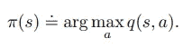

在 gridworld 中执行 GPI 时，我们使用了值迭代，在策略改进的每一步之间只迭代一次策略评估。对于蒙特卡罗策略迭代，每集后观察到的回报用于策略评估，然后在该集期间访问的所有州改进策略。

为了确保*探索*，蒙特卡洛中使用了两种方法:*政策内*方法和*政策外*方法。策略上的方法评估或改进用于制定决策的策略，策略外的方法评估或改进不同于用于生成数据的策略。在 on-policy 控制方法中，策略通常是*软*，这意味着对于所有状态和动作而言
*【π(a | s)】>0*，但是逐渐向确定性最优策略转变。我们接下来要看的 on-policy 方法将采用一个 *ε-greedy* 策略，这意味着我们将随机选择一个概率很小的动作 *ε* 。一项 *ε-greedy* 政策的美妙之处在于它的概念和实施是多么简单，以及它在保证我们取得进展，变得更好或与我们开始时的政策一样好时是多么有效。这被称为*政策改进定理*:

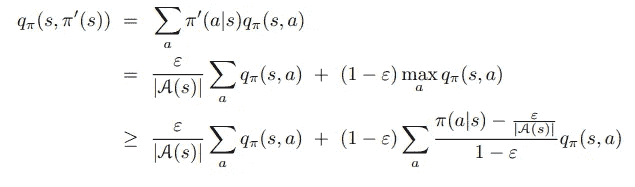

因此，事不宜迟，下面是一个基于策略的首次访问无模型蒙特卡罗控制算法的伪代码:

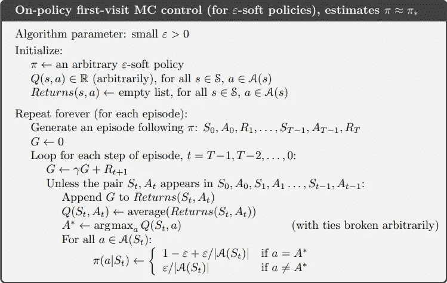

[http://incompleteideas.net/book/RLbook2018.pdf](http://incompleteideas.net/book/RLbook2018.pdf)

在将该算法实现到我们的 21 点环境中并模拟 500，000 集时，蒙特卡罗算法通过迭代更新的动作值函数为我们找到最优策略，这也收敛到最优；见下图。

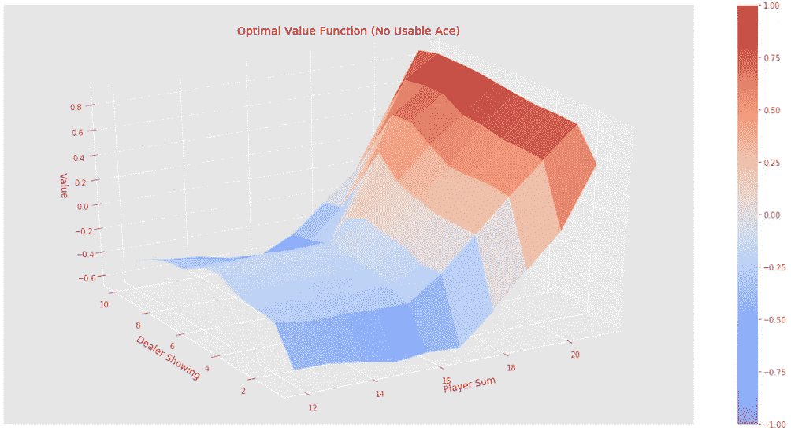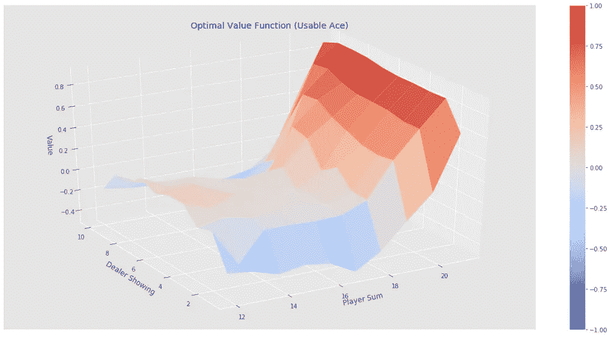

既然我们已经讨论了政策上的学习，让我们继续讨论政策外的学习。记住，这意味着我们评估一个*目标*策略 *π(a|s)* ，同时遵循一个单独的行为策略 *b(a|s)* 。代理采用这种学习方式有几个原因。一个是代理可以通过观察其他代理来学习，比如人类。代理可以观察一个人如何执行某项任务，并从该经验中学习/改进它。策略外学习的另一个非常重要的动机是，我们想要找到一个最优的、确定性的策略，它根本不探索，但是我们需要探索行为来找到它。通过非策略学习，我们可以在遵循一个策略的同时学习多个策略。

我们现在要学习的技术是*重要抽样*，这是一种在给定另一个样本的情况下估计一个分布的期望值的方法。我们通过获得*重要性抽样比率*将其应用于非策略学习，重要性抽样比率是根据它们在目标和行为策略下出现的轨迹的相对概率的加权回报。它可以表示为

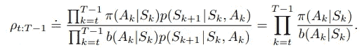

*p* 是状态转移概率函数。请注意，尽管这些概率通常是未知的(因为我们正在讨论一个未知的环境)，但它们的分子和分母是相同的，因此相互抵消。这一点很重要，因为这意味着重要性抽样比率仅依赖于两个策略和序列，而不依赖于 MDP。

所以，我们试图估计目标政策下的预期收益，但只有来自行为政策的收益 *Gₜ* ，这就有了错误的预期。通过引入重要性抽样比率，它将收益转换为正确的期望值:

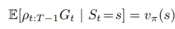

跨剧集边界对时间步长进行编号变得很方便，这意味着如果第一集在时间 10 结束，则下一集在 *t=11* 开始。也就是说，我们可以使用时间步数作为特定情节中特定步骤的参考。对于每次访问方法，我们可以将访问状态 *s* 的所有时间步长集合表示为 *T(s)* ，我们将在下面使用。对于首次访问方法， *T(s)* 将仅包括在剧集中首次访问 *s* 的时间步长。我们还将 *T(t)* 表示为时间 *t* 之后的第一次终止时间， *Gₜ* 表示从 *t* 到 *T(t)* 之后的返回。使用简单的平均值，重要性抽样通过按重要性抽样比率缩放回报并平均结果来估计价值函数:

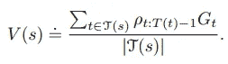

即*普通重要性抽样*，但以下练习将使用*加权重要性抽样*，它使用加权平均值:

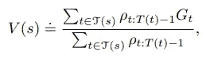

或者如果分母为零，则为零。这两种重要抽样的区别在于它们的偏差和方差。普通重要性抽样是无偏的，但通常具有无限的方差，在实践中，这种方差导致目标和行为策略努力寻找共同点。这就是为什么加权估计量通常是首选的原因。

那么，如果我们能够在一集接一集的基础上实现蒙特卡罗预测方法会怎么样呢？这叫做*增量实现*。我们通过平均回报来做到这一点，但对于非政策的加权重要性抽样方法，我们如何做到这一点呢？我们必须对收益进行加权平均。

如果我们有一个返回序列 *G₁* ， *G₂* ，…， *Gₙ₋₁* ，它们都从同一个州开始，并且每个都有一个相应的随机权重 *Wᵢ* ，我们希望估计

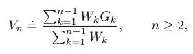

并在我们获得额外回报 *Gₙ* 时更新它。我们还必须维护每个州的第一个 *n 个*返回的权重的累计和 *Cₙ* 。 *Vₙ* 的更新规则是

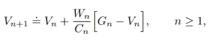

和

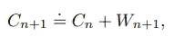

其中 *C₀* ≐ *0* 。

因此，这篇博客文章的最后伪代码显示了一种基于 GPI 和加权重要性抽样的非政策蒙特卡罗控制方法，估计了 *π⁎* 和 *q⁎* 。目标策略π是相对于 *Q* 的贪婪策略，行为策略 *b* 是*ε*——软保证每对状态和动作的返回次数无限次。即使根据策略 *b、*选择动作，策略π在所有遇到的状态下收敛到最优，策略*b、*b 可以在情节之间/情节内改变。

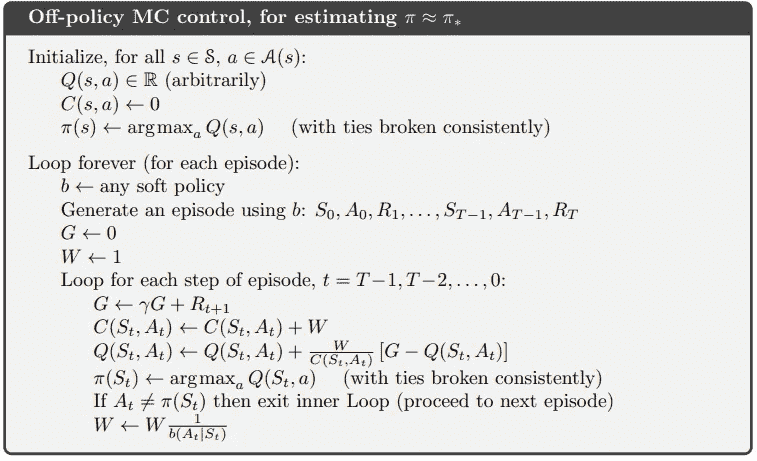

[http://incompleteideas.net/book/RLbook2018.pdf](http://incompleteideas.net/book/RLbook2018.pdf)

在将该算法应用于 21 点示例时，最优值函数的图表看起来当然与上面的相同，所以我不会再贴出来。这是蒙特卡罗方法中非常令人兴奋的 GPI，接下来我将使用*时间差异学习*以及 *Q 学习*来看预测和控制！

非常感谢你的阅读，我期待冒险继续。

> “我只得到这一个我们称之为生活的数据流”——大卫·西尔弗

# 资源

[**强化学习:简介**作者*萨顿和*巴尔托](http://incompleteideas.net/book/RLbook2018.pdf)

YouTube 上 David Silver 的 RL 课程

[强化学习 Github](https://github.com/dennybritz/reinforcement-learning)by*Denny britz*