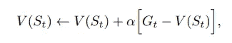
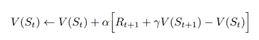
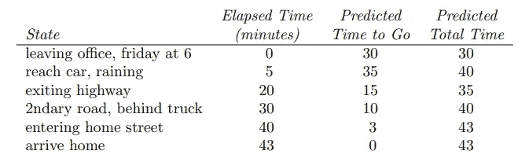
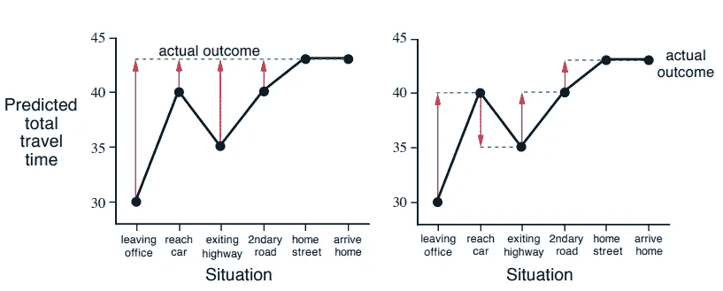
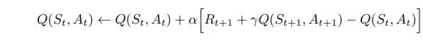
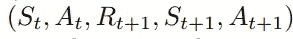
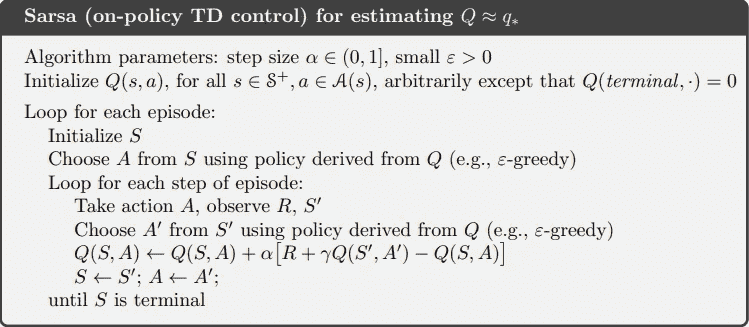
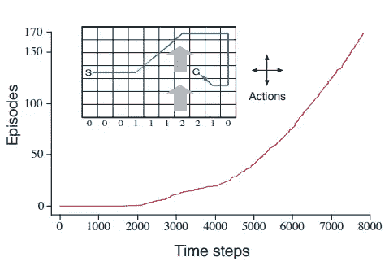

# 时差学习

> 原文：<https://towardsdatascience.com/my-journey-into-reinforcement-learning-part-5-temporal-difference-learning-d0cae79e850?source=collection_archive---------20----------------------->

## [强化学习之旅](https://towardsdatascience.com/tagged/a-journey-into-r-l)

## 通过经验引导优化价值函数。

欢迎来到我的强化学习研究的下一个激动人心的章节，在这一章中，我们将讨论时差学习。和往常一样，我会在文章底部链接到那些教导和指导我的资源。

在我的前两篇帖子中，我们谈到了*动态规划* (DP)和*蒙特卡洛* (MC)方法。时差学习是这两种思想在几个方面的结合。像 MC 一样，TD 直接从经历事件中学习，不需要环境模型。像 DP 一样，TD 学习可以从不完整的剧集中发生，利用一种叫做 *bootstrapping* 的方法来估计该剧集的剩余回报。基本上，它是对价值函数进行猜测，采取一些步骤，然后进行另一次猜测，朝着这个新的猜测更新我们的原始猜测。

其中 *Gₜ* 是返回，而 *α* 是恒定步长参数。我们查看估计值和回报之间的误差项，并在误差方向上更新我们的价值函数。TD 学习最简单的版本是 TD(0)或*一步 TD* ，在一步之后向估计收益更新价值函数。这个估计，就像贝尔曼方程一样，由两部分组成:直接回报加上下一步的贴现值。现在，我们可以用这个估计回报代替我们的真实回报 *Gₜ* ，得出一个估计的、有偏差的算法。

让我们用一个例子来看看 TD 方法是如何证明优于 MC 方法的。这个例子的想法是预测下班回家需要多长时间。这是状态、时间和预测的顺序。

我们如何根据经验的轨迹更新我们的价值函数？下面的可视化说明了 MC 和 TD 方法之间的区别。

蒙特卡罗(左)与时间差分(右)方法

在左边，我们看到 MC 方法推荐的改变。因为我们基于实际结果更新每个预测，所以我们必须等到最后，看到总时间用了 43 分钟，然后返回到那个时间更新每一步。有了 TD learning，如上图右侧所示，在每一步，迈出一步后，我们可以立即更新前一步。

TD 学习的一个主要优点是，它甚至在不知道最终结果的情况下也能学习。毕竟，一个代理完全有可能接收到不完整的序列，甚至在没有最终结果的连续环境中工作。

通过在我们的控制循环中用 TD 代替 MC，我们得到了强化学习中最著名的算法之一。这个想法叫做 *Sarsa* 。我们从 Q 值开始，将 Q 值稍微移向我们的 TD 目标，即奖励加上下一个状态的贴现 Q 值减去我们开始时的 Q 值。

Sarsa 使用五元组中的每个元素来描述从一个状态-动作对到下一个状态-动作对的转换。开始知道它的名字是从哪里来的了吗？

让我们看一下用于策略 TD 控制的 Sarsa 算法的伪代码:

http://incompleteideas.net/book/RLbook2018.pdf

为了实现这一点，我们来看一个可能很熟悉的例子，Windy Gridworld。Windy Gridworld 与我们在以前的帖子中了解并喜欢的 Gridworld 是一样的，但有一点不同:网格中间有一股侧风！

风的强度因柱子而异，由每根柱子下面的数字表示。强度表示采取行动后向上移动的单元格数量。例如，如果在目标右侧的单元格中，采取向左移动的动作会将您置于目标正上方的空间中。

需要注意的一件重要事情是，蒙特卡罗方法在这里可能不起作用，因为可能会找到一个策略，使代理停留在同一个空间，从而有效地使下一集永不结束。使用 Sarsa 让我们在插曲中了解到这样的政策是糟糕的，并将尝试其他的东西。

下一次，我将深入到非策略 TD 控制的 *Q-learning* 中，我们将独立于遵循的策略来逼近最优状态值函数，类似于非策略 MC 方法。非常感谢您的阅读，我期待着在这个迷人的机器学习子领域学到更多。

# 资源

[**强化学习:简介**作者*萨顿和*](http://incompleteideas.net/book/RLbook2018.pdf)

YouTube 上大卫·西尔弗的 RL 课程

[强化学习 Github](https://github.com/dennybritz/reinforcement-learning) 由 *dennybritz*