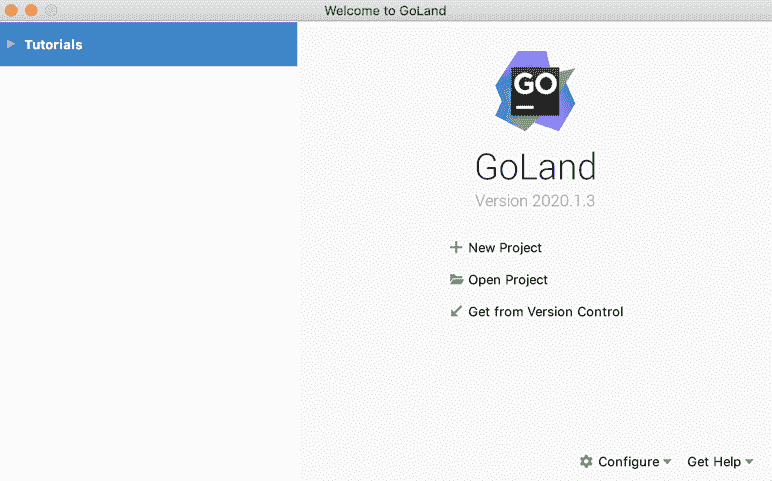

# 我加速 Python 的旅程:设置 GoLang 开发环境和基准测试

> 原文：<https://towardsdatascience.com/my-journey-to-speed-up-python-setting-up-a-golang-development-environment-and-benchmarking-f03c5252ef8f?source=collection_archive---------22----------------------->

我们的旅程从安装 GoLang 开始。我们用 **GoLang** IDE，以及一些相关的工具和软件包创建一个开发环境。接下来，我们列出了 19 个“免费”资源和 5 本“非免费”书籍来学习 GoLang 语言。最后**、**我们对**Python sk learn****k means**到 **GoLang kmeans** 实现**进行基准测试。**我们将一起确定 **GoLang kmeans** 实现是否有效，以及它是否比**Python sk learn****k means 更快。**


资料来源:联合国人类住区规划署

## 我过去的旅程(此部分可选)

> 开始学习机器学习，在 2011 年，用一种很棒的语言叫做 **R** 。我在机器学习的理论和实践方面进展顺利。我认为“进展良好”的感觉是相对于过去的四次“重组”而言的
> 
> 1.在我的第一个实验粒子物理职业生涯之后，我重新进入了人工智能领域。
> 
> 2.AI 1.0 的泡沫破灭 1985 年，我通过学习算法、C、C++、分布式计算，重新装备成了 IT(信息技术)架构师。
> 
> 3.我在 1993 年迷上了 **Oak** ，它后来在 1994 年被称为 **Java** 。我想，“这是一种用于 N 服务器分布式计算的语言。”我错了。原来是 **Scala** 。(IMHO，我很接近了。)我成了 [**CORBA**](https://en.wikipedia.org/wiki/Common_Object_Request_Broker_Architecture) 的拥护者，又一个泡沫破灭，这一阶段修图的最后部分。
> 
> 4.自然，从 1997 年到 2000 年 Web 1.0 泡沫破裂，下一次“重组”是学习然后建立网站。
> 
> 在 2012 年底，我开发了一个房地产应用程序，它可以改进邮件活动。我使用了一种叫做 **R** 的脚本语言，但是在钻研机器学习和深度学习的时候遇到了很多阻力。
> 
> 由于这种阻力，我在 2013 年底尝试了 **Python** ，并一直留在 **Python** ，因为我更深入地了解了机器学习，然后是深度学习，然后是[Nvidia](https://www.nvidia.com/)GPU，然后是云计算。

## **我的新目标**

我有一个问题，我想我与机器学习(ML)社区的很大一部分人都有这个问题。

我需要一种方法来加速我的 Python 机器学习解决方案，以便将其投入生产。

或者

Python 对于生产机器学习应用来说太慢了。我需要放弃 Python。

我决定做的是:

> 学习 **GoLang** 。
> 
> 它几乎和 C 一样快。它被宣传为易学，因为它有一个类似 C 的语法。对并发性有语言级别的支持。它是静态类型的，但也包括垃圾收集。
> 
> 这是值得注意的，因为它是在 Windows、Mac、Linux 和其他平台上。它支持新的多核架构。
> 
> **GoLang** 是[开源](https://github.com/golang/go)并且有一个不断增长的贡献者社区。
> 
> 对我来说，重要的是 **GOLang** 在 **Google** 的生产中使用了很多年。另外，我要求 **GOLang** 可以调用 **Python** 。我的基于 Python 的 ML 内核的包装器是我的快速生产运行时解决方案。

本文的其余部分是我建立 GoLang 开发环境的旅程。后面的文章详细介绍了如何使用 **GoLang** 和 **Python** 作为机器学习生产应用的双动力组合。

## 准备开始:设置您的 Go 开发环境

最好的开始方式是在源头:[https://golang.org](https://golang.org/)。

在这里，我下载了 *MacOS 10.14 的二进制发布安装程序*go 1 . 14 . 4 . Darwin-amd64 . pkg*。6.也有针对 Windows 和 Linux 的下载。*

我双击了驻留在我的**Mac** *下载*文件夹*中的 go . 1 . 14 . 4 . Darwin-amd64 . pkg*。*然后，我按照弹出的安装向导的指示进行操作。*

> *注: **Go** 安装需要所选目标磁盘上的 350 MB 空间。*
> 
> *注:根据您计算机上的安全设置，安装过程中可能会要求您输入密码。*
> 
> *注意:安装后，最后的操作是“将安装程序移到垃圾箱吗？”我点击了，是的。*

## *设置您的 GoLand IDE*

*我选择的 **Python** 交互式开发环境(IDE)是 **PyCharm** 。我欣赏的关于 **PyCharm** IDE 是它几乎完全自动化了我的 **Python** 开发管道，只需点击几下鼠标。*

*这种偏见导致我寻找 **GoCharm。**原来 **PyCharm** 背后的公司 **JetBrains** 称他们的**GoLang**IDE[GoLand](https://www.jetbrains.com/go/promo/?gclid=Cj0KCQjwirz3BRD_ARIsAImf7LOEQ5x2yGFTly0qE0bbx4WSl2eFhhryuyFNWASqj6TSU7p_r9v3nmMaAgPlEALw_wcB)**。***

*有一个方便的按钮可以下载 [**GoLand**](https://www.jetbrains.com/go/promo/?gclid=Cj0KCQjwirz3BRD_ARIsAImf7LOEQ5x2yGFTly0qE0bbx4WSl2eFhhryuyFNWASqj6TSU7p_r9v3nmMaAgPlEALw_wcB) 的安装。从下载中，我双击了驻留在我的**Mac** *下载*文件夹*中的 goland-2020.1.3dmg、。然后，我按照弹出的安装向导的指示进行操作。**

*安装过程中把图标 **GoLand** 放到我的工具栏里。我双击了 **GoLand 图标。***

**

*发射时的初始 **GoLand** 屏幕。瑞秋·科特曼的动画*

*接下来，我点击了`New Project:`*

**

*在戈兰创建第一个项目。瑞秋·科特曼的动画*

## *我的第一个围棋程序*

*你知道我的第一个 **GoLang** 节目是什么吗？*

```
*package main

import "fmt"

func main() {
   fmt.Printf("hello world")
}*
```

*如果你猜对了`Hello World`，你就对了！通过点击 **GoLand** 教程*“The hitchicker ' s Guide to GoLand”*，将`Hello World` 代码放入我的第一个项目 *awesomeProject1* 。*

> *注:我用的是 **GoLand 的社区版。***

*然后，我在 **GoLand 跑了`Hello World`。**有效！*

**

*运行“开始构建学习开始…”*

*我继续浏览剩下的**戈兰**教程，*“戈兰搭便车指南”*如果你一直在使用 **PyCharm** ，本教程是对 **GoLand 的快速介绍。***

*如果你对 PyCharm 不感兴趣，你可能想使用其他的 IDE。我可以推荐一下 **VSCode** ，另一个流行的多语言支持 IDE。*

*在下一部分，我列出了一些学习资源。我用过的。*

## *学习资源*

*当你开始学习一门新语言时，你必须有原始文档。然而，我建议你不要在这里开始学习..*

*[](https://golang.org/doc/) [## 证明文件

### Go 编程语言是一个开源项目，旨在提高程序员的工作效率。围棋富有表现力，简洁…

golang.org](https://golang.org/doc/) 

如果你想要五到十分钟的时间来学习 **GoLang** 或者现在需要一些话题，我推荐你

[](https://medium.com/rungo/go-introductory-tutorials-896aeda0fb8a) [## 转到入门教程

### 理解 Go 编程语言的教程列表，通过基本示例深入语言规范

medium.com](https://medium.com/rungo/go-introductory-tutorials-896aeda0fb8a) 

在“你必须拥有”的清单上应该有另外 12 种在网上可以免费获得的 **GoLang** 资源:

1.  [围棋之旅](https://tour.golang.org/welcome/1)；
2.  [学习围棋:面向各层次程序员的 30 大围棋教程](https://stackify.com/learn-go-tutorials/)；
3.  [Golang 教程系列](https://golangbot.com/learn-golang-series/)；
4.  [围棋教程和课程](https://hackr.io/tutorials/learn-golang)；
5.  [以身作则](https://gobyexample.com)；
6.  Gophercises；
7.  [围棋练习](https://exercism.io/tracks/go)；
8.  [围棋学习完全指南](https://www.calhoun.io/guide-to-go/)；
9.  [**必备围棋**](https://www.programming-books.io/essential/go/) 是一本关于围棋编程语言的免费书籍；
10.  [如何写 Go 代码？](https://golang.org/doc/code.html)
11.  [Go 并发模式](https://www.youtube.com/watch?v=f6kdp27TYZs)
12.  [边学边考](https://github.com/pityonline/learn-go-with-tests)

**GOLang** 包列表(进口！)可以在这里找到:

[](https://golang.org/pkg/) [## 包装

### 标准库▹这些包是 Go 项目的一部分，但是在主 Go 树之外。它们是在…下开发的

golang.org](https://golang.org/pkg/) 

另外，你可以在这里找到 **GOLang** 包:

[](https://devdocs.io/go/#subrepo) [## DevDocs

### Go 1.13 API 文档，包含即时搜索、离线支持、键盘快捷键、移动版本等。

devdocs.io](https://devdocs.io/go/#subrepo) 

> 这些包是 Go 项目的一部分，但是在主 Go 树之外。它们是在比 Go 内核更宽松的兼容性要求下开发的。用“[去拿](https://golang.org/cmd/go/#hdr-Download_and_install_packages_and_dependencies)安装它们。

我发现对机器学习有用的包:

1.  【https://github.com/pa-m/sklearn 
2.  [https://github.com/pa-m/randomkit](https://github.com/pa-m/randomkit)
3.  [https://github.com/pa-m/optimize](https://github.com/pa-m/optimize)

## 书籍(非免费)

1.  [围棋编程语言(Addison-Wesley 专业计算系列)](https://www.amazon.com/Programming-Language-Addison-Wesley-Professional-Computing/dp/0134190440/ref=sr_1_3?crid=2VLH1Z3AURG6N&dchild=1&keywords=golang+books&qid=1592664425&s=books&sprefix=Golang%2Ctools%2C141&sr=1-3)
2.  [精通 Go:使用网络库、并发性、机器学习和高级数据结构创建 Golang 产品应用，第二版](https://www.amazon.com/Mastering-production-applications-concurrency-structures/dp/1838559337/ref=sr_1_4?crid=2VLH1Z3AURG6N&dchild=1&keywords=golang+books&qid=1592664425&s=books&sprefix=Golang%2Ctools%2C141&sr=1-4)
3.  [练习:包括 70 种技术](https://www.amazon.com/Go-Practice-Techniques-Matt-Butcher/dp/1633430073/ref=sr_1_10?crid=2VLH1Z3AURG6N&dchild=1&keywords=golang+books&qid=1592664425&s=books&sprefix=Golang%2Ctools%2C141&sr=1-10)

# 表演

选择 **GoLang** 的两大原因是

1.  简单易学的语法
2.  比 **Python** 更快

就我所知 **C** ，第一个理由就满足了。我发现 **GOLang** 在基本构造上与 **C** 相似，有一点点 **Python** 的味道，以及并发中的新功能。

不知道 **GoLang、**作者的心态(我去查维基版。)，我的偏见让我相信 **GoLang** 是对 **C** 的重大改写，以适应分布式计算。

至于第二个原因，我查看了各种基准测试，结果显示 **GoLang** 比 **Python** 快 30 到 50 倍。

## 包和模块

我花了大约四个小时阅读 GoLang 的包和模块。然而，我需要做的是:

```
go get “github.com/pa-m/sklearn/base”
go get “github.com/pa-m/sklearn/cluster”
go get “github.com/pa-m/sklearn/dataset”
```

我认为 **GoLang** 已经发展到包可以归结为这些规则:

1.  全局变量是骆驼大小写的。它们是变量，从它的包中对外公开。
2.  Packages 是由`package <name>.`设置的文件顶部的名字。该文件中指定的所有函数和全局变量都在 package `<name>.`中
3.  你可以用命令`go get <URL-for-package-file>`将这个包加载到你 **GoLang** 环境(类似于`pip install <package-name>`)。
4.  您可以使用您的`package main`文件中的语句`import (<URL-for-package-file>)`访问`<package-name>`中的定义。

对集群例程 **kmeans** 的 **GoLang** 实现的调用结果是:

```
package main

import (
   "fmt"
   "github.com/pa-m/sklearn/cluster"
   "github.com/pa-m/sklearn/datasets"
   "time"
)

func main() {
   start := time.Now()
   _ = start
   kmeansBlobs()
   fmt.Printf("elapsed %s s\n", time.Since(start))
}

func kmeansBlobs(){
X,Y := datasets.MakeBlobs(&datasets.MakeBlobsConfig{
      NSamples: 10000,
      Centers: 10,
      ClusterStd: 0.5})
   kmeans := &cluster.KMeans{NClusters: 10}
   start := time.Now()
   _ = start
   kmeans.Fit(X, nil)
   kmeans.Predict(X, Y)
   fmt.Printf("elapsed %s s\n", time.Since(start))
}
```

另外，你可以浏览一下关于 **GoLang** 包和模块的内容，因为你很有希望使用**GoLang**。 **GoLand** 在 *run:* 上为您设置本地`GOROOT`和`GOPATH`


**GoLand**GoLang**kmeams-blogs . go 的运行**

## 基准

我们在 **Python** 和 **GoLang *kmeans*** 实现上执行基准测试。以上**给出了 **GoLang** 实现。**Python 的**实现就是 **:****

```
from sklearn.cluster import KMeans
def km():
    kmeans = KMeans(n_clusters=N_CLUSTERS)
    kmeans.fit(X)
    y_kmeans = kmeans.predict(X)
```

对于***k 均值*** 实现，聚类的点数( **n_p** )从`100`到`70,000`不等。


Python-sklearn-Kmeans 与 GoLang-Kmeans (Y=MS)对比表，X =点数。


Python-sklearn-Kmeans 对 GoLang-Kmeans (Y=MS)乘以 X =点数。

通过观察，我们观察到 **GoLang-kmeans** 实现上升为*[***O(n)，*** 而***Python-sk learn-k means****实现上升为 ***O(log(n))。****](https://en.wikipedia.org/wiki/Big_O_notation)*

***[**Python-sk learn-k means**](https://en.wikipedia.org/wiki/Big_O_notation)**[实现](https://en.wikipedia.org/wiki/Big_O_notation)使用**cy thon**callouts(**C**语言)对整体速度和特殊算法进行微调以实现[***O(log(n))***](https://en.wikipedia.org/wiki/Big_O_notation)***。********

****我很惊讶地看到 **GoLang-kmeans** 实现比 P **ython-sklearn-kmeans** 实现要快 N < 10，000 点。****

****我的好奇心被触发；你或我应该试试:****

1.  ****解释 **GoLang-kmeans** 实现和 **Python-sklearn-kmeans** 在低 N 个数据点时的速度结果。****
2.  ****使用[GPU](https://en.wikipedia.org/wiki/Graphics_processing_unit)有多容易？对性能有影响吗？****
3.  ****在没有性能增强的情况下， **Python-kmeans** 实现的速度有多快？****
4.  ****GoLang-kmeans 的实现会因为并发性的增强而加速吗？是 1/ ***O(n 核)*** *更快？*****

# ****结论****

****我喜欢我与 **GoLang** 和 **GoLand** 的生产力。我准备从社区升级到专业版 **GoLand。******

****我对 **GoLang** 和 **Python kmeans** 实现的速度并不感到惊讶。 **Python sklearn** 使用 **cython、**和`**log(N)**`算法进行了高度优化。****

****我预计其他领先的 **Python** 机器学习包从切换到 **GoLang** 中受益很少或根本没有。 **XGBoost** 在一个 **C++** 实现之上有一个 **Python** API，并且是并发的。 **Lightgbm** 给出与 **XGBoost** 相似的结果，并且通常比 **XGBoost** 更快。****

****我希望加速的地方是用 **GoLang** 代码替换围绕 ML 内核的 **Python** 无关预处理和后处理代码。****

****但是当有 GPU(加速)和云计算(可扩展性)和量子计算(在不久的将来大规模加速)的时候，为什么还要费心去加速 Python(T21)呢？)?****

****以下是我的推理。有一些现有的和未来的设备，比如几十亿部智能手机、无人机、电源插座( [IoT](https://en.wikipedia.org/wiki/Internet_of_things) )和其他设备，它们可能不想接入互联网，也不想拥有 GPU 也没有互联网接入(云)。****

****鉴于这种推理和 70 年的计算历史，对更快程序的需求一直存在，并且已经尝试了不同的方法。****

****如果说 **Python** 用 **C** 是为了更好的性能，那么或许 **GoLang** 可以用 **Python** 来交付生产机器学习**。******

## ****我旅程的下一步****

****我用 **Docker** 换 **Python** 。太棒了。 **GoLang** 版本多，包多。我想为不同的**戈朗**环境**一个码头工人**形象。****

******Python 2.x 到 Golan** **g** 有一个[翻译器。如果能找到一个 **Python 3.x 到 Golang 的翻译器就太酷了。**](https://github.com/google/grumpy)****

****我确定有办法从 **Python** 调用 **Golang** ，从 **Golang** 调用 **Python** 。我还需要安全的呼叫机制。****

******Python** 有开发工具，有持续集成/持续部署的自动化部署( [CI/CD](https://en.wikipedia.org/wiki/CI/CD) )。 **GoLang** 有什么开发工具？我们已经遇到了 **GoLand** ，一个全面的 IDE。****

****这里使用的所有代码都可以在[https://github.com/bcottman/GoApplication](https://github.com/bcottman/GoApplication)找到。****

****我希望这些博客“我的加速 Python 的旅程”对你的 **Python** 和 **GoLang** 编码和规划有用。我喜欢写它们。我更喜欢思考 Python 和 GoLang 可能的未来。请让我知道你对这些事情的想法。*****