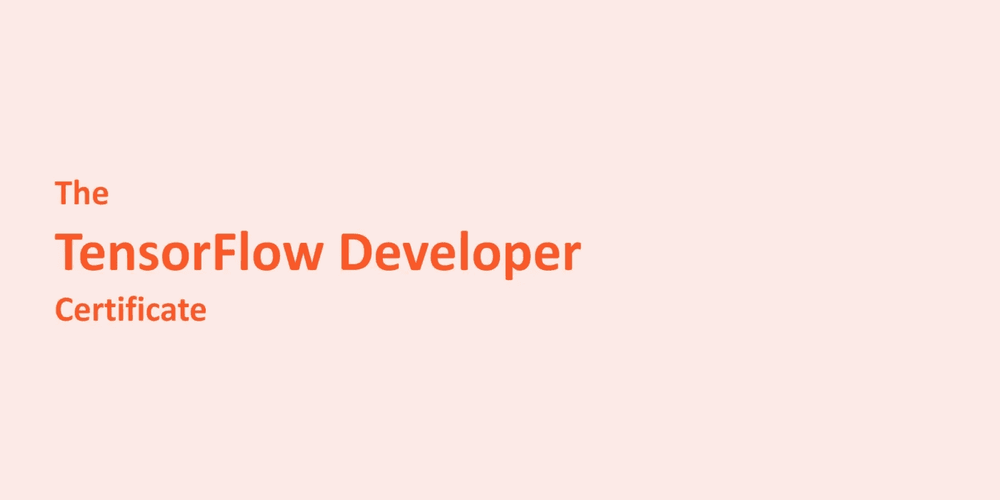
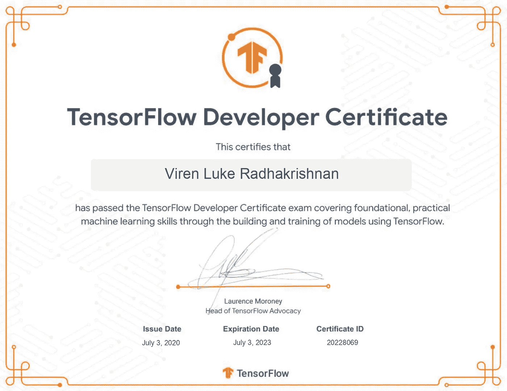
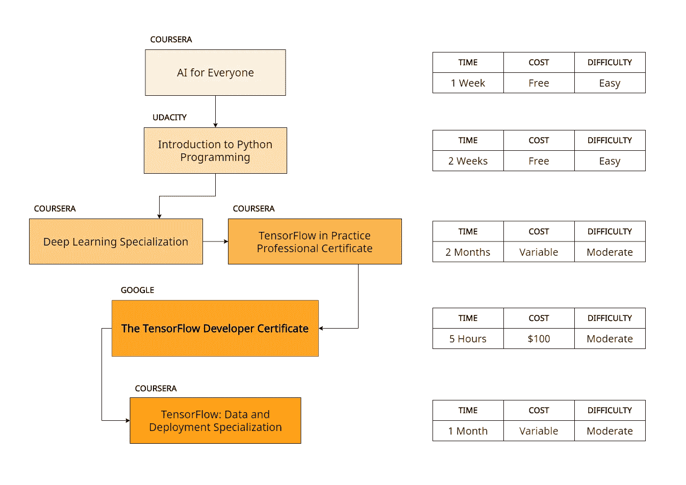

# TensorFlow 开发者证书

> 原文：<https://towardsdatascience.com/my-journey-with-ml-part-2-tensorflow-developer-certificate-c38882cbe1a6?source=collection_archive---------31----------------------->

## 我的曼梯·里之旅——第二/四部分

## TensorFlow 开发者证书——有用性、准备和时间承诺

作者图片

2020 年 3 月， [TensorFlow](https://www.tensorflow.org/) 团队发布了 [TensorFlow 开发者证书](https://www.tensorflow.org/certificate)。这一基础证书允许 ML 从业者证明他们拥有在入门级 ML 角色中取得成功所需的技能。对于外行来说，TensorFlow 是谷歌的一个开源机器学习框架。除了作为一个强大的数值计算软件，ML 开发人员和研究人员可以快速构建和部署生产级 ML 模型。

作者图片

在这个四部分系列的第二部分中，我将与你分享我的学习之路，这样你也可以从对 ML 一无所知开始，以在这个领域获得入门级工作的技能结束。我还将分享获得认证的优势，以及认证是否对你有用，是否值得你花费时间和金钱。

## 一张证书到底值多少钱？

关于证书在求职者的简历中是否有用，科技界存在激烈的争论。有些人认为他们完全没用，重要的是重大项目、美妙的实习经历以及在行业岗位上的成功历史。其他人认为，它们有助于证明申请人在该领域有一些经验，可以提高候选人的就业能力。我认为任何一方都没有错。

我相信证书确实有它的位置。以我的经验来看，获得某方面的认证总能为我打开机会之门。例如，我的大学委托我构建多个官方 App，并允许我在 2018 年创办移动应用开发俱乐部；在这方面，我已经成为谷歌认证的 Android 助理开发人员，这是一个巨大的信誉助推器。自从我获得 TensorFlow 开发者证书以来，我的 LinkedIn 个人资料获得了巨大的关注，各行各业的人都给我发消息，征求我的建议和意见。这个证书也为我的简历增添了精彩的一笔。这让我可以马上和招聘人员谈论一些事情。

我认为仅仅有证书就足够了吗？肯定不是。但如果我说获得认证并没有提高我的职业生活质量，那我就是在撒谎。你在想*是否适合你*？在这篇文章结束时，你将更好地准备做出决定。

## 你是视觉学习者吗？

科技领域的另一个激烈辩论是，是从教科书还是在线视频中学习。一些人认为没有什么能打败一本好的老式教科书的全面性和彻底性。其他人说，在线课程和视频提供了一种现代的、图形化的、个性化的学习材料消费方式。

我对此的看法很明确——我完全赞成后者。ML 概念倾向于用图形来最好地解释，因为它们涉及到大量的精神可视化来处理。例如，当通过丰富的动画演示时，我发现理解卷积滤波器如何在图像的像素上移动要比在静态教科书中容易得多，静态教科书将一切留给想象力。

此外，正如我在第一部分提到的，这个领域发展得太快了。虽然在线课程可能会定期更新，以反映最新的内容和趋势，但教科书可能会在发布几个月后就过时了。推而广之，今天市场上的大多数书籍可能已经过时，或者至少不包含最新和最更新的信息。

## “我不知道从哪里开始！”

我刚开始的时候也不知道。正如我在本系列的第一部分中提到的，有太多的资源可用，而关于选择的指导太少。然而，在经历了这个过程并做了我的研究之后，我写了这一节，所以我相信这条路对大多数初学者来说是最好的。

请注意，我绝不受任何人赞助或隶属于任何人；我在这里推荐的一切都来自我的研究和经验。此外，我对你在考试中的表现不负任何责任，按照下面的步骤操作需要你自担风险。

作者图片|保存到你的电脑。可能会帮你组织准备！

**第 0 步:学习人工智能**

当我开始我的旅程时，我跳过了这一步，后来我后悔了。请查看 Coursera 和 deeplearning.ai 的 [AI for Everyone](https://www.coursera.org/learn/ai-for-everyone) 课程。这个简单、非技术性的课程非常引人注目，让剩下的旅程更加顺畅。我后来选了这门课，但它应该是我事后做的第一件事。

**第一步:Python**

你习惯用 Python 编码吗？在开始之前，我对 Python 不熟悉，还有点害怕。来自 Java/C++的括号世界，不得不学习 Pythonic 式的做事方式的想法让我害怕。然而，我从 Udacity 开始使用 Python Nanodegree 进行人工智能编程，并感到非常自信(尽管需要一段时间来适应)。然而，我建议考虑 Udacity 的免费[Python 编程入门](https://www.udacity.com/course/introduction-to-python--ud1110)课程，因为它包含的内容与 Nanodegree 中的几乎相同。如果你心中有任何其他首选资源，请随意考虑。如果你熟悉 Python，你可以完全跳过这一步。

**第二步:深度学习基础**

我看到许多人犯的一个常见错误是，他们跳过这一步，直接进入下一步；因此，他们对欣赏深度学习所需的基本原理的理解很少甚至没有。我推荐 Coursera 和 deeplearning.ai 的[深度学习专业化](https://www.coursera.org/specializations/deep-learning)，培训师吴恩达是一位出色的讲师，他成功地将多年的经验提炼为单一的专业化。

在这门对初学者友好的课程中，你将学习到所有的理论概念(加上大量的实践实验)，这将为以后的一切打下基础。

**第三步:用 TensorFlow 应用深度学习**

拿 Coursera 和 deeplearning.ai 的 [TensorFlow in Practice 专业证书](https://www.coursera.org/professional-certificates/tensorflow-in-practice)(以前叫 TensorFlow in Practice Specialization)来说，这是 tensor flow 开发者证书页面官方推荐的资源。在这里，您将获得优秀、实用、真实的 TensorFlow 实践经验，并为通过考试做好充分准备。讲师劳伦斯·莫罗尼和吴恩达非常出色地讲述了这些内容，最终会让你充满自信。

该页面还列出了一个替代项目，来自 Udacity 的深度学习 TensorFlow 简介课程，但如果你打算在某个时候进行考试，我不建议你这样做。

**第四步:TensorFlow 开发者证书**

此时，你要做好充分的准备去参加考试；在接下来的章节中会有更多的介绍。

**第五步:一些更高级的话题**

这可能被看作是一个可选的步骤，但我推荐它。以 Coursera 和 deeplearning.ai 的[tensor flow:Data and Deployment Specialization](https://www.coursera.org/specializations/tensorflow-data-and-deployment)为例。该专业涵盖了一些特定的主题，其中一些可能与你不太相关(如在网络浏览器、移动设备和物联网设备上部署模型)，但包含某些部分(如构建数据管道和联合学习)，我不建议你错过。

## 那么，这需要什么呢？

*   **时间**——一般来说，我建议你为每个专业投入最多一个月的时间，每天大约 2 小时的学习时间。
*   **课程费用** -你可以选择*审核*课程，这样你就可以免费获得课程资料，但最终不会获得 Coursera 证书；或者花钱从事专业研究。在我看来，就你所得到的而言，这些费用是合理的。
*   **考试费用**——在撰写本文时，考试费用为 100 美元。你所得到的价格合理吗？我相信是这样的，但是你必须自己决定(在下一节中会有更多的介绍)。
*   奉献精神——很多。尤其是如果编程对你来说是新的。东西坏掉并停止工作，你可能会发现自己熬夜调试代码。软件的安装本身就是一个挑战。

**我的一些经验提示:**

*   多次阅读 [TensorFlow 考生手册](https://www.tensorflow.org/site-assets/downloads/marketing/cert/TF_Certificate_Candidate_Handbook.pdf)以熟悉考试。请注意，除了手册中提到的以外，关于考试本身的一切都是保密的。
*   我怎么强调这一点都不为过。如果你运行的是 Windows 10，**考试前暂停自动更新**。你需要做的最后一件事是，一旦你开始模型训练，你的计算机就开始运行后台更新！
*   考试前先熟悉一下 PyCharm。确保你对此感到满意。在上面运行一些代码，以确保一切按预期运行。

## 对你有什么好处？

首先，你会得到一张[证书和一枚](https://www.credential.net/a22b8a18-00dc-4187-986a-027a455e88e3)徽章。

你也会被添加到[认证目录](https://developers.google.com/certification/directory/tensorflow)。

你将有东西与招聘人员谈论，添加到你的简历，把你的电子邮件签名，并改善你的 LinkedIn 个人资料。你的技能将被验证为这个领域的入门级角色，你会对自己的进步充满信心。

但是，请注意，证书*本身*可能不足以帮助你脱颖而出；项目、实习和工作经验都是为了这个。此外，该证书在您收到后的三年内到期，您必须支付费用并重新认证才能保留该头衔。如果你是业内资深人士，这个认证可能对你没什么用。

如果你选择不参加这次考试，你可能会很高兴地知道，根据官方网站，未来将发布更多的高级认证考试。我呢，考完了，连一次都没后悔过。

我参加了另一个可能感兴趣的认证考试——谷歌云专业机器学习工程师考试。在这个系列的下一部分中会有更多的介绍！

◀ [*第一部:卑微的开始与艾*](https://medium.com/@virenlr/my-journey-with-ml-part-1-a-humble-beginning-with-ai-e01cc17cef01)

***第二部分:TensorFlow 开发者证书***

[*第三部分:云专业 ML 工程师*](https://medium.com/@virenlr/my-journey-with-ml-part-3-cloud-professional-ml-engineer-e600e3507b34)*【τ*

*[*第四部分:机器学习之旅*](https://medium.com/@virenlr/my-journey-with-ml-part-4-the-machine-learning-journey-9fac8b7b7dc3)*

*如果你喜欢你所读的，请分享这篇文章。订阅接收关于未来文章的通知。如果你有问题，建议，或者反馈，就在评论里讨论吧！*

*本文原载[此处](https://virenlr.com/2020/10/my-journey-with-ml-part-2-tensorflow-developer-certificate/)。*