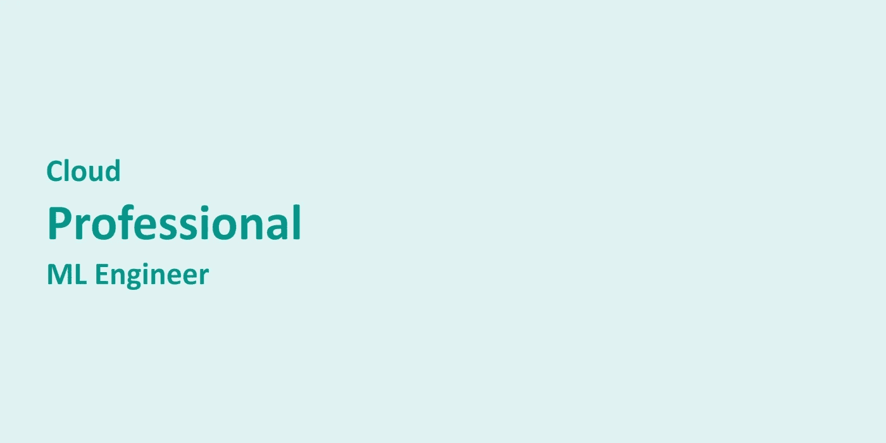
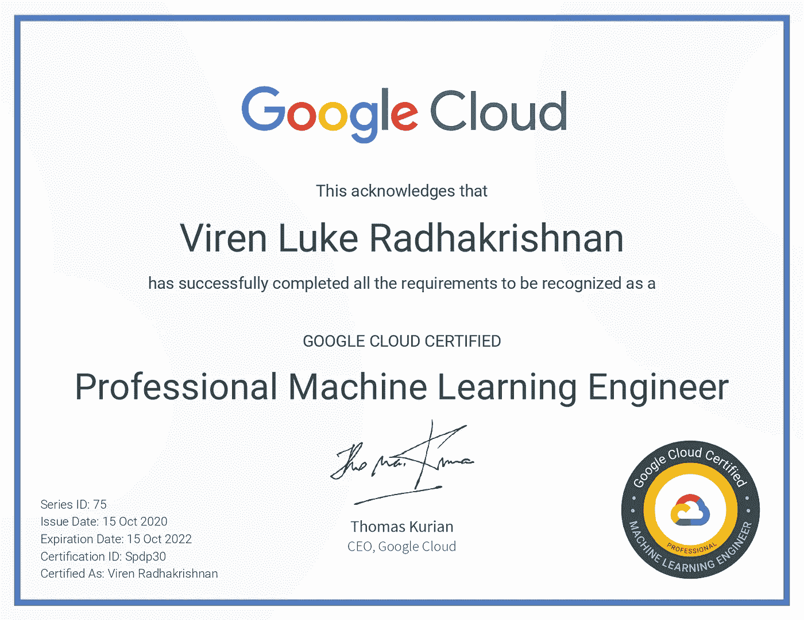
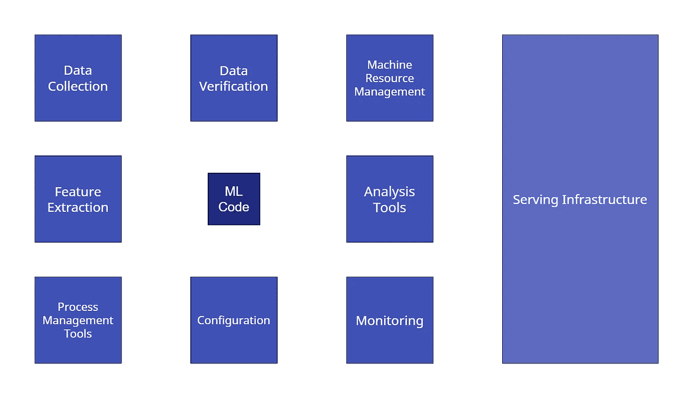
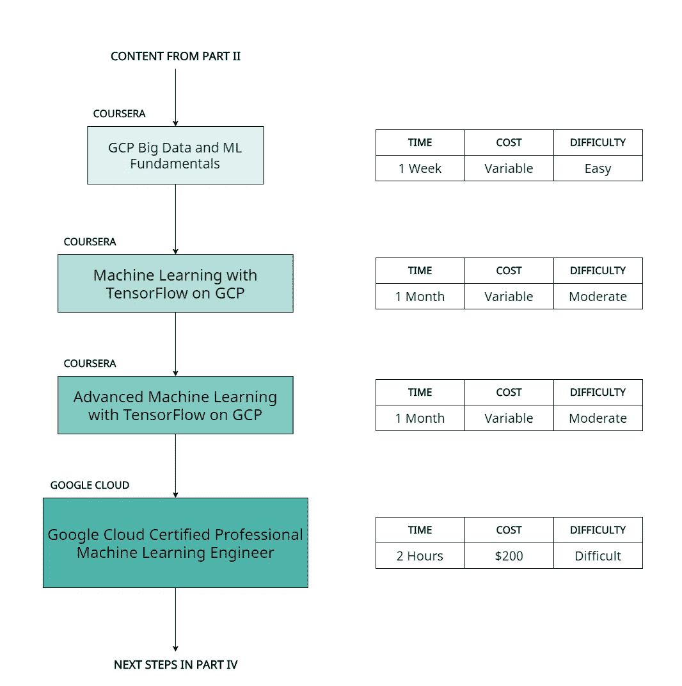

# 云专业 ML 工程师

> 原文：<https://towardsdatascience.com/my-journey-with-ml-part-3-cloud-professional-ml-engineer-e600e3507b34?source=collection_archive---------38----------------------->

## 我的曼梯·里之旅——第三/四部分

## ML 工程，以及谷歌云专业机器学习工程师考试

作者图片

谷歌云平台 (GCP)是谷歌提供的一套云服务，运行在支持谷歌应用的相同底层架构上。这些服务为客户(独立用户和组织)提供了对强大的基础架构、无服务器工具和企业级软件的访问，而安装和管理的开销时间最少。GCP 为微软的 Azure 和亚马逊的 AWS 平台提供了竞争。

虽然 GCP 有大量功能可以支持许多不同的工业应用，但我们关心的用例是人工智能。因此，我们将在本文中研究该平台提供的人工智能相关工具。

此外，谷歌云为开发人员、工程师和架构师提供了各种[认证途径](https://cloud.google.com/certification)，以展示他们在云上构建的能力。8 月，谷歌发布了云[专业机器学习工程师](https://cloud.google.com/certification/machine-learning-engineer) (PMLE)考试，测试模式，我参加了并成功通过。截止 2020 年 10 月 15 日，考试不再公测；即每个人都可以使用它。本文将涵盖考试准备、培训和认证的相关成本以及获得认证的利弊。

作者图片

虽然人们可以以项目的形式展示他们使用 TensorFlow 的技能，但在使用云时几乎不可能展示同样的能力；毕竟，一个人如何展示他们使用工具的能力？因此，我强烈建议你考虑参加这个考试，即使你可能并不想参加 TensorFlow 开发者证书考试。

## 开发者还是工程师？

根据 Google 的说法，[只有 5%的生产 ML 系统包含 ML 代码](https://developers.google.com/machine-learning/crash-course/production-ml-systems)。建立和训练一个模型是必不可少的，但是还有许多其他的过程组成了一个 ML 管道。这些可能包括但不限于数据收集、数据验证、特征提取、模型验证、模型部署和模型自动化。

作者图片|基于图片[此处](https://developers.google.com/machine-learning/crash-course/production-ml-systems)

如果到目前为止您已经阅读了本系列，那么您现在将会意识到 ML 不仅仅是构建一个 Keras 模型并在您的笔记本电脑上对其进行训练。

> 这就是做一个 ML 开发者和 ML 工程师的区别。

你不能称自己为 ML 工程师，除非你对 ML 管道中的每个阶段都了如指掌，而不仅仅是建模。这些技能很重要，因为如果没有人能使用它做任何事情，那么在你的笔记本电脑上有一个训练有素的 Keras 模型是没有用的。

## 谷歌云平台提供了什么

那么，GCP 提供了什么工具来缓解这些担忧呢？下面让我们来看看其中的一些，特别是从 ML 工程师的角度来看:

*   Google 云存储为您提供了存储大量结构化和非结构化数据的能力。
*   Pub/Sub 允许您让客户端(比如物联网设备)将数据发布到*主题*中，这些主题可以从其他 GCP 工具订阅和传输。
*   DataFlow 是 Apache Beam 的一个实现，它允许您在模型训练之前预处理批处理和流式数据，也可以用于对模型预测结果进行后处理。
*   DataPrep 为您提供了一种图形化可视化数据的方法，并在幕后使用数据流执行任何指定的转换。
*   BigQuery 让您能够针对大量结构化数据编写 SQL 查询，并从中快速学习模式。
*   AI 平台笔记本、作业和模型让你有能力快速实验、训练和部署模型(这是你现在必须非常熟悉的部分)。
*   KubeFlow Pipelines 作为 Kubernetes 上的一层实现，允许您编写可移植的、平台无关的 ML 代码，这些代码可以在任何地方运行和部署，包括您的笔记本电脑或不同的云提供商。
*   Cloud Composer 是 Apache Airflow 的一个实现，它为您提供了一种协调调度和编排所有其他 GCP 组件的方法。

GCP 还提供解决方案，让你不用写任何代码就能使用人工智能。这些允许你毫不费力地创建 ML 系统，它非常强大，但是可能没有你需要的定制功能。

GCP 最好的一点是整个生态系统是多么的统一。每个服务都可以很好地与其他服务协同工作，从而允许您在构建管道时轻松地将一系列服务串联起来。

## “我从哪里开始？”

考试的细节是完全保密的。下面的内容不是*暗示考试内容*，而是指导你学习成为一名成功的 ML 工程师所需的材料。这恰好是考试测试你的内容。

*请注意，我绝不受任何人赞助或隶属于任何人；我在这里推荐的一切都来自我的研究和经验。此外，我对你在考试中的表现不负任何责任，按照下面的步骤操作需要你自担风险。*

根据 PMLE 页面，该考试的推荐培训是 Coursera 的 [GCP 大数据和机器学习基础](https://www.coursera.org/learn/gcp-big-data-ml-fundamentals)课程，Coursera 的[机器学习与 TensorFlow on GCP](https://www.coursera.org/specializations/machine-learning-tensorflow-gcp) 专业化，以及 Coursera 的[高级机器学习与 TensorFlow on GCP](https://www.coursera.org/specializations/advanced-machine-learning-tensorflow-gcp) 专业化。

作者图片|保存到你的电脑。可能会帮你组织准备！

在撰写本文时，上述课程的部分内容已经过时。这些专业化最初于 2018 年发布，此后发生了很多变化。如果我的观察是正确的，它们将在未来的几个月/几年内被修改。在那之前，你需要知道的是:

*   如果您遵循了本系列前一部分中的学习路径，您可以**有效地跳过这些专门化**中的大部分张量流部分。他们使用 TensorFlow 1.x，我们目前使用 2.x，这改变了我们在 TensorFlow 中的许多做事方式。但是，您仍然必须彻底了解估计器，因为从今天起， [Keras 模型不支持分布式训练和 TFX](https://www.tensorflow.org/guide/estimator) (如果您听不懂我说的话，不要担心，一旦开始，您就会懂了)。
*   在*GCP*上用 TensorFlow 进行高级机器学习，可以完全避开第一门课；这只是对 GCP 上*用 TensorFlow 进行机器学习所涉及的课程的一个回顾。*
*   如果您遵循了本系列前一部分中的学习路径，在*GCP tensor flow 高级机器学习*中，您可以**跳过**第三个课程的大部分(仅完成第 2 周，从更深入更快，直到周末)，第四个课程的大部分(仅完成 AutoML 和 DialogFlow 部分)，以及第五个课程的大部分(仅完成第 1 周至因子分解方法和第 2 周的构建端到端推荐系统部分)。
*   请注意，这些专业中的许多实验已经过时，因此可以跳过。

然而，如果你想要 Coursera 的课程和专业证书，你不能跳过任何东西。

## “需要什么？”

1.  我建议你为每个专业准备一个月的预算，每天投入大约 2-3 个小时的学习。
2.  **课程费用-** 你可以选择旁听课程，这样你就可以免费获得课程资料，但最终不会获得 Coursera 证书；或者花钱从事专业研究。在我看来，就你所得到的而言，这些费用是合理的。
3.  **考试费用-** 考试的零售费用是 200 美元。你得到的价格合理吗？我相信是这样的，但是你必须自己决定(在下一节中会有更多的介绍)。
4.  **奉献-** 很多吧。并不是所有的事情都有很好的记录和解释。你可能会发现你的理解中有相当大的差距，这需要花很多个晚上来阅读。

## 为什么要经历这些？

你将获得一张[证书](https://www.credential.net/dbe05714-34b6-4ab0-8144-9a66d1800d65)，证明你有能力使用谷歌云产品构建有效的 ML 解决方案。

你还会被添加到 Google Cloud [证书持有者目录](https://googlecloudcertified.credential.net/?order=best_match%20DESC&groups=205299)。

你可以在这里和[这里](https://support.google.com/cloud-certification/answer/9908350?hl=en&ref_topic=9750300)阅读所有其他福利。

但是，请注意，证书*本身*可能不足以帮助你脱颖而出；项目、实习和工作经验都是为了这个。此外，该证书在您收到后的两年内到期，您必须付费并重新认证才能保留该头衔。值得吗？你现在有你需要决定的了。请注意，微软的 Azure 和亚马逊的 AWS 平台也提供类似的认证考试。

在这个系列的下一个也是最后一个部分，我们将看看为什么人工智能如此重要，如何利用它有所作为，以及它如何有时会令人沮丧。

[*第一部:一个卑微的开始与艾*](https://medium.com/@virenlr/my-journey-with-ml-part-1-a-humble-beginning-with-ai-e01cc17cef01)

◀ [*第二部分:TensorFlow 开发者证书*](https://medium.com/@virenlr/my-journey-with-ml-part-2-tensorflow-developer-certificate-c38882cbe1a6)

***第三部分:云专业 ML 工程师***

[*第四部分:机器学习之旅*](https://medium.com/@virenlr/my-journey-with-ml-part-4-the-machine-learning-journey-9fac8b7b7dc3)

如果你喜欢你所读的，请分享这篇文章。订阅接收关于未来文章的通知。如果你有问题，建议，或者反馈，就在评论里讨论吧！

本文原载[此处](https://virenlr.com/2020/10/my-journey-with-ml-part-3-cloud-professional-ml-engineer/)。