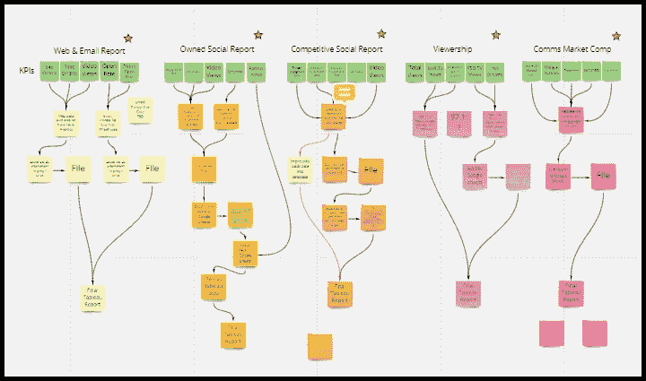
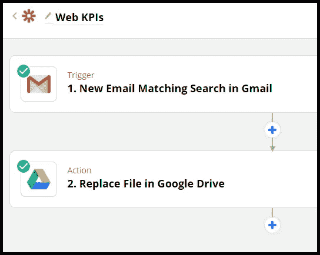
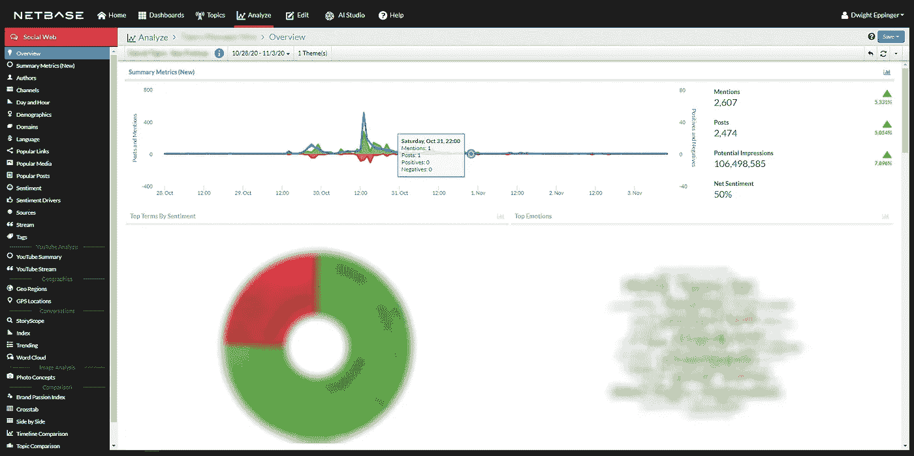

# 我的营销分析技术堆栈

> 原文：<https://towardsdatascience.com/my-marketing-analytics-tech-stack-37a6dc11edc7?source=collection_archive---------40----------------------->

## 寻找适合您业务的产品

*miro.com 流量(按作者)

我在一个有点有趣的地方。在 covid 疫情期间，我发现自己的角色发生了变化，从利用分析来增加收入，转变为专注于在我们的创意中、在我们的许多营销渠道中寻找见解，并通过少花钱或不花钱来实现这一点。我写这篇日记，也是为了与他人分享我发现的有用的东西。

谈到分析，我是自学的，或者更确切地说是通过互联网学习的。从我作为营销人员的早期开始，我就很幸运地为拥有丰富数据的公司工作。跨部门共享这些数据帮助我做出最佳、最明智的决策，以推动我们想要的结果。看到数据驱动的营销部门的力量，我开始专注于寻找更多的方法来做得更好。它始于创收渠道、电子邮件、付费数字和付费社交。由于目前缺乏广告支出，我一直专注于推动一些非收入驱动计划的洞察力。作为一个团队，我处理过程中的所有角色，数据收集，数据清理和可视化。我需要找到尽可能自动化的方法，以确保我可以不断更新我所创建的内容，并继续为团队构建更多内容。

在这里，我将向您介绍我们现有的解决方案、我选择它们的原因，以及一些如何使用它们的示例。

# 数据准备—表格准备

我为建立我们的社交媒体数据集的 Tableau 准备流程。

Tableau Prep 是一个非常强大的工具，它是我开始旅程的一个好地方。事实上，如果我有升级的平台，允许我通过 Tableau 服务器设置自动运行流，我会更多地使用它。但这目前不在预算中，所以我每天使用它来运行上述流程，该流程对来自 4 个社交媒体平台的数据进行标准化/合并，加上附加的情感数据和定制标签，以构建我们的社交媒体洞察仪表板。这是一个大电梯，大约需要 30 分钟处理。我们将在后面的文章中详细讨论该报告。

# 数据准备— Google 脚本

Google Scripts 是一个免费的工具，我用它来移动数据并同时清理数据。你需要对 javascript 有一个基本的了解，但是一旦你了解了，你就可以做任何事情。不是服务器端程序员我经常遇到的一个问题是自动化我编写的函数。Google Scripts 解决了这个问题，它允许我创建触发器来自动执行脚本。

# 数据准备/来源— Zapier

一个 Zap 寻找一封电子邮件，并自动保存附件到谷歌驱动器

从我有权获取报告的来源获取数据，但不在我管理的仓库或存储环境中，Zapier 对我帮助很大。最著名的是 Adobe Analytics。我目前使用 Zapier 从 Adobe Analytics 获取自动发送的报告，并将附件保存到 Google drive。

# 数据源—网络数据库

快速网络主题分析

我们使用 [Netbase](https://app.netbase.com/) 有两个目的。监控围绕我们品牌的对话，并将情感数据添加到我们自己的社交媒体帖子中。无论如何，这都不是一个便宜的工具，然而，我们公司跟踪谈话和情绪的目标使我们能够为购买做商业案例。通过连接到 API，我已经能够为每天更新的报告自动收集数据。

# 数据源— RapidAPI

我只是在刮 [RapidAPI](https://rapidapi.com/) 的表面。我的用例是从抖音收集见解。由于没有官方 API，我使用 RapidAPI + Google 脚本为我们的渠道和我们的竞争对手收集数据。

# 数据源/存储— Improvado

最初，当我创建社交媒体报告时，我从脸书& Twitter 本地导出数据，并使用 Netbase 导出 Instagram insights。这变成了一个乏味的日常过程，但是一旦我们能够证明报告的价值，我就能够让 Improvado 的支出得到批准，以自动化这个过程，并把我自己解放出来，致力于建立新的见解，而不是保持以前的见解与时俱进。

# 数据存储— Tableau 服务器

我使用 Tableau 服务器来存储与我们的 Tableau 准备流程相关的数据。当您使用 Tableau Prep 时，您实际上没有其他选择。

# 数据存储— Google Drive/Sheets

对于较小的数据集或构建概念证明时，我一直使用 Google Drive 和 Google Sheets 来存放数据。一些好处是，我可以与同事共享对文件的访问，我还可以使用 Zapier 将文件推送到这里，并使用 Google 脚本操纵这些文件。

# 数据存储—谷歌云 SQL

一旦我证明了数据集的价值，并确保它是干净的，并且处于最终形式，那么将它从 Google Sheet 转移到像 SQL 这样的真正数据库是有意义的。有很多方法可以选择，我使用的是 [Google Cloud SQL](https://console.cloud.google.com/sql) ,因为它可以通过 Google 脚本轻松访问和操作。另外，在承担任何费用之前，它给了我 300 美元的信用额度，以向公司展示价值。这是一个[很棒的视频](https://www.youtube.com/watch?v=VFE0Cbq581c)，它帮助我建立并更新了我的第一个谷歌云 SQL 数据库。

# 数据源—谷歌自然语言应用编程接口

我们总是希望为我们的内容创作者提供有价值的见解。我目前正在使用[谷歌自然语言 API](https://cloud.google.com/natural-language/?utm_source=google&utm_medium=cpc&utm_campaign=na-US-all-en-dr-bkws-all-all-trial-e-dr-1009135&utm_content=text-ad-none-any-DEV_c-CRE_291204615357-ADGP_Hybrid%20%7C%20AW%20SEM%20%7C%20BKWS%20%7C%20US%20%7C%20en%20%7C%20EXA%20~%20ML%2FAI%20~%20Natural%20Language%20~%20Google%20Natural%20Language-KWID_43700036257546994-kwd-475108780489&utm_term=KW_google%20natural%20language-ST_Google%20Natural%20Language&gclid=CjwKCAiAnIT9BRAmEiwANaoE1Y0YyZ-5ogdenr9rgtAkLlKnrCf1vse0LZehDbZ2EHlVXTNf0ARg2RoCD88QAvD_BwE) 来识别我们网站上文章中的实体。希望这将取代标记内容以创建片段的手动过程。你也可以用它来识别情绪。

# 数据可视化工具— Tableau

Tableau 是我们所有其他工作的终点。我通常会创建两种类型的报告。可以提供高级见解的高管级报告，可以通过电子邮件提供，无需登录；交互式报告，允许数据所有者挖掘自己的见解。

# **什么适合你？**

有大量的选择可供选择。花点时间确定适合您预算和需求的解决方案。此外，如果你在为一家负责任的企业工作，你必须先证明自己的价值，然后才能获得财政支持。随着您的成长，准备好多次构建和重建。这可能同时是一个令人愉快和疯狂的过程，只是不要忘记全程记录下来。