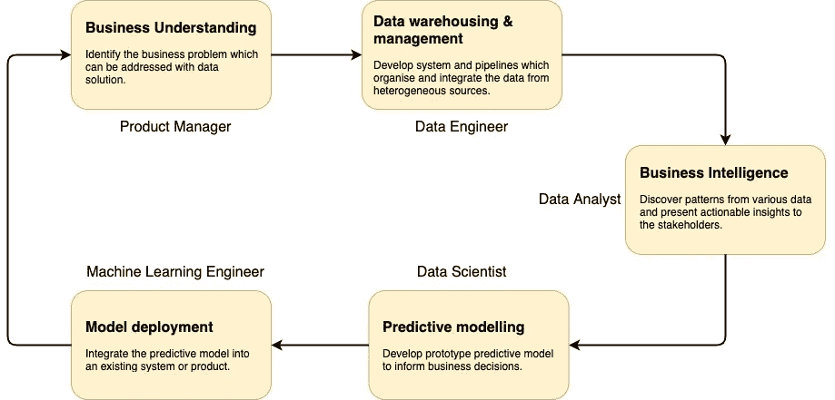
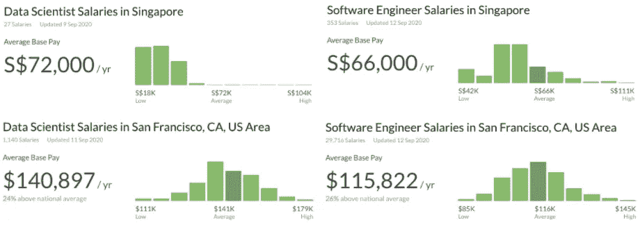

# 我对当前数据科学行业的观察和职业建议

> 原文：<https://towardsdatascience.com/my-observations-of-the-current-data-science-industry-and-career-advice-1fbe36cd6a83?source=collection_archive---------58----------------------->

## 大海的观点

我自己的简短简历。我是一名 1 岁的数据科学家，在新加坡工作。没有计算机科学或统计学学位，我花了 3 年时间追求数据科学的职业生涯，然后我得到了一份全职的 DS 工作。在这篇博客中，我想分享我对数据科学行业的理解，并给热衷于从事 ds 职业的朋友们一些建议。这里表达的观点代表我自己，是基于我的工作经验、社交网络以及我阅读的书籍和文章而给出的。

# 1.数据科学家的头衔正在经历一场“膨胀”。

由于近年来对人工智能和大数据的关注越来越多，越来越多的公司声称他们正在他们的产品中采用人工智能技术，并寻求雇用数据科学家。但是，一个公司是否需要很多数据科学家，“数据科学家”真的在做实际的数据科学工作吗？“科学家”的头衔听起来很好听，但大多数数据科学家的日常工作与实际的科学家相去甚远，例如在研究所从事前沿研究课题的统计学家和物理学家。因此，对于热衷于从事 ds 职业的朋友们，第一个建议是，不要被花哨的标题所迷惑。有必要了解 DS 的角色，选择最适合自己兴趣和实力的工作。

> 了解 DS 的生命周期，找到您的兴趣和优势

有几个朋友问我，数据科学家平时的日常工作是什么？被称为 21 世纪最性感的工作，数据科学家实际上不是一个独立的工作，而是需要各种角色之间的广泛合作。很好地理解典型 DS 生命周期中的不同角色非常有帮助。

图 1 典型的数据科学生命周期

图 1 给出了典型数据科学生命周期中的常见角色。一般来说，数据科学家的主要职责是开发具有适当算法和工具的机器学习模型，以解决特定的商业问题，如欺诈检测和需求预测。在下游，机器学习工程师将原型模型从笔记本带到生产中。以上所有的角色在一个 DS 项目中都是不可或缺的。在创业公司，有可能一个人需要承担多个角色。

以下博客详细介绍了不同项目阶段涉及的各种数据相关角色。

 [## 你是哪种类型的数据专家？

### 扩展数据科学领域的实地指南

towardsdatascience.com](/which-flavor-of-data-professional-are-you-5e01375584ce) 

# 2.不同公司的数据科学家的价值由他们带来的业务影响来衡量。

作为各种 IT 专业人士的新宠之一，数据科学家被认为具有超强的赚钱能力。然而，事实并非如此，至少在东南亚是如此。图 2 显示了新加坡和旧金山的数据科学家和软件工程师的平均年薪对比。

图 2 数据科学家和软件工程师的薪资对比

新加坡数据科学家和软件工程师的薪酬差距比旧金山小得多。这表明 SEA 中的 DS 产业还不成熟。大多数中小企业不能理解 DS 和 ML 技术的能力。他们不知道 DS 功能可以实现什么，也不知道如何建立 DS 员工队伍。

对薪酬差距较小的另一种解释是，SEA 中的数据科学家带来的业务影响有限。就工作的复杂性和技术技能的要求而言，数据科学家和软件工程师可能同样具有挑战性。对于大多数 IT 公司来说，开发人员永远是他们技术团队的中坚力量。没有开发人员的贡献，他们的产品无法生存，而他们的数据科学家在理想情况下可能会将利润提高 5%。你能看出这里的区别吗？

因此，我想在这里给出的第二个建议是，当你选择一份 DS 工作时，评估你作为一名数据科学家能够给企业带来的职位和潜在影响。

> 在选择 DS 工作时，评估您作为数据科学家的职位以及您可以为企业带来的潜在影响。

你可以问自己几个问题。

*   DS 是公司产品的核心技术吗？
*   作为一名数据科学家，你会参与产品或内部使用的系统的开发吗？
*   你将处理什么样的问题和项目？是你喜欢的吗？

答案没有对错好坏之分。这完全取决于你的兴趣所在。

# 3.DS 的研究和实验性质使它具有挑战性，但也令人着迷。

如果你到了这里，我希望你没有因为前两个观察而对追求 DS 望而却步。当你开始处理现实世界的问题时，DS 就变得很吸引人，例如用户行为、营销策略、各种可能影响收入的因素。当数据科学家开发的应用程序能够预测用户的未来决策并推动销售增长时，他们最有成就感。如果没有繁琐的数据处理、大量的研究和重复的实验，这是无法实现的。当商业目标实现后，所有的努力都是值得的。

另外，DS 需要更多的商业思维和创造力。如何将问题框定，使其可用现有数据解决？模型应该使用什么样的特征？应该使用什么指标来衡量绩效？这些问题都不容易回答。这就是领域知识在 DS 工作中扮演重要角色的原因。这也是数据科学家和开发人员的区别。

知道了它的利弊，如果它是你喜欢的东西，那就瞄准它，下定决心去努力。有大量的资料介绍如何为 DS 职业做准备。这里我只做一个快速的总结。

*   为技术技能做准备:数学、编程、机器学习。
*   建立 DS 项目组合。竞赛和自发项目是一个很好的起点。
*   阅读并与 DS 人员交谈，了解该技术如何应用于不同行业。

下面的博客给出了自学 DS 的实用指南。我曾经被各种资源淹没:在线课程、书籍、竞赛平台。正确的方法是为每个主题找一个好的材料，并坚持下去。熟能生巧。

 [## 如何免费学习数据科学

### 一个完整的学习路径，包括不花你一分钱的资源

towardsdatascience.com](/how-to-learn-data-science-for-free-eda10f04d083) 

谢谢你的阅读。我欢迎反馈和建设性的批评，您可以通过 [LinkedIn](https://www.linkedin.com/in/shenghao-wang-41172163/) 联系我。