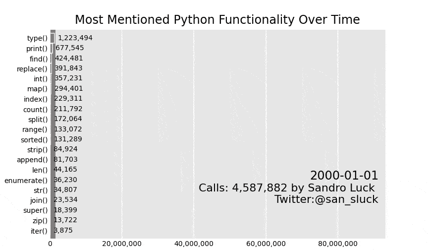
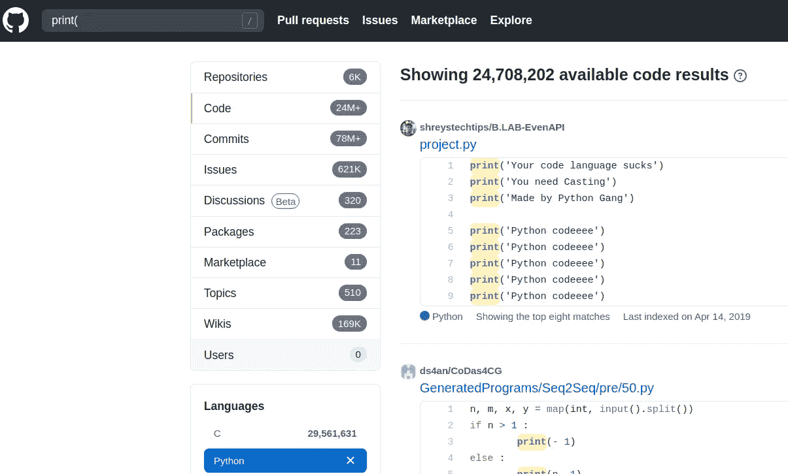
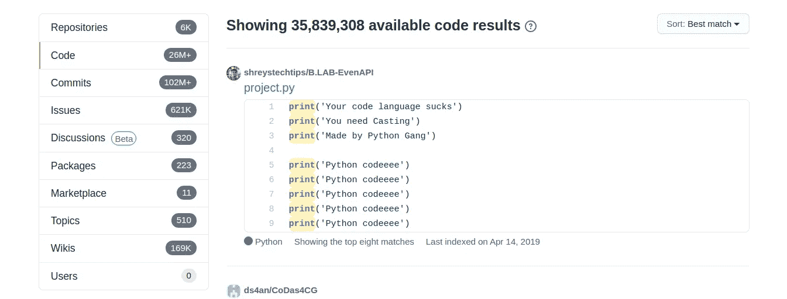

# 我的奥德赛，寻找最流行的 Python 函数

> 原文：<https://towardsdatascience.com/my-odyssey-finding-the-most-popular-python-function-6aa216db047c?source=collection_archive---------18----------------------->

## 我们都喜欢 Python，但是我们多久使用一次这些强大的功能呢？一篇关于我寻找答案的文章



在 Pythonrepositories 中提到最多的 Python 函数是通过 GitHub 提交计算的。作者图片

# 介绍

有一天，当我通过 map()运行 zip()和一些列表时。我无法停止注意这些年来我的 Python 风格发生了多大的变化。

我们以前都问过自己这个问题，其他人用这种美丽的语言做什么？他们用什么功能？

作为一名数据科学家，我的目标是更容易衡量的东西。*GitHub 提交中提到最多的 Python 功能是什么？*

在下面的文章中，我将

1.  讨论这样一个问题的局限性，以及我用了多少方法都没能找到答案
2.  展示我如何从 GitHub 收集数据
3.  最重要的是，教你如何用酷的赛车吧来吸引普通读者

# 限制

最初，我开始这个项目是为了弄清楚 Python 函数被调用的频率。很快我们注意到，在 Github 上，你可以很快找到它。使用搜索功能！



GitHub 上 print()函数的数量，图片由作者提供

> 问题解决了！
> 
> 嗯，不完全是…

问题是这些结果是不稳定的。通过多次调用这个搜索，我们可以得到任意数量的结果！这意味着当再次调用它时。



GitHub 上再次调用 print()函数的数量，图片由作者提供。

我们得到一个非常不同的结果…

## Github API

GitHub 有一个神奇的搜索 API！

> 问题解决了！
> 
> 嗯，不完全是…

这里的问题是，他们只提供代码的前 34k 结果或类似这样的结果，在相当长的时间内试图从中获得一些有用的东西。我不得不意识到他们不会允许我这样做。遗憾的是，我们的问题无法用简单的方法来回答。

## 通过提交的 Github 搜索功能

过了一段时间后，我发现在 Python 语言中可以通过提交和时间进行搜索！

> 问题解决了！
> 
> 嗯，不完全是…

虽然这种搜索方式似乎相当可靠。它会产生很多假阳性。例如，它将显示提交到只提交一点点 Python 的存储库。在某种意义上，提交可以包括单词或函数。

虽然这并不理想，但我决定采用这种方法，因为它允许随着时间的推移进行比较。此外，我尝试了我能想到的所有其他方法，如果你找到了更好的方法，请在评论中告诉我。总的来说，这个数据必须带着许多怀疑，但我希望它能给我们一些有价值的教训。最肯定的是，它创造了一个杀手情节；)

# 数据收集

我们有找到答案的近似方法。现在，我们要做的就是调用 GitHub API！

> 问题解决了！
> 
> 嗯，不完全是…

问题似乎是这个 API 应该更多地用于你的存储库内部的实际搜索。GitHub 似乎对他们返回给你的链接数量有硬性限制。他们似乎寻找了 X 秒钟，然后停下来，并返回他们到目前为止得到的任何东西。这很有意义，因为处理如此大量的数据非常昂贵。可悲的是，这也让我们寻找答案的旅程变得更加艰难。

由于我们拒绝放弃，我们决定调用他们的网站，并从返回的 HTML 解析答案！虽然这既不优雅也不简单，但我们不是懦夫。

让我们建立我们的联系。链接示例可能如下所示

```
[https://github.com/search?q=**{function}**%28+language%3A**{Language}**+type%3Acommits+committer-date%3A%3C{**before_year**}-01-01&type=commits](https://github.com/search?q=len%28+language%3APython+type%3Acommits+committer-date%3A%3C2000-01-01&type=commits)
```


示例链接，作者图片

如我们所见，我们主要寻找三样东西。

```
function: What function do we want to know about? e.g. len()
language: What programming language? e.g. Python
before_year: Before what year? e.g. 2000
```

当把这些参数输入 GitHub 时，它会告诉我们在那个日期之前已经提交了多少函数！

在调用这个链接之后，它返回给我们一个 HTML 文件，我们可以过滤这个文件来得到我们的答案。做这些事情的代码可以是

```
import urllib.requestlanguage='Python'
befor_year=2000# create the url using a year and a language
url_base = *f"https://github.com/search?l=Python&q={search_term}%28+language%3A{language}+type%3Acommits+committer-date%3A<{befor_year}-01-01&type=commits"*fp = urllib.request.urlopen(url_base)
byte_html = fp.read()
org_html = byte_html.decode("utf8")
fp.close()
```

例如，为了过滤结果 HTML，我们可以使用 regex。我们也可以使用 [BeautifulSoup](https://www.crummy.com/software/BeautifulSoup/bs4/doc/) 或者其他一些可爱的 HTML 解析库，但是使用 regex 会大大简化本文的可读性。在这种特定的情况下，我们只关心一个数字，这使得简单地寻找那个数字更快。

```
import re
find_count = re.compile(r'([0**-**9,]+) (available|commit)')
```

上面的正则表达式“find_count”查找字符串“44，363 commits”。使用匹配组(“()”中的所有内容)，我们可以从字符串“44，363”中提取数字组合。

快速完成这项工作的完整代码是，

正如我们所看到的，我们迭代所有的术语和年份，为每个函数收集一个数据点。然后我们从 HTML 中解析结果并存储它。剩下的整个过程是为了确保我们遵守 GitHub 的速率限制，不会被禁止累积我们的数据！

GitHub 似乎并不喜欢我们一直调用他们相对昂贵的功能；)这个我跑了 20 年，20 个函数，用了 80 多分钟，我觉得挺惊讶的。

最后，我们已经收集了我们想要的数据，现在可以用一些很酷的图来炫耀了！

# 形象化

我们现在有了一个大致如下的数据框架，

```
date,print(),len(),join()
2000-01-01,677545,44165,23534
2001-01-01,859815,66593,40032
2002-01-01,1091170,93604,59618
2003-01-01,1391283,117548,80327
2004-01-01,1755368,152962,125238
2005-01-01,2049569,185497,173200
```

每年每个函数提交的函数数量。这个数据集合特别易于可视化。

要把数据随时间可视化，我觉得赛车吧是最酷的。虽然它们可能不是信息最丰富的，但它们看起来令人难以置信！

我们需要的是一个 CSV，对于每个日期，有几个类别。一旦我们有了这样一个 CSV，我们就可以很容易地使用奇妙的 [bar_chart_race](https://github.com/dexplo/bar_chart_race) 库。

> 注意:当通过 pip 安装时，这个库似乎没有完全更新，所以通过 github 安装

```
python -m pip install git+[https://github.com/dexplo/bar_chart_race](https://github.com/dexplo/bar_chart_race)
```

现在，剩下要做的就是将我们的 CSV 传递给函数，创建一个漂亮的 gif。

```
def plot_search_term_data(file):
    *"""
    This function plots our df* ***:param*** *file: file name of the csv, expects a "date" column
    """* df = pd.read_csv(file).set_index('date')
    bcr.bar_chart_race(
        df=df,
        filename=file.replace('.csv', '.gif'),
        orientation='h',
        sort='desc',
        n_bars=len(df.columns),
        fixed_order=False,
        fixed_max=True,
        steps_per_period=10,
        period_length=700,
        interpolate_period=False,
        period_label=
        {'x': .98, 'y': .3, 'ha': 'right', 'va': 'center'},
        period_summary_func=
        lambda v, r: {'x': .98, 'y': .17,
                      's': f'Calls{v.sum():,.0f},
                      'ha': 'right', 'size':11},
        perpendicular_bar_func='median',
        title='Most Mentioned Python Functionality Over Time',
        bar_size=.95,
        shared_fontdict=None,
        scale='linear',
        fig=None,
        writer=None,
        bar_kwargs={'alpha': .7},
        filter_column_colors=False)
```


在 Pythonrepositories 中提到最多的 Python 函数是通过 GitHub 提交计算的。作者图片

# 结论

我们已经看到了如何使用 regex 而不是通常的 bs4 直接从 HTML 收集数据。虽然这种方法不应该用于更重要的项目，但是对于像这样的简单任务，这种方法是必须的。我们还看到，最突出的数据源可能并不总是有效的。

最后，我们发现了一个新的可爱的图书馆和如何创建美丽的赛车酒吧，将捕获您的观众的兴趣！

如果你喜欢这篇文章，我会很高兴在 Twitter 或 LinkedIn 上联系你。

一定要看看我的 [YouTube](https://www.youtube.com/channel/UCHD5o0P16usdF00-ZQVcFog?view_as=subscriber) 频道，我每周都会在那里发布新视频。

# 整个代码