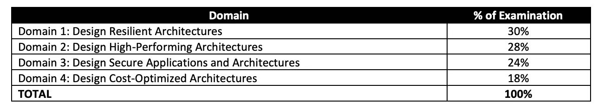
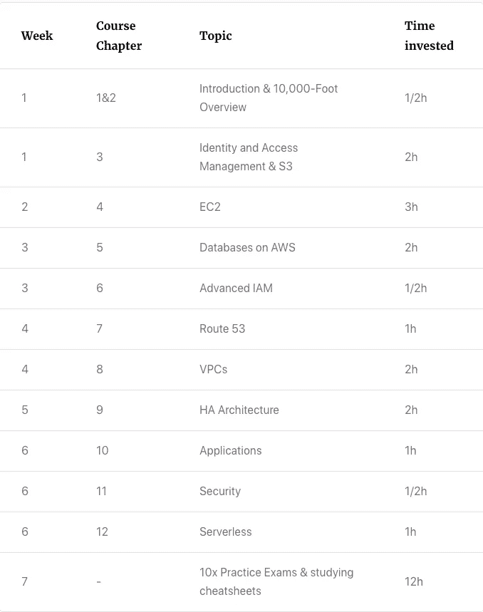
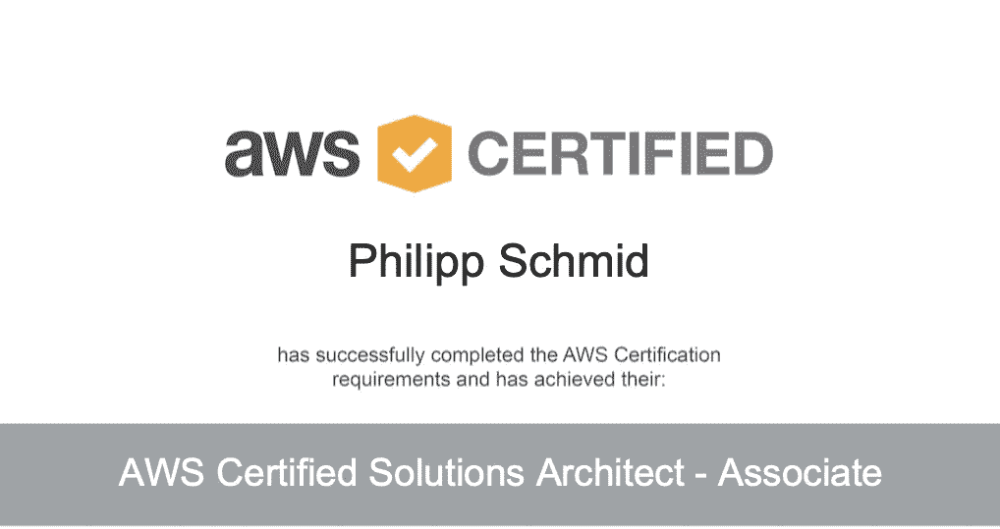

# 我成为认证解决方案架构师的途径

> 原文：<https://towardsdatascience.com/my-path-to-become-a-certified-solution-architect-a22d9650af1d?source=collection_archive---------19----------------------->

## 这是我如何在 28 小时的准备时间内成为认证解决方案架构师的故事

菲德尔·费尔南多在 [Unsplash](https://unsplash.com/s/photos/one-way?utm_source=unsplash&utm_medium=referral&utm_content=creditCopyText) 上的照片

# 介绍

大家好，我叫 Philipp，在一家科技孵化创业公司担任机器学习工程师。在工作中，我为金融科技和保险公司设计并实现了云原生机器学习架构。

我在两年半前开始使用 AWS。从那以后，我已经使用 AWS 服务在私人和工作中构建了许多项目。最喜欢 aws 的无服务器服务。对我来说，无服务器优先总是适用的。

总之我有几年的 AWS 专业和兼职经验，但是没有证书。我知道实践经验和知识比证书更重要。但是有时候你需要一张纸来证明。

# 放弃

> *这篇文章不会展示每个人如何在 30 小时的学习中获得认证。而是应该激励其他和我有同样经历但是太懒的人。*

# 证书

因此，几周前，我决定参加“AWS 认证解决方案架构师——SAA 助理-C02”认证。

“AWS 解决方案架构师-助理 SAA-C02”证书验证了在 AWS 上设计和部署动态可扩展、高度可用、容错和可靠的应用程序的能力。考试时间为 130 分钟，由 65 道题组成。

# 研究

首先我研究了一下，考试标准是什么。根据[AWS*Solution _ Architect*-_ Associate _ SAA-C02 _ Exam _ Blue _ Print](https://d1.awsstatic.com/training-and-certification/docs-sa-assoc/AWS-Certified-Solutions-Architect-Associate-Exam-Guide_v1.1_2019_08_27_FINAL.pdf)，它由这 4 个主题组成。

[除了 PDF 文档](https://d1.awsstatic.com/training-and-certification/docs-sa-assoc/AWS-Certified-Solutions-Architect-Associate-Exam-Guide_v1.1_2019_08_27_FINAL.pdf)

第二，我研究了在线课程和总结/小抄。我很快找到了一个在线课程，因为我已经熟悉了云专家。在谷歌搜索了一番后，我找到了贾延德拉的博客，几乎每个话题都有一份备忘单。

# 研究

最初，我看了一位云专家的[“AWS 认证解决方案架构师助理 SAA-C02”课程。由于我的经验，我以 2 倍的速度观看了课程。每一集包含一个实验室，我后来都独立实现了。](https://acloud.guru/learn/aws-certified-solutions-architect-associate)

在我完成课程后，我参加了一个云专家的模拟考试，获得了 78 分。因此我预约了 3 天后的实习。在这 3 天里，我每天学习 4 个小时，做了 10 次模拟考试，用小抄学习。

## 学习路径概述

学习路径

**我总共花了 7 周零 28 小时完成了“AWS 认证解决方案架构师-助理 SAA-C02”证书。**

# 考试

考试当天，我参加了最后一次模拟考试，并做了 a cloud guru 课程的每个测验。我在家通过 PearsonVue 参加考试。作为一名模范考生，我提前满足了所有要求，为考试做好了准备。入住非常容易，导师也很和蔼。大约花了 10 分钟才开始。

我花了 80 分钟完成并通过了考试。

# 学习

实践考试是好的，但由于 AWS 发展如此之快，他们不一定要准确。就我而言，我有大约 8 到 10 个关于存储网关、efs、fsx 的问题，而在模拟考试中这些问题要少得多。我从中得到的教训是，我应该少做一次模拟考试，多读一些文档。

我学到的第二件事是，对自己能力的肯定是一件值得骄傲的事情。

感谢阅读，特别感谢[贾延德拉的博客](https://jayendrapatil.com/aws-certified-solutions-architect-associate-saa-c02-exam-learning-path/)和[一位云计算大师](https://acloudguru.com/)。

如果你有任何问题，随时联系我。你可以在 [Twitter](https://twitter.com/_philschmid) 和 [LinkedIn](https://www.linkedin.com/in/philipp-schmid-a6a2bb196/) 上与我联系，或者给我写一封[电子邮件](https://www.philschmid.de)。

*原载于 2020 年 10 月 24 日*[*https://www . philschmid . de*](https://www.philschmid.de/my-path-to-become-a-certified-solution-architect)*。*