# 我挑选的 48 个高级数据库系统面试问题

> 原文：<https://towardsdatascience.com/my-pick-for-top-48-advanced-database-system-interview-questions-deb7b30968ca?source=collection_archive---------2----------------------->

## 适用于中高级受访者


旧的数据库系统，美好的往昔——照片由 [Unsplash](https://unsplash.com/s/photos/database?utm_source=unsplash&utm_medium=referral&utm_content=creditCopyText) 上的 [Kolar.io](https://unsplash.com/@jankolar?utm_source=unsplash&utm_medium=referral&utm_content=creditCopyText) 拍摄

除了知道如何查询，你还应该了解一些数据库系统的知识。这是意料之中的，面试的时候经常会出现这些知识问题。在这里，我试着挑选我最喜欢的高级数据库系统面试问题。重点是“高级”,我假设您熟悉数据库基础知识，所以我跳过诸如什么是 DBMS 之类的基本问题。什么是 SQL？什么是交易？或者要求您运行一些基本的查询。我也尽我所能的把这些问题分类，归类，让学习更容易。

我希望这篇文章短小精悍，但结果并非如此。所以，我希望你做好长时间阅读的准备。如果你想通过数据库系统面试，你必须开始花时间做功课，我相信这篇文章是一个很好的起点。

我试图删除不必要的细节，只解释必要的内容。但是，当问题本身很有趣，值得多读的时候，我提供了一些补充材料的链接。

好的。我们开始吧。

# 一般问题

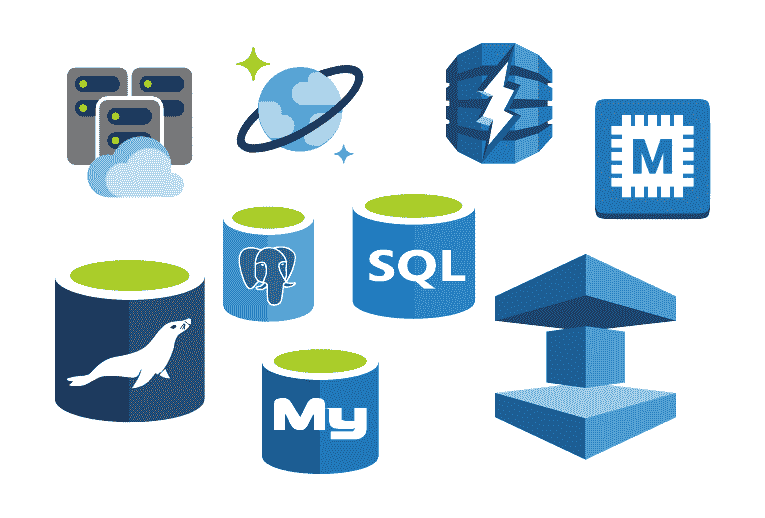

**#1 传统的基于文件的系统有哪些问题使得 DBMS 成为更好的选择？**

一个主要问题是准入。在没有索引的情况下，你唯一的选择就是全页扫描，速度超级慢。

另一个问题是冗余和不一致。文件有许多重复和冗余的数据，如果你改变其中的一个，你可能会使它们都不一致。保持文件的一致性是非常昂贵的。

另一个问题是缺乏并发控制。因此，一个操作可能会锁定整个页面，而在 DBMS 中，允许对单个文件执行多个操作。

数据隔离、完整性检查、事务的原子性和安全问题是传统的基于文件的系统的一些其他问题，DBMSs 为这些问题提供了一些很好的解决方案。

**#2 有哪些开源和商业关系型 DBMSs 的例子？**

对于开源 RDBMS，三种流行的软件是 MySQL、PostgreSQL 和 SQLite。对于商业 RDBMSs，您可以提到 Oracle、Microsoft SQL server、IBM DB2 和 Teradata。

**#3 什么是数据库模型？列举几个常见的数据库模型？**

数据库模型是数据库的逻辑结构，描述存储和访问数据的关系和约束。一些常见的数据库模型包括:

*   关系模型
*   层次模型
*   实体关系模型
*   文档模型
*   面向对象(OO)模型

**#4 如何选择数据库模型？**

在某种程度上，这取决于您的应用程序，每个数据库模型都有自己的优势。例如，文档模型适用于文本或半结构化数据。另一方面，如果您有原子数据，关系模型是您的最佳选择。
这也取决于你使用的数据库管理系统。许多数据库管理系统只适用于一种特定的模型，用户没有其他选择。

**#5 什么是 ER 建模？**

实体关系是一种建模形式，它试图模仿现实世界中实体之间存在的关系。在 ER 建模中，实体是真实世界的某个方面，例如事件、地点、人员，而关系，顾名思义，是这些实体之间的关系。

在 ER 建模中，所有实体都有它们的属性，这些属性在现实世界中可以被看作是对象的特征。例如，如果 employee 是一个实体，那么该雇员的姓名就是它的属性之一。

作为 ER 建模的示例，我们可以对员工之间的一种关系形式建模如下:两个实体，即主管和员工，以及一种关系，即主管。你可以像这样对你的整个组织建模。

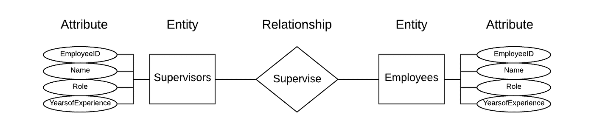

员工的 ER 模型

**#6 什么是 NoSQL？**

NoSQL 指的是为一些特定的数据模型而构建的一组数据库，例如图形、文档、密钥对和宽列。与关系数据库不同，NoSQL 数据库具有灵活的模式。NoSQL 数据库因其易开发性、功能性和大规模性能而得到广泛认可。与 SQL 数据库不同，许多 NoSQL 数据库可以跨数百或数千台服务器进行水平扩展。

与传统的关系数据库相比，NoSQL 系统被认为是非常年轻的。然而，由于许多创新和性能改进，它们的受欢迎程度正在上升。

除了这些系统的所有好处之外，值得一提的是，NoSQL 数据库通常不能提供与关系数据库相同的数据一致性。这是因为 NoSQL 系统牺牲了 ACID 属性来支持速度和可伸缩性。

如果你想了解更多关于 NoSQL 数据库的信息，这里有一个极好的来源。

**#7 什么是交易的 ACID 属性？**

**酸**代表 **A** 富， **C** 协调， **I** 溶解， **D** 耐久。为了维护数据库的一致性，在事务之前和之后，必须满足这四个条件。下面，我试着简单描述一下这个概念。

**原子性:**又称“全有或全无法则”。基本上，要么存储事务的所有部分，要么不存储任何部分。不允许部分交易。例如，如果一个交易是从一个账户取钱并存入另一个账户，那么它的所有部分都必须完成，这样数据库才能保持一致。如果我们部分地做这个交易，那么我们就使我们的数据库不一致。

**一致性:**对这一术语的定义没有共识。一般来说，您可以这样看，在事务之前，数据库是一致的，在事务之后，它也必须保持一致。

**隔离:**我们同时运行许多事务，每个事务的中间状态必须对其他事务不可见。例如，在我为原子性描述的转账交易中，其他交易必须要么看到一个帐户中的钱，要么看到另一个帐户中的钱，而不是两个都看到。换句话说，如果我们让事务彼此完全隔离，那么事务就必须看起来是串行运行的，而不是并发运行的。

**持久性:**当事务成功提交时，它必须持久化(存储在磁盘上)，并且不能撤销，即使在崩溃的情况下也是如此。

**#8 数据抽象的不同层次是什么？**

DBMS 中的数据抽象是对用户隐藏不相关细节的过程。一般来说，数据抽象有三个层次。1)物理层，其是最低层，是数据存储描述，该层由 DBMS 管理，并且该层的细节通常对系统管理员、开发者和用户隐藏；2)描述数据库和不同字段之间关系的概念或逻辑层。开发人员和系统管理员在这一层工作；3)仅描述部分数据库的外部或视图级别。例如，查询的结果是视图级别的数据抽象。用户通常在这一层工作，表模式及其物理存储的细节对他们是隐藏的。

# 存储管理

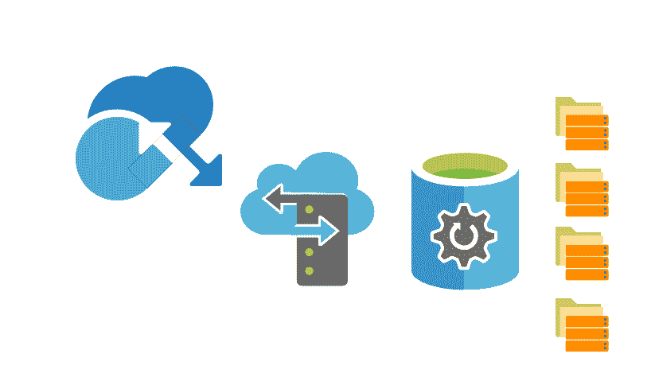

**#9 列式和基于行的数据库有什么区别？**

基于行的数据库将数据逐行存储在磁盘上，而列数据库将数据逐列存储。每种方法都有自己的优点。前者对于行上的操作非常快速和高效，而后者对于列上的操作非常快速和高效，例如为列的子集聚集大量数据。

通常需要整行的操作是写操作，如`INSERT`、`DELETE`、`UPDATE`。需要列的操作通常是读操作，如`SELECT`、`GROUP BY`、`JOIN`等。

一般来说，列数据库是分析操作理想选择，行数据库是事务处理的理想选择。

**#10 什么是 OLTP 和 OLAP 及其区别？**

OLTP 和 OLAP 都是在线处理系统。OLTP 代表“在线事务处理”，它是一个管理面向事务的应用程序的系统，OLAP 代表“在线分析处理”，它是一个管理分析查询的系统。

这两个系统的主要区别在于，OLTP 是一个写入密集型系统，而 OLAP 是一个读取密集型系统。这种差异对它们的实施有重大影响。例如，对于 OLTP 系统来说，采用适当的并发控制非常重要，而这在读取量大的操作中并不是主要问题。这两个系统之间的另一个区别是，OLTP 查询通常很简单，返回的记录数量相对较少，而 OLAP 查询非常复杂，涉及许多复杂的连接和聚合。

另一个区别是，由于 OLTP 系统的实时性，它们通常采用分散式架构来避免单点故障，而 OLAP 系统通常采用集中式架构。

此外，在大多数 DBMSs 中，OLTP 是基于行的数据库，而 OLAP 是列数据库。

**#11 什么是正常化和去正常化？**

规范化是将数据组织到多个表中以最小化冗余的过程。去正常化是相反的过程。它将规范化的表合并到一个表中，以便数据检索变得更快。规范化的主要优点是可以更好地利用磁盘空间。规范化后，维护数据库的完整性也更容易。

JOIN 是允许我们反转规范化并创建数据的非规范化形式的操作。

**#12 什么是数据仓库？**

它是从不同来源收集(提取、转换和加载)数据并将它们存储到一个数据库中的过程。您可以将数据仓库视为一个中央存储库，数据从事务系统和其他关系数据库流入其中。它可以关联广泛的业务数据，以提供对组织绩效的更深入的管理洞察。数据仓库是商业智能的核心，商业智能是用于数据分析和报告的系统。

该数据库与标准操作数据库分开维护。它们是两个独立的系统，后者经过优化，可以快速准确地更新实时数据，而前者最适合离线操作，可以长期查看数据。

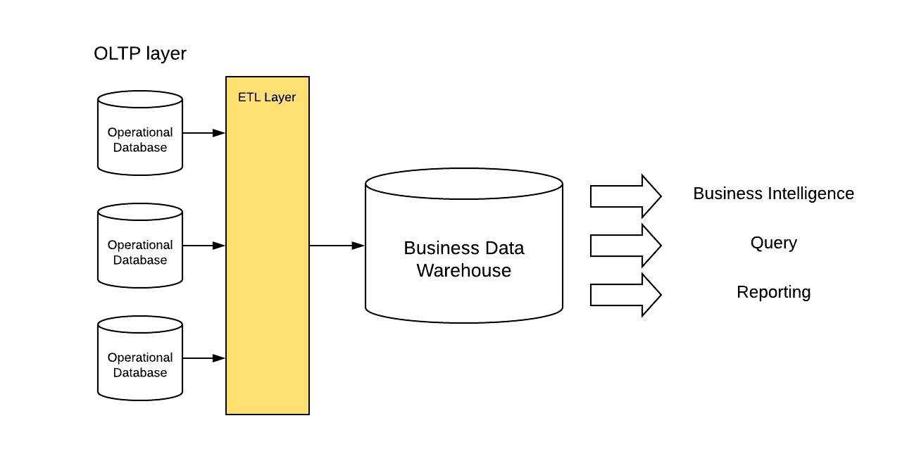

数据库

# 并发控制


克里斯·萨博尔在 [Unsplash](https://unsplash.com/s/photos/bird-fight?utm_source=unsplash&utm_medium=referral&utm_content=creditCopyText) 上的照片

并发控制是 DBMS 中确保同时操作不会相互冲突的过程。

**#13 什么是数据库锁及其类型？**

一般来说，可以说锁主要用于确保只允许一个用户/会话更新特定的数据。这里我描述了两种类型的锁:共享锁(S)和排他锁(X)。这些锁可以保存在表、页、索引键或单独的行上。

**共享锁:**当一个操作请求一个表上的共享锁时，如果被授予，这个表就可以被读取。这个锁可以与其他读操作共享，并且它们可以同时读这个表。

**排他锁:**当一个操作请求一个表上的排他锁时，如果被授予，就拥有对该表写的排他权。如果其他操作请求对该锁定的表进行访问，将会被阻止。

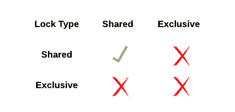

锁兼容性矩阵

对于锁还有另一个相关的概念，叫做**意向(I)锁**。我们有意向共享锁(IS)和意向排他锁(IX)。这些锁允许更细粒度的并发控制。从技术上讲，我们不需要它们。s 和 X 锁足够了，但是对查询优化有帮助。关于意向锁的更多细节通常超出了高级问题的范围。

**#14 什么是“锁升级”？**

数据库锁可以存在于行、页或整个表或索引中。当事务正在进行时，事务持有的锁会占用资源。锁升级是指系统将多个锁合并到一个更高级别的锁中(例如将多个行锁合并到一个页面或将多个页面合并到一个完整的表中)，通常是为了恢复大量细粒度锁占用的资源。

**#15 什么是“锁争用”？**

当多个操作请求一个表上的排他锁时，就会发生锁争用。在这种情况下，操作必须在队列中等待。如果您遇到长期锁争用，这意味着您的数据库的某些部分是热的，您必须进一步划分这些数据块，以允许更多的操作同时获得独占锁。锁争用可能是扩展数据库的瓶颈。

**#16 什么是“僵局”？**

死锁是指一些事务无限期地等待对方放弃锁的情况。通常，有两种方法来解决这个问题，一种是惰性方法，这意味着什么都不做，如果发生了，那么检测它并重新启动一个操作来解开死锁。另一种方法是主动的，这意味着防止死锁的发生。如果你想了解更多关于死锁预防的知识，请点击这里阅读[。](https://www.geeksforgeeks.org/deadlock-in-dbms/)

**#17 什么是隔离级别？**

隔离是酸性的第三个字母。有了这个属性，我们的目标就是让所有的事务彼此完全隔离(可序列化)。然而，有些应用不需要完全隔离。因此，我们定义了一些没有完全隔离严格的其他隔离级别。一般来说，定义了五个隔离级别。

**Read Uncommitted:** 根本没有锁。并发事务可以读取其他事务的未提交数据，也可以写入这些数据。在数据库术语中，他们说 DBMS 允许脏读。

**读提交:**在这个级别，DBMS 不允许脏读。在此级别，每个事务持有当前行的读/写锁，只有在提交更改时才会释放。这种隔离级别仍然允许不可重复的读取，这意味着事务在读取同一行时返回不同的值。如果你看看下面的图片，会更清楚。很明显，不允许脏读，但是不可重复的读仍然存在。

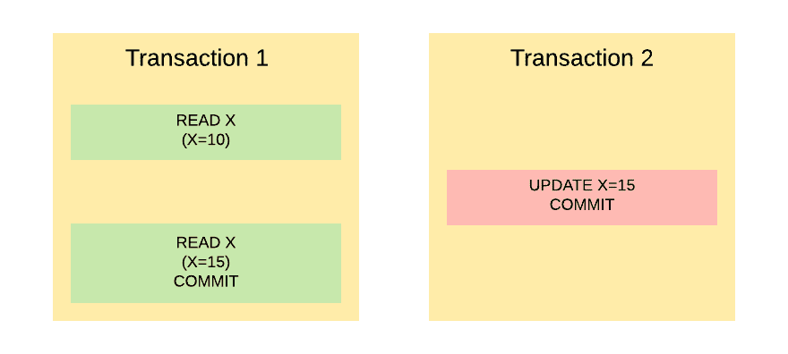

提交读隔离级别的示例

**可重复读取:**正如您之前看到的，“提交读取”隔离级别的问题是“不可重复读取”。为了避免不可重复的读取，每个事务必须对它们读取的行持有读锁，对它们写入的行持有写锁(例如，插入、更新和删除)，直到它们提交更改。这种隔离级别是可重复读取的。

但是，在这个隔离级别中仍然有一个场景，它会使数据库不一致。如果我们向表中插入或删除新行，然后进行范围查询，那么结果将会不一致。看下面的例子。事务 1 中的同一个查询返回两个不同的结果。这种情况被称为“幻像读取”。

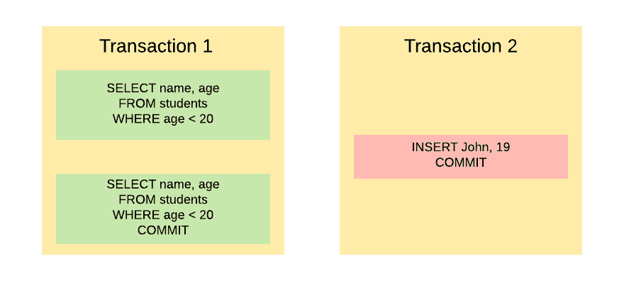

**可序列化:**这是最高的隔离级别。正如您在“可重复读取”中看到的，幻像读取可能会发生。为了防止幻影读取，我们必须持有整个表的锁，而不是行的锁。下图是迄今为止所有隔离级别的总结。

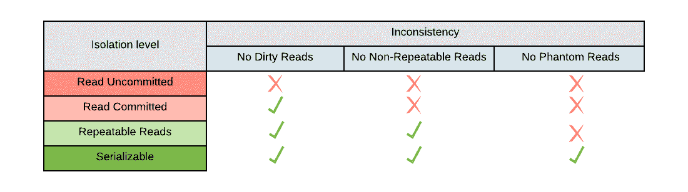

**快照:**这个隔离级别不同于我目前描述的其他隔离级别。其他的是基于锁和块的。这个不用锁。在此隔离级别中，当事务修改(即插入、更新和删除)行时，已修改行的提交版本将被复制到临时数据库(tempdb)并接收版本号。这也称为行版本控制。然后，如果另一个会话试图读取已修改的对象，该对象的已提交版本将从 tempdb 返回给该操作。

如果我描述的快照隔离听起来与其他隔离级别有根本的不同，那是因为它确实不同。其他隔离级别基于悲观的并发控制模型，但快照隔离基于乐观的模型。乐观模型假设冲突很少发生，并决定不阻止它们，如果它们发生了就处理它们。它不同于悲观模型，悲观模型确保无论如何都不会发生冲突。

# 访问方法


由[马库斯·斯皮斯克](https://unsplash.com/@markusspiske?utm_source=unsplash&utm_medium=referral&utm_content=creditCopyText)在 [Unsplash](https://unsplash.com/s/photos/matrix?utm_source=unsplash&utm_medium=referral&utm_content=creditCopyText) 上拍摄

访问方法是支持快速访问行/列子集的组织技术或数据结构。一些最常见的数据结构是哈希表和 B 树的变体。

**#18 什么是哈希及其优缺点？**

哈希是一种查找技术。基本上，这是一种将键映射到值的方法。散列函数将字符串转换成通常较短的固定长度的值，然后这些值可以用作存储原始元素的索引。

如果我们使用一个好的哈希函数，哈希可以用来在一个常数时间内索引和检索数据库中的项目，这比其他的查找技术要快。

优势:

*   哈希表是点查找(也称为等式查询)的理想数据结构，尤其是当数据库很大时，因为无论输入大小如何，您都可以在恒定的时间内搜索、插入和删除数据。

缺点:

*   有些情况下，哈希不一定是最佳选择。例如，对于小数据，好的散列函数的成本使得散列比简单的顺序搜索更昂贵。
*   另一种情况是范围扫描操作(也称为范围查询)，对于这种操作，B+树是一种理想的数据结构。
*   另一种情况是寻找子字符串或前缀匹配，哈希对于这些操作基本上是无用的。
*   哈希的另一个缺点是可伸缩性。随着数据库的增长，哈希表的性能会下降(更多的冲突和更高的冲突解决成本，例如，添加更多的存储桶或重新散列现有项目)

**#19 什么是 B+树及其优缺点？**

B+树是 B 树家族中的一种数据结构。这种数据结构及其变体在索引方面非常流行。该树是自平衡树，并且有适当的机制来确保节点至少是半满的。在 B+树中，数据存储在叶节点中，并且叶节点彼此顺序链接。叶节点之间的这些顺序链接允许在不遍历树结构的情况下顺序访问数据。这种顺序访问允许快速有效的范围扫描。

B+树允许在对数时间内进行搜索、顺序访问、插入和删除。在这个回答的最后，可以找到一个 B+树样本可视化。如果你有兴趣，你可以通过这个可视化工具为自己绘制一个([这里](https://www.cs.usfca.edu/~galles/visualization/BPlusTree.html))。

通常，在数据库系统中，B+树数据结构与哈希表进行比较。所以，在这里我试着解释一下 B+树相对于哈希表的优缺点。B+树的优点是在范围查询和搜索子字符串中，使用 LIKE 命令。另一方面，对于等价查询，哈希索引优于 B+树。B+树的另一个优点是它可以很容易地随着数据增长，因此，它更适合在磁盘上存储大量数据。

一个常见的后续问题是，B+树和二叉查找树(BST)之间有什么区别？B+ tree 是 BST 的推广，它允许树节点有两个以上的子节点。

如果有人问你 B 树和 B+树的区别，你可以提两点。首先，在 B+ three 中，记录只存储在叶子中，内部节点存储指针(key)。与 B+树不同，在 B 树中，键和记录都可以存储在内部节点和叶节点中。第二，a B+树的叶节点是链接在一起的，而在 B 树中，它们是不链接的。你可以在下面的例子中看到这两个不同之处。

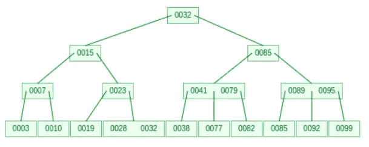

b 树可视化

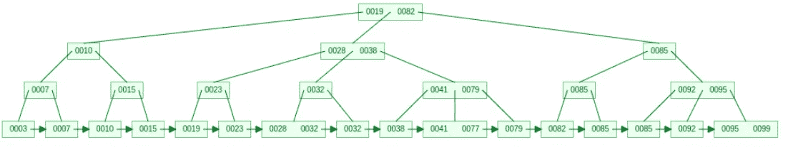

B+树可视化

**#20 聚集索引和非聚集索引有什么区别？**

索引用于加速查询过程。没有它们，DBMS 需要执行全表扫描，这非常慢。

聚集索引与数据的物理存储相关。基本上，我们要求 DBMS 按列对我们的行进行排序，并按照这个顺序物理存储它们。如您所见，每个表只能有一个聚集索引。聚集索引允许我们非常快速地检索数据，因为它提供了快速的顺序扫描。您可以创建自定义的聚集索引，也可以让 DBMS 使用主键自动为您创建聚集索引。

相比之下，非聚集索引与物理存储无关。这些索引基于列进行排序，并存储在不同于表的位置。您可以将这些索引想象成一个包含两列的查找表。一列是一个表列的排序形式，另一列是它们在内存中的物理地址(行地址)。对于这些索引，如果我们寻找一个记录，我们首先在查找表中搜索它的索引，然后我们到物理内存中获取与该行地址相关的所有记录。

总之，非聚集索引比聚集索引慢，因为它们涉及额外的查找步骤。此外，由于我们需要存储这些查找表，我们需要额外的存储空间。另一个区别是，我们可以为每个表创建一个聚集索引，而非聚集索引的数量可以根据我们的需要而定。

# 操作员执行


由[塞巴斯蒂安·莱昂·普拉多](https://unsplash.com/@elmundoderabbit?utm_source=unsplash&utm_medium=referral&utm_content=creditCopyText)在 [Unsplash](https://unsplash.com/s/photos/execution?utm_source=unsplash&utm_medium=referral&utm_content=creditCopyText) 上拍摄的照片

**#21 什么是相关和非相关子查询？**
就相互依赖而言，有两种类型的子查询，一种是内部查询依赖于外部查询的值，我们称这种查询为“相关”查询，另一种是内部和外部查询相互独立，我们称之为“非相关”查询。

不用说，相关子查询非常慢，因为它要求内部子查询对外部查询中的每一行运行一次。

**#22 有哪些不同的 JOIN 算法？**

有三种主要的算法来执行连接。这里我试着简单描述一下，并提及它们的优点。

*   嵌套循环:它将外部表和内部表的所有值相互比较。这是唯一能够交叉连接(多对多连接)的算法。在没有更好的算法的情况下，它可以作为一个后备选择。
*   散列连接:这是最通用的连接方法。简而言之，它构建两个输入中较小的一个内存哈希表，然后读取较大的输入并探测内存哈希表以找到匹配。哈希联接只能用于计算等值联接。它通常比嵌套循环更有效，除非连接的探测端非常小。
*   排序-合并连接:该算法首先根据连接属性对两个表进行排序。然后找到第一个匹配项，向下滚动两个表，合并匹配属性的行。

**#23 什么是存储过程？**

你可以把它当作一个半程序。执行特定任务的一组 SQL 语句。如果这个任务是一个常见的任务，那么我们可以将查询存储到一个过程中，并在需要时执行它，而不是每次都运行查询。下面是一个结构简单的程序。

```
CREATE PROCEDURE <Procedure-Name> AS
Begin
     <SQL STATEMENT>
End
```

创建一个过程后，无论何时需要，我们都可以使用 execute 命令来执行它

```
EXECUTE <Procedure-Name>
```

存储过程有很多好处。主要的一点是 SQL 代码的可重用性。如果该过程是常用的，它有助于避免多次编写代码。另一个好处是当我们使用分布式数据库时，它减少了通过网络发送的信息量。

**#24 什么是数据库触发器？**

触发器是一个存储过程，在事件发生之前/之后自动运行。这些事件可以是 DML、DDL、DCL 或数据库操作，如登录/注销。通用触发器语法如下:

```
CREATE [ OR ALTER ] TRIGGER [ Trigger_name ] 
[BEFORE | AFTER | INSTEAD OF]  
{[ INSERT ] | [ UPDATE ] | [ DELETE ]}  
ON [table_name]  
AS
{SQL Statement}
```

触发器的一些应用有:检查事务的有效性、实施参照完整性、事件记录、自动生成一些派生列以及用户登录前/后的安全授权。

如果你被问到触发器和存储过程的区别，你可以提到触发器不能被自己调用。它们在事件期间被调用。相比之下，存储过程是一个独立的查询，可以独立调用。

# 查询规划和优化


阿尔瓦罗·雷耶斯在 [Unsplash](https://unsplash.com/s/photos/planning?utm_source=unsplash&utm_medium=referral&utm_content=creditCopyText) 上拍摄的照片

查询规划和优化是许多 RDBMSs 的一个特性。查询优化器试图通过考虑可能的查询计划来确定执行给定查询的最有效方式。

什么是执行计划？

执行计划是对数据库引擎为有效运行查询而计划执行的操作的描述。您可以将它视为 DBMS 查询优化器的一个视图，DBMS 查询优化器基本上是一个寻找实现查询的最有效方法的软件。执行计划是对性能不佳的查询进行故障排除的主要手段。

阅读执行计划，理解它并根据计划排除故障是一门艺术。因此，如果你想了解更多，一个很好的参考是[这里](https://www.red-gate.com/simple-talk/sql/performance/execution-plan-basics/)。

**#26 什么是查询优化？**

SQL 是一种声明性语言，而不是过程性语言。基本上你告诉数据库管理系统你想要什么，但你没有说如何得到这些结果。这要靠数据库管理系统来解决。DBMS 可以采用多种查询策略来获得正确的结果。但是，这些执行计划会产生不同的成本。查询优化器的工作是比较这些策略，并选择预期成本最低的策略。在这种情况下，成本是 I/O 和处理成本的加权组合。I/O 成本是从磁盘访问索引和数据页的成本。

**#27 提几个提高查询性能的最佳实践？**

这是一个普遍的问题，实际上有许多方法可以提高查询性能。这里我只提几个。

*   避免在单个查询中使用多个连接
*   使用连接代替子查询。
*   对常用数据和更复杂的查询使用存储过程。
*   使用 WHERE 表达式尽可能限制结果的大小。

[这里](https://www.sisense.com/blog/8-ways-fine-tune-sql-queries-production-databases/)是回答这个问题的另一本好书。

# 故障修复


照片由[罗姆森·普里查维特](https://unsplash.com/@woodies11?utm_source=unsplash&utm_medium=referral&utm_content=creditCopyText)在 [Unsplash](https://unsplash.com/s/photos/404-error?utm_source=unsplash&utm_medium=referral&utm_content=creditCopyText) 上拍摄

崩溃恢复是回滚到一致且可用的状态的过程。这是通过撤销未完成的事务并重做崩溃发生时仍在内存中的已提交事务来实现的

**#28 什么是预写日志？**

在 DBMSs 中，恢复管理和维护原子性和持久性的实际技术是使用预写日志(WAL)。使用 WAL，所有的更改首先被写入一个日志，然后日志本身必须被写入一个稳定的存储器，然后更改才被允许被物理地应用。这就是它被称为预写日志的原因。一个简单的技术，保证当我们从崩溃中回来的时候，我们仍然可以弄清楚我们在崩溃之前正在做什么，并从我们停止的地方继续。

什么是检查点？

检查点与基于日志的恢复系统相关。为了在崩溃后恢复数据库，我们必须重做所有的日志记录。但是如果我们从头开始重做所有的日志记录，那么恢复一个数据库将花费很长时间。所以，一段时间后我们必须忽略一些记录。检查点是我们出于恢复目的决定忽略它们之前的记录的点。如您所见，通过使用检查点，DBMS 可以减少在崩溃时重启数据库的工作量。

# 分布式系统

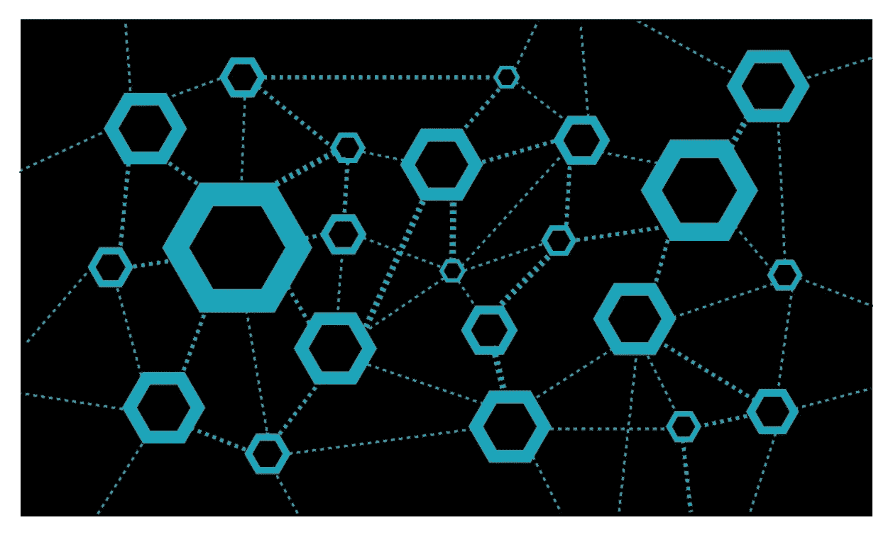

**什么是分布式数据库？**

分布式数据库是多个相互连接的数据库的集合，这些数据库在物理上分布在不同的位置。几乎在所有情况下，这些物理上分离的数据库都具有无共享的架构，并且彼此独立。然而，DBMS 以一种对用户/应用程序显示为单个数据库的方式逻辑地集成数据。

**#31 什么是数据库分区？**

分区是将非常大的表分成多个较小的可管理的部分的过程。分区的一些好处包括更快的查询、更快的数据加载和更快的旧数据删除。分区的好处受到分区键和粒度选择的限制。

有两种方法可以对表进行分区:水平和垂直。垂直分区将不同的列放入不同的分区，而水平分区根据分区键将行的子集放入不同的分区。例如，公司的销售记录可以根据销售日期进行水平划分。

**#32 什么是数据库分片？**

本质上，分片是一种水平分区架构。每个碎片都有相同的模式和列，但是有不同的行，并且它们是相互独立的。

分片的主要好处是可伸缩性。借助自动分片架构，您可以根据需要随时向堆栈中添加更多机器，并降低现有机器的负载，从而提高流量和处理速度。它对成长期的应用程序非常有吸引力。

如果想了解更多，可以参考这篇文章([此处](https://www.digitalocean.com/community/tutorials/understanding-database-sharding))。

# SQL 相关问题

**#33 什么是不同类型的 SQL 语句？**

SQL 语句是高级指令，每条语句负责一项特定的任务。这些陈述通常可以分为五类:

*   数据定义语言(DDL)
    *这一系列 SQL 命令用于定义数据库模式。
    *例子包括`CREATE`、`DROP`、`ALTER`
*   数据操作语言(DML)
    *这一系列 SQL 命令用于修改表中的数据。
    *例子包括`INSERT`、`UPDATE`、`DELETE`
*   数据查询语言(DQL)
    *这一系列 SQL 命令对现有的表执行查询。
    *例子包括`SELECT`
*   数据控制语言(DCL)
    *这一系列 SQL 命令处理权限和许可。
    *例子包括`GRANT`、`REVOKE`
*   事务控制语言(TCL)
    *这一系列 SQL 命令用于处理事务。
    *示例包括`COMMIT`、`ROLLBACK`、`SAVEPOINT`、
    *只有在有 OLTP 操作的情况下才需要这些命令。

**# 34 DDL 和 DML 的区别是什么？**

他们关系密切。DDL 负责定义表的结构，基本上是什么允许进入表，什么不允许。DDL 可以看作是一组塑造表结构(模式)的规则。在 DDL 定义了模式之后，DML 的工作就是用数据填充表。

**#35 标量函数和聚合函数有什么区别？**

这两个函数都返回单个值，不同之处在于输入，标量函数对单个值进行操作，而聚合函数对一组值进行操作。我试着用一个例子来说明两者的区别。比如像`ISNULL()`、`ISNUMERIC()`、`LEN()`这样的字符串函数就是标量函数。它们输入单个值并返回单个值。另一方面，`AVG()`、`MAX()`、`SUM()`是聚合函数，它们输入多个值并输出单个值。

**#36 什么是数据库视图？**

视图是一个虚拟的表。这个虚拟表可以临时保存 SQL 查询的结果，以供将来参考。您可以将它视为一个命名查询，以后可以通过它的名称来引用它，而不必重新编写整个查询。视图的一个优点是，不用创建一个全新的表来存储查询结果，而是创建一个视图来节省磁盘空间。

**#37 视图和物化视图有什么区别？**

视图结果不存储在磁盘上，每次运行视图时，我们都会得到更新的结果。但是，在物化视图中，事情就不一样了。我们将结果存储在磁盘上，并采用某种机制来保持它们的更新(也称为视图维护)。

当视图被频繁访问时，物化视图是有益的。这样，我们不需要每次都运行它。然而，物化视图有存储成本和更新开销。

**#38 什么是常见的餐桌用语(CTE)？**

CTE 可被视为临时视图或“内嵌”视图。换句话说，CTE 是一个临时结果集，您可以在另一个`SELECT`、`INSERT`、`UPDATE`或`DELETE`语句中引用它。我之所以说 CTE 是一个临时视图，是因为它只能被附加到它的查询使用，而不能在其他地方被引用。

CTE 用`WITH`算子定义。下面是 CTE 的简单蓝图。您可以只使用一个`WITH`来定义多个 cte，它允许您简化复杂的查询。

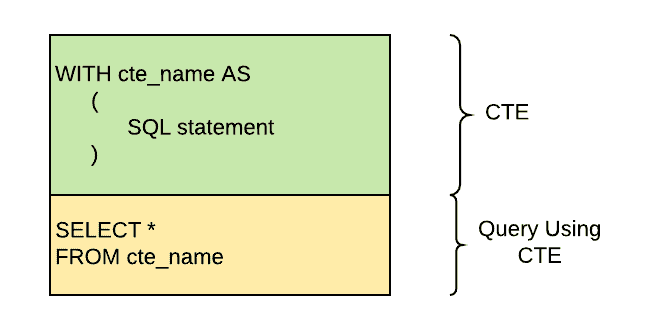

# 不是我最喜欢的，气人，但他们经常被问到

**# 39 DROP 和 TRUNCATE 命令有什么区别？**

DROP 将整个表删除，并且不能回滚。另一方面，TRUNCATE 会删除该表中的所有行。使用 TRUNCATE，表定义(模式)仍然存在，如果需要，我们可以在将来插入数据。

**#40 删除和截断命令有什么区别？**

DELETE 和 TRUNCATE 属于两个不同类别的 SQL 命令，前者属于 DML，后者属于 DDL。换句话说，前者在行级别上操作，而后者在表级别上操作。TRUNCATE 一次删除表中的所有行。DELETE 也可以做到这一点，但是它会一行一行地删除它们，这样会花费太多的时间。如果使用 TRUNCATE，则不能回滚数据，但使用 DELETE，可以回滚删除的行。

**#41 主键和外键有什么区别？**

这些关键字是交叉引用不同表的非常重要的工具。它们也有助于参照完整性。然而，它们在性质上是不同的。一个表只有一个主键。主键 1)可以唯一地标识表中的记录；2)不能接受空值；3)对于大多数 DBMSs，默认情况下，是聚集索引。与主键不同，一个表可以有多个外键。外键 1)是另一个表中的主键；2)不能唯一标识表中的记录；3)可以接受空值，4)不会自动索引。由用户为其创建索引。

**# 42 WHERE 和 HAVING 从句有什么区别？**

这两个子句都用于通过提供一些条件从结果集中筛选行来限制结果集。然而，有一点不同。WHERE 子句扫描原始数据(逐行)以检查条件并对其进行筛选，但让扫描聚合结果以检查条件并对其进行筛选。因此，在 SQL 查询中，HAVING 位于`GROUP BY`之后。总之，WHERE 过滤原始数据，而 HAVING 过滤经过处理的数据。

**#43 什么是函数依赖？**

如果其中一个属性唯一地标识另一个属性，则表的属性在功能上是相关的。通过一个例子，它变得更加清晰。假设我们有一个带有属性的雇员表:Id、姓名和年龄。在这里，雇员 Id 唯一地标识雇员姓名，因为如果我们知道雇员 Id，我们就可以唯一地说出他/她的姓名。函数相关性用箭头→表示。所以，在这种情况下，我们可以用`Id -> Name`来表示

**#44 什么是不同的归一化类型？**

正常化有许多级别。正如我前面解释的，规范化的目标是避免冗余和依赖。但是，这个目标不是一步就能实现的。每一个规范化步骤(类型)都让我们更接近我们的目标。

我们从非规范化形式的数据(UNF)开始，在 UNF 中，单元格可以有多个值(非原子的)，如果我们将这些值分成多个单元格，以确保每个表格单元格都有一个值，并删除重复的行以确保所有记录都是唯一的，那么我们将 UNF 转换为第一范式(1NF)。

下一步是引入主键和外键。在这一步中，我们进一步划分 1NF 表，创建新表，并通过主键和外键连接它们。如果在这些新表中，所有非键属性都完全依赖于主键，那么我们就达到了第二范式(2NF)

虽然有了 2NF，我们已经大大减少了冗余和依赖性，但仍有很大的改进空间。下一步是移除传递性函数依赖，这基本上意味着这样一种情况:如果我们更改一个非键列，我们可能会导致另一个非键列发生更改。为了理清这些非键列，我们必须创建一个单独的表。当我们没有传递函数依赖时，我们就达到了第三范式(3NF)。

在几乎所有的数据库中，3NF 是一个我们无法将数据库进一步分解成更高形式的规范化的点。但是，在一些复杂的数据库中，有些情况下您可以实现更高形式的规范化。

更高形式的规范化是 Boyce-Codd 范式(BCNF)、4NF、5NF 和 6NF，我不想讨论它们。如果你有兴趣了解更多关于这些更高形式的规范化，你可以从维基百科的数据规范化页面阅读它们([此处](https://en.wikipedia.org/wiki/Database_normalization))。

**#45 什么是不同的诚信规则？**

有两种类型的完整性规则，如果我们遵守它们，我们可以维护我们的数据库一致性。实体规则和参照规则。实体规则与我们的主键相关，如果我们将一列作为主键，那么它不能有任何空值。引用规则与我们的外键相关，我们的外键必须具有空值，或者它们的值必须是另一个表的主键。

**#46 什么是 DML 编译器？**

它是一个翻译器。它将 DML 查询从高级语句转换为可由查询评估引擎执行的低级指令。

**#47 什么是光标？**

光标是一种工具，用户可以使用它来以逐行的方式返回结果。这与典型的 SELECT 语句不同，后者返回整个结果集。通常，我们对完整的行集感兴趣，但是有些应用程序，尤其是那些交互式和在线的应用程序，并不总是能够有效地将整个结果集作为一个单元。这些应用程序喜欢逐行处理数据。游标允许它们执行这种逐行操作。

你可以在下面的例子中看到使用光标的整个过程。

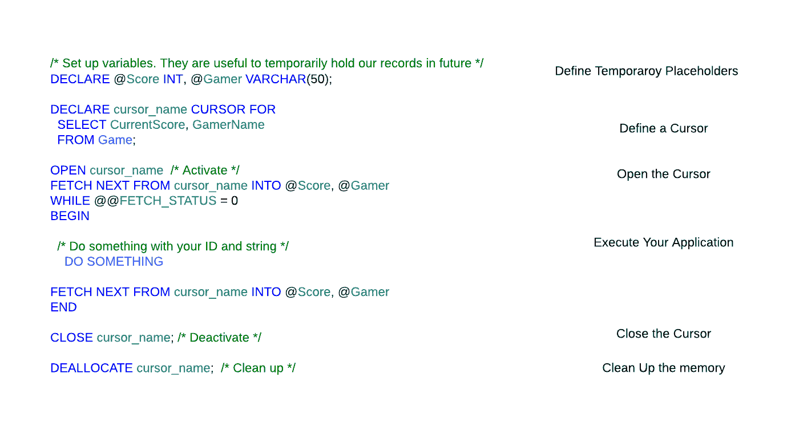

**#48 什么是基数？**

数据库系统上下文中的基数意味着“唯一性”。例如，当我们说一个列的基数较低时，这意味着它有许多重复值。

# 参考

*   **数据工程师必读的五本书** ( [链接](https://medium.com/@smohajer85/5-must-read-books-for-data-engineers-921b248fe875))
*   **实施数据治理:实现合规性和数据驱动洞察的分步指南** ( [链接](/implementing-data-governance-a-step-by-step-guide-for-achieving-compliance-and-data-driven-9e1c2896ab1e))
*   **数据目录:开启商业洞察力的钥匙** ( [链接](https://medium.com/gitconnected/data-catalog-a-key-to-unlocking-business-insights-750d261a350e))
*   **元数据管理:数据治理的关键组件** ( [链接](https://techleadcuriosity.com/metadata-management-a-key-component-of-data-governance-feff3d3405cc))
*   **确保数据质量:最佳实践、挑战和解决方案** ( [链接](https://techleadcuriosity.com/ensuring-data-quality-best-practices-challenges-and-solutions-eaee6941d74a))
*   **数据安全:数据工程师的基本考虑** ( [链接](https://medium.datadriveninvestor.com/data-security-essential-considerations-for-data-engineers-72d7b161be0d))
*   **数据完整性与数据质量** ( [链接](https://techleadcuriosity.com/data-integrity-vs-data-quality-ed4b11cee568))
*   **探索使用数据集成 API 的好处和挑战** ( [链接](https://techleadcuriosity.com/exploring-the-benefits-and-challenges-of-using-data-integration-apis-d78261f95c53))
*   数据处理的发展:ETL 与 ELT——哪一个适合您的业务需求？ ( [链接](https://medium.datadriveninvestor.com/data-processing-evolution-etl-vs-elt-which-one-suits-your-business-needs-ea4082c8d36))
*   **数据编排 101:了解不同类型的工具及其用例** ( [链接](https://techleadcuriosity.com/data-orchestration-101-understanding-the-different-types-of-tools-and-their-use-cases-d695bce2b461))
*   **数据网格:实现以产品为中心的数据架构的概念和最佳实践** ( [链接](/data-mesh-concepts-and-best-practices-for-implementing-a-product-centric-data-architecture-50037063f58e))
*   **从头开始设计数据仓库:技巧和最佳实践** ( [链接](/designing-a-data-warehouse-from-the-ground-up-tips-and-best-practices-e355b6799b99))
*   **查询优化 101:技术和最佳实践** ( [链接](/query-optimization-101-techniques-and-best-practices-413eb1056769))
*   **我挑选的 48 个高级数据库系统面试问题** ( [链接](/my-pick-for-top-48-advanced-database-system-interview-questions-deb7b30968ca))
*   **ACID 属性:深入研究数据库系统事务** ( [链接](https://techleadcuriosity.com/acid-properties-a-deep-dive-into-database-system-transactions-80e10078d13f))
*   **机器学习模型开发、部署和维护的最佳实践** ( [链接](/mlops-best-practices-for-machine-learning-model-development-deployment-and-maintenance-e70f5d2f416b))
*   **边缘计算和机器学习:释放实时数据分析的潜力** ( [链接](/edge-computing-and-machine-learning-unlocking-the-potential-of-real-time-data-analysis-b53876530d15))
*   **GraphQL 和机器学习:如何构建更好、更智能的应用** ( [链接](/graphql-and-machine-learning-how-to-build-better-smarter-applications-801d655670a9))
*   **特征库:类固醇上的特征工程，缩放机器学习的关键** ( [链接](/featurestore-the-key-to-scaling-machine-learning-8e2f2064ca62))
*   **使用 BigQuery ML 简化机器学习:全面概述** ( [链接](https://techleadcuriosity.com/streamlining-machine-learning-with-bigquery-ml-a-comprehensive-overview-2b66d1782e7a))

我希望你喜欢读这篇文章。如果你愿意支持我成为一名作家，考虑报名参加[成为一名媒体成员](https://medium.com/@smohajer85/membership)。每月只需 5 美元，你就可以无限制地使用 Medium。