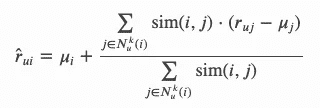

# 我的灵活推荐 Python 代码

> 原文：<https://towardsdatascience.com/my-python-code-for-flexible-recommendations-b4d838e9e0e0?source=collection_archive---------50----------------------->

## 我的额外定制 Python 代码，使您能够基于 Surprise library 的 K-Nearest neighborhood 样式模型运行更灵活的推荐。


照片由[merit Thomas](https://unsplash.com/@merittthomas?utm_source=unsplash&utm_medium=referral&utm_content=creditCopyText)在 [Unsplash](https://unsplash.com/s/photos/cupcake?utm_source=unsplash&utm_medium=referral&utm_content=creditCopyText) 上拍摄

在我的[上一篇博文](/how-to-build-a-memory-based-recommendation-system-using-python-surprise-55f3257b2cf4)中，我详细讨论了如何使用惊奇库在 Python 中使用推荐系统，从数据处理到预测和前 N 名推荐。如果你不熟悉这个主题，我建议你先阅读这篇文章，作为对协同过滤推荐系统的介绍，我不会重复其中的段落让你厌烦。

我在开始我的上一篇文章时打了一个比方，蛋糕店里的纸杯蛋糕排起了长队，作为一个消费者，由于资源有限，你无法尝试所有的蛋糕，因此推荐系统非常重要。继续这个类比，如果在我们分析了所有可用的纸杯蛋糕后，有人想出了一个额外的纸杯蛋糕，我们宁愿产生结果而不是重新开始整个过程。(我真的很期待我能弄清楚如何继续类比，以及什么样的封面图片将符合我接下来要写的基于模型的推荐系统的逻辑...)

在使用 Surprise 时，我不喜欢的一点是，为了给新用户做推荐，你必须将用户的评级添加到大量的训练数据中，然后重新拟合你的整个模型。其原因是预测模型建立在相同的类结构之上，对于使用矩阵分解的更复杂的模型，重新拟合是唯一的选择。

在这篇文章中，我将展示如何在不重新运行模型的情况下进行推荐。我们将构建一个推荐器类

*   使用 Surprise library 在大群体中只需计算一次参数，
*   当您输入新的单个用户评级时，返回推荐项目的有序列表。

我们关注的是`KNNWithMeans`模型，这是在我的项目中导致最高`RMSE`分数的模型类型，但是该方法也可以很容易地针对`KNNBasic`或`KNNWithZScores`模型进行调整。你可以在我的 [GitHub repo](https://github.com/MatePocs/boardgame_recommendation) 里找到整个项目的代码。

## 数学背景

正如我提到的，我不想重复我以前的帖子，但我认为有一个关于`KNNWithMeans`模型背后的数学公式的快速提醒是很好的。 *rᵤᵢ* 是用户 *u* 对项目 *i* 的评分， *μᵢ* 是对项目*I【nᵤᵏ(i】所有评分的平均值)*是用户 *u* 评分的项目中“最接近*I】*项目的最大 *k* 数。



surprise 的 KNNWithMeans 模型中的估计用户评分

## 计划

我们将利用这一事实来估计用户 *u* 将如何基于他们的其他评价来评价项目 *i* ，我们需要的是:

*   其他项目的平均评分，或*μᵢ*；
*   物品之间的相似性，或者说 *sim* ( *i，j* )。

我们将创建一个名为`KNNWithMeans_Recommender`的类，它有三个参数:

*   `sim_dataframe`:一个`pandas` `DataFrame`对象，一个带有项目间相似性的方阵。我们不关心使用哪种方法，可以是`cosine`、`pearson`或`MSD`。列名应该与索引名(项目的名称)相同，顺序相同。
*   `average_ratings_by_item` : a `pandas` `Series`，每个项目的平均评分，其中指数为项目名称。这将提供`KNN`模型的“带手段”部分。
*   `k_factor`:一个整数，用于限制我们在评估评级时考虑的相邻项目的数量。

我们稍后将研究如何创建这些参数，现在，我们将重点放在推荐器类上。当我们初始化一个对象时，保存这些参数就是全部了。

该类将有两个功能:`estimate_all_for_user`和`estimate_item`。

默认情况下，当我们与类交互时，我们将使用`estimate_all_for_user`。它将有一个参数，`user_input_dict`,这是一个字典，其中条目名称是键，等级是值。(后面我们会看到一个例子。)该函数遍历用户没有评级的项目，并使用`estimate_item`函数来估计评级。该函数将返回一个字典，其中键是项目名称，值是估计的评级。

另一个函数，`estimate_item`将基本上是我们前面看到的数学公式，使用相似性和每个项目的平均评分。

## 密码

下一个块包含我们刚刚描述的类的 Python 代码。

请注意，考虑到我们刚刚讨论了结构，我省略了上面要点中的大部分文档字符串和注释。如果你确实想使用代码，我建议从我的 GitHub repo 中复制[原文](https://github.com/MatePocs/boardgame_recommendation/blob/master/recomm_func.py)。(有一些命名上的区别，我的项目本来是一个 boardgame 推荐系统，所以“物品”和“游戏”是可以互换使用的。)

## 如何使用—输入参数

首先，我们将讨论如何为我们的`KNNWithMeans_Recommender`对象创建所需的参数。

先说`average_ratings_by_item`，我们需要一个`pandas` `Series`，其中项目名称是指标，评分是数值。我认为您不能从`surprise`库中生成这个，但是您可以简单地使用`groupby`方法，假设您在一个名为`df`的对象中有所有的评级:

```
avg_ratings_by_item = \
    df.groupby('item_name').mean()['rating'].copy()
```

`sim_dataframe`稍微复杂一点。我打算先把所有东西都保存在一个文件里，这样以后更容易利用。我们需要两样东西:相似性和项目名称。

在`surprise`中，kNN 类型的模型有一个`sim`方法，该方法将以`numpy` `array`格式返回相似性矩阵，不包含索引。我使用`numpy`将它保存在一个名为 pearson_sim 的`csv`文件中。

```
my_sim_option = {'name':'pearson', 'user_based':False}
model = KNNWithMeans(sim_options = my_sim_option, verbose = False)
model.fit(trainsetfull)np.savetxt('./results/pearson_sim.csv', model.sim, delimiter=',')
```

需要注意两件事:

*   在上面的代码中，我使用了`pearson`相似度，但是还有其他可用的相似度，参见[文档](https://surprise.readthedocs.io/en/stable/similarities.html)。我使用了`pearson`,因为这导致了我的项目中最高的`RMSE`分数。
*   对于这一步，你从惊喜库中使用哪个 KNN 模型可能并不重要，相似性是以同样的方式计算的。为了保持一致，我们可以使用`KNNWithMeans`。

下一步是获取项目名称，它们将被用作索引和列名。我们可以使用惊喜库的`all_items`和`to_raw_iid`功能(再次请参考[我之前的帖子](/how-to-build-a-memory-based-recommendation-system-using-python-surprise-55f3257b2cf4)了解详情)。

```
trainsetfull_iids = list(trainsetfull.all_items())
iid_converter = lambda x: trainsetfull.to_raw_iid(x)
trainsetfull_raw_iids = list(map(iid_converter, trainsetfull_iids))
```

我还将这些保存在一个`csv`文件中:

```
with open('./results/item_ids_for_sim_matrix.csv', 'w') as f:
    writer = csv.writer(f)
    writer.writerows(zip(trainsetfull_raw_iids, trainsetfull_iids))
```

然后在项目的后期，我将这两个文件，评级和项目列表合并到一个名为`pearson_sim`的`DataFrame`中。这将是我们创建推荐对象时要传递的参数。

```
pearson_sim = \
    pd.read_csv('./results/pearson_sim.csv', header = None)sim_matrix_itemlist = \  
    pd.read_csv(
        './results/item_ids_for_sim_matrix.csv', header = None)pearson_sim.columns = sim_matrix_itemlist[0]
pearson_sim.index = sim_matrix_itemlist[0]
```

将结果保存在文件中并将它们组合起来并不是最有效的解决方案，但是我发现这是一种干净的结构，可以方便地在过程的不同区域处理这些结果。

## 如何使用—预测

好了，有趣的部分来了！

首先，我们需要导入该类，假设您将文件命名为 recomm_func.py:

```
from recomm_func import kNNWithMeans_Recommender
```

然后，您可以通过传递我们刚刚讨论过的两个输入参数和一个用于`k_factor`的整数来初始化一个新对象:

```
recommender = kNNWithMeans_Recommender(
    pearson_sim, average_ratings_by_item, 10)
```

正如我提到的，我用这个项目来建立一个棋盘游戏推荐器，一个用户输入的例子是，如果你喜欢棋盘游戏，你可以看到这个测试用户更喜欢欧洲风格的标题:

```
user_input = {
    'Le Havre': 8,
    'Concordia': 9,
    'The Castles of Burgundy': 8,
    'Mansions of Madness: Second Edition': 5,
    'Kingdom Death: Monster':6
}
```

`estimate_all_for_user`方法返回一个包含所有项目和估计评分的字典，下面块中的下一行根据评分对它们进行排序，这样我们可以很容易地确定推荐给用户的前 N 个游戏。

```
estimated_ratings = recommender.estimate_all_for_user(user_input)sorted_ratings = \
    sorted(estimated_ratings.items(), key=lambda x: x[1])
```

通过对 sorted_ratings 进行切片，我们可以获得前 10 个推荐:

```
sorted_ratings[-10:]
```

将返回以下列表:

```
[('Agricola', 7.436929246134879),
('Agricola (Revised Edition)', 7.456466489174002),
('Through the Ages: A New Story of Civilization', 7.46818223297934),
('Orléans', 7.4808225652209),
('Terra Mystica', 7.498203401133102),
('Terraforming Mars', 7.5063889188525685),
('Gaia Project', 7.621611348138763),
('Puerto Rico', 7.665136353318606),
('Great Western Trail', 7.786750410443334),
('Brass: Birmingham', 7.82265622044594)]
```

再一次，作为一个桌游爱好者，这些建议对我这个特定的测试用户来说是有意义的。

通过从前面分割`sorted_ratings`列表，该代码还可以用于制作反推荐，即用户可能不喜欢的项目。如果你对其他不同的测试用户推荐感兴趣，请查看[这款 Jupyter 笔记本的结尾](https://github.com/MatePocs/boardgame_recommendation/blob/master/04_results_data_and_predictions.ipynb)。

## 结论

这就结束了我们在定制推荐功能上的工作。在我看来，一旦建立起来，这个类使用起来真的很方便，而且它使我的项目的代码结构更加精简。一个额外的优势是，你可以利用从早期阶段保存的惊喜库的结果，而不必依赖于当前环境中的库。

我希望你觉得它有用，请随意在你的项目中使用代码，如果你遇到任何问题，请告诉我。

## 参考

 [## 欢迎使用“惊喜”文档！-惊喜 1 文档

### 如果您对惊喜感到陌生，我们邀请您看一看入门指南，在那里您会找到一系列…

surprise.readthedocs.io](https://surprise.readthedocs.io/en/stable/index.html) [](/how-to-build-a-memory-based-recommendation-system-using-python-surprise-55f3257b2cf4) [## 如何使用 Python Surprise 构建基于内存的推荐系统

### 使用 Python 中的 Surprise 库实现 kNN 风格推荐引擎的分步指南，来自 data…

towardsdatascience.com](/how-to-build-a-memory-based-recommendation-system-using-python-surprise-55f3257b2cf4)