# 我的蟒蛇熊猫小抄

> 原文：<https://towardsdatascience.com/my-python-pandas-cheat-sheet-746b11e44368?source=collection_archive---------3----------------------->

## 作为一名数据科学家和软件工程师，我每天都在使用熊猫的功能

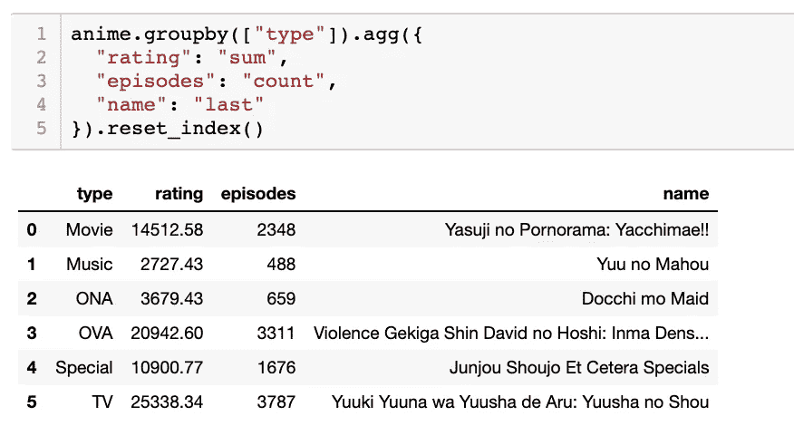

一位导师曾经告诉我，软件工程师就像索引而不是教科书；我们不会记住所有的东西，但是我们知道如何快速查找。

能够快速查找和使用函数，可以让我们在编写代码时达到一定的流程。所以我创建了这个函数清单，我每天都用它来构建网络应用和机器学习模型。

这不是一个全面的列表，但是包含了我最常用的函数，一个例子，以及我对什么时候它最有用的见解。

**内容:** 1)设置
2)导入
3)导出
4)查看和检查
5)选择
6)添加/删除
7)合并
8)过滤
9)分类
10)聚集
11)清洗
12)其他
13)结论

# 1)设置

如果你想自己运行这些例子，从 Kaggle 下载[动漫推荐](https://www.kaggle.com/CooperUnion/anime-recommendations-database)数据集，解压后放到你 jupyter 笔记本的同一个文件夹里。

接下来运行这些命令，你应该能够复制我的以下任何函数的结果。

```
import pandas as pd
import numpy as npanime = pd.read_csv('anime-recommendations-database/anime.csv')
rating = pd.read_csv('anime-recommendations-database/rating.csv')anime_modified = anime.set_index('name')
```

# 2)导入

## 加载 CSV

将 CSV 直接转换为数据框。有时从 CSV 加载数据也需要指定一个`encoding`(即:`encoding='ISO-8859–1'`)。如果您的数据框包含不可读字符，这是您应该尝试的第一件事。

另一个类似的函数叫做 excel 文件的`pd.read_excel`。

```
anime = pd.read_csv('anime-recommendations-database/anime.csv')
```

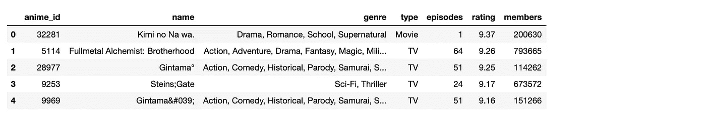

## 从输入的数据构建数据框架

当您想要手动实例化简单数据时非常有用，这样您就可以看到数据在管道中流动时是如何变化的。

```
df = pd.DataFrame([[1,'Bob', 'Builder'],
                  [2,'Sally', 'Baker'],
                  [3,'Scott', 'Candle Stick Maker']], 
columns=['id','name', 'occupation'])
```

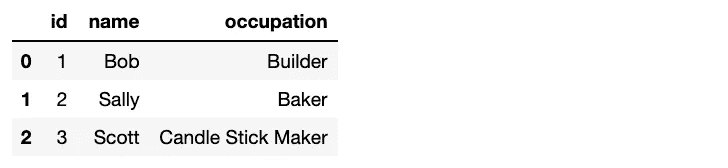

df.head()

## 复制数据框

当您想要在保留原始数据框副本的同时对数据框进行更改时，此功能非常有用。加载完所有数据帧后立即`copy`是一个很好的做法。

```
anime_copy = anime.copy(deep=True)
```

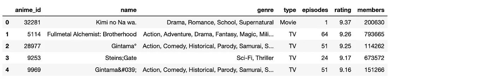

# 3)出口

## **保存到 CSV**

这会转储到与笔记本相同的目录中。我只保存下面的前 10 行，但你不需要这样做。同样，`df.to_excel()`也存在，功能基本相同，为 excel 文件。

```
rating[:10].to_csv('saved_ratings.csv', index=False)
```

# 4)查看和检查

## 获取顶部或底部`n`记录

显示数据框中的第一个`n`记录。我经常在笔记本的某个地方打印一个数据框的顶部记录，这样如果我忘记了里面的内容，我就可以参考它。

```
anime.head(3)
rating.tail(1)
```

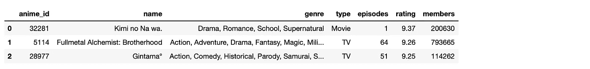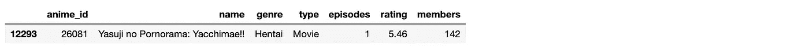

## **计算行数**

这本身不是一个 pandas 函数，但是`len()`计算行数，并且可以保存到一个变量中并在其他地方使用。

```
len(df)
#=> 3
```

## 计算唯一的行

对列中的唯一值进行计数。

```
len(ratings['user_id'].unique())
```

## 获取数据框信息

有用的获得一些一般信息，如标题，值的数量和列的数据类型。一个类似但不太有用的函数是`df.dtypes`，它只给出列数据类型。

```
anime.info()
```

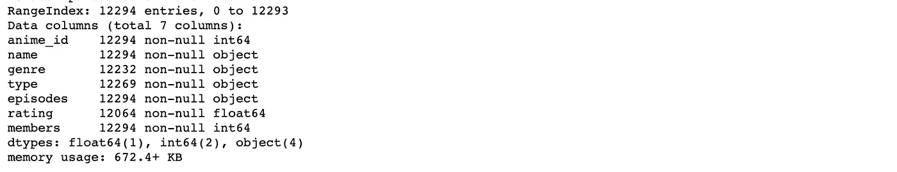

## 获取统计数据

如果数据框包含大量数值，这将非常有用。了解评级列的平均值、最小值和最大值可以让我们了解数据框的整体外观。

```
anime.describe()
```

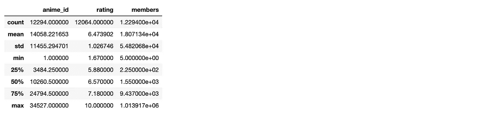

## 获取值的计数

获取特定列的值的计数。

```
anime.type.value_counts()
```

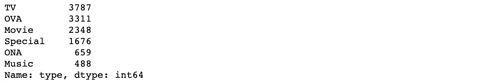

# 5)选择

## 获取列的值列表或系列

如果您需要将列中的值放入`X`和`y`变量中，这样您就可以适应机器学习模型，那么这种方法是有效的。

```
anime['genre'].tolist()
anime['genre']
```

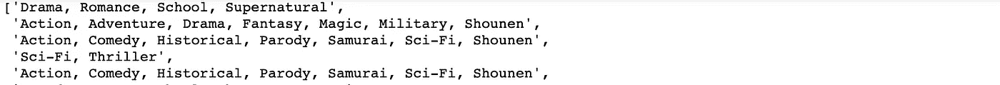

动漫【流派】。tolist()

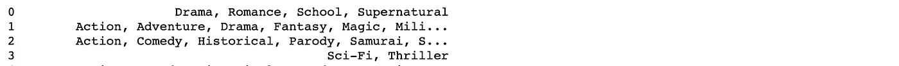

动漫['流派']

## 获取索引值列表

从索引创建值列表。注意我在这里使用了`anime_modified`数据框，因为指数值更有趣。

```
anime_modified.index.tolist()
```

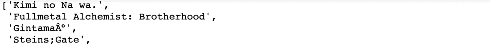

## 获取列值列表

```
anime.columns.tolist()
```


# 6)添加/删除

## 用设定值追加新列

当我在两个独立的数据帧中有测试和训练集，并希望在组合它们之前标记哪些行与哪些集相关时，我有时会这样做。

```
anime['train set'] = True
```

## 从列的子集创建新的数据框

当您只想保留大型数据框中的几列，而不想指定要删除的每一列时，这种方法非常有用。

```
anime[['name','episodes']]
```

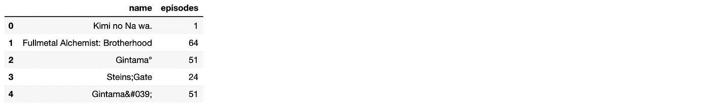

## 删除指定的列

当您只需要删除几列时非常有用。否则，把它们都写出来会很乏味，我更喜欢前一个选项。

```
anime.drop(['anime_id', 'genre', 'members'], axis=1).head()
```

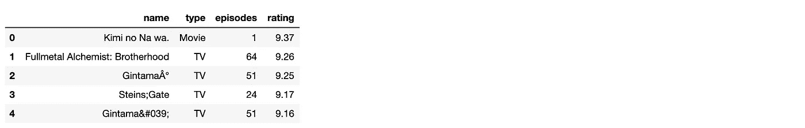

## 添加包含其他行总和的行

我们将在这里手动创建一个小数据框，因为这样更容易查看。这里有趣的部分是`df.sum(axis=0)`，它将各行的值相加。或者，`df.sum(axis=1)`将各列的值相加。

当计算计数或平均值时，同样的逻辑也适用，即:`df.mean(axis=0)`。

```
df = pd.DataFrame([[1,'Bob', 8000],
                  [2,'Sally', 9000],
                  [3,'Scott', 20]], columns=['id','name', 'power level'])df.append(df.sum(axis=0), ignore_index=True)
```

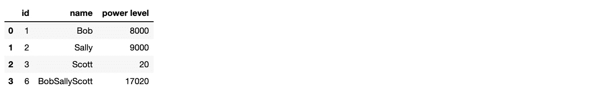

# 7)合并

## 连接两个数据帧

如果您有两个具有相同列的数据框，并且想要合并它们，请使用此选项。

在这里，我们将一个数据帧一分为二，然后将它们重新组合在一起。

```
df1 = anime[0:2]df2 = anime[2:4]pd.concat([df1, df2], ignore_index=True)
```

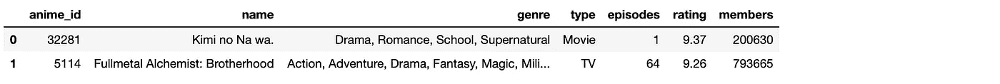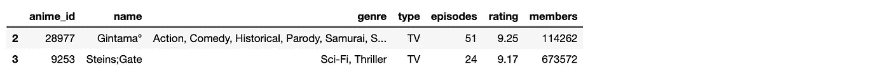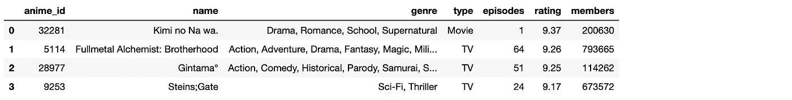

## 合并数据帧

当您有两个数据框并且想要在一列上连接时，这类似于 SQL 左连接。

```
rating.merge(anime, left_on=’anime_id’, right_on=’anime_id’, suffixes=(‘_left’, ‘_right’))
```

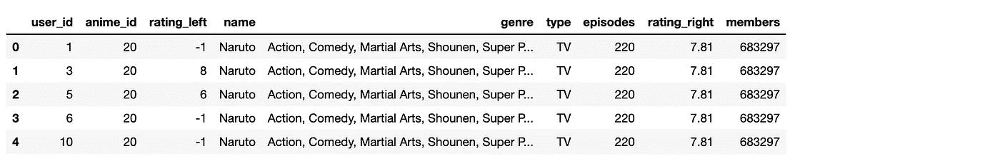

# 8)过滤

## 检索具有匹配索引值的行

`anime_modified`中的索引值是动漫的名称。请注意我们如何使用这些名称来获取特定的列。

```
anime_modified.loc[['Haikyuu!! Second Season','Gintama']]
```


## 按编号索引值检索行

这与之前的功能不同。使用`iloc`，第一行的索引为`0`，第二行的索引为`1`，以此类推……即使您已经修改了数据框，并且现在在索引列中使用字符串值。

如果您想要数据框中的前 3 行，请使用此选项。

```
anime_modified.iloc[0:3]
```

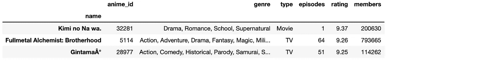

## 获取行

检索列值在给定列表中的行。`anime[anime[‘type’] == 'TV']`在匹配单个值时也有效。

```
anime[anime['type'].isin(['TV', 'Movie'])]
```

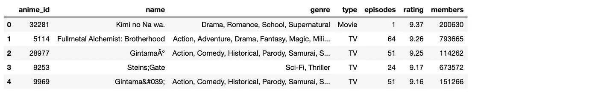

## 切片数据帧

这就像分割一个列表。对数据帧进行切片，以获取指定索引之前/之间/之后的所有行。

```
anime[1:3]
```


## 按值过滤

过滤满足条件的行的数据框。请注意，这将保持现有的索引值。

```
anime[anime['rating'] > 8]
```

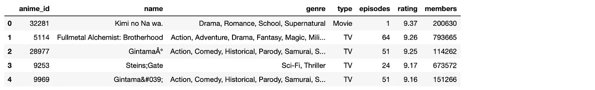

# 9)分类

## 排序值

按列中的值对数据框排序。

```
anime.sort_values('rating', ascending=False)
```

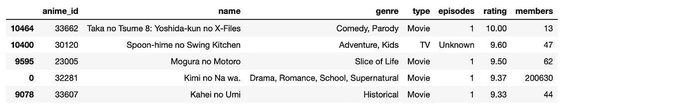

# 10)聚集

## 分组和计数

计算列中每个不同值的记录数。

```
anime.groupby('type').count()
```

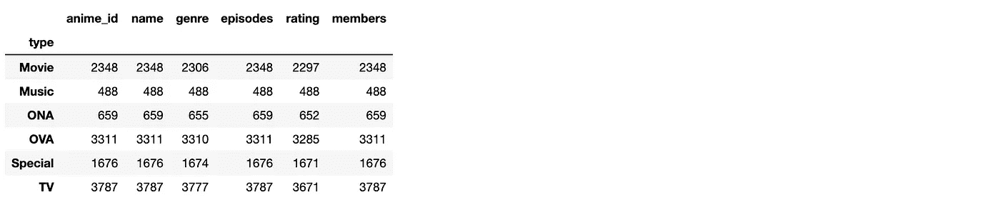

## Groupby 和聚合列的方式不同

注意，我添加了`reset_index()`,否则`type`列将成为索引列——我建议在大多数情况下也这样做。

```
anime.groupby(["type"]).agg({
  "rating": "sum",
  "episodes": "count",
  "name": "last"
}).reset_index()
```

## 创建数据透视表

对于从数据框中提取数据子集来说，没有比数据透视表更好的了。

请注意，我已经对数据框进行了严格的过滤，这样可以更快地构建数据透视表。

```
tmp_df = rating.copy()
tmp_df.sort_values('user_id', ascending=True, inplace=True)
tmp_df = tmp_df[tmp_df.user_id < 10] 
tmp_df = tmp_df[tmp_df.anime_id < 30]
tmp_df = tmp_df[tmp_df.rating != -1]pd.pivot_table(tmp_df, values='rating', index=['user_id'], columns=['anime_id'], aggfunc=np.sum, fill_value=0)
```


# 11)清洁

## 将 NaN 单元格设置为某个值

将`NaN`值的单元格设置为`0`。在这个例子中，我们创建了与之前相同的数据透视表，但是没有`fill_value=0`，然后使用`fillna(0)`来填充它们。

```
pivot = pd.pivot_table(tmp_df, values='rating', index=['user_id'], columns=['anime_id'], aggfunc=np.sum)pivot.fillna(0)
```

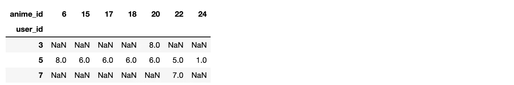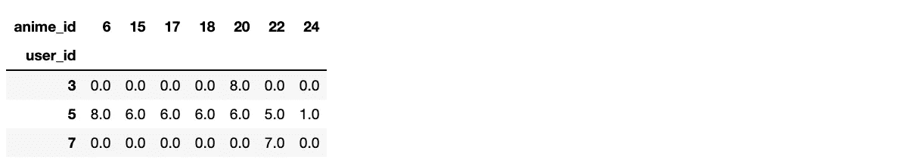

# 12)其他

## 对数据帧进行采样

我一直用这个从一个大的数据框架中抽取一个小样本。它允许随机重新排列行，同时保持索引。

```
anime.sample(frac=0.25)
```

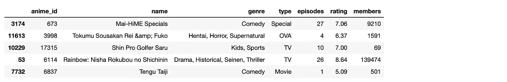

## 迭代行索引

迭代数据框中的索引和行。

```
for idx,row in anime[:2].iterrows():
    print(idx, row)
```

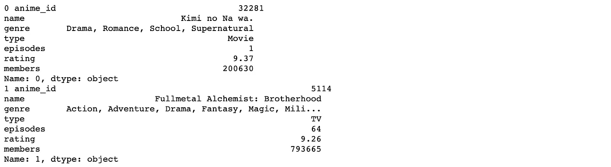

## 启动 jupyter 笔记本

以非常高的数据速率限制启动笔记本电脑。

```
jupyter notebook — NotebookApp.iopub_data_rate_limit=1.0e10
```

# 13)结论

我希望这也能成为你的参考指南。随着我发现更多有用的熊猫功能，我会不断更新。

如果有任何你离不开的功能，请在下面的评论中发表！