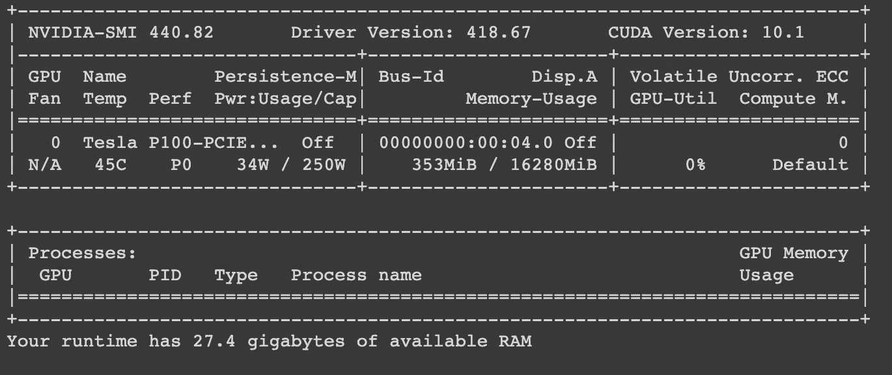
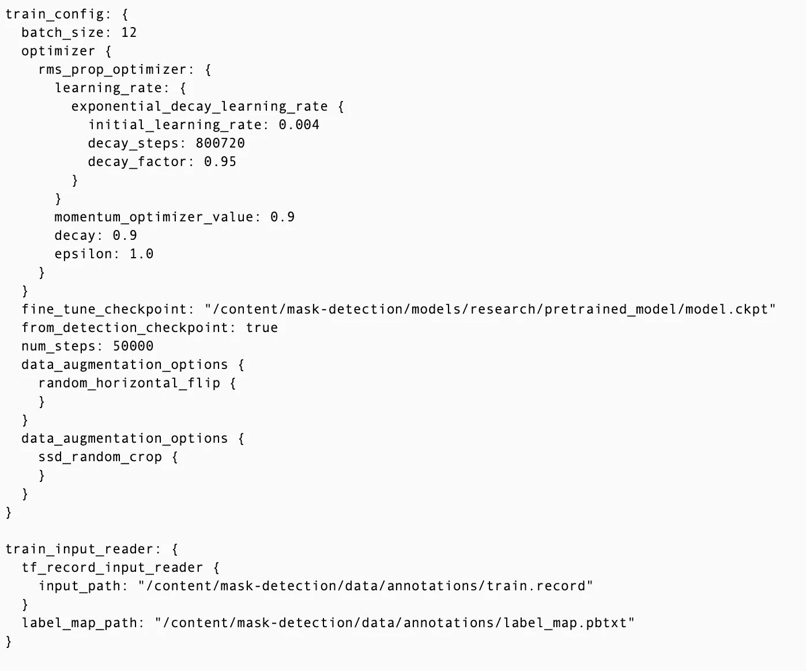
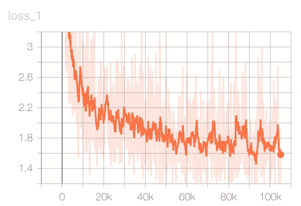
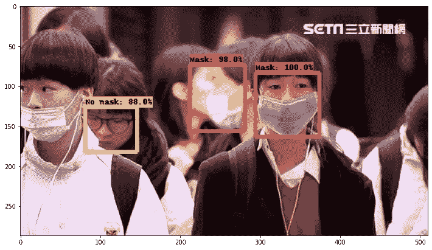
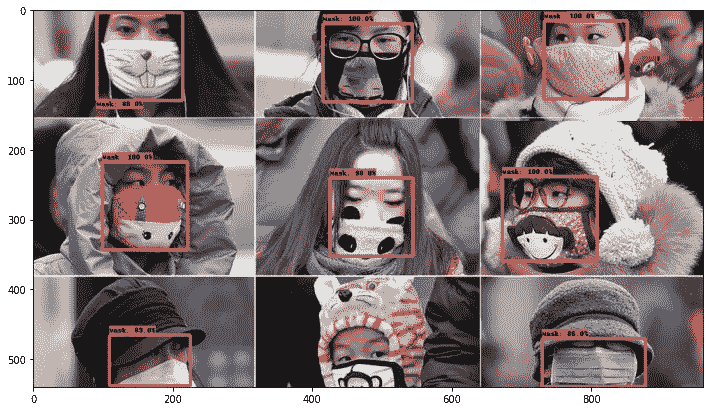
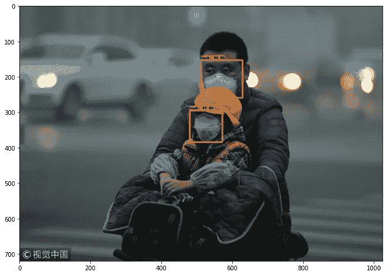
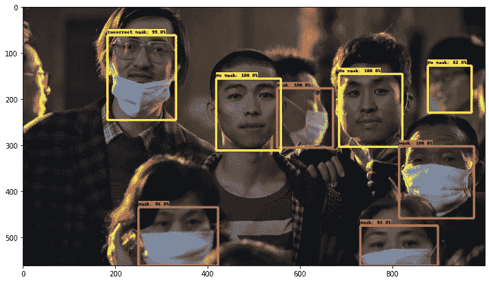

# 我的隔离项目:使用 Tensorflow 的实时面罩检测器

> 原文：<https://towardsdatascience.com/my-quarantine-project-a-real-time-face-mask-detector-using-tensorflow-3e7c61a42c40?source=collection_archive---------35----------------------->

## 检疫项目

在新冠肺炎封锁的最初几天，我决定做一些与疫情有关的项目，这些项目可能会变得有用。有很多伟大的项目使用了疫情的数据，所以我想专注于一些独特的东西。

随着该国开始经历重新开放的各个阶段，口罩已经成为我们日常生活中的一个重要元素，并将继续存在。为了社交或开展业务，需要佩戴口罩(并正确佩戴)。因此，我决定创建一个应用程序，利用摄像头来检测一个人是否戴着面具，以及面具是否被正确使用。

## Kaggle，Tensorflow 和合作实验室

在 Kaggle 上导航时，我遇到了一个由带注释的面具图片组成的小数据集。这是一个很好的注解，这是一个完美的起点。

鉴于我对 Tensorflow [对象检测 API](https://github.com/tensorflow/models/tree/master/research/object_detection) 有些熟悉，我决定使用预先训练好的 COCO 数据集模型。这些[预先训练的模型](https://github.com/tensorflow/models/blob/master/research/object_detection/g3doc/detection_model_zoo.md)对于 COCO 中已经存在的 90 个类别(例如，人类、汽车、狗等)的开箱即用推理非常棒。它们还特别适用于作为初始化新模型以训练全新数据集的基线。

有许多在浏览器中编写和执行 Python 的好方法，比如 [AWS SageMake](https://aws.amazon.com/sagemaker/) r，但是 Google Colaboratory 提供免费的 GPU 计算，所以我选择使用 Colab 笔记本来运行我的所有培训。后来，我决定升级到专业帐户，以保证我总是有 GPU 和内存可用。



Google 协作配置

不是巧合，卡格尔。Tensorflow 和 Colaboratory 是谷歌的产品。我确信我可以找到类似的 AWS 或微软的产品，但是没有什么比免费的更好。

## 为训练准备数据集

带有遮罩批注的元数据文件是 XML 文件，包含有关图像的信息和每个元素的边界框信息。他们使用 PASCAL VOC 格式，这是一种常见的结构。

```
<annotation>
 <folder>images</folder>
 **<filename>1_13.jpg</filename>** <path>P:\mask_mouth\images\1_13.jpg</path>
 <source>
  <database>Unknown</database>
 </source>
 **<size>**  <width>918</width>
  <height>506</height>
  <depth>3</depth>
 </size>
 <segmented>0</segmented>
 <object>
 **<name>good</name>**  <pose>Unspecified</pose>
  <truncated>0</truncated>
  <difficult>0</difficult>
 **<bndbox>**   <xmin>133</xmin>
   <ymin>109</ymin>
   <xmax>215</xmax>
   <ymax>201</ymax>
  </bndbox>
 </object>
```

`name`字段包含对象的类。在这个数据集的情况下，三个类名有些混乱:`good`代表戴面具的人，`bad`代表不戴面具的人，`none`代表面具放置不正确。这很傻，但这给我带来了问题，使这个项目花费了更长的时间，因为我使用了不同类名的 labelmap 进行推理。

**生成 CSV 文件**

需要做一些调整来规范化数据集。有些文件是 png，有些是 jpg，有些没有相应的 XML 文件，反之亦然。在确保它们都是一致的之后，我将它们随机分成训练集和测试集(80/20)。来自 XMLs 的数据然后被导入到一个 CSV 文件中。每行对应一个注释。CSV 列有:`filename`、`width`、`height`、`class`、`xmin`、`ymin`、`xmax`、`ymax`。

```
train_xml_df.to_csv(train_path_csv + 'train_labels.csv', index=None)
test_xml_df.to_csv(test_path_csv + 'test_labels.csv', index=None)
```

**生成 TFRecord**

TFRecord 是一种存储二进制记录序列的简单格式。所以我的下一步是使用 CSV 创建一个 TFRecord 文件，用于训练网络。为拆分的训练集和测试集分别生成了不同的 TFRecord 文件。

```
generate_tfrecord(train_csv_file, HOME_DIR, 'train.record', train_path_images)
generate_tfrecord(test_csv_file, HOME_DIR, 'test.record', test_path_images)
```

## 培训 TFRecords

在 TFRecords 可用的情况下，下一步是从 Tensorflow 模型动物园中选择一个预训练的模型，并使用它来训练 TFRecords。

在对一些模型进行了一些调查后，我决定使用`ssd_inception_v2_coco`，因为它可以很好地平衡速度和[平均精度](http://cocodataset.org/#detection-eval)(地图)。

关于 Tensorflow 对象检测 API 的事情是，它不被最新的 2。张量流的 x 个版本。遗留代码不是向后兼容的，所以需要做一些工作来找出可以工作的最佳版本。该过程的一部分是编译协议缓冲区，并确保它们包含在`PYTHONPATH`中。堆栈溢出很方便地帮助我解决了必须降级`gast(==0.2.2)`和`numpy(==1.17.4)`的问题，并避免在训练中途崩溃。

```
# Testing Object Detection worksfrom tensorflow.contrib import slim
from nets import inception_resnet_v2
from object_detection.builders import model_builder
from object_detection.protos import input_reader_pb2
```

**型号配置**

在能够训练之前，我必须用 TFRecords 的参数和文件位置修改`ssd_inception_v2_coco`配置文件。每一篇关于物体检测的文章都会详尽地告诉你如何去做。



ssd_inception_v2_coco.config 摘录

拥有可用的 GPU 和 RAM 很有帮助，甚至尝试了大量的步骤。笔记本电脑可以在夜间运行，不会出现大的问题。当有事情发生时，我总是可以从检查点恢复。

```
python ./models/research/object_detection/**model_main.py** \
--pipeline_config_path={pipeline_fname} \
--model_dir={model_dir} --alsologtostderr \
--num_train_steps={num_steps} --num_eval_steps={num_eval_steps}
```



培训损失

## 导出训练好的推理图

一旦训练工作完成，下一步是提取新训练的推理图，该推理图稍后将用于执行对象检测。这可以使用 Tensorflow 对象检测程序来完成。

```
python object_detection/**export_inference_graph.py** \
--input_type image_tensor --pipeline_config_path {pipeline_fname} \
--trained_checkpoint_prefix {last_model_path} \
--output_directory /content/mask-detection/training/exported_graph
```

这个过程生成`frozen_inference_graph.pb`，它是一个 *protobuf* 文件，包含图形定义以及模型的所有权重。有了这个文件，我们就可以运行训练好的模型并进行推理。

在一些训练图像中运行检测工作得相当好。



训练图像上的目标检测。

我更进一步，将它转换成一个`tflite_graph.pb`文件作为输入，最终得到一个 TensorFlow Lite flatbuffer 格式`detect.tflite`

```
python object_detection/**export_tflite_ssd_graph.py** \
--pipeline_config_path={pipeline_fname} \
--trained_checkpoint_prefix={last_model_path} \
--output_directory /content/mask-detection/tflite \
--add_postprocessing_op=true**tflite_convert** --graph_def_file=/content/mask-detection/tflite/tflite_graph.pb \
--output_file=/content/mask-detection/tflite/detect.tflite \
--output_format=TFLITE --input_shapes=1,300,300,3 \
--input_arrays=normalized_input_image_tensor \
--output_arrays ='TFLite_Detection_PostProcess','TFLite_Detection_PostProcess:1','TFLite_Detection_PostProcess:2','TFLite_Detection_PostProcess:3' \
--allow_custom_ops --mean_values=128 --std_dev_values=127 \
--change_concat_input_ranges=false --allow_custom_ops
```

TensorFlow Lite 文件可用于在移动、嵌入式和物联网设备上运行模型。它们支持低延迟和小二进制大小的设备上推断。

在我的下一篇关于在 Raspberry PI 4 上运行 TF Lite 的文章中，请遵循我的中等配置文件。这是这个项目的 Github [库](https://github.com/cacheop/facemask-detection)。