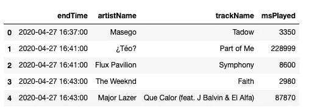
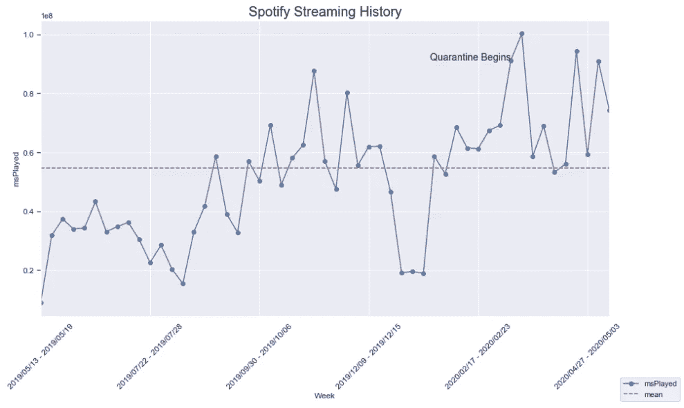
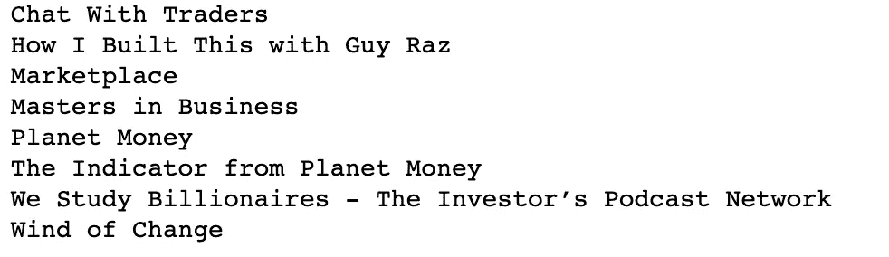
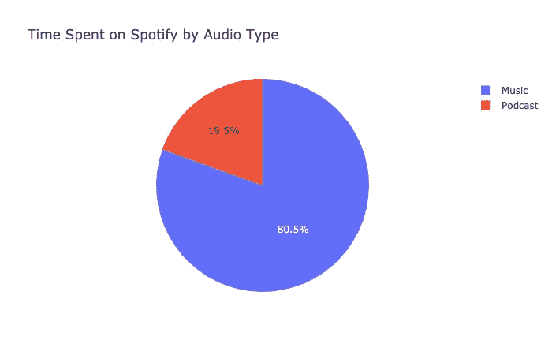
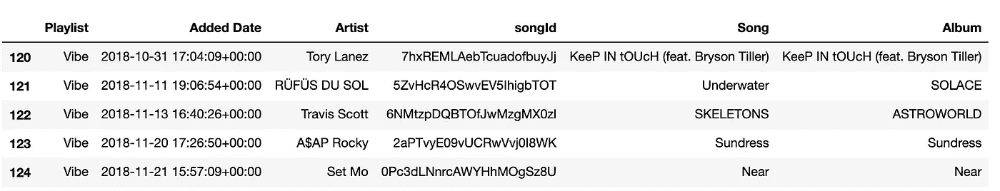
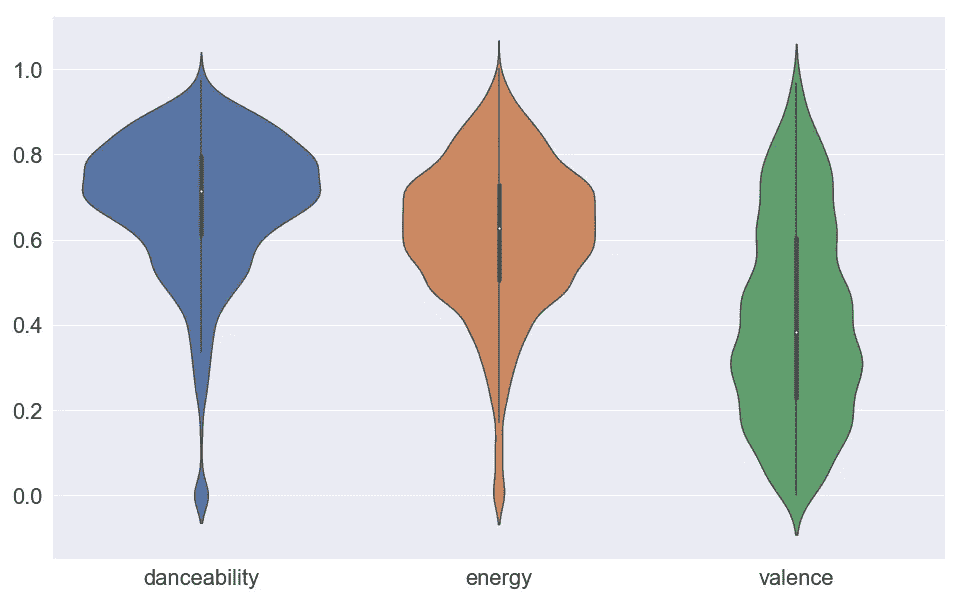
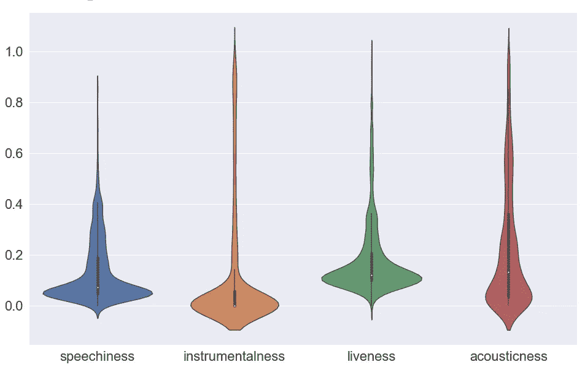
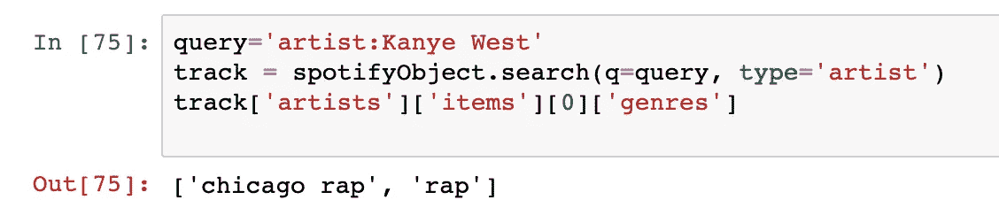
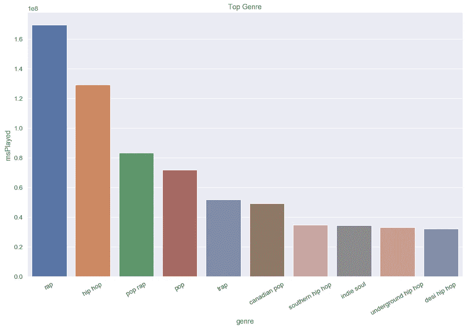
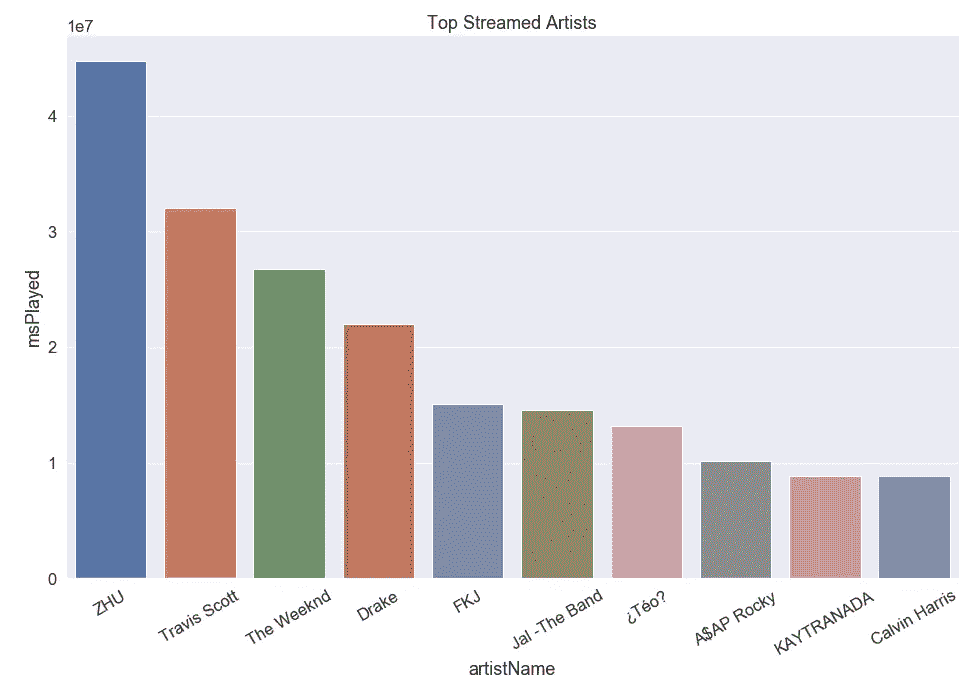

# 我的隔离区，包好了

> 原文：<https://towardsdatascience.com/my-quarantine-wrapped-94e5015dc847?source=collection_archive---------13----------------------->

## 在新冠肺炎疫情隔离期间，我用 Spotify 的 Python 客户端 SpotiPy 分析了我的音乐收听模式

播放列表' [Kartik 的热门歌曲 Kartik Dhawan 的 Quarantine](https://open.spotify.com/playlist/4gqQSY1i6coXFPkrQnynRP?si=39br08AfRnyQYhESEfvpMw) '的专辑封面。

2020 年初，Spotify 推出了一项名为“wrapped”的功能，为用户提供对其收听历史的分析。作为一个数据和音乐的爱好者，我真的很喜欢在应用程序上了解我的活动！几个月后，冠状病毒疫情迫使世界大部分地区进入强制隔离状态，导致许多人在家工作，与社会隔绝。

在隔离期间，我花了很多时间听音乐，所以我决定在 Spotify 上分析我的收听历史，并创建一个' Wrapped '来找点乐子！本文涵盖了一些基本的数据工程、分析、可视化，最重要的是一组高质量的曲子。

# 数据收集

Spotify 为开发者提供了一个名为 SpotiPy 的 python 库。它提供了对 Spotify 庞大音乐数据库上的 API 的访问。除此之外，Spotify 允许用户下载他们拥有的关于您的数据，以遵守欧盟的一般数据保护条例(GDPR)政策。我按照[的这些步骤](https://www.makeuseof.com/tag/download-privacy-data-spotify/)去做。数据文件包括一个流部分，这是我在这个分析中使用的部分。

熊猫数据帧中加载的 JSON 流文件

## 隔离期间我在 Spotify 上花的时间比平时多吗？

我问自己被困在家里是否影响了我在 Spotify 上的时间。我的直觉是，我比平时流了更多的歌曲，因此在应用程序上花费了更多的时间，我想用一个简单的图表来证明这一点，该图表按周绘制了总的流时间(以毫秒为单位)。

出于分析的目的，我将把 2020 年 3 月 11 日*作为我隔离的开始，因为这是我开始在家工作的日期。根据上面的图表，隔离开始后的一周(*3 月 16 日至 22 日*)是我在 Spotify 上播放时间最多的一周。除了被隔离的一周，其他时间都以高于平均水平的时间进行了播放！很明显，自从隔离开始后，我在 Spotify 上花的时间比平时多。*

我从我的流历史中创建了两个数据帧，以根据开始日期(*2020 年 3 月 11 日*)之前/之后播放的歌曲来识别隔离区中的活动。我合计了隔离数据帧的 ms streamed 列，以获得在 Spotify 上流式播放音频所花费的总时间。

> 隔离期间，我在 Spotify 上总共花了 12222 分钟

# 我花时间听了什么？

## 我花了多少时间听播客和音乐

Spotify 提供的流媒体数据不包括该曲目是播客还是音乐的指标。我通常听的播客大约 20-60 分钟，平均每首歌大约 4 分钟。我找到了所有超过 12 分钟的歌曲的艺术家，并将他们标记为“播客”。

我的流媒体历史中的播客

我是经济播客的忠实粉丝，NPR 的《星球货币》是我最喜欢的一个！)，我的一个朋友推荐《变革之风》作为一个很好的调查播客，它是关于中情局参与热门歌曲*蝎子*以及它如何潜在地导致冷战结束的。这是超级有趣的，[看看吧！](https://open.spotify.com/show/3vikAuFxKVNe2GBZC61IYD?si=8Kiuowj9Q9muiqYIi3LMDg)

按音频类型划分的 MsPlayed 切片

> 我在 spotify 上花了大约 20%的时间听播客

## 我发现了多少新的艺术家？

发现新音乐总是一个有趣又耗时的旅程。有了世界上所有的时间和 Spotify 上不同播放列表的访问权限，我开始了我的隔离音乐探索。

当我有一个播放列表在随机播放模式下运行，并且我不喜欢一首歌的前几秒钟，我通常会跳过它。为了避免计算跳过的歌曲，我添加了一个限制，即歌曲必须播放超过 10 秒。然后，我只是统计了隔离数据框中不存在于常规数据框中的艺术家数量。

> 我发现了 **281 位艺术家**和 **6 个播客**

## 我在播放列表中添加了多少首新曲目？

一个自然的过程是计算出我在我的播放列表中添加了多少首新歌。我在 Spotify 上有 5 个公共播放列表，用于不同的心情/场合。我使用 SpotiPy 的***user _ playlists***API 来获取我所有的公共播放列表 ID，并将这些 ID 传递给 API***user _ playlist _ tracks***来获取这些播放列表中的所有歌曲，我将一些必要的属性存储在一个数据帧中。

播放列表的随机样本跟踪数据帧

最后，为了与流历史文件保持一致，我在 3 月 11 日之后和 5 月 15 日之前按添加的日期对这些数据进行了切片。

> 我添加了 **89 首歌曲**横跨 **5 个播放列表**

## 在隔离期间，我的流历史记录中有哪些常见主题？

我问自己，在封锁期间听的歌曲中是否有共同点。SpotiPy 有一个 API，允许用户从音轨返回音频特征。这些音频功能的例子有:

1.  **可跳性**:0-1 之间的一个值，用于判断一个轨道的可跳性
2.  **能量**:0-1 之间的一个值，用来衡量一个轨迹的强度和活跃程度
3.  **响度**:整体响度，单位为分贝。值的范围从-60 到 0
4.  **语速**:测量音轨中有多少是由口语组成的，范围为 0-1
5.  **声音度**:测量音轨是否有声音，范围为 0-1
6.  **乐器性**:预测音轨是否没有人声，范围为 0-1
7.  **效价**:这描述了音轨在音乐上的积极程度。标度 0-1

关于这些属性的更多信息可以在 API 的官方文档中找到[这里](https://developer.spotify.com/documentation/web-api/reference/tracks/get-audio-features/)

该 API 需要一个 track_id 作为参数，所以第一步是为我的隔离流历史中的每个磁道返回一个磁道 id。我使用 SpotiPy **search** API，在一些正则表达式的帮助下，使用我的流数据中的 trackName 和 artistName 列构建一个查询，以返回我的数据帧中的 songId。

我使用上面代码返回的歌曲 ID 作为***audio _ features***API 中的参数，并将元数据保存为我的数据帧的一部分。

> **问**:什么样的剧情最适合把数据可视化在音乐上？
> 
> **A** :小提琴剧情..(咄！)

我在隔离期间的流动历史非常适合跳舞，充满活力，因为毕竟谁不需要一个理由来跳舞，而被困在家里？在我的流历史中，效价图显示的积极因素是均匀分布的。

上述大多数音频特征的头和尾都延伸到了极端，这表明我听的歌曲在乐器、现场或原声方面范围很广。然而，我的大部分流都在所有三个指标的底部。

> 隔离期间听了**高度** **可舞**和**活力**的歌曲

## 我最喜欢的流派是什么？

2019 年 Wrapped 的一个流行特征是“顶级流派”。我发现 SpotiPy 库将流派作为艺术家的一部分，而不是歌曲的一部分，它可以通过**艺术家** API 获得。

一个艺术家可以有多种风格。这提出了一个数据工程的挑战，因为在我的基础数据框架中存储流派会引入重复，并且做额外的分析会变得复杂。因此，我决定将艺术家和流派保存在一个单独的数据框中，并将其加入到我的流历史框中，以通过简单的分组方式获得顶级流派。

我遍历我的流媒体历史中所有独特的艺术家，以构建 SpotiPy 搜索查询，然后遍历与艺术家相关的每个流派，并将流派和艺术家的名字添加到 pandas 数据框中。我将此数据框加入到我的艺术家姓名和流派分组的流历史中。结果在下图中！

说唱是我最喜欢的类型。我的前 10 个流派很好地混合了嘻哈子流派(德西、地下、南方)。除了 Hip Hop/Rap，我还听了一些流行音乐、陷阱音乐和独立灵魂音乐！

## 谁是我的顶级流媒体艺术家？

这是 Spotify 2019 wrapped 中的一个受欢迎的功能。我决定看看我最喜欢的 10 位艺术家。一群简单的熊猫就做到了！

当我在为 TDS 写我的[上一篇文章](/exploring-the-world-of-ramen-through-text-analytics-1131280c4c6b)时，我在 YouTube 上发现了[的这首](https://www.youtube.com/watch?v=XHNHq1mC0VQ&t=3402s) ***朱*** 集，我再次迷上了他的音乐。特拉维斯·斯科特是我最喜欢的艺术家已经有一段时间了。**威肯**推出了一张新专辑， [*下班后*](https://open.spotify.com/album/4yP0hdKOZPNshxUOjY0cZj?si=7-AttA6BS3GjOTEMqHjPCw) 在隔离期开始的时候，来点复古的感觉吧！FKJ 是我在隔离期间发现的一位艺术家，他演奏多种乐器，是我听过的最有天赋的艺术家之一。看看他的专辑， [*法国猕猴桃汁*](https://open.spotify.com/album/0jJ7mMkCkTe7p9EJgSRxgi?si=5kQSHzh6RW2tugOQbleZWg) ！

## 我最喜欢的歌曲是什么？

综合起来，我想生成一个播放列表，其中包含我在隔离期间的所有热门歌曲，这样我就可以记住这段时间以及帮助我度过这一阶段的歌曲！

我创建了一个数据框，用熊猫分组，按播放次数降序排列，得到我的前 50 首歌曲。我使用了一个函数来获取这些曲目的歌曲 id。我使用**user _ playlist _ create**API 创建了一个播放列表，然后使用**user _ playlist _ add _ tracks**添加我的分组数据框对象中的所有歌曲。

我包装上的歌曲包括新专辑 drops ( *威肯*)、历史上最受欢迎的(*足以相信*)、复古(*加尔文·哈里斯*)以及流行文化歌曲，如“*sketcher*”，这些歌曲在被推荐到 [Tik Tok](https://www.tiktok.com/@nabeeljeewa/video/6797062502384520454) 和“*Bella Ciao”*后迅速走红，这是我在隔离期间碰巧狂看的热门网飞系列《金钱大劫案》的主题曲！

最后，我想对那些把新音乐介绍给我的人大喊一声，你们知道你们是谁！Spotify 是一个如此棒的应用程序；通过让音乐变得容易理解来帮助人们度过困难时期。享受听这些宝石！

这是我的 git 库的链接:

 [## kartikd1/Spotify

### 通过在 GitHub 上创建帐户，为 kartikd1/Spotify 开发做出贡献。

github.com](https://github.com/kartikd1/Spotify)