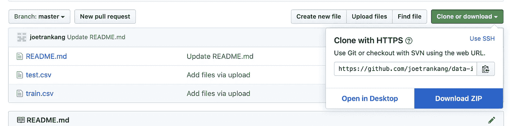

# Python 中的随机森林分类器

> 原文：<https://towardsdatascience.com/my-random-forest-classifier-cheat-sheet-in-python-fedb84f8cf4f?source=collection_archive---------2----------------------->

## 一次处理分类变量和数值变量的端到端注释


[Guillaume Henrotte](https://unsplash.com/@guigui1410?utm_source=medium&utm_medium=referral) 在 [Unsplash](https://unsplash.com?utm_source=medium&utm_medium=referral) 上拍摄的照片

# 内容

1.  数据预处理(自动处理分类特征和 NAs 的技巧)
2.  训练射频分类器
3.  评估分类器(准确度、召回率、精确度、ROC AUC、混淆矩阵、绘图)
4.  特征重要性
5.  通过随机搜索调整超参数

现在让我们开始吧，伙计们！

# 数据描述

在本文中，我使用的数据集来自我在一家科技公司为一个数据科学职位进行的真实技术测试。你可以在这里获得数据[(点击下载 ZIP)。](https://github.com/joetrankang/data-is-life.git)



> 声明:数据中描述的所有信息都不真实。


这里的`exit_status`是响应变量。注意，我们只给出了`train.csv`和`test.csv`。`test.csv`没有`exit_status`，即仅用于预测。因此，方法是我们需要将`train.csv`分成训练和验证集来训练模型。然后用模型预测`test.csv`中的`exit_status`。

这是一个典型的数据科学技术测试，您有大约 30 分钟的时间来制作详细的 jupyter 笔记本和结果。

# 1.数据预处理

```
import pandas as pd
import numpy as np
import matplotlib.pyplot as pltdata = pd.read_csv('train.csv')
```


哎呀，我们看到了 NaN，让我们检查一下我们有多少 NaN

## **检查 NAs**

```
data.isnull().sum()
```


由于总共有 2600 行，所以这里使用 NAs 的行数相对较少。但是，我在这里没有删除 NAs，因为如果`test.csv`数据集也有 NAs，那么删除训练数据中的 NAs 将无法使我们预测有 NAs 的客户的行为。但是，如果`test.csv`没有任何 NAs，那么我们可以继续并删除训练数据集中的 NAs。但是让我们先来看看`test.csv`

```
test = pd.read_csv('test.csv')
test.isnull().sum()
```


不出所料，`test.csv`中有 NAs。因此，我们将 NAs 视为一个类别，并假设它对响应变量`exit_status`有贡献。

## **将** `exit_status` **中的是-否替换为 1–0**

```
exit_status_map = {'Yes': 1, 'No': 0}
data['exit_status'] = data['exit_status'].map(exit_status_map)
```

这一步在后面很有用，因为响应变量必须是一个数字数组才能输入到 RF 分类器中。正如我前面提到的，RF 模型不能读取字符串或任何非数字数据类型。

## **将数据分为 X 和 y**

```
y = data.pop('exit_status')
X = data.drop('id',axis = 1)
```

`id`列不会给我们的工作增加任何意义，因为它不会影响客户是选择留下还是离开，所以我们应该删除它。

## **创建培训和验证集**

```
seed = 50  # so that the result is reproducible
from sklearn.model_selection import train_test_splitX_train, X_test, y_train, y_test = train_test_split(X,y,test_size=0.333, random_state = seed)
```

现在，是时候让 NA 成为一个类别了。在 Python 中，`NaN`被认为是 NAs。编码后，那些`NaN`将被忽略。因此，用`na`代替`NaN`是有用的，它现在是一个叫做‘na’的类别。稍后编码时会考虑到这一点。

```
X_train = X_train.fillna('na')
X_test = X_test.fillna('na')
```

## **创建分类变量列表进行编码**

```
X_train.dtypes
```


请注意，只有分类变量具有 dtype = object

现在，让我们创建一个分类变量列表

```
features_to_encode = list(X_train.select_dtypes(include = ['object']).columns) # Or alternatively, features_to_encode = X_train.columns[X_train.dtypes==object].tolist() 
```

## **为我们创建一个处理分类特征的构造函数**

这是我最喜欢的一步，因为通过重新创建这个新的构造函数，当传递到模型中时，我不需要对任何 X 数据帧进行任何转换。 ***这个构造函数会自动处理分类变量，而不会影响数值变量*** 。多方便啊！！！

```
from sklearn.preprocessing import OneHotEncoder
from sklearn.compose import make_column_transformercol_trans = make_column_transformer(
                        (OneHotEncoder(),features_to_encode),
                        remainder = "passthrough"
                        )
```

`remainder = 'passthrough'`允许构造器忽略那些**不**包含在`features_to_encode`中的变量。

现在我们的输入准备好了。让我们训练射频分类器。

# 2.训练射频分类器

让我们首先创建我们的第一个模型。当然可以从`rf_classifier = RandomForestClassifier()`开始。然而，大多数情况下，这个基本模型的性能不会很好(至少从我的经验来看，你的可能会有所不同)。所以我总是从下面的一组参数开始，作为我的第一个模型。

```
from sklearn.ensemble import RandomForestClassifierrf_classifier = RandomForestClassifier(
                      min_samples_leaf=50,
                      n_estimators=150,
                      bootstrap=True,
                      oob_score=True,
                      n_jobs=-1,
                      random_state=seed,
                      max_features='auto')
```

我建议总是从模型开始，因为最好使用袋外样本来估计泛化精度。oob 误差估计与通过 k 倍交叉验证获得的误差估计几乎相同。与许多其他非线性估计器不同，随机森林可以适合一个序列，并在此过程中进行交叉验证。

现在，让我们通过使用`Pipeline`来组合我们的分类器和我们之前创建的构造器

```
from sklearn.pipeline import make_pipeline
pipe = make_pipeline(col_trans, rf_classifier)
pipe.fit(X_train, y_train)
```

`pipe`是一个新的黑盒，由 2 个组件组成:1。一个构造函数来处理带有分类变量的输入，并转换成正确的类型。从构造函数接收这些新转换的输入的分类器。

```
y_pred = pipe.predict(X_test)
```


# 3.评估分类器

```
from sklearn.metrics import accuracy_score, confusion_matrix, precision_score, recall_score, roc_auc_score, roc_curve, f1_score
```

准确度= (TP + TN) / (TP+TN+FP+FN)

召回= TP / (TP + FN)

精度= TP / (TP + FP)

f1-得分= 2 *精度*召回/(精度+召回)

在本例中，1 为正，0 为负

> 我不会解释上面每个术语的意思，因为这篇文章并不是随机森林算法的详细文档。我想我们都知道这些术语的意思。当然，如果你不确定，可以在评论区问我。

## **准确度(正确分类样本的分数)**

```
accuracy_score(y_test, y_pred)print(f"The accuracy of the model is {round(accuracy_score(y_test,y_pred),3)*100} %")**The accuracy of the model is 91.1%**
```

## **进行概率预测**

```
train_probs = pipe.predict_proba(X_train)[:,1] 
probs = pipe.predict_proba(X_test)[:, 1]train_predictions = pipe.predict(X_train)
```

`predict_proba(dataframe)[:,1]`给出数据帧中类别标签 1 的预测概率分布。这对于计算 ROC_AUC 分数很重要。你可能会问为什么类的标签是 1 而不是 0。以下是我从 sklearn 文档中得到的内容:


对于`y_score`，‘*二进制情况…分数必须是标签* ***大于****的类的分数。这就是为什么我们需要得到标签 1 而不是标签 0。*

```
*print(f'Train ROC AUC Score: {roc_auc_score(y_train, train_probs)}')print(f'Test ROC AUC  Score: {roc_auc_score(y_test, probs)}') **Train ROC AUC Score: 0.9678578659647703 
Test ROC AUC Score: 0.967591183178179***
```

*现在，我们需要绘制 ROC 曲线*

```
*def evaluate_model(y_pred, probs,train_predictions, train_probs): baseline = {} baseline['recall']=recall_score(y_test, [1 for _ in range(len(y_test))]) baseline['precision'] = precision_score(y_test, [1 for _ in range(len(y_test))]) baseline['roc'] = 0.5 results = {} results['recall'] = recall_score(y_test, y_pred) results['precision'] = precision_score(y_test, y_pred) results['roc'] = roc_auc_score(y_test, probs) train_results = {} train_results['recall'] = recall_score(y_train,       train_predictions) train_results['precision'] = precision_score(y_train, train_predictions) train_results['roc'] = roc_auc_score(y_train, train_probs) for metric in ['recall', 'precision', 'roc']:          print(f'{metric.capitalize()} 
                 Baseline: {round(baseline[metric], 2)} 
                 Test: {round(results[metric], 2)} 
                 Train: {round(train_results[metric], 2)}') **# Calculate false positive rates and true positive rates** base_fpr, base_tpr, _ = roc_curve(y_test, [1 for _ in range(len(y_test))]) model_fpr, model_tpr, _ = roc_curve(y_test, probs) plt.figure(figsize = (8, 6))
    plt.rcParams['font.size'] = 16 # Plot both curves plt.plot(base_fpr, base_tpr, 'b', label = 'baseline')
    plt.plot(model_fpr, model_tpr, 'r', label = 'model')
    plt.legend(); plt.xlabel('False Positive Rate');
    plt.ylabel('True Positive Rate'); plt.title('ROC Curves');
    plt.show();evaluate_model(y_pred,probs,train_predictions,train_probs) **Recall Baseline: 1.0 Test: 0.92 Train: 0.93 
Precision Baseline: 0.48 Test: 0.9 Train: 0.91 
Roc Baseline: 0.5 Test: 0.97 Train: 0.97***
```

**

*结果看起来不错。测试和训练结果之间的差异非常小，表明我们的模型没有过度拟合数据。*

## ***混乱矩阵***

*人们可以简单地输入`confusion_matrix(y_test, y_pred)`来得到混淆矩阵。然而，让我们采取更高级的方法。在这里，我创建一个函数来绘制混淆矩阵，这个函数**打印并绘制混淆矩阵。**(改编自[代码来源](http://scikit-learn.org/stable/auto_examples/model_selection/plot_confusion_matrix.html))*

```
*import itertoolsdef plot_confusion_matrix(cm, classes, normalize = False,
                          title='Confusion matrix',
                          cmap=plt.cm.Greens): # can change color     plt.figure(figsize = (10, 10))
    plt.imshow(cm, interpolation='nearest', cmap=cmap)
    plt.title(title, size = 24)
    plt.colorbar(aspect=4) tick_marks = np.arange(len(classes))
    plt.xticks(tick_marks, classes, rotation=45, size = 14)
    plt.yticks(tick_marks, classes, size = 14) fmt = '.2f' if normalize else 'd'
    thresh = cm.max() / 2. # Label the plot for i, j in itertools.product(range(cm.shape[0]),   range(cm.shape[1])): plt.text(j, i, format(cm[i, j], fmt), 
             fontsize = 20,
             horizontalalignment="center",
             color="white" if cm[i, j] > thresh else "black") plt.grid(None)
    plt.tight_layout()
    plt.ylabel('True label', size = 18)
    plt.xlabel('Predicted label', size = 18) # Let's plot it outcm = confusion_matrix(y_test, y_pred)
plot_confusion_matrix(cm, classes = ['0 - Stay', '1 - Exit'],
                      title = 'Exit_status Confusion Matrix')*
```

**

# *4.特征重要性*

*首先，让我们检查模型中有多少个特征重要性值*

```
*print(rf_classifier.feature_importances_)print(f" There are {len(rf_classifier.feature_importances_)} features in total")**[7.41626071e-04 6.12165359e-04 1.42322746e-03 6.93254520e-03  2.93650843e-04 1.96706074e-04 1.85830433e-03 2.67517842e-03  1.02110066e-05 2.99006245e-05 6.15325794e-03 1.66647237e-02  4.49100748e-03 3.37963818e-05 1.87449830e-03 1.00225588e-03  3.72119245e-04 1.39558189e-02 8.28073088e-04 3.41692010e-04  1.71733193e-04 7.60943914e-02 1.09485070e-02 1.78380970e-02  1.63392715e-02 2.93397339e-03 1.46445733e-02 1.34849432e-01  1.33144331e-02 4.42753783e-02 3.13204793e-03 4.97894324e-03  6.17692498e-03 2.70959923e-02 1.61849449e-03 7.57024010e-02  2.31468190e-02 4.66247828e-01]** **There are 38 features in total***
```

*总共有 38 个特征。但是，X_train 只有 15 列。这是因为模型`pipe`自动对 X_train 中的分类变量进行编码。例如，X_train 中的`gender`列被转换为 2 列`Female`和`Male`。*

*因此，为了将特性与从`rf_classifier`获得的特性重要性值相匹配，我们需要在编码的 X_train 中获得所有那些**对应的**列。*

> ***问题**:*
> 
> ***我们只有一个特征重要性数组，但是有分类和数字特征，我们如何知道哪个值属于哪个特征？***

*还记得我们之前创建的构造函数`col_trans`吗？`col_trans.fit_transform(X_train)`将给出编码的 X_train。*

```
*# Let's look at the first row
print(col_trans.fit_transform(X_train)[0,:])**[ 0\.    1\.    0\.    0\.    0\.    1\.    1\.    0\.    0\.    1\.    1\.    0\.   0\.    0\.    1\.    0\.    0\.    0\.    1\.    0\.    0\.    1\.    0\.    0\.   1\.    0\.    0\.    1\.    0\.    0\.    0\.    1\.    0\.    1\.    0\.   30\.  74.75 14\.  ]**# And the first row of X_train
X_train.iloc[0,:] **gender                             Male
age                                 >60
dependents                           No
lifetime                             30
phone_services                      Yes
internet_services                    3G
online_streaming             Major User
multiple_connections                 No
premium_plan                         No
online_protect                       No
contract_plan            Month-to-month
ebill_services                      Yes
default_payment         Online Transfer
monthly_charges                   74.75
issues                               14
Name: 1258, dtype: object***
```

*对于 X_train，有 3 个数值变量，值分别为 30、70.75 和 14。对于编码的 X_train，这 3 个数值放在所有分类变量之后。这意味着对于`rf_classifier.feature_importances_` **，首先显示所有编码的分类变量，随后是数值变量***

*好了，现在我们知道了，让我们创建一个合适的编码 X_train。*

```
*def encode_and_bind(original_dataframe, features_to_encode): dummies = pd.get_dummies(original_dataframe[features_to_encode])
    res = pd.concat([dummies, original_dataframe], axis=1)
    res = res.drop(features_to_encode, axis=1)
    return(res)X_train_encoded = encode_and_bind(X_train, features_to_encode)*
```

*函数`encode_and_bind`对分类变量进行编码，然后将它们与原始数据帧相结合。*

**

*x _ 火车 _ 编码*

*酷，现在我们有 38 列，这和之前在`rf_classifier.feature_importances_`中显示的 38 个特性完全一样。*

```
*feature_importances = list(zip(X_train_encoded, rf_classifier.feature_importances_))**# Then sort the feature importances by most important first**
feature_importances_ranked = sorted(feature_importances, key = lambda x: x[1], reverse = True)**# Print out the feature and importances** [print('Feature: {:35} Importance: {}'.format(*pair)) for pair in feature_importances_ranked];*
```

**

*一些特征及其重要性分数(降序)*

```
***# Plot the top 25 feature importance**feature_names_25 = [i[0] for i in feature_importances_ranked[:25]]
y_ticks = np.arange(0, len(feature_names_25))
x_axis = [i[1] for i in feature_importances_ranked[:25]]plt.figure(figsize = (10, 14))
plt.barh(feature_names_25, x_axis)   #horizontal barplot
plt.title('Random Forest Feature Importance (Top 25)',
          fontdict= {'fontname':'Comic Sans MS','fontsize' : 20})plt.xlabel('Features',fontdict= {'fontsize' : 16})
plt.show()*
```

**

# *5.使用 RandomSearchCV 调整超参数*

*由于模型性能非常好，具有很高的准确度、精确度和召回率，因此实际上几乎不需要对模型进行调优。但是，如果我们的第一个模型表现不佳，可以采取以下步骤来调整模型。*

*让我们看看目前使用的参数*

```
*from pprint import pprintprint('Parameters currently in use:\n')
pprint(rf_classifier.get_params())*
```

**

*现在，我为模型创建了一个参数网格，以便**随机**挑选和训练，因此命名为随机搜索。*

```
***from sklearn.model_selection import RandomizedSearchCV**n_estimators = [int(x) for x in np.linspace(start = 100, stop = 700, num = 50)]max_features = ['auto', 'log2']  # Number of features to consider at every splitmax_depth = [int(x) for x in np.linspace(10, 110, num = 11)]   # Maximum number of levels in treemax_depth.append(None)min_samples_split = [2, 5, 10]  # Minimum number of samples required to split a nodemin_samples_leaf = [1, 4, 10]    # Minimum number of samples required at each leaf nodebootstrap = [True, False]       # Method of selecting samples for training each tree random_grid = {'n_estimators': n_estimators, 'max_features': max_features, 'max_depth': max_depth, 'min_samples_split': min_samples_split, 'min_samples_leaf': min_samples_leaf, 'max_leaf_nodes': [None] + list(np.linspace(10, 50, 500).astype(int)), 'bootstrap': bootstrap}*
```

*现在，我首先创建一个基础模型，然后使用随机网格根据 ROC_AUC 得分选择最佳模型，因此有了`scoring = 'roc_auc'`。*

```
***# Create base model to tune**rf = RandomForestClassifier(oob_score=True)**# Create random search model and fit the data**rf_random = RandomizedSearchCV( estimator = rf, param_distributions = random_grid, n_iter = 100, cv = 3, verbose=2, random_state=seed,                        scoring='roc_auc')rf_random.fit(X_train_encoded, y_train)rf_random.best_params_rf_random.best_params_**{'n_estimators': 206,
 'min_samples_split': 5,
 'min_samples_leaf': 10,
 'max_leaf_nodes': 44,
 'max_features': 'auto',
 'max_depth': 90,
 'bootstrap': True}***
```

*我们将用三重交叉验证进行 100 次迭代。关于参数的更多信息可以在[这里](https://scikit-learn.org/stable/modules/generated/sklearn.model_selection.RandomizedSearchCV.html)找到。*

***或者**，我们可以再次使用`pipe`，这样我们就不需要编码数据了*

```
*rf = RandomForestClassifier(oob_score=True, n_jobs=-1)rf_random = RandomizedSearchCV( estimator = rf, param_distributions = random_grid, n_iter = 50, cv = 3, verbose=1, random_state=seed, scoring='roc_auc')pipe_random = make_pipeline(col_trans, rf_random)pipe_random.fit(X_train, y_train)rf_random.best_params_*
```

*请注意，这两种方法给出的答案可能略有不同。这是由于选择参数的随机性。*

```
***# To look at nodes and depths of trees use on average**n_nodes = []max_depths = []for ind_tree in best_model.estimators_: n_nodes.append(ind_tree.tree_.node_count) max_depths.append(ind_tree.tree_.max_depth)print(f'Average number of nodes {int(np.mean(n_nodes))}')   print(f'Average maximum depth {int(np.mean(max_depths))}') **Average number of nodes 82 
Average maximum depth 9***
```

***评估最佳车型***

```
***# Use the best model after tuning**best_model = rf_random.best_estimator_pipe_best_model = make_pipeline(col_trans, best_model)pipe_best_model.fit(X_train, y_train)y_pred_best_model = pipe_best_model.predict(X_test)*
```

*第 3 节中使用的相同代码可以再次应用于 ROC 和混淆矩阵。*

```
*train_rf_predictions = pipe_best_model.predict(X_train)train_rf_probs = pipe_best_model.predict_proba(X_train)[:, 1]rf_probs = pipe_best_model.predict_proba(X_test)[:, 1]**# Plot ROC curve and check scores**evaluate_model(y_pred_best_model, rf_probs, train_rf_predictions, train_rf_probs)**Recall Baseline: 1.0 Test: 0.94 Train: 0.95 
Precision Baseline: 0.48 Test: 0.9 Train: 0.91 
Roc Baseline: 0.5 Test: 0.97 Train: 0.98***
```

**

*这组参数使模型的性能比我们的原始模型稍好一些。差别并不大。这是可以理解的，因为我们的原始模型已经表现得很好，得分更高(准确度、精确度、召回率)。因此，调整一些超参数可能不会给模型带来任何显著的改进。*

```
***# Plot Confusion matrix**plot_confusion_matrix(confusion_matrix(y_test, y_pred_best_model), classes = ['0 - Stay', '1 - Exit'],title = 'Exit_status Confusion Matrix')*
```

**

# *对`test.csv`数据使用最佳模型*

*现在我们有了最好的模型，让我们用它来进行预测，并编译我们的最终答案来提交。*

```
*test = pd.read_csv('test.csv')
test_withoutID = test.copy().drop('id', axis = 1)
test_withoutID = test_withoutID.fillna('na')final_y = pipe_best_model.predict(test_withoutID)
#pipe model only takes in dataframe without ID column. final_report = test
final_report['exit_status'] = final_y
final_report = final_report.loc[:,['id','exit_status']]# Replace 1-0 with Yes-No to make it interpretablefinal_report= final_report.replace(1, 'Yes')
final_report= final_report.replace(0, 'No')*
```

**

*我们都看到了`No`。让我们检查以确保该列中也有`Yes`。*

```
*final_report.exit_status.value_counts()**No     701
Yes    638
Name: exit_status, dtype: int64***
```

*好了，我们安全了~*

# *保存并提交文件*

```
*final_report.to_csv('submissions.csv', index=False)*
```

# *结论*

*我希望这也能成为你们有用的参考指南。您可以使用本指南来准备一些技术测试，或者将它作为一个备忘单来复习如何用 Python 实现随机森林分类器。我一定会继续更新，因为我发现了更多有用的函数或技巧，我认为它们可以帮助每个人快速解决许多数据科学问题，而不需要在 StackOverflow 这样的平台上查找，特别是在时间有限的技术测试中。*

*如果还有其他你认为重要的技巧或功能，请在下面的评论区告诉我。此外，我欢迎任何人的建设性反馈。*

*谢谢你的阅读。祝您愉快，编程愉快！*