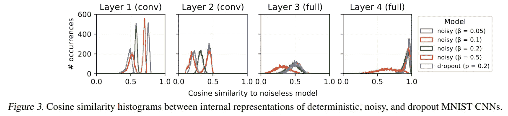
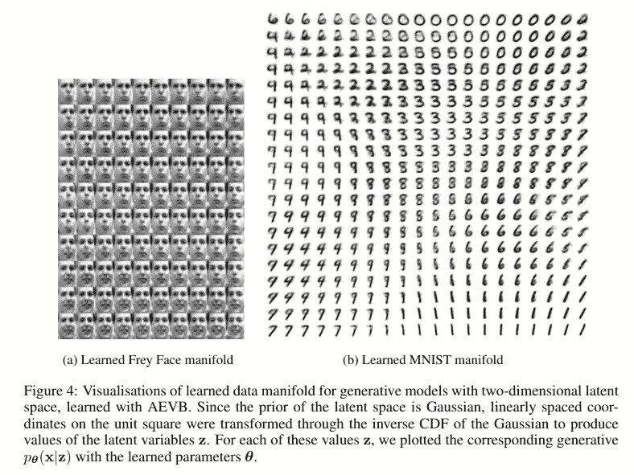
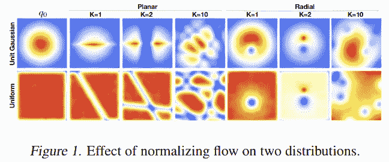
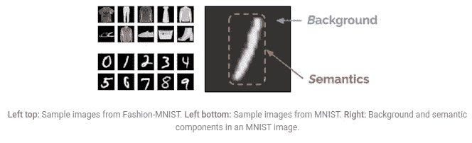
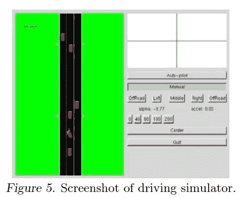
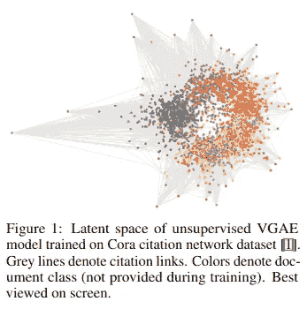

# 我的深度学习阅读清单

> 原文：<https://towardsdatascience.com/my-reading-list-for-deep-learning-686e1c80359d?source=collection_archive---------45----------------------->

## 为那些希望开始深度学习的人和那些希望填补他们知识空白的人推荐的文献。

[真诚媒体](https://unsplash.com/@sincerelymedia?utm_source=medium&utm_medium=referral)在 [Unsplash](https://unsplash.com?utm_source=medium&utm_medium=referral) 上拍摄的照片

这是我推荐的关于深度学习各个方面的资源的精选列表，虽然基于我自己的个人经验，但很大程度上受到了[这个 Github 库](https://github.com/floodsung/Deep-Learning-Papers-Reading-Roadmap)的启发。我打算随着新论文的出现，或者如果我设法发现一些真正对我有影响的论文，几乎定期地更新这个列表。

这个阅读清单相对来说比较长，我并不宣称已经阅读了每一页上的每一个单词。然而，我坚信发展良好的基础:鉴于深度学习的当前状态有多广阔，如果你从零开始，你必须赶上很多。我的建议是大步前进，在你需要的时候学习你需要的东西；*这是必然的，但不是不可克服的*！

# 建立良好的基础

不管你喜不喜欢，深度学习无论是线性代数还是统计，都需要大量的背景知识；你需要一个坚实的基础才能建造一座大厦。前者是理解每一个模型背后的核心机制的一个必要条件，而发展一个良好的线性代数直觉可以让你洞察到一些模型所涉及的一些技巧(例如，内积解码器，inception 架构)。对于一些较简单的任务，例如分类，需要对后者有基本的了解。当我们讨论更复杂的问题时，贝叶斯统计的背景非常有帮助:这些想法构成了概率建模的主干，用于生成模型——基于所学知识创建新数据的模型。

对于线性代数，我其实并不推荐一本数学教材。而是推荐 [*数学对于量子化学*](https://www.amazon.com/Mathematics-Quantum-Chemistry-Dover-Books/dp/0486442306)；不要让标题把你搞糊涂了，因为这本已经很短的书的前几章给了你一个快速入门和线性代数性质的很好的参考。量子化学实际上使用了许多与深度学习相同的机制(有许多矩阵乘法和因式分解)，所有这些都是为了解决薛定谔方程的近似问题。您将学习如何将概念表达为基函数、投影和求解线性方程。这本书是由多佛出版社出版的，所以买起来非常便宜，而且随身携带也很好！

对于统计学，我一般会避免典型的侧重于假设检验(即*p*-值)的大学教科书，这在心理学和生物学中可能会很常见。这些想法背后的前提是“频繁主义者”，依我拙见，你最好像贝叶斯统计学家那样思考(尽管不要太害怕被不确定性麻痹)。出于这个原因，我推荐盖尔曼、卡林、斯特恩和鲁宾的 [*贝叶斯数据分析*](https://www.amazon.com/Bayesian-Analysis-Chapman-Statistical-Science/dp/158488388X) ，还有一本更实用的书，麦克雷瑟的 [*统计再思考:一门贝叶斯课程，示例见 R 和斯坦*](https://xcelab.net/rm/statistical-rethinking/) 。前者特别让你根据可能性来构建任何问题，并提供案例研究来理解贝叶斯统计如何帮助我们解决现实生活中的问题并理解不确定性的作用。

# 建造房子的框架

有两个具体的资源我会推荐，它们会让你做好准备: [*深度学习*](https://www.deeplearningbook.org/) 由该领域的三位巨头:伊恩·古德菲勒、约舒阿·本吉奥和亚伦·库维尔，以及吴恩达的关于 deeplearning.ai 的课程。前者提供了深度学习基础的极其坚实的基础和理论支撑，而吴恩达的课程更加务实，教你如何从头开始实现这些模型。配合吴恩达课程的好书是弗朗索瓦·乔莱的《用 Python 进行深度学习的*》。在这两种情况下，都非常关注 Tensorflow 和 Keras(原因很明显)，尽管从*深度学习*中学习应该为您提供足够的抽象来实现许多基础知识。*

*本质上，这三种材料的组合足以让你开始摆弄深度学习模型。当然，这确实说起来容易做起来难，因为有大量的阅读，但是你未来的自己会感谢你的！*

*在这一点上，许多深度学习的最新概念来自学术论文:与许多其他领域不同，几乎所有的材料都是免费的。我们很幸运，机器学习和深度学习研究人员倾向于将大量论文上传到 arXiv 上，这对于其他学科(例如化学、物理等)来说并不真实。).我建议找一些你有兴趣解决的事情，并开始阅读提供这些问题解决方案的论文。例如，如果你正在处理图像，看看卷积模型:AlexNet，LeNet，Inception，举几个例子(按这个顺序)。如果你处理数字/序列数据，看看递归神经网络。[这个 Github 库](https://github.com/floodsung/Deep-Learning-Papers-Reading-Roadmap)提供了直到几年前的论文集锦，涵盖了许多当前最先进的更具开创性的论文。如果我没有提到其中的一篇论文，它可能会在那个库中。*

*在接下来的几节中，我将讨论更多具体的应用，这些应用并不总是被系统地报道或者进入主流媒体，但是(我认为)非常酷。这是我对一些文件的一站式商店的想法，它将让你开始一段漫长的旅程。*

***额外材料:** [这篇 arXiv 论文](https://arxiv.org/pdf/1404.7828.pdf)提供了深度学习相当全面的历史概述，可以追溯到 20 世纪初的思想。*

# *特定主题*

## *学习动力和能力*

*有一件事，我还没有找到很多关于神经网络容量的帖子或文章:这不是一个简单的问题，在这个问题上，文献实际上是非常多样的。虽然大多数人可能会认为这“太理论化”，但通过理解神经网络如何保留 T2 的信息，还是有重要的意义。我发现这个领域非常有趣，因为它无疑为优化问题增加了一个“有机”的成分。*

**

*图改编自[估算神经网络中的信息流](http://people.lids.mit.edu/yp/homepage/data/dnn-infoflow.pdf)。*

*   *[估计神经网络中的信息流](http://people.lids.mit.edu/yp/homepage/data/dnn-infoflow.pdf)*
*   *[前馈神经网络的能力](https://www.math.uci.edu/~rvershyn/papers/bv-capacity-neural-networks.pdf)*
*   *[关于深度神经网络的表达能力](https://arxiv.org/pdf/1606.05336.pdf)。*

## *自动编码器*

*自动编码器是一类整洁的模型，试图学习以无监督的方式提取有用的特征。基本要点是编码器模型产生嵌入，解码器模型可以使用该嵌入来再现输入，并且通过这样做，学习将输入的重要部分压缩成小的特征向量。[这篇博客文章](https://lilianweng.github.io/lil-log/2018/08/12/from-autoencoder-to-beta-vae.html)全面概述了各种自动编码器。*

**

*图改编自[自动编码变分贝叶斯](http://arxiv.org/pdf/1312.6114)*

*   *[神经网络中的模块学习，1987 年](https://dl.acm.org/doi/10.5555/1863696.1863746)*
*   *[自动编码变分贝叶斯](http://arxiv.org/pdf/1312.6114)；变型自动编码器的描述。*
*   *变分自动编码器简介；VAE 氏症的最新介绍。*
*   *[β-VAE:用约束变分框架学习基本视觉概念](https://openreview.net/pdf?id=Sy2fzU9gl)；变型自动编码器的最新发展。*
*   *[矢量量化变分自动编码器](https://arxiv.org/pdf/1906.00446.pdf)*
*   *[时间差变分自动编码器](https://arxiv.org/pdf/1806.03107.pdf)*

*虽然变分自动编码器很酷，但它们通常受到一个事实的限制[，即在许多(可能是大多数)情况下，对角高斯不能很好地逼近真实的后验概率](http://akosiorek.github.io/ml/2018/04/03/norm_flows.html)。规范化流是一种通过一系列可逆转换将简单、易于计算的分布转换为更具表达性的分布的方法。*

**

*根据标准化流的变分推断改编的图形*

*   *[流程正常化的变分推理](https://arxiv.org/pdf/1505.05770.pdf)；演示标准化流程的想法。*
*   *[用于密度估计的掩蔽自回归流](https://arxiv.org/pdf/1705.07057.pdf)*
*   *[标准化流程:当前方法的介绍和回顾](https://arxiv.org/pdf/1908.09257.pdf)*

## *概率模型*

**贝叶斯数据分析*这本书应该为本节提供一个良好的基础:尽管这一节的标题，重点更多的是捕捉模型的不确定性， *à la* 贝叶斯统计。不确定性量化是理性决策的一个重要组成部分，为政策制定、自动驾驶汽车等等“让人工智能值得信赖”的总体主题增添了新的内容。这一部分并不全面，我打算进一步扩展。*

**

*改编自[改进机器学习模型中的非分布检测](http://ai.googleblog.com/2019/12/improving-out-of-distribution-detection.html)*

*   *[改进机器学习模型中的非分布检测](http://ai.googleblog.com/2019/12/improving-out-of-distribution-detection.html)；关于估算模型告诉你一个它不知道的答案的可能性的简单方法的博文和论文。*
*   *[神经网络的稳健非分布检测](https://arxiv.org/pdf/2003.09711.pdf)*
*   *[作为贝叶斯近似的辍学:表示深度学习中的模型不确定性](https://arxiv.org/pdf/1506.02142)；考虑不确定性的最具成本效益的方法——在测试期间保持辍学状态！然而，倾向于低估不确定性。*
*   *[在递归神经网络中基于理论的应用](https://arxiv.org/pdf/1512.05287)；将上述思想扩展到循环模型。*

## *强化学习*

*深度学习的热门话题，让神经网络通过试错来自学如何解决问题。这个部分对我来说有点稀疏，但是我很快会填充它。*

**

*图改编自[通过逆向强化学习的学徒学习](https://dl.acm.org/doi/10.1145/1015330.1015430)*

*   *[通过逆向强化学习的学徒学习](https://dl.acm.org/doi/10.1145/1015330.1015430)；不是深度学习，而是一篇非常好读的论文，它形成了强化学习的基础，没有明确定义的奖励。*
*   *[图像增强就是你所需要的一切:从像素中正则化深度强化学习](https://arxiv.org/pdf/2004.13649.pdf)；最近一篇关于使用简单增强来帮助策略学习任务而不是事件的论文。*
*   *[从失败中逆向强化学习](http://www.cs.ox.ac.uk/people/shimon.whiteson/pubs/shiarlisaamas16.pdf)；与其让模型只从完美的专家轨迹中学习，还不如让它们从失败中学习。*
*   *[开放式强化学习健身房](https://spinningup.openai.com)；开始*进行*深度强化学习的好地方。*

## *图形模型*

*图论是对各种问题建模的一种方式:例如，社会网络、电路和结构化数据，当然还有神经网络。概率图[也越来越受欢迎，因为它们可以很容易地理解因果关系。最近，深度学习中的许多主流思想，如卷积和生成模型，在图形神经网络文献中找到了类似的推导。](https://en.wikipedia.org/wiki/Graphical_model)*

**

*图改编自[变分图自动编码器](https://arxiv.org/pdf/1611.07308.pdf)*

*   *[基于图卷积网络的半监督分类](https://arxiv.org/pdf/1609.02907.pdf)；卷积图网络模型的推导。Kipf 的博文。*
*   *[变分图自动编码器](https://arxiv.org/pdf/1611.07308.pdf)；如题所言。*
*   *[图形神经网络:方法与应用综述](https://arxiv.org/pdf/1812.08434.pdf)；开始学习图形神经网络模型的好地方。*
*   *[拓扑自适应图卷积网络](https://arxiv.org/pdf/1710.10370.pdf)；顶点域中的有效卷积。*
*   *[图卷积神经网络中的池](https://deepai.org/publication/pooling-in-graph-convolutional-neural-networks)；下采样所必需的，以前不是派生的！*

# *结论*

*目前，这些是我进行深度学习的资源。我会试着定期更新这篇文章，但是你也应该做你自己的发现！最简单的方法之一就是浏览 ArXiv，找到你感兴趣的论文。考虑到它的广阔性，以及每周都有数十到数百个新发现被报道的事实，我的建议还是要深入细节，因为你需要解决不同的问题。你不可能掌握所有的事情，为了你自己的理智和精神健康，你应该按照自己的速度处理这些文件和新文件！*

*如果您有任何问题，或者如果您认为我遗漏了什么，我应该将它添加到列表中，请随时联系我！另外，请让我知道这是否对你有所帮助！*