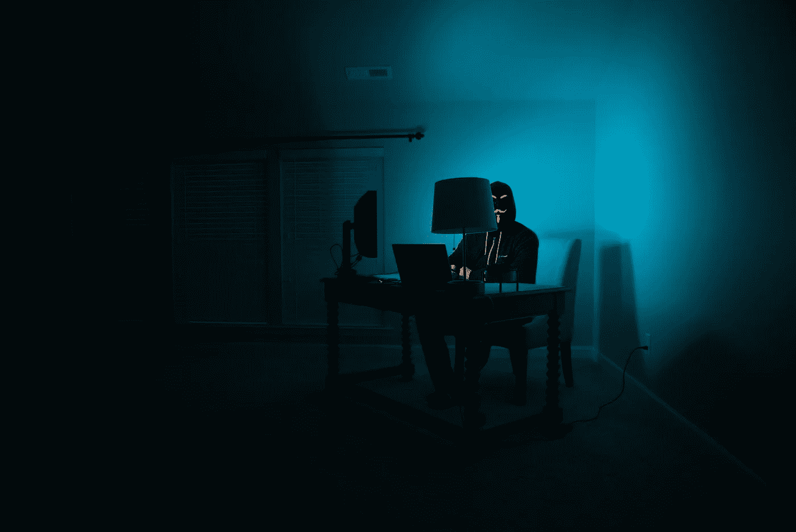

# 我参加 TensorFlow 开发者认证考试的故事

> 原文：<https://towardsdatascience.com/my-story-of-taking-the-tensorflow-developer-certification-exam-85d4fb777cbb?source=collection_archive---------8----------------------->

## 我参加考试的总体经历，我是如何准备的，如果我不得不再次参加考试，我会做些什么。

克林特·帕特森在 [Unsplash](https://unsplash.com/s/photos/coding?utm_source=unsplash&utm_medium=referral&utm_content=creditCopyText) 上拍摄的照片

老实说，我不知道 TensorFlow 提供认证考试，直到我看到有人在 Twitter 上发布了关于它的推文。我做了一些研究，以了解更多关于考试的信息，我对自己说:这将是我探索机器学习世界之旅的下一个目标。

在这篇文章里，我想谈谈我参加 TensorFlow 开发者认证考试的亲身经历，以及我是如何备考的。希望这篇文章对近期有兴趣参加考试的各位有所帮助。

现在，在我讲述我的经历之前，有必要先谈谈 TensorFlow 开发人员认证考试到底是什么。

# 什么是 TensorFlow 开发者认证？

你可能已经知道，谷歌在 2015 年发布了一个名为 TensorFlow 的机器学习应用开源软件库。TensorFlow 是目前最受欢迎的深度学习库之一，它使您能够轻松地大规模构建和部署不同类型的深度学习模型。

TensorFlow 开发人员认证考试允许您展示您使用 TensorFlow 构建各种模型来解决不同类型的机器学习问题的实际技能。如果你看一下[这个认证考试的考生手册](https://www.tensorflow.org/site-assets/downloads/marketing/cert/TF_Certificate_Candidate_Handbook.pdf)，你很快就会知道，你将被要求解决与结构化数据或图像和文本等非结构化数据相关的问题。

由于这是一个使用 TensorFlow 的实践考试，因此它假设您已经知道浅层神经网络、深层神经网络、卷积神经网络和序列模型背后的一般概念。在考试期间，你应该用 TensorFlow 实现这些机器学习概念。

考试本身的费用是每次 100 美元，这意味着如果你没有通过考试，你需要为每次考试再次支付考试费。如果第一次考试失败，你可以在第一次考试 14 天后重考。如果你第二次尝试失败了，你需要等两个月才被允许做第三次尝试。

您将有 5 个小时的时间来解决 PyCharm 环境中的不同问题，在您结束考试后，您将通过电子邮件直接收到通知，无论您是否通过考试。如果你通过了考试，你的证书会在几天后发给你，三年后到期。

# 我为什么要参加认证

作为一个希望不断发展技能来解决不同类型的机器学习问题的人，毫无疑问 TensorFlow 是我经常使用的基本工具之一。

以参加 TensorFlow 开发者考试为主要目标的想法确实激励我不断发展如何利用 TensorFlow 解决机器学习问题的技能。此外，知道考试时会有时间限制，真的会让考试更有挑战性。我越是知道我的目标将会有多么具有挑战性，我就会越努力地为它做准备。

另一个优势是，如果你试图进入人工智能行业，拥有 TensorFlow 认证肯定会给你一个额外的证书，尽管我不能保证仅凭证书就足以让你进入人工智能。你可以在你的简历、LinkedIn 或 GitHub 中分享你的证书。

# 对考试有帮助的学习材料

现在您已经知道 TensorFlow 开发人员认证考试是什么，并且您可能想在不久的将来参加它。接下来，你可能想知道哪些学习材料会对你准备考试有所帮助。

嗯，这取决于你目前所知道的…

如果你已经知道了深度学习的大致概念，那么 Coursera 上的[tensor flow in Practice Specialization](https://www.coursera.org/specializations/tensorflow-in-practice)就是你准备考试的最好方式。

如果你看一下[考生手册](https://www.tensorflow.org/site-assets/downloads/marketing/cert/TF_Certificate_Candidate_Handbook.pdf)中的技能清单，你会找到成功通过认证考试所需的相关技能。一开始看到技能清单可能会感到害怕，但是所有这些技能都包含在 TensorFlow 的实践专业化中。

参加 TensorFlow 实践专业化课程每月需要花费 49 美元，但实际上你可以免费旁听课程，你可以在 Google Colab 上获得学习材料和实用代码。在学习本课程时，尝试自己从头开始重新创建代码以最大化您的学习体验也很重要。

然而，如果你还不熟悉深度学习的一般概念，那么我推荐以下材料，让你在参加 TensorFlow 实践专业化之前快速掌握:

1.  [吴恩达深度学习专业化](https://www.coursera.org/specializations/deep-learning)
2.  [用 Scikit-Learn、Keras 和 TensorFlow 进行机器学习，作者是 Aur](https://www.oreilly.com/library/view/hands-on-machine-learning/9781491962282/)lien GRon。
3.  [CS231n:斯坦福大学用于视觉识别的卷积神经网络](https://cs231n.github.io/)。
4.  [CS224n:斯坦福大学深度学习的自然语言处理](http://web.stanford.edu/class/cs224n/)。
5.  [Fran](https://livebook.manning.com/book/deep-learning-with-python/chapter-1/1)ois Chollet 的《深度学习 Python》，整本书你都可以在线免费阅读。
6.  [麻省理工 6。S191 深度学习介绍](http://introtodeeplearning.com/)。

这些是我的首选资源，我发现从不同的资源和角度学习深度学习概念是有益的，因为它有助于巩固我的知识。

我发现在考试前你需要学习的另一件非常重要的事情是 TensorFlow 数据集。了解如何使用 tf.datasets 加载数据，更重要的是，了解如何对 tf.datasets 中的数据进行预处理，以便将它们输入到模型中。您可以在 [TensorFlow 文档页面](https://www.tensorflow.org/api_docs/python/tf/data/Dataset)中了解更多信息。

# 我是如何准备考试的

我总共花了大约三周时间准备考试。

在前两周，我从 TensorFlow 的实践专门化中学习了所有材料，并从头开始重新创建了代码。

接下来，因为我们需要在 PyCharm 环境中进行考试，而我以前从未使用过 PyCharm，所以在考试前一周，我花时间学习了更多关于 PyCharm 的知识。我认为，如果您以前使用过 Spyder 等其他 Python IDE，那么熟悉 PyCharm 不会花费您太多时间。

本 [TensorFlow 开发者认证文档](https://www.tensorflow.org/site-assets/downloads/marketing/cert/Setting_Up_TF_Developer_Certificate_Exam.pdf)中解释了安装考试所需 PyCharm 和插件的所有详细步骤。现在如果你想了解更多关于 PyCharm 的功能，那么我推荐以下材料:

1.  [JetBrains 的 PyCharm 视频系列入门](https://www.youtube.com/playlist?list=PLQ176FUIyIUZ1mwB-uImQE-gmkwzjNLjP)
2.  [JetBrains 的 PyCharm 文档入门](https://www.jetbrains.com/help/pycharm/quick-start-guide.html)

在我熟悉了 PyCharm 并检查了所有必要的插件都可以正确安装之后，我在 PyCharm 环境中的 Practice Specialization 中重新创建了 TensorFlow 的代码，以确保运行代码时没有错误。

# 我参加考试的亲身经历

终于，考试日到了，2020 年 7 月 9 日…

要参加认证考试，您需要做的就是前往 TensorFlow 开发者认证网站的[，并点击*“开始考试”*按钮。在那里，您需要提供您的 ID 和支付信息，以及设置您的考试环境。](https://www.tensorflow.org/certificate)

一旦您完成付款，设置考试环境的所有步骤都将在一份机密的 PDF 文档中详细解释，因此您无需担心。

设置好所有的考试环境后，您可以选择点击*“开始考试”*按钮开始考试。一旦你点击那个按钮，5 个小时的计时器将立即启动，你需要在这段时间内完成不同的任务。

## 访问 GPU 是完成考试的必要条件吗？

现在你可能会问:你需要访问 GPU 才能完成考试吗？我的回答是:不一定。

我个人只在我的华硕笔记本电脑的 CPU 上训练了所有的模型，所以没有什么复杂的。直到现在我都不知道为什么我在考试的时候没有使用我在 Colab 上的免费 GPU 访问权限，我在考完试后才意识到这一点。但我想我们都经历过。

但这证明了一件事:你虽然没有 GPU，但也可以完成并通过考试。然而，如果你计划在你机器的 CPU 上训练你所有的模型，不要重复我的错误，我会告诉你我的错误是什么。

正如你从候选人手册中已经知道的，你需要在 5 个小时内解决不同的问题，每个问题都会比前一个问题更复杂。

我的错误是我按顺序解决问题，这意味着我先解决最简单的问题，然后再去解决更复杂的问题。这种方法没有错，但当我试图解决更复杂的问题时，我没有太多的时间来训练模型，尽管该模型在计算上比前一个问题更需要训练。

我已经用大约一个半小时完成了所有问题的编码部分，但是还有两个不同的计算密集型模型仍在同时训练。从那以后，基本上就是我的笔记本电脑 CPU 的处理能力和时间之间的竞赛了。

我，在只剩 30 分钟，模特还在训练的时候(来源: [GIPHY](https://giphy.com/gifs/reactiongifs-LRVnPYqM8DLag) )

幸运的是，所有的训练都在时间结束前完成了，它们在验证集中表现得非常好，所以一切都很好。

现在我要谈下一点..

## 如果我再参加一次考试，我会有什么不同的表现

如果我想完全用笔记本电脑的 CPU 来解决整个考试，那么我想先解决比较复杂的问题，然后再解决不太复杂的问题。

在不给出太多问题细节的情况下，包含卷积层以及 LSTM 或 GRU 层的模型当然会比另一个在计算上要求更高。如果你先解决更复杂的问题，那么你就有更多的时间来训练模型。如果复杂的模型没有你预期的那么好，你仍然有时间调整它并重新训练它。模型一训练好，就开始解决更简单的问题。

为了避免 CPU 和考试时间之间的竞争，我还想利用 Colab 免费访问 GPU。你可以用 Colab 解决问题，在那里用 GPU 训练模型，把训练好的模型复制到考试的目录下。任何可以访问 Google Drive 的人都可以免费使用 Colab，如果你想了解更多关于如何设置和使用 Colab 的细节，我推荐你阅读[这篇文章](/getting-started-with-google-colab-f2fff97f594c)。

# 你怎么知道你通过了考试？

考试结束后不久，您会收到一封电子邮件反馈，告知您是否通过了考试。

然而，你应该已经知道在考试期间你是否会通过。一旦你把每个问题的训练好的模型提交给评分员，你会马上得到反馈。

# 外卖食品

现在，您已经了解了 TensorFlow 开发者认证考试的所有必要内容，以下是一些要点:

*   如果你已经了解了深度学习的大致概念，那么 Coursera 上的《实践专精》中的 TensorFlow 就是最好的备考学习资料。
*   如果你还不熟悉深度学习的一般概念，那么我上面列出的学习材料将有助于你在参加 TensorFlow 实践专业化之前达到速度。
*   了解 TensorFlow 数据集以及如何对其进行预处理。
*   花点时间熟悉 PyCharm 环境，并尝试在 it 专业实践中重新创建 TensorFlow 的项目，以确保一切都完美运行。
*   如果你计划完全在你机器的 CPU 上完成考试，确保你合理地管理你的时间，先解决复杂的问题，再解决简单的问题。
*   您可以使用 Colab 上的免费 GPU 访问来优化考试期间的工作流程。

而这就是我参加 TensorFlow 开发者认证考试的亲身经历，以及我是如何通过的。我希望这有利于你们中任何一个想在不久的将来参加考试的人。如果你有问题，我很乐意帮助你。