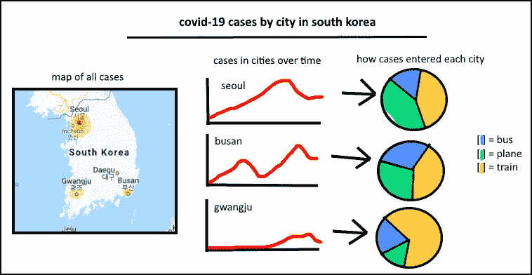
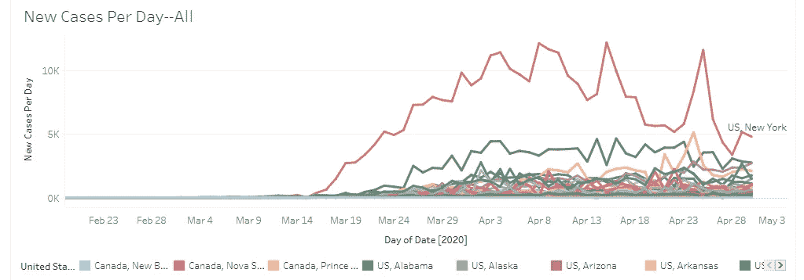
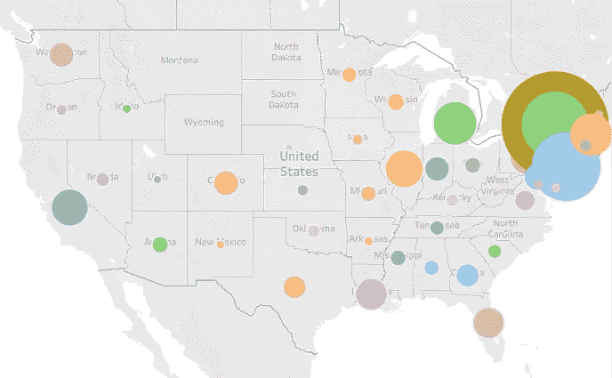
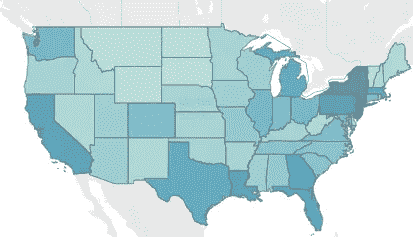
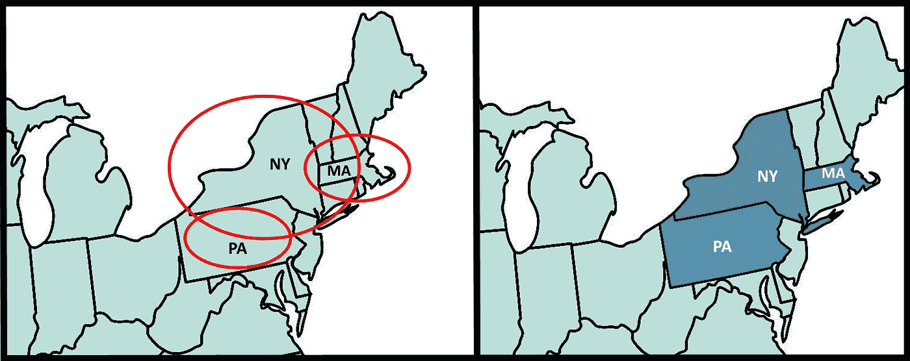
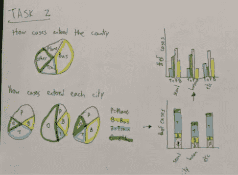
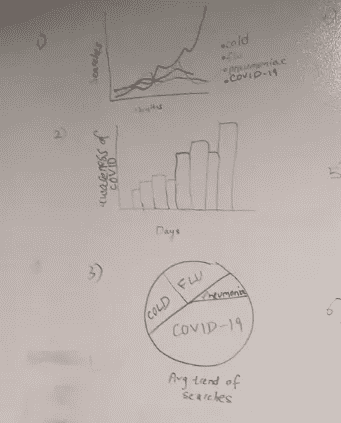
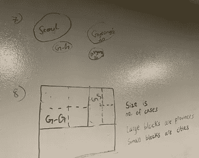

# 我的 Tableau 仪表盘糟透了——直到我开始先画它们

> 原文：<https://towardsdatascience.com/my-tableau-dashboards-sucked-until-i-started-drawing-them-ec4c9d4a4fe8?source=collection_archive---------19----------------------->

## 为什么手绘仪表板可以培养更强的数据可视化技能，并更好地理解图形概念

一个简单的手绘仪表板的例子

我们都有过这样的经历——你正在浏览网页，突然发现一个你根本无法解读的表格或图表。在对它进行短暂的内部判断后，你继续你的一天，甚至忘记了它不久后就存在了。是因为图形实现不当而难以理解吗？有大量的信息吗？也许创作者根本没有做好用手头的数据讲一个故事？如果你不想开发易被遗忘的仪表板，先尝试手绘。

这个故事主要是针对最近的毕业生和那些开始发展这方面技能的人，但我希望任何人都能从中收集一些有用的见解。

# 该设置

众所周知，数据可视化是一项越来越受欢迎、需求越来越大的技能。在 LinkedIn 上简单搜索“数据可视化”会返回大量结果，通常来自那些希望创建引人注目的仪表板以向利益相关者、董事和客户展示的雇主。

没有比这更好的时间来提高你在这方面的能力了。可悲的是，能够创建准确和引人注目的仪表板是我见过的困扰无数学生和专业人士的事情。很多时候，人们似乎对寻找展示信息的最佳*方式并不感兴趣，他们只是在寻找展示信息的任何*方式。**

**我先举一个例子来说明这个问题有多普遍。几个月前的早上 8 点，我坐在一个闷热的房间里，急于在研究生水平的可视化课程中与我的小组一起展示本学期的最后一个 Tableau 仪表板。我们整个学期都在学习如何有效地将数据传达给观众，然而当一批又一批的人来到我们面前时，每个人都展示了一个比一个更具误导性和设计不当的仪表板。只占 80%的饼状图和不小心实现的布局只是我们所接触到的问题的一小部分(后面还有更多例子)。**

**你可能不认为这个故事适用于你，但除非你坐下来，在用一些软件建模之前计划好每一个可视化，否则你可能已经成为这些问题的受害者之一。这可能是一件简单的事情，就像找不到一个更好的可视化方法，只差一步之遥。**

# **可视化工具的陷阱**

**Tableau 之类的数据可视化工具受到人们的喜爱和使用，因为它们可以非常简单地显示大型数据集中的相关性。它们被使用的确切原因也是它们最大的缺陷。**

> **在找到看起来可以接受的东西之前，简单地点击按钮太容易了。**

**让我们看一些例子。我重新创建了特定仪表板的一部分，这是我在我提到的课程的最终项目中回忆起来的，所有仪表板都与世界各地的新冠肺炎统计数据相关。请记住——**这些是来自研究生水平课程的可视化。****

****

**每个单独的状态使用单独的一行**

**在本例中，每个州都绘制在一条单独的线上。这使得几乎不可能区分大部分的州，并导致整体上的草率外观。50 句台词重叠在一起很容易让观众不知所措，这一点很明显。令人失望的是，类似的图表在公共仪表盘上司空见惯，在各地年轻专业人士的投资组合中也随处可见。**

**另一个常见问题是这样的显示:**

****

**重叠的球体使得理解与每个数据点相关的地理区域变得困难**

**在本例中，数据最好用简单的热图来表示。使用热图不仅可以让你看到潜在的州边界，还可以使用阴影代替不同的球体大小。**

****

**热图可视化是显示区域数据的巧妙方式**

**再一次，这看起来像是曾经解释过的显而易见的事情，但是这是许多人挣扎的事情。创建合适的可视化的门槛比大多数人认为的要低得多。**

**那为什么人们最终会有这样的可视化效果呢？主要有两个原因。**

> **Tableau 等数据可视化软件提供了可视化选定变量的建议。**

**推荐功能是一把双刃剑。它们可能非常方便和有用，但也可能阻止你找到更引人注目的图形。我经常看到我的同行使用推荐的图表，并表示“嘿，这给了我一个我可以使用的解决方案！”以为他们的工作已经完成了。他们没有意识到，工作不是找到解决方案，而是找到**最佳解决方案**。**

**第二个原因是，人们可能不太了解某种类型的图形或图表应该在什么情况下使用。**

> **数据可视化软件在通知或促进学习方面作用不大，并且依赖于你已经知道何时使用某些类型的图表。**

**这会导致许多问题——折线图代替条形图，饼图相加不到 100%,等等。**

**谢天谢地，有一个简单的方法可以提高你在这两方面的技能。**

# **成功素描**

**手绘仪表板有几个主要原因。**

> **花时间手绘一个可视化需要你思考你实际上在做什么。**

**参考前面的例子，你会在彼此的上面手绘 50 条线吗？不。人类是懒惰的——你会很快停下来，对自己说:“嘿，如果不可能区分超过 2 或 3 条不同的线，那么这样做有什么意义。”同样，参照前面的第二个例子，你会在每个州周围画一个大圈来代表该州的新冠肺炎病例数吗？难道你不想找一种更简单的方式来表达你的信息吗？**

****

**只画了三个圆，很明显哪个图形更好理解。**

**就像我已经说过的，一旦解释清楚，这似乎是显而易见的，但是很多人都在为此而挣扎。整个研究生水平的课程之所以存在是为了教授人们这些技能，是因为它们并不像人们想象的那样显而易见。**

> **手绘图表让常识占上风。手绘视觉效果的每一个细节都倾注了心血。**

**绘制可视化图形需要你思考 ***为什么*** 你要以某种方式建模。它迫使你对每一行、每一笔和每一处删除都进行思考。我可以整天坐在我的桌面上点击按钮，直到一些可接受的可视化出现，但是坐下来画画是最简单的方式来实际 ***思考*** 我想要如何可视化一些东西。正如我前面说过的，创建合适的可视化的门槛比你可能认为的要低得多。**

**此外，你不需要成为一名艺术家或做任何复杂的事情来从中受益。一些最简单的图表在你的会议或演示中可能是最有效的。**

> **为了让广大观众理解，简单是王道。**

**让我们回顾一下之前关于小组陈述的趣闻。当我们正在决定在最后的报告中加入什么内容时，图书馆的网络突然中断了。这给我们留下了一个空白的白板，一些干擦记号笔，和我们的数据变量的笔记。**

**以下是一些例子:**

************

**勾勒出部分仪表板**

**我怎么强调都不为过——你不需要设计任何花哨的东西，**这就是 Tableau 这样的工具存在的原因**。即使你确实想拥有比铅笔素描更好的东西，也没有什么能阻止你加载一个预装的绘图应用程序，并制作一个看起来更整洁的显示器。你看到这一页最上面的图形了吗？用 MS Paint 大概花了 3 分钟。**

> **手绘可视化可以帮助培养批判性思维和思考技能**

**当你画东西的时候，你有意识地对你正在做的事情做出决定。为什么我在这里使用条形图？为什么在那里使用散点图？我是否应该寻找另一种方法来可视化这些信息？这些是你应该问自己的问题。即使你不在乎答案，股东和雇主也需要准确、易懂的信息来推动商业决策。**

**绘制图表需要你有意识地对自己进行推理**为什么**你正在做出具体的决定，以及在每个选项之间进行权衡。这里的线图会不会太混乱了？我是否需要一个饼图来提供信息，或者我可以简单地在不同的区域添加一个百分比标签？能够思考你为什么要做决定是一项至关重要的技能，它适用于生活的每一个方面。**

# **结论**

**当今的劳动力越来越需要数据可视化技能。**

**由于缺乏关于何时实现某些表或图的知识，人们很难进行数据可视化。**

**手绘图表有助于促进更强的数据可视化和批判性思维技能，因为它需要你有意识地坐下来思考你建模的一切。**

**如果你认为它有什么有趣的，不正确的，或者误导的——请随意回复，我可以修正它或者重新思考我的逻辑。我非常感谢那些花时间完整阅读这篇文章的人。**